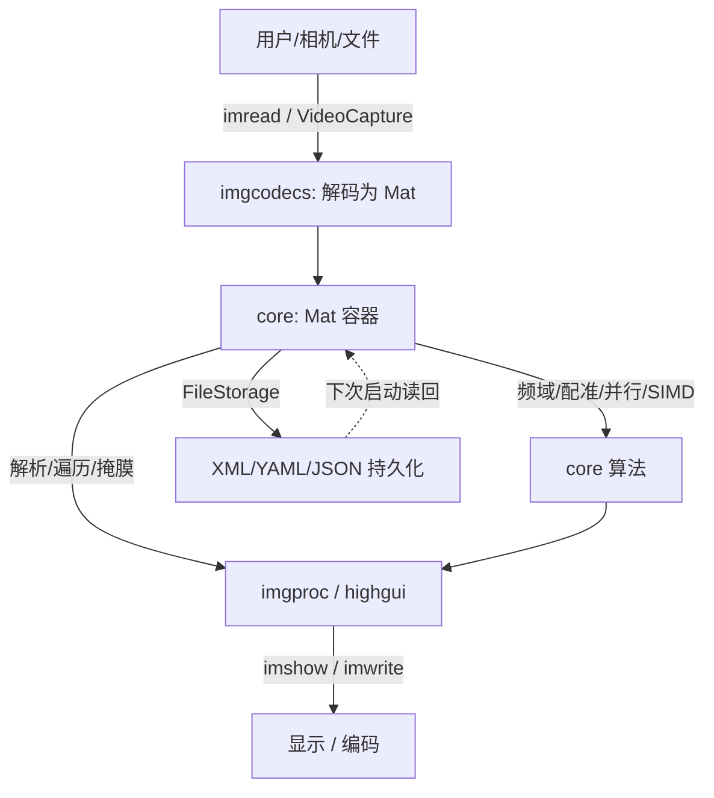

# 第 1 章 核心模块：图像容器、I/O 与基础算法原理

> 本章基于 OpenCV C++ 官方示例（`samples/cpp` 根目录 + `tutorial_code/core`、`tutorial_code/introduction`、`tutorial_code/imgcodecs` 子目录）重写并深度扩写，目标是把"能跑通的示例"还原为"可迁移的原理"。本文为简体中文，API 与代码标识符保留英文。

---

## 1.0 章节导言

OpenCV 的运算建立在三个不可逾越的底层概念之上，它们恰好对应本章要覆盖的三个模块：

1. **introduction 模块**——一切的起点：`imread` 拿到一张图、`imshow` 把它画出来、`waitKey` 接事件循环。它回答的是"OpenCV 程序长什么样、图像从哪来、到哪去"。它把 `highgui` 与 `imgcodecs` 第一次串联起来，是后续所有示例的入口范式。
2. **core 模块**——`cv::Mat`。`Mat` 是 OpenCV 中*唯一*贯穿全库的数据容器：从 `imread` 的返回值，到 `filter2D`、`dft`、`findTransformECC` 的输入/输出，再到 `dnn` 网络张量，全部是 `Mat`。不理解 `Mat` 的*引用计数、深浅拷贝、内存连续性、ROI 浅拷贝语义*，几乎所有"诡异 bug"（改一张图另一张跟着变、越界崩溃、并行写入竞争）都源于此。core 还负责*算法的可扩展性*：`FileStorage` 序列化、`parallel_for_` 并行、SIMD 向量化、DFT 频域变换、ECC 配准、多边形相交、模拟退火等基础能力。
3. **imgcodecs 模块**——编解码与持久化：JPEG 色度子采样、图像列表的 XML/JSON 序列化、动画（WebP）、GDAL 遥感栅格读取。它是 introduction 中 `imread`/`imwrite` 背后的"引擎区"。



**上下文依赖**：`imgcodecs` 依赖 `core::Mat` 作为载体；`imgcodecs` 与 `highgui` 共用底层 backend；`core` 的并行/向量化能力被 `imgproc`、`calib3d`、`dnn` 等所有上层模块复用。换言之，读不懂本章，上层所有模块都会出现"知其然不知其所以然"的理解断点。

**本章阅读建议**：先建立 `Mat` 心智模型（1.2.1–1.2.4），再理解"高效遍历与就地修改"（1.2.5、1.2.6），然后进入频域、并行、SIMD 等性能主题（1.2.7–1.2.14），最后把多边形相交、模拟退火与 ECC 配准当作"core 算法综合应用"收尾（1.2.15–1.2.20）；imgcodecs 部分（1.3）可独立阅读。

**概念阅读顺序**（重点看核心原理与参数说明，不写编译运行）：

- 先懂 `Mat` 的引用计数、深浅拷贝与 ROI 语义，再对照 `mat_the_basic_image_container.cpp`
- 先懂连续内存、指针遍历与 `at`/`ptr` 访问代价，再对照 `how_to_scan_images.cpp`
- 先懂 DFT 频域表示与可分离变换，再对照 `dft.cpp`
- 其余示例在掌握上述三点后再按需对照，仍以原理与参数表为主

---

## 1.1 introduction 模块：OpenCV 的起点

> 本节对应 `tutorial_code/introduction/`，目标是建立"最小 OpenCV 程序"的概念基线。

### 1.1.1 `display_image.cpp` —— 加载并显示图像
> **源文件**：`tutorial_code/introduction/display_image/display_image.cpp` ｜ **所属模块**：`imgcodecs`+`highgui` ｜ **示例类型**：完整流程

#### 功能概述

从命令行参数读取图像路径，`imread` 解码为 `Mat`，校验非空后 `imshow` 显示，`waitKey` 阻塞直至按键退出。它演示 OpenCV 程序的标准骨架：解码 → 容器 → 显示 → 事件循环。

#### 核心原理

**30 秒心智模型**：`imread` 把磁盘上的编码字节流（JPEG/PNG/…）交给 imgcodecs 后端解码成内存中的像素矩阵，返回一个 `Mat`；`imshow` 把这个 `Mat` 注册到 highgui 窗口；`waitKey` 进入事件循环，既是"等按键"也是"让窗口有机会重绘"。三者缺一不可：缺 `waitKey` 窗口不刷新甚至不出现，缺 `imread` 校验则路径错误时 `Mat::data` 为 `nullptr`，后续 `imshow` 崩溃。

读图标志位决定通道数：`IMREAD_COLOR` 强制 3 通道 BGR；`IMREAD_GRAYSCALE` 单通道；`IMREAD_UNCHANGED` 按文件原样（可能含 alpha 通道）。通道数直接影响后续算法的输入约定，不能"反正都是图"。

#### 关键 API

- `cv::imread(path, flags)`：解码文件为 `Mat`；
- `cv::Mat::empty()`：检查是否成功加载；
- `cv::imshow(winname, mat)`：把 `Mat` 显示到窗口；
- `cv::waitKey(ms)`：事件循环，`0` 表示阻塞至按键，正数表示超时毫秒。

#### 处理流程

解析命令行 → `imread` → `empty()` 校验 → `imshow` → `waitKey(0)` → 退出。

#### 参数说明

| 参数 | 含义 | 典型范围/默认 | 调大/调小会怎样 |
|---|---|---|---|
| `imread` flags | 解码通道策略 | `IMREAD_COLOR` | `UNCHANGED` 会带入 alpha，后续 `imgproc` 可能需拆通道 |
| `waitKey` 毫秒 | 事件循环时长 | `0`（阻塞） | 负数等同 `0`；正数适合视频循环 |
| 窗口名 | highgui 窗口标识 | 任意字符串 | 同名窗口复用，不同名新建 |

#### 关联与对比

本例是 [1.2.1 `mat_the_basic_image_container`](#121-mat_the_basic_image_containercpp--mat-的基本容器) 的"先用起来"前置；`imread` 返回的 `Mat` 即 core 模块的主角。与 [1.3 `imgcodecs_jpeg`](#131-imgcodecs_jpegcpp--jpeg-编解码与质量评测) 相比，本例只读不解码细节。

#### 注意事项

- 路径含中文/空格在某些 backend 下会失败，建议用 ASCII 路径或验证 `empty()`；
- `waitKey` 必须配合 `imshow` 在同一线程，否则窗口无响应；
- 无图形环境（纯命令行/SSH 无 X 转发）下 `imshow` 会抛异常或静默失败。

#### 应用场景

所有 OpenCV 程序的"第一步"骨架：原型验证、教程、调试预览。

### 1.1.2 `documentation.cpp` —— 文档与模块索引引导
> **源文件**：`tutorial_code/introduction/documentation/documentation.cpp` ｜ **所属模块**：`core` ｜ **示例类型**：snippet

#### 功能概述

演示如何查询 OpenCV 版本与编译时启用的模块，作为"环境自检与文档导航"的模板。

#### 核心原理

**30 秒心智模型**：OpenCV 是模块化构建，同一版本号下不同编译可能禁用了 `xfeatures2d`、`cuda` 等。`getBuildInformation` 返回的字符串列出编译选项、依赖与启用模块，是判断"某个 API 是否可用"的权威来源。

#### 关键 API

- `cv::getVersionString()`：版本号；
- `cv::getBuildInformation()`：编译配置多行字符串。

#### 处理流程

打印版本 → 打印 build info → 列出关心的模块标志。

#### 参数说明

无关键可调参数；只读信息接口。

#### 关联与对比

与根目录 [`opencv_version.cpp`](#1218-opencv_versioncpp) 功能重叠，本例偏教程引导。两者都为"环境诊断"服务。

#### 注意事项

- build info 字符串很长，建议 grep 而非全量打印；
- 模块缺失不总是编译期错误，可能运行期 `dlopen` 失败。

#### 应用场景

CI 环境诊断、第三方依赖确认、bug 报告附环境信息。

### 1.1.3 `introduction_windows_vs.cpp` —— Visual Studio 工程入门
> **源文件**：`tutorial_code/introduction/windows_visual_studio_opencv/introduction_windows_vs.cpp` ｜ **所属模块**：环境配置 ｜ **示例类型**：配置引导

#### 功能概述

演示在 Windows + Visual Studio 下配置 OpenCV（包含目录、库目录、依赖库列表），并编译运行一个最小图像处理程序。

#### 核心原理

**30 秒心智模型**：OpenCV 是 C++ 库，链接期需要找到 `opencv_worldXXX.lib`（或各模块 `.lib`），运行期需要找到对应 `.dll`。VS 工程属性表配置三件事：头文件搜索路径（编译期）、库搜索路径与库列表（链接期）、PATH 或可执行目录（运行期）。三者任一缺失都会报"无法解析的外部符号"或"找不到 dll"。

#### 关键 API

无新 API；演示 `imread`+`imshow`+`cvtColor` 的最小组合与工程配置。

#### 处理流程

配置包含/库目录 → 添加依赖库 → 编译 → 运行 → 验证窗口出现。

#### 参数说明

| 参数 | 含义 | 典型范围/默认 | 调大/调小会怎样 |
|---|---|---|---|
| 包含目录 | `OPENCV_DIR\build\include` | 安装路径 | 指错会编译期找不到头文件 |
| 库目录 | `OPENCV_DIR\build\x64\vc16\lib` | 与编译器匹配 | 指错会链接期找不到 `.lib` |
| 依赖库 | `opencv_worldXXXd.lib`（调试） | debug 带 `d` | 混用 release/debug 会运行期崩溃 |
| PATH | `OPENCV_DIR\build\x64\vc16\bin` | 与上同根 | 缺失会"找不到 dll" |

#### 关联与对比

Windows 专用，Linux 用 pkg-config 或 CMake `find_package(OpenCV)`。本例与 [1.1.1](#111-display_imagecpp--加载并显示图像) 共享同一最小程序，差别在工程组织。

#### 注意事项

- debug/release 必须一致，否则 `Mat` 内存布局差异会崩溃；
- `opencv_world` 把所有模块合并为一个库，简化链接但增大体积；
- 静态链接需额外配置 `cstatic` 与第三方依赖。

#### 应用场景

Windows 初次部署 OpenCV、VS 工程模板。

---

## 1.2 core 模块：Mat 与核心算法

> 本节对应 `tutorial_code/core/` 与根目录 core 类示例，是全章重点。`Mat` 是贯穿全库的数据容器，理解它的内存模型与访问语义是后续一切模块的前提。

### 1.2.1 `mat_the_basic_image_container.cpp` —— Mat 的基本容器
> **源文件**：`tutorial_code/core/mat_the_basic_image_container/mat_the_basic_image_container.cpp` ｜ **所属模块**：`core` ｜ **示例类型**：完整流程

#### 功能概述

系统演示 `Mat` 的构造、拷贝、ROI、像素类型与格式化输出，是建立"Mat 是引用计数句柄而非值容器"心智模型的核心示例。

#### 核心原理

**30 秒心智模型**：`Mat` 由"头"（描述尺寸/类型/步长等元信息）和"数据块指针"两部分组成。拷贝 `Mat` 只拷贝头，多个头共享同一块像素数据（引用计数）；只有 `clone()`/`copyTo()` 才真正复制像素。ROI（`mat(roi)`）也是浅拷贝——改 ROI 会污染原图，这是最常见的 bug 来源。

内存布局上，`Mat` 按行存储，`step[0]` 是一行字节数（含对齐填充）。`isContinuous()` 为真时整块内存可当一维数组遍历，否则必须按 `step` 跳行。通道交错存储：3 通道图按 `[B,G,R, B,G,R, ...]` 排列，不是"三块平面"。

像素类型由 depth（每通道位深）与 channels 组合：`CV_8UC3` = 8 位无符号 × 3 通道。`depth()` 返回 `CV_8U`，`type()` 返回 `CV_8UC3`，`channels()` 返回 3。

```mermaid
graph LR
    H[Mat 头: rows/cols/type/step] -->|引用| D[(数据块: refcount)]
    H2[浅拷贝 Mat] -->|同一数据块| D
    H3[ROI mat(roi)] -->|同一数据块偏移| D
    H4[clone 副本] -->|独立数据块| D2[(新数据块)]
```

#### 关键 API

- `cv::Mat::Mat(rows, cols, type)`：构造指定尺寸/类型；
- `cv::Mat::clone()`、`copyTo(dst)`：深拷贝；
- `cv::Mat::operator()(roi)`：ROI 浅拷贝；
- `cv::Mat::type()`、`depth()`、`channels()`、`isContinuous()`、`step`：元信息查询；
- `cv::Mat::ptr<T>(row)`、`at<T>(row,col)`：像素访问；
- `cv::Mat::setTo(value)`、`cv::Mat::zeros/ones`：初始化。

#### 处理流程

构造 `Mat` → 浅拷贝对照 → `clone()` 深拷贝 → ROI 修改污染验证 → `type/step` 打印 → `format` 格式化输出。

#### 参数说明

| 参数 | 含义 | 典型范围/默认 | 调大/调小会怎样 |
|---|---|---|---|
| `type` | 像素深度×通道 | `CV_8UC3`/`CV_32FC1` | 选错会导致后续算法误读位宽 |
| ROI 宽高 | 区域尺寸 | 不超过原图 | 越界会抛异常或崩溃 |
| 浅/深拷贝 | 是否复制像素 | — | 浅拷贝改 ROI 污染原图；深拷贝独立 |
| `step` | 行字节数 | 由类型×列数+对齐 | 跨行遍历必须按 step，不能直接 `cols*channels` |

#### 关联与对比

与 [1.2.2 `mat_operations`](#122-mat_operationscpp--mat-基本操作) 互补：本例偏内存语义，后者偏算术运算。ROI 污染语义在 [1.2.5 `mat_mask_operations`](#125-mat_mask_operationscpp--掩膜与就地运算) 中被实际利用。

#### 注意事项

- 函数返回 `Mat` 时若返回的是 ROI 或 `mat(roi)` 形式，调用方修改会污染源数据；
- `Mat` 跨线程共享时引用计数线程安全，但*像素读写不安全*，需自行加锁或用 `UMat`/流式；
- 连续性假设（`isContinuous()`）只在 `clone`/全图或特定对齐下成立，ROI 通常不连续。

#### 应用场景

所有 OpenCV 程序的数据载体；理解 ROI 污染是调试"图莫名其妙变了"的前提。

### 1.2.2 `mat_operations.cpp` —— Mat 基本操作
> **源文件**：`tutorial_code/core/mat_operations/mat_operations.cpp` ｜ **所属模块**：`core` ｜ **示例类型**：完整流程

#### 功能概述

演示 `Mat` 的算术（`+`、`-`、`*`、`/`）、按位运算、`setTo`、`push_back`、`reshape`、`convertTo` 等日常操作。

#### 核心原理

**30 秒心智模型**：`Mat` 重载了算术与位运算符，返回新 `Mat`（不就地修改，除非用 `+=`/`|=` 等）。类型提升遵循"向更宽/更高精度靠"：`CV_8U + CV_8U` 仍是 `CV_8U`（饱和到 0–255），但 `8U * scalar` 可能溢出。`convertTo` 显式改变 depth（如 `CV_8U→CV_32F`），常用于归一化前/滤波后。

`reshape` 不复制数据，只改头部的通道/行数解释——`M.reshape(1)` 把多通道图展平为单通道多行，常作为 ML 训练样本矩阵构造方式。

#### 关键 API

- `cv::Mat::operator+/-/*//`、`+=`、`|=`、`&=`；
- `cv::Mat::convertTo(dst, rtype, alpha, beta)`：类型转换+缩放；
- `cv::Mat::reshape(cn, rows)`：不复制改解释；
- `cv::Mat::push_back`、`cv::Mat::setTo`、`cv::Mat::t()`（转置）；
- `cv::addWeighted`、`cv::bitwise_and/or/xor/not`。

#### 处理流程

构造两 `Mat` → 算术运算 → 类型转换 → `reshape` 展平 → `convertTo` 归一化 → 输出对照。

#### 参数说明

| 参数 | 含义 | 典型范围/默认 | 调大/调小会怎样 |
|---|---|---|---|
| `convertTo` alpha/beta | 线性变换 `dst = alpha*src + beta` | 归一化常用 `1/255, 0` | 改变值域，影响后续算法输入 |
| `reshape` cn | 新通道数 | 1（展平）或原始值 | 不连续或维度不符会失败 |
| 算术运算 dtype | 结果类型 | 自动提升 | 8U+8U 不提升会饱和截断 |

#### 关联与对比

`addWeighted` 是 [1.2.21 `AddingImages`](#121-addingimagescpp--线性混合) 的核心。`reshape(1)` 在 [第 5 章 ML](./ch05_ml.md) 构造 `TrainData` 时反复使用。

#### 注意事项

- 8 位算术会饱和，负值变 0、超 255 变 255，不是回绕；
- `reshape` 不复制，改结果会污染源；
- 不同通道数的 `Mat` 不能直接算术运算，需 `cvtColor` 或 `merge/split`。

#### 应用场景

图像加减（叠加、差分）、归一化前处理、训练样本矩阵构造。

### 1.2.3 `cout_mat.cpp` —— Mat 格式化输出
> **源文件**：`samples/cpp/cout_mat.cpp` ｜ **所属模块**：`core` ｜ **示例类型**：完整流程

#### 功能概述

演示 `Mat` 通过 `operator<<` 的格式化打印，包括不同数值格式、矩阵切片与对齐。

#### 核心原理

**30 秒心智模型**：`cv::format(mat, fmt)` 把 `Mat` 转成字符串流，`fmt` 选择 `Formatter::FMT_DEFAULT`/`NUMPY`/`CSV`/`C` 等。`operator<<` 内部调用 `format`，按行打印，元素以空格/逗号分隔。大矩阵打印会截断，需要 `mat(Rect)` 切片查看局部。

#### 关键 API

- `cv::format(mat, fmt)`、`std::cout << mat`；
- `cv::Formatter::FMT_*`；
- `cv::Mat::operator()(Rect)` 切片。

#### 处理流程

构造 `Mat` → `format` 选格式 → `cout <<` → 切片局部打印。

#### 参数说明

| 参数 | 含义 | 典型范围/默认 | 调大/调小会怎样 |
|---|---|---|---|
| `fmt` | 输出格式 | `FMT_DEFAULT`/`CSV` | CSV 适合粘贴到表格，C 适合代码 |
| 切片范围 | 打印子区域 | 小于全图 | 全图打印大矩阵会刷屏且被截断 |

#### 关联与对比

与 [1.1.2 `documentation`](#112-documentationcpp--文档与模块索引引导) 同为"诊断"类。`FMT_NUMPY` 输出可直接粘贴到 Python 调试。

#### 注意事项

- 大矩阵即使截断也很长，建议先 `mat.reshape(1)` 或切片；
- 浮点 `Mat` 打印默认精度有限，对照小数位差异需 `setprecision`。

#### 应用场景

调试时查看像素值、把矩阵导出为其他语言（Python/Excel）。

### 1.2.4 `how_to_scan_images.cpp` —— 高效像素遍历
> **源文件**：`tutorial_code/core/how_to_scan_images/how_to_scan_images.cpp` ｜ **所属模块**：`core` ｜ **示例类型**：完整流程

#### 功能概述

对比三种像素遍历方式的性能：`Mat::ptr<T>(row)` 行指针、`at<T>` 随机访问、`MatIterator_` 迭代器，并演示就地减色操作。

#### 核心原理

**30 秒心智模型**：图像是二维连续内存（连续时）或按行连续（非连续时）。行指针 `ptr<T>(r)` 一次拿到整行起始地址，沿行线性递增是缓存友好的；`at<T>(r,c)` 每次重算偏移，开销大但可读性高；迭代器抽象但慢。就地操作（如减色 `v = (v/n)*n`）必须保证输入输出同一 `Mat`，且类型一致。

减色公式：把 `[0,255]` 量化为 `n` 级，`q = (v/n)*n`，等效于按 `n` 取整。它不引入新数据，是"就地修改"的典型场景。

性能排序（典型）：`ptr` 行指针（连续时 + `isContinuous` 优化）> `ptr` 行指针 > 迭代器 > `at`。差距可达 5–10 倍。

#### 关键 API

- `cv::Mat::ptr<T>(row)`：行起始指针；
- `cv::Mat::at<T>(row, col)`：随机访问；
- `cv::MatIterator_<T>`、`mat.begin<T>()`/`end<T>()`；
- `cv::Mat::isContinuous()`：连续性判定；
- `cv::LUT`：查表加速（减色等量化操作的工业实现）。

#### 处理流程

读图 → 三种方式各跑一遍减色 → 计时对比 → 与 `LUT` 对照 → 输出耗时。

#### 参数说明

| 参数 | 含义 | 典型范围/默认 | 调大/调小会怎样 |
|---|---|---|---|
| 遍历方式 | 指针/迭代器/at | `ptr` 最快 | `at` 在大图上慢数倍 |
| `isContinuous` 优化 | 连续时按一维遍历 | 启用 | ROI 通常不连续，优化失效 |
| 减色级数 `n` | 量化粒度 | `64` 等 | 越大色阶越粗，越小越细 |
| `LUT` 表 | 256 项查找表 | 预计算 | `LUT` 用 SIMD，远快于手写循环 |

#### 关联与对比

`LUT` 是本例"手写遍历"的工业替代，内部走 SIMD 与并行。本例与 [1.2.5 `mat_mask_operations`](#125-mat_mask_operationscpp--掩膜与就地运算) 都强调"就地修改"语义，前者偏性能，后者偏运算语义。

#### 注意事项

- 就地修改要求输入输出同 `Mat`，否则需 `dst.create(src.size(), src.type())`；
- 多通道行指针 `ptr<Vec3b>(r)` 拿到的是 `Vec3b*`，元素粒度是像素不是通道；
- `at` 在 release 模式下不检查边界但仍慢于 `ptr`。

#### 应用场景

逐像素变换（减色、gamma、阈值化）、性能瓶颈定位、教学"为什么循环慢"。

### 1.2.5 `mat_mask_operations.cpp` —— 掩膜与就地运算
> **源文件**：`tutorial_code/core/mat_mask_operations/mat_mask_operations.cpp` ｜ **所属模块**：`core` ｜ **示例类型**：完整流程

#### 功能概述

演示基于 ROI 与掩膜的线性混合（锐化：`dst = alpha*src + beta*blur`），并强调 ROI 是浅拷贝、就地修改污染源的特性。

#### 核心原理

**30 秒心智模型**：锐化核 `[[0,-1,0],[-1,5,-1],[0,-1,0]]` 的 `filter2D` 等价于 `src*5 - 上/下/左/右邻`。但本例的要点不在核，而在"用 ROI 把变换限制在图的一个区域"：`mat(roi)` 返回的 `Mat` 共享原图数据，`filter2D(src_roi, dst_roi, ...)` 写入 `dst_roi` 会直接改原图。掩膜（mask）则进一步控制"哪些像素参与运算"，掩膜为 0 的位置不更新。

线性混合通用公式：

$$
\text{dst}(x,y) = \alpha\,\text{src}_1(x,y) + \beta\,\text{src}_2(x,y) + \gamma.
$$

`addWeighted` 是其工业实现，支持多通道、自动饱和。

#### 关键 API

- `cv::Mat::operator()(Rect)`：ROI 浅拷贝；
- `cv::filter2D(src, dst, ddepth, kernel, anchor, delta, borderType)`：线性滤波；
- `cv::addWeighted(src1, alpha, src2, beta, gamma, dst)`：线性混合；
- `cv::Mat::setTo(value, mask)`：带掩膜赋值。

#### 处理流程

读图 → 取 ROI → `filter2D` 锐化 → 验证原图被改 → `addWeighted` 混合 → `setTo` 带掩膜赋值。

#### 参数说明

| 参数 | 含义 | 典型范围/默认 | 调大/调小会怎样 |
|---|---|---|---|
| 锐化核中心值 | `5`（减四邻） | 5 | 调大增锐化，过大会放大噪声 |
| `filter2D` ddepth | 输出深度 | `src.depth()` 或 `CV_16S` | 8U 输入 + 8U 输出在强边缘会饱和 |
| ROI 位置/尺寸 | 处理区域 | 不越界 | 越界抛异常 |
| 掩膜 | 像素参与控制 | 单通道 8U | mask=0 处不更新 |

#### 关联与对比

ROI 污染语义在 [1.2.1](#121-mat_the_basic_image_containercpp--mat-的基本容器) 已铺垫，本例实际利用。`addWeighted` 与 [1.2.21 `AddingImages`](#121-addingimagescpp--线性混合) 一致。`filter2D` 的全图版见 [第 2 章 `filter2D_demo`](./ch02_imgproc.md)。

#### 注意事项

- ROI 是浅拷贝，"只改区域"会污染原图，需独立副本时用 `clone`；
- `filter2D` 在边界处需 `borderType`，默认 `BORDER_DEFAULT` 反射；
- 掩膜尺寸必须与目标 `Mat` 一致，否则忽略或报错。

#### 应用场景

局部锐化、ROI 内混合、水印合成、带掩膜的像素赋值。

### 1.2.6 `file_input_output.cpp` —— XML/YAML 序列化
> **源文件**：`tutorial_code/core/file_input_output/file_input_output.cpp` ｜ **所属模块**：`core` ｜ **示例类型**：完整流程

#### 功能概述

演示 `FileStorage` 读写 `Mat`、自定义结构体、`std::vector`，覆盖 XML、YAML、JSON 三种格式。

#### 核心原理

**30 秒心智模型**：`FileStorage` 是 OpenCV 的"键值序列化"容器，类似简化版 JSON/YAML 库。写模式 `FileStorage(path, WRITE)` 打开文件，用 `<<` 把命名键和值串行写入；读模式 `READ` 用 `>>` 按键取回。`Mat`、`std::vector<Mat>`、`int/double/string`、自定义结构（实现 `write`/`read` 函数）都可序列化。

格式由扩展名决定：`.xml`→XML，`.yml`/`.yaml`→YAML，`.json`→JSON。YAML 可读性最好，XML 工具链最全，JSON 利于跨语言。

#### 关键 API

- `cv::FileStorage(path, flags)`：`WRITE`/`READ`/`APPEND`；
- `fs << "key" << value`、`fs["key"] >> value`；
- `cv::FileNode`、`cv::FileNodeIterator`：遍历序列/映射；
- 自定义 `write(fs, obj)`/`read(fs, obj)` 重载。

#### 处理流程

构造数据 → `FileStorage(WRITE)` → 写 `Mat`/vector/结构 → 关闭 → `FileStorage(READ)` → 按键读回 → 校验一致。

#### 参数说明

| 参数 | 含义 | 典型范围/默认 | 调大/调小会怎样 |
|---|---|---|---|
| 扩展名 | 格式选择 | `.yml`/`.xml`/`.json` | 选错格式会按内容解析失败 |
| `flags` | 读写模式 | `WRITE`/`READ` | `APPEND` 需文件已存在且格式兼容 |
| 嵌套结构 | 映射/序列 | `{}`/`[]` | 写错会导致读回时类型不匹配 |
| 压缩 | `.gz` 后缀 | 可选 | 压缩节省空间但读写变慢 |

#### 关联与对比

`imagelist_creator`/`imagelist_reader`（[1.3.2](#132-imagelist_creatorcpp--图像列表生成)/[1.3.3](#133-imagelist_readercpp--图像列表读取)）用 `FileStorage` 存图像路径列表，供标定/拼接读取。第 7 章标定参数的保存也依赖 `FileStorage`。

#### 注意事项

- 读回时键不存在返回空 `FileNode`，转 `Mat` 得到空 `Mat`，需校验；
- 自定义结构必须实现 `write`/`read` 全字段，缺字段读回时被忽略；
- 大 `Mat` 序列化文件很大，建议 `.gz` 压缩或用二进制格式。

#### 应用场景

标定参数持久化、配置文件、跨进程数据传递、训练样本存档。

### 1.2.7 `dft.cpp` —— 离散傅里叶变换
> **源文件**：`samples/cpp/dft.cpp` ｜ **所属模块**：`core` ｜ **示例类型**：完整流程

#### 功能概述

演示一维/二维 DFT 的完整流程：扩展到最优尺寸、前向变换、频谱可视化（中心化+对数）、逆变换还原。

#### 核心原理

**30 秒心智模型**：DFT 把图像从空间域转到频率域，每个频率分量记录"整张图里某种周期模式的振幅与相位"。低频是整体亮度梯度，高频是细节/边缘/噪声。可视化时把零频移到中心（`fftshift`），取幅值再对数压缩动态范围，得到的"频谱图"中心亮（低频能量集中）、向外衰减。

二维 DFT 公式：

$$
F(u,v) = \sum_{x=0}^{W-1}\sum_{y=0}^{H-1} f(x,y)\, e^{-2\pi j\left(\frac{ux}{W}+\frac{vy}{H}\right)}.
$$

OpenCV 的 `dft` 默认返回未中心化的复数（双通道 `Mat`：实部+虚部）。`magnitude` 算幅值，`split`+`merge` 配合 `fftshift`（`Quadrant` 四象限对调）实现中心化。最优尺寸 `getOptimalDFTSize` 把 W/H 扩到 2 的幂或高复合数，DFT 复杂度从 $O(N^4)$ 降到接近 $O(N^2 \log N)$，代价是补零后的边缘效应（需加窗或归一化）。

#### 关键 API

- `cv::dft(src, dst, flags)`：`DFT_COMPLEX_OUTPUT`/`DFT_REAL_OUTPUT`/`DFT_INVERSE`/`DFT_ROWS`；
- `cv::idft`：逆变换；
- `cv::getOptimalDFTSize(n)`：最优尺寸；
- `cv::copyMakeBorder`：补零到最优尺寸；
- `cv::magnitude`、`cv::split`、`cv::merge`：幅值与通道处理。

#### 处理流程

读图转灰度 → `copyMakeBorder` 补零到最优尺寸 → 拼实部为复数 `Mat` → `dft` → `magnitude`+`log`+中心化 → 可视化频谱 → `idft` 还原。

#### 参数说明

| 参数 | 含义 | 典型范围/默认 | 调大/调小会怎样 |
|---|---|---|---|
| 最优尺寸 | 扩展后 W/H | `getOptimalDFTSize` | 不扩展会慢数倍 |
| `DFT_COMPLEX_OUTPUT` | 输出复数 | 启用 | 实数输出丢失相位 |
| `log(1+mag)` | 动态压缩 | 标准 | 不取对数时高频几乎不可见 |
| 中心化 | 四象限对调 | 启用 | 不中心化时零频在角上 |
| 边界补零 | 避免循环卷积混叠 | 用 `BORDER_CONSTANT` | 不补零时频谱被边界效应污染 |

#### 关联与对比

`dft.cpp` 与 [1.2.8 `discrete_fourier_transform.cpp`](#128-discrete_fourier_transformcpp--教程版-dft) 同主题，前者偏工程，后者偏教程。频域滤波（带通/陷波）是后续 [第 2 章 `periodic_noise_removing_filter`](./ch02_imgproc.md) 与 [第 10 章 principles §10](./principles.md#10-频域变换与-ecc-配准) 的基础。

#### 注意事项

- 复数 `Mat` 是双通道，幅值计算后才是单通道；
- 中心化必须与逆变换前的"反中心化"配对，否则还原图错位；
- 大图 DFT 内存占用按 $W \times H \times 8$ 字节（复数 double）估计，慎防 OOM；
- `dft` 对尺寸敏感，非最优尺寸可能退化为直接 DFT 而非 FFT。

#### 应用场景

频域滤波、周期噪声去除、相位相关配准（[phase_corr](./samples_flow.md#phase_corrcpp)）、频谱分析。

### 1.2.8 `discrete_fourier_transform.cpp` —— 教程版 DFT
> **源文件**：`tutorial_code/core/discrete_fourier_transform/discrete_fourier_transform.cpp` ｜ **所属模块**：`core` ｜ **示例类型**：完整流程

#### 功能概述

`dft.cpp` 的教程版，步骤更细：构造复数输入、`merge`、`dft`、`split`+`magnitude`+`normalize` 可视化。原理与 1.2.7 一致。

#### 核心原理

与 [1.2.7](#127-dftcpp--离散傅里叶变换) 相同。本例额外强调"实图转复数输入"的 `merge` 步骤：把灰度图作为复数实部、零矩阵作为虚部，`merge` 成双通道 `Mat` 再 `dft`。

#### 关键 API

`cv::merge`、`cv::dft`、`cv::split`、`cv::magnitude`、`cv::normalize`。

#### 处理流程

读图转灰度 → 扩展尺寸 → `Mat` 实部+零虚部 `merge` → `dft` → `split`+`magnitude`+`log`+中心化+`normalize` → 显示。

#### 参数说明

| 参数 | 含义 | 典型范围/默认 | 调大/调小会怎样 |
|---|---|---|---|
| `normalize` 类型 | 归一化到 0–255 | `NORM_MINMAX` | 不归一化无法直接 `imshow` |
| 中心化 | 四象限交换 | 启用 | 同 1.2.7 |

#### 关联与对比

与 1.2.7 互补；本例步骤更适合作教学脚手架。

#### 注意事项

- `normalize` 后才能 `imshow`，否则频谱图全黑；
- 教程版未做逆变换，关注"看频谱"而非"还原"。

#### 应用场景

教学、频谱可视化、初学频域概念。

### 1.2.9 `how_to_use_OpenCV_parallel_for_.cpp` —— parallel_for_ 并行
> **源文件**：`tutorial_code/core/how_to_use_OpenCV_parallel_for_/how_to_use_OpenCV_parallel_for_.cpp` ｜ **所属模块**：`core` ｜ **示例类型**：完整流程

#### 功能概述

演示 `cv::parallel_for_` 调度多线程逐行处理图像，对比串行与并行耗时。

#### 核心原理

**30 秒心智模型**：`parallel_for_(Range, Body)` 把 `[0, n)` 的区间切成若干块分发给线程池，每块调用 `Body::operator()(Range)`。OpenCV 内部用 TBB/OpenMP/cpthreads 等后端（编译期选定），用户只需写"处理一段区间"的可重入逻辑。关键约束：**Body 必须无状态或只读共享**，写输出必须按区间分片不重叠。

并行对逐像素操作收益最大（计算密集且可分）；对已 SIMD 化的库函数（`filter2D` 等）收益递减，因为内部已并行。

#### 关键 API

- `cv::parallel_for_(Range, Body, nstripes)`；
- `cv::setNumThreads(n)`、`cv::getNumThreads()`；
- `cv::Range`、自定义 `Body::operator()(Range)`。

#### 处理流程

读图 → 定义 `Body`（按行处理） → 串行计时 → `parallel_for_` 并行计时 → 校验结果一致 → 输出加速比。

#### 参数说明

| 参数 | 含义 | 典型范围/默认 | 调大/调小会怎样 |
|---|---|---|---|
| `nstripes` | 分块数 | `-1`（自动=线程数） | 太小负载不均，太大调度开销大 |
| `setNumThreads` | 线程池大小 | CPU 核数 | 0=单线程；过大争用 |
| Body 状态 | 可重入性 | 无状态/只读 | 有状态会数据竞争 |

#### 关联与对比

与 [1.2.11/1.2.12](#1211-example-openmpcpp--openmp-后端)/[1.2.12](#1212-example-tbbcpp--tbb-后端) 同主题，前者展示后端选择。`LUT`、`filter2D` 等已内部用 `parallel_for_`，用户层并行叠加收益有限。

#### 注意事项

- 写输出必须按行分片，跨行写同一像素会竞争；
- 线程池在首次 `parallel_for_` 时初始化，冷启动有延迟；
- 异常跨线程抛出会被吞，建议在 Body 内捕获并记录。

#### 应用场景

逐像素变换、大图分块处理、自定义算子并行化。

### 1.2.10 `how_to_use_OpenCV_parallel_for_new.cpp` —— parallel_for_ 新写法
> **源文件**：`tutorial_code/core/how_to_use_OpenCV_parallel_for_/how_to_use_OpenCV_parallel_for_new.cpp` ｜ **所属模块**：`core` ｜ **示例类型**：完整流程

#### 功能概述

演示 `parallel_for_` 的 Lambda 写法，避免手写 `Body` 类，更现代。

#### 核心原理

原理同 [1.2.9](#129-how_to_use_opencv_parallel_for_cpp--parallel_for_-并行)，区别在用 Lambda 代替 `Body` 结构体，捕获外部变量（如 `Mat`）按引用，区间作为参数传入。

#### 关键 API

`cv::parallel_for_(Range, [](const Range& r){...}, nstripes)`。

#### 处理流程

读图 → Lambda 内按区间处理 → `parallel_for_` → 计时对照。

#### 参数说明

同 1.2.9；额外注意 Lambda 捕获方式（`[&]` 引用捕获需保证被捕获对象生命周期）。

#### 关联与对比

新旧两版对照学习；新写法更简洁，旧写法在复杂 Body 时更清晰。

#### 注意事项

- 引用捕获 `Mat` 时若主线程同时修改会竞争；
- Lambda 必须可重入，不能在闭包内维护可变状态。

#### 应用场景

现代 C++11+ 项目、快速原型并行。

### 1.2.11 `example-openmp.cpp` —— OpenMP 后端
> **源文件**：`tutorial_code/core/parallel_backend/example-openmp.cpp` ｜ **所属模块**：`core` ｜ **示例类型**：snippet

#### 功能概述

演示如何把 OpenCV 并行后端切到 OpenMP（编译期链接 `opencv_core` 时启用 OpenMP 支持）。

#### 核心原理

**30 秒心智模型**：OpenCV 并行后端是编译期可选的，`setParallelBackend("openmp")` 在运行期切换（若编译时包含多后端）。不同后端在 NUMA、亲和性、线程数上有差异，但 API 一致。

#### 关键 API

- `cv::setParallelBackend(backendName)`；
- `cv::parallel::createParallelFor()`。

#### 处理流程

设置后端 → 跑同一并行任务 → 输出耗时与线程数。

#### 参数说明

| 参数 | 含义 | 典型范围/默认 | 调大/调小会怎样 |
|---|---|---|---|
| backend | 后端名 | `"tbb"`/`"openmp"`/`"pthread"` | 未编译的后端会切换失败 |

#### 关联与对比

与 [1.2.12](#1212-example-tbbcpp--tbb-后端) 配对；后端选择影响 `parallel_for_` 的实际线程模型。

#### 注意事项

- 后端切换是全局状态，影响所有后续并行；
- OpenMP 与 TBB 不能在同一进程混用，会死锁或退化。

#### 应用场景

嵌入式/特定 runtime 环境、性能基准对照。

### 1.2.12 `example-tbb.cpp` —— TBB 后端
> **源文件**：`tutorial_code/core/parallel_backend/example-tbb.cpp` ｜ **所属模块**：`core` ｜ **示例类型**：snippet

#### 功能概述

切换并行后端到 Intel TBB，演示 TBB 的任务调度与亲和性优势。

#### 核心原理

同 [1.2.11](#1211-example-openmpcpp--openmp-后端)。TBB 在 NUMA 与任务窃取上更优，OpenMP 在静态分块上更简单。

#### 关键 API

`cv::setParallelBackend("tbb")`、`cv::setNumThreads`。

#### 处理流程

切后端 → 跑任务 → 输出。

#### 参数说明

同 1.2.11。

#### 关联与对比

与 1.2.11 互为对照；TBB 是 OpenCV 默认后端之一。

#### 注意事项

TBB 需单独链接，未链接时切换会静默失败。

#### 应用场景

高性能服务器、需要任务调度灵活性的场景。

### 1.2.13 `simd_basic.cpp` —— 通用 SIMD 入门
> **源文件**：`samples/cpp/simd_basic.cpp` ｜ **所属模块**：`core` ｜ **示例类型**：完整流程

#### 功能概述

演示 `universal_intrinsics`（`v_float32`/`v_uint8` 等）向量类型与 lane 运算，跨架构（SSE/AVX/NEON）写一份代码。

#### 核心原理

**30 秒心智模型**：CPU 一次能算多个数据 lane（如 AVX2 一次 8 个 float），手写 SIMD 通常绑死架构（`_mm256_*`）。OpenCV 的 `universal_intrinsics` 抽象成 `v_load`/`v_add`/`v_store` 等，编译期映射到目标架构的实际 intrinsics，一份代码多架构可用。

向量化收益：逐像素 gamma、加减、量化等"对每元素独立运算"最受益；分支多的算法收益小。

#### 关键 API

- `cv::v_float32`/`v_uint8`/`v_int16` 等向量类型；
- `cv::v_load(ptr)`、`v_load_interleave`；
- `cv::v_add`/`v_mul`/`v_sub`/`v_div`；
- `cv::v_store(ptr, v)`；
- `cv::checkHardwareSupport(CV_CPU_SSE/AVX/NEON)`、`cv::v_width`。

#### 处理流程

检查硬件支持 → 构造数据 → 标量版与向量版各跑 → 验证结果一致 → 输出加速比。

#### 参数说明

| 参数 | 含义 | 典型范围/默认 | 调大/调小会怎样 |
|---|---|---|---|
| 向量类型宽度 | lane 数 | 架构相关（4/8/16） | 宽度越大单指令数据越多 |
| 对齐 | 内存对齐 | 16/32 字节 | 未对齐 `v_load` 在某些架构会慢或崩 |
| 通道交错 | `v_load_interleave` | 多通道图 | 交错加载后需 `v_deinterleave` 拆分 |

#### 关联与对比

与 [1.2.14 `univ_intrin`](#1214-univ_intrincpp--教程版-simd) 同主题，本例偏工程，后者偏教程。库内 `filter2D`/`LUT` 已用 SIMD，用户层再加 SIMD 收益递减。

#### 注意事项

- 向量类型宽度在编译期由架构决定，不能假设固定值；
- 未对齐访问在某些架构（如旧 NEON）会崩溃，建议 `cv::aligned_alloc` 或 `Mat` 对齐分配；
- 分支密集算法 SIMD 收益小，考虑用 `LUT` 替代。

#### 应用场景

逐像素变换、自定义算子加速、跨架构移植高性能代码。

### 1.2.14 `univ_intrin.cpp` —— 教程版 SIMD
> **源文件**：`tutorial_code/core/univ_intrin/univ_intrin.cpp` ｜ **所属模块**：`core` ｜ **示例类型**：完整流程

#### 功能概述

`simd_basic` 的教程版，更细地演示 `v_reduce`、`v_interleave`、`v_deinterleave`、掩码运算等高级用法。

#### 核心原理

同 [1.2.13](#1213-simd_basiccpp--通用-simd-入门)。额外演示 `v_reduce`（lane 间归约，如求和/最大值）、`v_interleave`/`v_deinterleave`（多通道交错数据的加载与拆分）。

#### 关键 API

`cv::v_reduce`、`cv::v_interleave`、`cv::v_deinterleave`、`cv::v_select`（掩码选择）。

#### 处理流程

构造多通道数据 → `v_load_interleave` → 运算 → `v_deinterleave` → `v_store` → 归约对照。

#### 参数说明

同 1.2.13。

#### 关联与对比

与 1.2.13 互补；本例覆盖 lane 间与通道间操作。

#### 注意事项

`v_reduce` 的结果宽度可能小于输入宽度（如 `v_reduce_sum(v_float32)` 返回 `float`），注意精度。

#### 应用场景

多通道图处理、lane 间归约（如直方图累加）。

### 1.2.15 `intersectExample.cpp` —— 矩形相交
> **源文件**：`samples/cpp/intersectExample.cpp` ｜ **所属模块**：`core` ｜ **示例类型**：完整流程

#### 功能概述

演示 `cv::Rect` 的相交运算（`operator&`）、包含判断（`contains`）与交集面积。

#### 核心原理

**30 秒心智模型**：两个轴对齐矩形相交区域仍是矩形，其左上角是两矩形左上角的最大值，右下角是两右下角的最小值。若结果宽高任一为负则不相交。`Rect::operator&` 直接返回相交矩形，`area()` 判有效性。

#### 关键 API

- `cv::Rect`、`cv::Rect2f`；
- `cv::Rect::operator&(Rect)`、`operator|`（并包）；
- `cv::Rect::contains(Point)`、`cv::Rect::area()`、`cv::Rect::empty()`。

#### 处理流程

构造两 `Rect` → `&` 求交 → 检查 `area` → `contains` 判点归属 → `|` 求并包。

#### 参数说明

| 参数 | 含义 | 典型范围/默认 | 调大/调小会怎样 |
|---|---|---|---|
| `Rect` 坐标 | 左上角+宽高 | 整数像素 | 浮点 `Rect2f` 用于亚像素 |
| `area` 阈值 | 相交判定 | `>0` | 0 表示仅边接触 |

#### 关联与对比

`Rect` 运算在跟踪（第 4 章 IoU）、ROI 裁剪（第 2 章）中反复使用。`select3dobj`（第 7 章）用 `Rect` 限制搜索区域。

#### 注意事项

- `operator&` 不报错，不相交时返回空 `Rect`，需 `empty()` 校验；
- 浮点 `Rect2f` 与整数 `Rect` 不能直接运算。

#### 应用场景

跟踪 IoU、ROI 裁剪、碰撞检测、布局计算。

### 1.2.16 `travelsalesman.cpp` —— 模拟退火与随机优化
> **源文件**：`samples/cpp/travelsalesman.cpp` ｜ **所属模块**：`core` ｜ **示例类型**：完整流程

#### 功能概述

用模拟退火解旅行商问题（TSP），演示元启发式优化与 `Mat`/`RNG` 的随机数访问。

#### 核心原理

**30 秒心智模型**：TSP 是 NP-hard，精确解不可行时用模拟退火——从随机路线出发，每次扰动（如两城市交换），若更优则接受，否则按"温度"概率接受坏解以跳出局部最优，温度随迭代降低收敛。接受概率服从 Metropolis 准则：

$$
P(\text{accept worse}) = e^{-\Delta E / T},\qquad T_{k+1} = \alpha\,T_k\ (0<\alpha<1).
$$

`cv::theRNG()` 提供线程局部随机数生成器，`randu`/`randn` 生成均匀/正态分布。

#### 关键 API

- `cv::theRNG()`、`cv::RNG::uniform(a,b)`、`cv::randu`、`cv::randn`；
- `cv::Mat` 作为距离矩阵/路线向量；
- 自定义 `energy`/`perturb`/`accept` 函数。

#### 处理流程

构造距离矩阵 → 随机初始路线 → 迭代扰动+Metropolis 接受 → 降温 → 输出最优路线与长度。

#### 参数说明

| 参数 | 含义 | 典型范围/默认 | 调大/调小会怎样 |
|---|---|---|---|
| 初始温度 $T_0$ | 起始"接受坏解"概率 | 与 $\Delta E$ 量级匹配 | 太高收敛慢，太低陷局部 |
| 降温系数 $\alpha$ | 温度衰减 | `0.95`–`0.999` | 太快冻结早，太慢耗时长 |
| 迭代数 | 总步数 | 与问题规模相关 | 太少未收敛，太多浪费 |
| 扰动策略 | 路线扰动方式 | 2-opt/交换 | 2-opt 更强但每步贵 |

#### 关联与对比

模拟退火与第 5 章 K-means、EM 同为优化算法；本例偏组合优化，ML 章偏参数估计。`RNG` 在第 4 章 Kalman 噪声生成中也用。

#### 注意事项

- `theRNG()` 是线程局部的，多线程需各自获取；
- 距离矩阵规模 $O(N^2)$，大 N 内存爆；
- 收敛不保证全局最优，多次重启取最好。

#### 应用场景

路线规划、调度、参数搜索、ML 超参数优化。

### 1.2.17 `application_trace.cpp` —— 应用调用轨迹
> **源文件**：`samples/cpp/application_trace.cpp` ｜ **所属模块**：`core` ｜ **示例类型**：完整流程

#### 功能概述

演示 `cv::trace` 收集运行期函数调用轨迹，定位热点与调用关系。

#### 核心原理

**30 秒心智模型**：`trace` 在被测代码段前后埋点，记录函数入口/出口与耗时，输出为可解析的调用树。OpenCV 内部很多 API 已埋 trace 点，开启后可看库内调用链。

#### 关键 API

- `cv::trace::details::Trace`、`cv::trace::traceArg`；
- `CV_TRACE_FUNCTION()`、`CV_TRACE_REGION(name)` 宏；
- `cv::Mat trace`（结果容器）。

#### 处理流程

启动 trace → 执行被测段 → 停止 → 输出调用树/耗时。

#### 参数说明

| 参数 | 含义 | 典型范围/默认 | 调大/调小会怎样 |
|---|---|---|---|
| trace 区域 | 命名作用域 | 任意字符串 | 太细会拖慢运行 |
| 采样 | 全量/采样 | 全量 | 全量影响性能 |

#### 关联与对比

与性能分析工具（perf/VTune）互补；本例偏库内埋点。`getTickCount`/`getTickFrequency` 是更轻量的计时手段。

#### 注意事项

- trace 会引入额外开销，生产环境慎用；
- 区域名需唯一，否则树结构错乱。

#### 应用场景

性能热点定位、库内调用链分析、教学"某 API 内部做了什么"。

### 1.2.18 `opencv_version.cpp` —— 版本与构建信息
> **源文件**：`samples/cpp/opencv_version.cpp` ｜ **所属模块**：`core` ｜ **示例类型**：完整流程

#### 功能概述

打印 OpenCV 版本号、编译信息、启用模块，用于环境诊断。

#### 核心原理

同 [1.1.2 `documentation`](#112-documentationcpp--文档与模块索引引导)。本例偏命令行工具，输出更紧凑。

#### 关键 API

`cv::getVersionString()`、`cv::getBuildInformation()`、`cv::getCPUFeaturesLine()`。

#### 处理流程

打印版本 → 打印 build info → 打印 CPU 特性 → 退出。

#### 参数说明

只读接口，无可调参数。

#### 关联与对比

与 1.1.2 重叠；本例是命令行版。

#### 注意事项

输出量大，建议重定向到文件。

#### 应用场景

CI 诊断、bug 报告环境附信息。

### 1.2.19 `create_mask.cpp` —— 掩膜生成与按位运算
> **源文件**：`samples/cpp/create_mask.cpp` ｜ **所属模块**：`core` ｜ **示例类型**：完整流程

#### 功能概述

用阈值/比较生成二值掩膜，演示掩膜与 ROI、按位运算的关系。

#### 核心原理

**30 秒心智模型**：掩膜是单通道 8 位图，非零位置"保留"、零位置"丢弃"。`compare`/`threshold` 生成掩膜，`bitwise_and` 把掩膜应用到原图（按位与）。`setTo(value, mask)` 在掩膜非零处赋值。掩膜本质是"逐像素开关"，控制哪些位置参与运算/输出。

#### 关键 API

- `cv::threshold`、`cv::compare`、`cv::inRange`：生成掩膜；
- `cv::bitwise_and/or/xor/not`：按位运算；
- `cv::Mat::setTo(value, mask)`：带掩膜赋值；
- `cv::Mat::copyTo(dst, mask)`：带掩膜拷贝。

#### 处理流程

读图转灰度 → `threshold` 生成掩膜 → `bitwise_and` 应用 → `setTo` 局部赋值 → 显示对照。

#### 参数说明

| 参数 | 含义 | 典型范围/默认 | 调大/调小会怎样 |
|---|---|---|---|
| 阈值 | 掩膜分界 | Otsu 或手动 | 改变掩膜覆盖区域 |
| `bitwise` 运算 | 与/或/异或 | `and` | `or` 合并掩膜，`xor` 取反 |
| 掩膜尺寸 | 与目标一致 | 单通道 8U | 不一致会被忽略或报错 |

#### 关联与对比

掩膜语义在 [1.2.5 `mat_mask_operations`](#125-mat_mask_operationscpp--掩膜与就地运算)、第 2 章 `mask_tmpl`、第 6 章 `grabCut` 中反复出现。`inRange` 用于颜色区间掩膜（第 2 章 `Threshold_inRange`）。

#### 注意事项

- 掩膜必须单通道，多通道需先 `cvtColor` 或拆分；
- `copyTo(dst, mask)` 只在掩膜非零处拷贝，dst 其余位置保持原值。

#### 应用场景

ROI 提取、前景合成、带掩膜的滤波与检测。

### 1.2.20 `image_alignment.cpp` —— ECC 图像配准
> **源文件**：`samples/cpp/image_alignment.cpp` ｜ **所属模块**：`core` ｜ **示例类型**：完整流程

#### 功能概述

基于 ECC（Enhanced Correlation Coefficient）最大化估计模板与输入间的几何变换（平移/仿射/透视），实现图像配准。

#### 核心原理

**30 秒心智模型**：配准是找一组合变换参数 $W$，让模板 $T$ 经 $W$ 变换后与输入 $I$ 在重叠区最相似。ECC 目标是最大化归一化互相关：

$$
\text{ECC}(W) = \frac{\sum_{x}(T(Wx)-\bar T)(I(x)-\bar I)}{\sqrt{\sum_x(T(Wx)-\bar T)^2 \sum_x(I(x)-\bar I)^2}}.
$$

OpenCV `findTransformECC` 用前向加性 Lucas-Kanade 式迭代：给定初始 $W$（常为单位阵），每步算残差与雅可比，更新 $W$，直至相关系数收敛或达迭代上限。运动模型可选 `MOTION_TRANSLATION`/`AFFINE`/`EUCLIDEAN`/`HOMOGRAPHY`，自由度依次升高，收敛更难但能处理更复杂形变。

#### 关键 API

- `cv::findTransformECC(templateImage, inputImage, warpMatrix, motionType, terminationCriteria, mask)`；
- `cv::warpAffine`/`warpPerspective`：应用变换；
- `cv::TermCriteria`：`EPS`（参数变化）+`COUNT`（迭代数）。

#### 处理流程

读模板/输入 → 初始化 warp 矩阵 → `findTransformECC` 迭代 → `warpAffine` 对齐 → 输出误差与配准图。

#### 参数说明

| 参数 | 含义 | 典型范围/默认 | 调大/调小会怎样 |
|---|---|---|---|
| `motionType` | 变换模型 | `TRANSLATION`/`AFFINE`/`HOMOGRAPHY` | 自由度高更难收敛，需更好初值 |
| `TermCriteria` | 收敛条件 | `EPS=1e-6, COUNT=1000` | 太松结果差，太紧耗时长 |
| 初值 | 起始 warp | 单位阵或粗匹配 | 坏初值会陷局部最优或发散 |
| 重叠区 mask | 限定配准区域 | 全图 | 去除遮挡/边界可提升稳定性 |

#### 关联与对比

ECC 是基于强度的配准，与基于特征的配准（第 3 章 `SURF_FLNN_matching_homography`、第 7 章 `stitching_detailed`）互补：ECC 不需特征点，对纹理弱区域更鲁棒，但对大位移初值敏感。`phase_corr`（第 2 章）是平移配准的频域版，精度高但只处理纯平移。

#### 注意事项

- 输入需单通道灰度且尺寸一致；
- `HOMOGRAPHY` 模型收敛慢，建议先用 `AFFINE` 粗配；
- 多通道图需先 `cvtColor` 灰度或按通道配准后合并；
- 收敛失败时常因初值差或纹理不足，可在多尺度金字塔上逐级配准。

#### 应用场景

医学图像对齐、超分辨率、运动补偿、文档配准、前后帧稳定。

### 1.2.21 `AddingImages.cpp` —— 线性混合
> **源文件**：`tutorial_code/core/AddingImages/AddingImages.cpp` ｜ **所属模块**：`core` ｜ **示例类型**：完整流程

#### 功能概述

演示两图线性混合 $dst = \alpha\cdot src1 + \beta\cdot src2 + \gamma$，并用滑条交互调节 $\alpha$。

#### 核心原理

**30 秒心智模型**：线性混合是最简单的"图像叠加"，把两张同尺寸图按权重相加。`addWeighted` 是其工业实现：自动处理饱和（8U 截断到 0–255）、多通道、类型一致。$\alpha+\beta=1$ 时是"淡入淡出"，$\beta>1$ 时是"加权锐化"的基础（见 [1.2.5](#125-mat_mask_operationscpp--掩膜与就地运算)）。

公式见 [1.2.5](#125-mat_mask_operationscpp--掩膜与就地运算)。

#### 关键 API

- `cv::addWeighted(src1, alpha, src2, beta, gamma, dst)`；
- `cv::createTrackbar`、`cv::TrackbarCallback`；
- `cv::Mat::convertTo`（归一化到 0–1 后混合再还原）。

#### 处理流程

读两图 → 滑条调 $\alpha$ → `addWeighted` → `imshow` 实时更新。

#### 参数说明

| 参数 | 含义 | 典型范围/默认 | 调大/调小会怎样 |
|---|---|---|---|
| $\alpha$ | src1 权重 | `[0,1]` | 控制混合比例 |
| $\beta$ | src2 权重 | `1-\alpha` | 不守恒则混合偏亮/偏暗 |
| $\gamma$ | 亮度偏置 | `0` | 正值整体变亮 |
| 两图尺寸/类型 | 一致性 | 必须一致 | 不一致会报错或需 resize |

#### 关联与对比

`HighGUI/AddingImagesTrackbar` 是带滑条的交互版。本例与 [1.2.5 `mat_mask_operations`](#125-mat_mask_operationscpp--掩膜与就地运算) 的锐化公式同源，差别在 $\beta$ 取值。

#### 注意事项

- 8U 混合会饱和，超 255 截断；
- 浮点混合可保留高动态范围，混合后再 `convertTo` 到 8U 显示；
- 两图尺寸不一致需先 `resize` 或 `ROI` 对齐。

#### 应用场景

淡入淡出、HDR 合成、加权叠加、教学"线性运算"。

---

## 1.3 imgcodecs 模块

> 本节对应 `tutorial_code/imgcodecs` 与根目录编解码示例，关注"解码/编码细节"而非"图像处理"。

### 1.3.1 `imgcodecs_jpeg.cpp` —— JPEG 编解码与质量评测
> **源文件**：`samples/cpp/imgcodecs_jpeg.cpp` ｜ **所属模块**：`imgcodecs` ｜ **示例类型**：完整流程

#### 功能概述

演示 JPEG 编码参数（质量、色度子采样、渐进式）对压缩率与失真的影响，并用 PSNR 量化重建质量。

#### 核心原理

**30 秒心智模型**：JPEG 是有损压缩，质量因子 $Q\in[1,100]$ 越低压缩率越高但失真越大；色度子采样（如 `4:2:0`）利用人眼对色度不敏感，把色差通道降采样节省空间；渐进式把系数量化分多段传输，利于低带宽预览。失真用 PSNR 衡量：

$$
\text{PSNR} = 10\log_{10}\left(\frac{255^2}{\text{MSE}}\right).
$$

PSNR 越高失真越小，一般 >30dB 视觉可接受。

#### 关键 API

- `cv::imencode(ext, src, buf, params)`：编码到内存 buffer；
- `cv::imdecode(buf, flags)`：从 buffer 解码；
- `IMWRITE_JPEG_QUALITY`、`IMWRITE_JPEG_SAMPLING_FACTOR`、`IMWRITE_JPEG_PROGRESSIVE`；
- PSNR 自定义实现（`absdiff`+`mean`）。

#### 处理流程

读图 → 多组 `params` `imencode` → `imdecode` 回读 → 计算 PSNR/BPP → 输出对照表。

#### 参数说明

| 参数 | 含义 | 典型范围/默认 | 调大/调小会怎样 |
|---|---|---|---|
| `IMWRITE_JPEG_QUALITY` | 质量因子 | `95` | 越低文件越小、失真越大 |
| `IMWRITE_JPEG_SAMPLING_FACTOR` | 色度子采样 | `4:2:0`（即 `0x111111`） | `4:4:4` 保色但文件大 |
| `IMWRITE_JPEG_PROGRESSIVE` | 渐进式 | `0/1` | 渐进式略增大小但预览友好 |
| 重采样 | 解码后尺寸 | `IMREAD_*` | 影响 PSNR 计算 |

#### 关联与对比

与 `ela`（第 2 章）共享 JPEG 重压缩逻辑，但本例偏压缩率评测，`ela` 偏取证篡改定位。`animations`/`gdal-image` 见 [1.3.4](#134-animationscpp--动图与序列读写)/[1.3.5](#135-gdal-imagecpp--gdal-遥感栅格读取)。

#### 注意事项

- `imencode` 的 `params` 必须是 `int` 数组并以 `0` 结尾；
- PSNR 只反映整体均方误差，不能衡量结构失真（结构失真用 SSIM）；
- 同一 $Q$ 下不同图像压缩率差异大，不能跨图比 $Q$。

#### 应用场景

压缩参数调优、存储/带宽优化、图像质量评测、JPEG 重压缩取证。

### 1.3.2 `imagelist_creator.cpp` —— 图像列表生成
> **源文件**：`samples/cpp/imagelist_creator.cpp` ｜ **所属模块**：`core`+`imgcodecs` ｜ **示例类型**：完整流程

#### 功能概述

把命令行传入的多张图像路径写入 `FileStorage` 的 XML/YAML 图像列表文件，供标定/拼接按统一接口读取。

#### 核心原理

**30 秒心智模型**：标定与拼接需要"一组图像"作为输入，但 OpenCV 没有"图像序列"原生类型。约定把路径列表存为 `FileStorage` 的字符串序列，读取方按序 `imread`/`imdecode` 加载。这样把"输入是哪些图"与"如何加载"解耦。

#### 关键 API

- `cv::FileStorage(path, WRITE)`；
- `fs << "images" << "["` ... `"]"`：写序列；
- 命令行参数解析。

#### 处理流程

解析命令行路径 → `FileStorage(WRITE)` → 写序列 → 关闭 → 校验文件。

#### 参数说明

| 参数 | 含义 | 典型范围/默认 | 调大/调小会怎样 |
|---|---|---|---|
| 输出格式 | 扩展名 | `.yml`/`.xml` | 选错格式解析失败 |
| 序列键名 | "images" | 固定 | 读取方按此键找，改名需同步 |

#### 关联与对比

与 [1.3.3 `imagelist_reader`](#133-imagelist_readercpp--图像列表读取) 配对；本例只写不读。第 7 章标定/拼接的输入常由此文件提供。

#### 注意事项

- 路径含中文/空格在某些 backend 失败；
- 列表文件本身不是图像，需配套读取器。

#### 应用场景

标定图像列表、拼接序列、批量处理输入清单。

### 1.3.3 `imagelist_reader.cpp` —— 图像列表读取
> **源文件**：`samples/cpp/imagelist_reader.cpp` ｜ **所属模块**：`core`+`imgcodecs` ｜ **示例类型**：完整流程

#### 功能概述

读取 `imagelist_creator` 生成的列表文件，按序加载图像并按 $Z=0$ 平面生成标定板物点，演示批量输入到标定流程的桥接。

#### 核心原理

**30 秒心智模型**：`FileStorage(READ)` 按序列键取回路径数组，逐张 `imread`/`imdecode` 加载。标定板物点按 $Z=0$ 平面网格生成：$(X,Y,0)$，行优先排列。这样图像点（角点）与物点一一对应，供 `calibrateCamera` 使用。

#### 关键 API

- `cv::FileStorage(path, READ)`、`fs["images"] >> paths`；
- `cv::imread`/`imdecode`；
- 标定板物点生成（自定义函数）。

#### 处理流程

读列表 → 逐张 `imread` → 生成物点 → 输出 `vector<Point2f>`/`vector<Point3f>` 对。

#### 参数说明

| 参数 | 含义 | 典型范围/默认 | 调大/调小会怎样 |
|---|---|---|---|
| 板尺寸 | 内角点行列 | 与板一致 | 错则物点序与图像点序不匹配 |
| 板格距 | 物理距离 | 实测值 | 影响平移的物理尺度 |

#### 关联与对比

与 [1.3.2](#132-imagelist_creatorcpp--图像列表生成) 配对；输出物点直接供 [第 7 章 `stereo_calib`](./ch07_calib3d_stitching.md) 与 `calibration` 使用。

#### 注意事项

- 加载失败的图需跳过并告警，不能让索引错位；
- 物点序必须与 `findChessboardCorners` 输出序一致，否则标定全错。

#### 应用场景

双目/单目标定输入准备、批量处理前置。

### 1.3.4 `animations.cpp` —— 动图与序列读写
> **源文件**：`tutorial_code/imgcodecs/animations.cpp` ｜ **所属模块**：`imgcodecs` ｜ **示例类型**：完整流程

#### 功能概述

演示动图（WebP/AVIF/GIF 等支持多帧的格式）的多帧读写与帧控制。

#### 核心原理

**30 秒心智模型**：支持动画的图像格式把多帧打包在单文件内，每帧带持续时间与 disposal 方法。`imread` 默认只读首帧，多帧需 `imreadmulti`/`imwrite` 带 `IMWRITE_*` 动画参数。帧间透明度/位移由格式规范决定。

#### 关键 API

- `cv::imreadmulti(path, mats, flags)`：多帧读取；
- `cv::imwritemulti(path, mats, params)`：多帧写入；
- `IMWRITE_ANIMATION_*`、`IMWRITE_WEBP_*` 参数。

#### 处理流程

读动图 → `imreadmulti` 取所有帧 → 处理 → `imwritemulti` 写回 → 验证帧数与时长。

#### 参数说明

| 参数 | 含义 | 典型范围/默认 | 调大/调小会怎样 |
|---|---|---|---|
| 帧时长 | 每帧毫秒 | 格式相关 | 改变播放速度 |
| disposal | 帧间处理 | `NONE`/`BACKGROUND` | 影响透明区域 |
| 循环数 | 播放次数 | `0`=无限 | 0 无限循环 |

#### 关联与对比

与 [1.3.1](#131-imgcodecs_jpegcpp--jpeg-编解码与质量评测) 的单帧 JPEG 互补；动图处理依赖格式支持。

#### 注意事项

- 不是所有 backend 支持动图，需 build info 确认；
- 帧数多时内存占用大，建议流式处理；
- 透明通道需 `IMREAD_UNCHANGED` 保留 alpha。

#### 应用场景

动图制作、UI 加载动画、多帧序列存档。

### 1.3.5 `gdal-image.cpp` —— GDAL 遥感栅格读取
> **源文件**：`tutorial_code/imgcodecs/GDAL_IO/gdal-image.cpp` ｜ **所属模块**：`imgcodecs`+GDAL ｜ **示例类型**：完整流程

#### 功能概述

通过 GDAL backend 读取遥感栅格（GeoTIFF 等），保留地理参考与多波段信息。

#### 核心原理

**30 秒心智模型**：遥感影像常带地理参考（投影、坐标、分辨率）与多波段（如多光谱），普通 `imread` 会丢失这些元数据并可能降采样。GDAL backend 保留波段数与地理变换，输出 `Mat` 配合额外元数据结构。地理变换把像素坐标映射到世界坐标：

$$
X = X_0 + \Delta_x\cdot col,\quad Y = Y_0 + \Delta_y\cdot row.
$$

#### 关键 API

- `cv::imread(path, IMREAD_LOAD_GDAL)`：指定 GDAL backend；
- GDAL 元数据访问（通过 GDAL API）；
- `cv::split`：拆多波段。

#### 处理流程

`imread` 带 `IMREAD_LOAD_GDAL` → 校验波段数 → `split` 拆波段 → 按波段处理/可视化。

#### 参数说明

| 参数 | 含义 | 典型范围/默认 | 调大/调小会怎样 |
|---|---|---|---|
| `IMREAD_LOAD_GDAL` | 启用 GDAL | — | 不启用则按普通图读，丢元数据 |
| 波段选择 | 处理哪些波段 | 全部或 RGB 合成 | 选错波段合成色异常 |

#### 关联与对比

与普通 `imread` 互补；GDAL 适合遥感，普通 backend 适合常规图。

#### 注意事项

- GDAL 需编译期链接，未链接则 backend 不可用；
- 大栅格（>内存）需分块读取，GDAL 支持 tile 读取；
- 16 位/32 位栅格需 `convertTo` 后才能 `imshow`。

#### 应用场景

遥感影像处理、GIS 集成、多光谱分析、地理配准。

---

## 1.9 拓展与小结

### 1.9.1 跨文件原理主线

本章示例围绕三条主线：

1. **Mat 内存语义**：引用计数→浅拷贝→ROI 污染→深拷贝。1.2.1/1.2.2/1.2.5 一脉相承，是后续所有模块的基础。
2. **高效访问与并行**：行指针→连续性优化→`parallel_for_`→SIMD。1.2.4→1.2.9→1.2.13 演示"如何让逐像素操作快起来"。
3. **频域与配准**：DFT→中心化→频谱→ECC 配准。1.2.7→1.2.20 把"频域表示"应用到"图像对齐"这一实际问题。

### 1.9.2 常见核心约定与排查清单

- **改 ROI 污染原图**：用 `clone` 而非 `mat(roi)`；
- **遍历慢**：用 `ptr` 行指针 + `isContinuous` 优化，或 `LUT`；
- **DFT 还原图错位**：中心化与反中心化未配对；
- **`FileStorage` 读回空**：键名错或格式不匹配；
- **并行数据竞争**：Body 有可变状态，或跨区间写同像素；
- **JPEG 质量低但文件大**：色度子采样设 `4:4:4`；
- **ECC 不收敛**：初值差或纹理不足，先用 `AFFINE` 粗配或多尺度。

### 1.9.3 进阶方向（从本章出发）

- core 之外，`Mat` 语义在 [第 2 章 imgproc](./ch02_imgproc.md) 的滤波/形态学、[第 3 章 features2d](./ch03_features.md) 的描述子矩阵、[第 5 章 ml](./ch05_ml.md) 的 `TrainData` 中反复出现；
- 并行与 SIMD 在 `filter2D`/`dft`/`matchTemplate` 等库内已实现，用户层叠加需测速判断收益；
- ECC 配准与第 7 章标定/PnP、第 3 章单应估计形成"配准方法谱"：强度配准（ECC）↔特征配准（单应）↔几何配准（标定）。

---

> 本章与 [principles.md §1 Mat](./principles.md#1-图像的像素结构与-mat)、[§10 频域/ECC](./principles.md#10-频域变换与-ecc-配准)、[samples_flow.md](./samples_flow.md) §F.1 配套使用。
