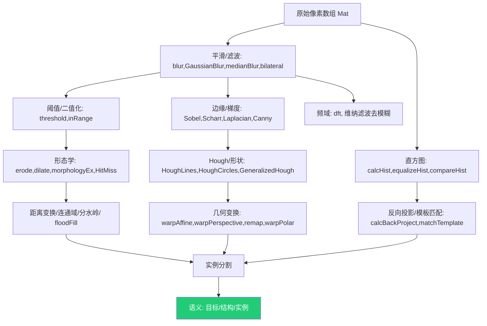

# 第 2 章 图像滤波、几何变换与直方图匹配：ImgProc / ImgTrans / Histograms 原理深解

> 本章基于 OpenCV C++ 官方示例源码（`samples/cpp` 根目录 15 个文件 + `tutorial_code/ImgProc/`、`tutorial_code/ImgTrans/`、`tutorial_code/Histograms_Matching/` 三个子目录的全部 `.cpp`）重写并大幅扩写。目标是把"能跑通的示例"还原为"可迁移的原理"——对每个条目给出数学表达、关键 API 参数表、算法关联对比、常见错误与落地场景。正文为简体中文，API 与代码标识符保留英文。
>
> 约定：文件路径以 `samples/cpp/...` 相对前缀给出；公式用 LaTeX 行内（`$...$`）或伪代码块；所有示例均"先读源码再扩写"，未改动任何源文件。篇幅约为常规教程的 1.5–2 倍，重点在于把"演示代码"升级为"算法原理 + 工程权衡"。

---

## 2.0 章节导言

计算机视觉的终极目标是理解图像内容（目标、结构、语义）。但原始图像本质上只是一张二维像素网格上的*像素强度数组*——只携带"亮度/颜色"这一最底层信号，几乎不含可直接使用的"结构"。OpenCV 的 `imgproc`、`imgtrans`（在 `imgproc` 命名空间内统一组织为几何空间变换）与 `histograms` 三大块，正是完成 **像素 → 结构 → 语义** 三级跃迁的核心算子层：

1. **ImgProc｜平滑与增强**：抑制噪声、突出主体，把含噪声采样"变成"可稳定切割的连续信号，是所有后续边缘、Hough、分水岭的*前置稳态器*。
2. **ImgProc｜形态学**：用结构元素在二值灰度图上做腐蚀、膨胀、开闭、顶帽、黑帽、Hit-Miss，在集合论层面刻画*邻接连通区域的形状*（去毛刺、填孔、断连、提取骨架线条）。
3. **ImgProc｜阈值与二值化**：把灰度图压成 0/1 掩膜，是"连续强度"到"离散区域"的*第一道语义化闸门*。
4. **ImgTrans｜边缘与梯度**：一阶微分（Sobel/Scharr）、二阶微分（Laplacian）、Canny 非极大值抑制 + 双阈值，把"强度变化"显式化为"边界"——从"像素"走向"轮廓/结构"的关键一跃。
5. **ImgTrans｜Hough 与形状检测**：把边缘点通过参数空间的*投票累加*，从杂乱点中还原"直线/圆/任意模板"的全局假设，从"局部边界"走向"几何语义"。
6. **ImgTrans｜几何变换**：仿射、透视（`warpPerspective`）、重映射（`remap`）、极坐标（`warpPolar`）、相位相关（`phaseCorrelate`）——把图像从一个坐标系*重采样*到另一个，服务于配准、矫正、尺度归一。
7. **ImgProc｜距离变换 / 连通域 / 分水岭 / floodFill**：从二值掩膜计算到最近背景的距离场，再用连通域标记或分水岭把*重叠/粘连目标分割开*——从"区域"走向"独立实例"。
8. **Histograms｜直方图与匹配**：把某通道灰度统计分布显式化，用 `equalizeHist`/`CLAHE` 改善对比度；用 `compareHist` 衡量相似度；用 `calcBackProject` 把模板直方图反投回原图做*颜色/纹理定位*；用 `matchTemplate` 做*刚性模板匹配*——从"像素值"走向分布语义与相似度度量。
9. **频域去模糊**：`dft` + 维纳滤波，在频率域建模糊核扩散函数（PSF）并逆滤波，是平稳卷积在频域的对偶视角。

**上下文依赖**：`imgproc`/`imgtrans` 全部建立在第 1 章的 `cv::Mat` 之上；`calcHist`、`calcBackProject`、`matchTemplate` 的结果以 `Mat` 参与后续 `threshold`/`findContours`/`minMaxLoc`；几何变换与 `VideoCapture`、相机标定（`calib3d`）深度融合；频域去模糊依赖 `core::dft`。读不懂本章，上层的 `features2d`、`objdetect`、`calib3d`、`dnn` 都会出现理解断层。

**本章阅读建议**：按"平滑 → 形态学 → 阈值 → 边缘 → Hough → 几何变换 → 距离/分水岭 → 直方图 → 频域"顺序读，每节按 功能 → 原理 → 数学 → API 参数 → 对比 → 易错点 → 场景 → 要点"展开。重点吃透 **Canny 的非极大值抑制与双阈值滞后、Hough 的 $(\rho,\theta)$ 累加投票、双边滤波的保边性、`calcHist` 的 bin 统计、维纳逆滤波** 五处原理，它们是全章"可迁移性最高"的内核。

**概念阅读顺序**（重点看核心原理与参数说明，不写编译运行）：

- 先懂卷积核、边界填充与各类平滑的保边差异，再对照 `Smoothing.cpp`
- 先懂梯度、非极大值抑制与双阈值滞后，再对照 `CannyDetector_Demo.cpp`
- 先懂直方图 bin、均衡化与反向投影匹配，再对照 `calcHist_Demo.cpp`
- 形态学、Hough、几何变换等节在上述三块之后按需对照，仍以原理与参数表为主

---

## 2.1 图像平滑与增强（Smoothing / Filtering / Linear Transform）

平滑本质是用**核（kernel）**对邻域像素做**加权求和**（或统计）压制高频噪声、保留低频主体。卷积定义：

$$y[i] = \sum_{k} w[k] \cdot x[i-k]$$

二维可分离情况下：

$$I'(x,y) = \sum_{k_x}\sum_{k_y} K(k_x,k_y)\, I(x-k_x,\, y-k_y)$$

边界处理需**外推填充**，由 `BORDER_*` 控制（见 2.6.4、第 2 节）。

### 2.1.1 `Smoothing.cpp` —— 四类线性/非线性滤波对比

> **源文件**：`tutorial_code/ImgProc/Smoothing/Smoothing.cpp` ｜ **所属模块**：`imgproc` ｜ **示例类型**：完整流程

#### 功能概述

在同一张 `lena.jpg` 上依次施加 `blur`（均值）、`GaussianBlur`（高斯）、`medianBlur`（中值）、`bilateralFilter`（双边），核尺寸从 1 步进 2 到 31，直观对比四类滤波在"降噪能力 vs 边缘保留"上的权衡。

#### 核心原理

**30 秒心智模型**：四类滤波对应四种"邻域聚合策略"——均值最简单但严重糊边；高斯按距离加权，糊边稍轻且解析可调；中值取邻域中位数，对**椒盐脉冲噪声**几乎完美但对**高斯噪声**弱；双边除空间距离外再引入*强度差*权重，**保边降噪**因此得名。

| 滤波器 | 数学性质 | 适合噪声 | 边缘处理 | 复杂度 |
| --- | --- | --- | --- | --- |
| 均值 `blur` | 线性、低通、盒形核 | 平滑高斯噪声 | 严重糊边 | $O(k^2)$，可分离为 $O(k)$ |
| 高斯 `GaussianBlur` | 线性、低通、各向同性 | 通用高斯噪声 | 糊边但可控 | 可分离，$O(k)$ |
| 中值 `medianBlur` | 非线性、顺序统计量 | **椒盐脉冲** | 保边 | $O(k^2)$，常用 O(1) 算法 |
| 双边 `bilateralFilter` | 非线性、空间+强度双核 | 平滑噪声 | **强保边** | $O(k^2)$，最慢 |

高斯核：

$$G_\sigma(x,y) = \frac{1}{2\pi\sigma_x\sigma_y}\exp\!\left(-\frac{x^2}{2\sigma_x^2}-\frac{y^2}{2\sigma_y^2}\right)$$

双边滤波（空间核 $\otimes$ 强度核）：

$$I'(x,y)=\frac{1}{W_p}\sum_{i,j\in\Omega} I(i,j)\,
\underbrace{\exp\!\left(-\frac{(i-x)^2+(j-y)^2}{2\sigma_s^2}\right)}_{\text{空间邻近}}
\underbrace{\exp\!\left(-\frac{\|I(i,j)-I(x,y)\|^2}{2\sigma_r^2}\right)}_{\text{强度相似}}$$

其中 $W_p$ 为归一化因子。强度差大（跨边缘）时第二项趋零，跨边像素几乎不参与平均，边缘因此被保留。

#### 关键 API

- `blur(src, dst, ksize, anchor, borderType)`：盒形均值滤波；
- `GaussianBlur(src, dst, ksize, sigmaX, sigmaY, borderType)`：高斯滤波，`sigmaX=0` 时按核尺寸自动推算 $\sigma=0.3\cdot(k-1)\cdot0.5+0.8$；
- `medianBlur(src, dst, ksize)`：中值滤波，`ksize` 必须为正奇数；
- `bilateralFilter(src, dst, d, sigmaColor, sigmaSpace, borderType)`：双边滤波，`d<0` 由 `sigmaSpace` 推算邻域直径。

#### 处理流程

`namedWindow` → `imread` 校验 → 循环 `i=1,3,...,31` 依次施加四类滤波 → `imshow` + `waitKey(DELAY_BLUR)` 暂停对比 → 显示 caption 切换。

#### 参数说明

| 参数 | 含义 | 典型范围/默认 | 调大/调小会怎样 |
| --- | --- | --- | --- |
| `MAX_KERNEL_LENGTH` | 核边长上界 | 31 | 越大越平滑但越糊，耗时 $\propto k^2$ |
| `sigmaColor`（双边） | 强度差权重 | 50–150 | 调大允许跨更大强度差参与平均，保边变弱、更糊 |
| `sigmaSpace`（双边） | 空间距离权重 | 10–50 | 调大邻域扩大，平滑更强但耗时显著上升 |
| `sigmaX`（高斯） | x 方向标准差 | 0（自动） | 越大越糊，跨向异性可分离实现 |
| `DELAY_BLUR` | 帧间停顿 | 100 ms | 仅影响演示节奏 |

#### 关联与对比

本节是 [principles §5 卷积与滤波](./principles.md#5-卷积与滤波邻域运算的基石) 的代码对照。双边滤波的保边思想与 [2.4.6 anisotropic_image_segmentation](#246-anisotropic_image_segmentationcpp--梯度结构张量各向异性扩散) 的 Perona-Malik 各向异性扩散同源——都是"在跨边处停止扩散"。中值滤波的顺序统计量思想在 [2.2 形态学](#22-形态学变换morphology) 中被推广为更一般的 `morphologyEx`。

#### 注意事项

- `bilateralFilter` 对 8 位图内部转浮点处理，输出再量化，速度比高斯慢 5–10 倍；
- `medianBlur` 当 `ksize>5` 时对 8 位图走专用优化路径，CV_8U 性能远好于 CV_32F；
- 高斯核尺寸必须为正奇数，`Size(0,0)` + `sigmaX>0` 时尺寸由 sigma 自动推算。

#### 应用场景

降噪预处理、下采样前抗混叠（高斯）、医学/文档图像保边去噪（双边）、脉冲噪声修复（中值）。

### 2.1.2 `filter2D_demo.cpp` —— 自定义卷积核

> **源文件**：`tutorial_code/ImgTrans/filter2D_demo.cpp` ｜ **所属模块**：`imgproc` ｜ **示例类型**：完整流程

#### 功能概述

用 `filter2D` 把任意自定义核（锐化、浮雕、边缘、Sobel 等）施加于图像，三键切换核类型并循环改变核尺寸，演示"线性滤波即卷积"的通用引擎。

#### 核心原理

`filter2D` 在数学上做相关（correlation）而非严格卷积（不翻转核）：

$$I'(x,y)=\sum_{i,j} K(i,j)\, I(x+i-d, y+j-d),\quad d=(k-1)/2$$

核的*和*决定整体亮度偏移：和为 0 的核（Laplacian、Sobel）输出围绕 0 振荡，需加 128 偏移或取绝对值才能可视；和为 1 的核（锐化 `[[0,-1,0],[-1,5,-1,],[0,-1,0]]`）保持平均亮度不变；和大于 1 的核会整体提亮。可分离核（高斯、Sobel）应优先用 `sepFilter2D`，复杂度从 $O(k^2)$ 降到 $O(2k)$。

#### 关键 API

- `filter2D(src, dst, ddepth, kernel, anchor, delta, borderType)`：通用 2D 线性滤波；
- `sepFilter2D`：可分离核的高效实现；
- `Mat::t()`：核转置（用于构造各向异性核）。

#### 处理流程

定义三组核（锐化/边缘/模糊）→ 用户按键切换 → `filter2D` → `imshow`。

#### 参数说明

| 参数 | 含义 | 典型范围/默认 | 调大/调小会怎样 |
| --- | --- | --- | --- |
| `ddepth` | 输出深度 | `src.depth()` 或 `CV_16S` | 用 `CV_16S`/`CV_32F` 避免负梯度溢出截断 |
| `kernel` | 卷积核 Mat | $3\times3$–$11\times11$ | 大核平滑更强但糊边更严重 |
| `delta` | 加到结果的常数 | 0 | 视化为 0 中心核加偏移 |
| `anchor` | 核锚点 | `(-1,-1)`=核中心 | 偏移会改变输出图像几何位置 |

#### 关联与对比

`filter2D` 是 [2.1.1 Smoothing](#211-smoothingcpp--四类线性非线性滤波对比) 中 `blur`/`GaussianBlur` 的"通用版本"——后者等价于传入特定核的 `filter2D`。Sobel/Laplacian 在 [2.4 边缘与梯度](#24-边缘与梯度edge--gradient) 中通过专用 API 调用，但底层都是 `sepFilter2D`/`filter2D`。

#### 注意事项

- 核和为 0 时输出有负值，`imshow` 会截断到 0，需 `convertScaleAbs(dst, dst, 1, 128)` 显式偏移；
- 大核（$>7$）若不可分离，性能急剧下降，应优先 `GaussianBlur` 等专用实现。

#### 应用场景

自定义锐化、浮雕、Emboss 特效、Hessian 自定义响应、PSF 卷积仿真。

### 2.1.3 `BasicLinearTransforms.cpp` —— 仿射亮度/对比度

> **源文件**：`tutorial_code/ImgProc/BasicLinearTransforms.cpp` ｜ **所属模块**：`core`（点运算）｜ **示例类型**：完整流程

#### 功能概述

点运算 $I'=\alpha I+\beta$，通过滑条调节 $\alpha$（对比度）和 $\beta$（亮度），演示最基础的逐像素线性变换。

#### 核心原理

点运算不依赖邻域，每个像素独立映射。$\alpha>1$ 拉伸对比度（直方图横向扩张）、$\alpha<1$ 压缩；$\beta$ 整体平移直方图。当像素值溢出 `[0,255]` 时 OpenCV 在 `saturate_cast` 中自动截断。`convertTo` 是其高效实现（SIMD 向量化），无需手写循环。

$$I'(x,y)=\alpha\, I(x,y)+\beta,\quad \alpha\in[0,3],\,\beta\in[-100,100]$$

#### 关键 API

- `Mat::convertTo(dst, rtype, alpha, beta)`：`dst = saturate_cast(src*alpha + beta)`；
- `createTrackbar`：交互调节 $\alpha,\beta$。

#### 处理流程

`imread` → 创建两个滑条（alpha/beta）→ 回调内 `src.convertTo(dst, -1, alpha, beta)` → `imshow`。

#### 参数说明

| 参数 | 含义 | 典型范围/默认 | 调大/调小会怎样 |
| --- | --- | --- | --- |
| `alpha` | 对比度增益 | 0.0–3.0 | >1 拉伸对比度，超出截断；<1 压缩 |
| `beta` | 亮度偏移 | -100–100 | 正值提亮，负值压暗 |

#### 关联与对比

与 [2.1.4 changing_contrast_brightness_image](#214-changing_contrast_brightness_imagecpp) 同主题，后者额外讲解 $\gamma$ 校正（幂律变换 $I^\gamma$）以补偿显示器的非线性响应。点运算的极限是 [2.8 直方图均衡化](#28-直方图与匹配histograms--matching)，后者自动求得最优映射曲线。

#### 注意事项

- 8 位图运算结果必须 `saturate_cast`，否则溢出回绕产生伪影；
- 多通道 BGR 时 `alpha/beta` 同等地作用三通道，不能单独调某一通道。

#### 应用场景

曝光校正、显示前 gamma 补偿、医学影像窗宽窗位调节。

### 2.1.4 `changing_contrast_brightness_image.cpp` —— 亮度对比度与 gamma

> **源文件**：`tutorial_code/ImgProc/changing_contrast_brightness_image/changing_contrast_brightness_image.cpp` ｜ **所属模块**：`core` ｜ **示例类型**：完整流程

#### 功能概述

在 [2.1.3](#213-basiclineartransformscpp--仿射亮度对比度) 基础上增加**伽马校正**通道：除线性 $\alpha I+\beta$ 外，再用 $I^\gamma$ 对暗部/亮部做非线性增强。

#### 核心原理

伽马变换：

$$I' = \bigl(I/255\bigr)^\gamma \cdot 255$$

$\gamma<1$ 拉伸暗部（更常见，因为人眼对暗部更敏感、显示器本身也是 $V^\gamma$），$\gamma>1$ 压暗。线性变换与伽马变换**不可交换**：先线性再幂与先幂再线性结果不同，工程中常"先 gamma 解码到线性光空间 → 处理 → gamma 编码回显示空间"。

#### 关键 API

- `Mat::convertTo`：线性变换；
- 逐像素 LUT 或 `cv::pow`：实现 $I^\gamma$。

#### 处理流程

`imread` → 像素遍历 `alpha*src + beta` → `pow(adjusted, gamma)` → `imshow` 对比。

#### 参数说明

| 参数 | 含义 | 典型范围/默认 | 调大/调小会怎样 |
| --- | --- | --- | --- |
| `alpha` | 线性增益 | 1.0–3.0 | 同 2.1.3 |
| `beta` | 线性偏移 | 0–100 | 同 2.1.3 |
| `gamma` | 幂指数 | 0.04–10 | <1 提亮暗部，>1 压暗 |

#### 关联与对比

伽马校正是 sRGB ↔ 线性光空间转换的核心，[2.8.3 EqualizeHist_Demo](#283-equalizehist_democpp含-clahe-扩展) 的直方图均衡化应在*线性光*空间做才物理正确，否则 gamma 压缩会扭曲分布。

#### 注意事项

- 8 位图做 `pow` 需先 `convertTo(CV_32F, 1/255)`，运算后乘回 255 再 `saturate_cast`；
- 暗部拉伸过度会放大噪声，应配合降噪使用。

#### 应用场景

显示校正、HDR tone mapping 预处理、低光照增强。

### 2.1.5 `falsecolor.cpp` —— 伪彩色映射

> **源文件**：`samples/cpp/falsecolor.cpp` ｜ **所属模块**：`imgproc` ｜ **示例类型**：完整流程

#### 功能概述

用 `applyColorMap` 把灰度图（或单通道指标图）映射到预定义的彩色 LUT（JET/HOT/...），把"不可见的强度差异"转化为"可分辨的色相差异"。

#### 核心原理

伪彩色映射是逐像素查表（LUT）：对每个灰度 $g\in[0,255]$ 预存一个 BGR 三元组，输入图的每个像素值作为索引取出对应颜色。OpenCV 内置 `COLORMAP_*` 系列（JET、HOT、PARULA、INFERNO、VIRIDIS、TURBO…），其中感知均匀色图（VIRIDIS/TURBO）在视觉上对相同数值差给出相同感知差，避免 JET 的"虚假边界"。

$$\text{out}(x,y) = \text{LUT}\bigl[I(x,y)\bigr],\quad \text{LUT}:[0,255]\to[0,255]^3$$

#### 关键 API

- `applyColorMap(src, dst, colormap)`：内置 LUT 应用；
- `applyColorMap(src, dst, userColorMap)`：自定义 LUT（一维 256×3 的 `Mat`）。

#### 处理流程

`imread` 灰度 → 选 colormap → `applyColorMap` → `imshow`。

#### 参数说明

| 参数 | 含义 | 典型范围/默认 | 调大/调小会怎样 |
| --- | --- | --- | --- |
| `colormap` | LUT 类型 | JET/VIRIDIS/TURBO | 选 JET 对比强但有伪边界，VIRIDIS 感知均匀无误导 |

#### 关联与对比

伪彩色是 [2.8.2 calcHist_Demo](#282-calchist_democpp) 中直方图可视化的"色彩版"——把分布密度直接染色到原图。与 [2.7 距离变换](#27-距离变换连通域分水岭与-floodfill) 结合，可把"到背景距离"映射成色温，用于分水岭标记可视化。

#### 注意事项

- 输入必须为 8 位单通道，多通道需先 `cvtColor` 转灰度；
- 学术论文优先 VIRIDIS/TURBO，避免 JET 误导读者。

#### 应用场景

热力图、深度图可视化、概率图叠加、医学影像窗位染色。

---

## 2.2 形态学变换（Morphology）

形态学用**结构元素**（structuring element）在二值图（或灰度图）上做集合运算，刻画邻接区域的形状。基础运算为**腐蚀**（erode）和**膨胀**（dilate）：

$$A\ominus B = \{z\mid (B_z)\subseteq A\},\quad A\oplus B = \{z\mid (B_z)\cap A\neq\varnothing\}$$

其中 $B_z$ 是结构元素平移到 $z$。腐蚀"瘦化"、膨胀"肥化"，开 = 腐蚀+膨胀（去毛刺）、闭 = 膨胀+腐蚀（填孔）。

### 2.2.1 `Morphology_1.cpp` —— 腐蚀与膨胀基础

> **源文件**：`tutorial_code/ImgProc/Morphology_1.cpp` ｜ **所属模块**：`imgproc` ｜ **示例类型**：完整流程

#### 功能概述

用滑条控制腐蚀/膨胀类型与核尺寸，直观演示"瘦化/肥化"对二值图的影响。

#### 核心原理

**30 秒心智模型**：腐蚀要求结构元素完全落入前景才算保留，故会"吃掉"细小毛刺、细缝、孤立小点；膨胀只要结构元素触碰前景就置前景，故会"长大"并连通相邻块、填补小孔。开运算（先腐蚀再膨胀）只消除小毛刺不改变主体尺寸；闭运算（先膨胀再腐蚀）只填小孔不断连。结构元素形状（矩形/十字/椭圆）决定腐蚀的方向偏好：十字元素对水平/垂直线更敏感。

#### 关键 API

- `getStructuringElement(shape, ksize, anchor)`：构造矩形/十字/椭圆核；
- `erode(src, dst, kernel, anchor, iterations, borderType, borderValue)`；
- `dilate(src, dst, kernel, anchor, iterations, borderType, borderValue)`。

#### 处理流程

`imread` 灰度 → 阈值化二值 → `getStructuringElement` → 滑条切换腐蚀/膨胀 → `erode`/`dilate` → `imshow`。

#### 参数说明

| 参数 | 含义 | 典型范围/默认 | 调大/调小会怎样 |
| --- | --- | --- | --- |
| `shape` | 结构元素形状 | MORPH_RECT/ELLIPSE/CROSS | 椭圆保形，矩形方向偏强 |
| `ksize` | 核尺寸 | 3–15 | 越大单次腐蚀/膨胀作用越强 |
| `iterations` | 迭代次数 | 1 | $n$ 次迭代近似核尺寸为 $2n+1$ 的单次作用 |

#### 关联与对比

形态学是 [principles §6 形态学操作](./principles.md#6-形态学操作腐蚀膨胀与开闭运算) 的代码对照。开闭运算的复合定义见 [2.2.2 Morphology_2](#222-morphology_2cpp--开闭顶帽黑帽)。

#### 注意事项

- 多次 `iterations` 不严格等价于大核单次，因为边缘像素的边界填充会重复参与；
- 灰度形态学（非二值）按"极值"操作：腐蚀取邻域最小、膨胀取邻域最大，对应最小/最大滤波。

#### 应用场景

去毛刺、填孔、断连/连通、文本行连通、噪声孤立点去除。

### 2.2.2 `Morphology_2.cpp` —— 开闭顶帽黑帽

> **源文件**：`tutorial_code/ImgProc/Morphology_2.cpp` ｜ **所属模块**：`imgproc` ｜ **示例类型**：完整流程

#### 功能概述

通过 `morphologyEx` 演示五种复合运算：开、闭、顶帽（tophat）、黑帽（blackhat）、形态学梯度（gradient）。

#### 核心原理

复合运算定义：

| 运算 | 公式 | 用途 |
| --- | --- | --- |
| 开 `MORPH_OPEN` | $A\circ B=(A\ominus B)\oplus B$ | 去毛刺、断连小点 |
| 闭 `MORPH_CLOSE` | $A\bullet B=(A\oplus B)\ominus B$ | 填孔、连通 |
| 顶帽 `MORPH_TOPHAT` | $A-(A\circ B)$ | 提取比结构元素小的亮峰 |
| 黑帽 `MORPH_BLACKHAT` | $(A\bullet B)-A$ | 提取比结构元素小的暗谷 |
| 梯度 `MORPH_GRADIENT` | $(A\oplus B)-(A\ominus B)$ | 形态学边缘检测 |

顶帽 = 原图 − 开运算结果。开运算抹掉小亮块，故顶帽**保留小亮块**——常用于不均匀光照下的局部阈值分割（先顶帽校正背景，再全局阈值）。

#### 关键 API

- `morphologyEx(src, dst, op, kernel, anchor, iterations, borderType, borderValue)`：统一接口。

#### 处理流程

`imread` 灰度 → 二值化 → `getStructuringElement` → 滑条切换 op → `morphologyEx` → `imshow`。

#### 参数说明

| 参数 | 含义 | 典型范围/默认 | 调大/调小会怎样 |
| --- | --- | --- | --- |
| `op` | 运算类型 | MORPH_OPEN/CLOSE/... | 见上表 |
| `ksize` | 结构元素尺寸 | 5–21 | 顶帽/黑帽的 ksize 应略大于目标尺寸 |

#### 关联与对比

顶帽/黑帽是 [2.3 阈值](#23-阈值与二值化thresholding) 处理不均匀光照的前置步骤，与 [2.8.3 CLAHE](#283-equalizehist_democpp含-clahe-扩展) 的局部自适应对比度增强思想同源。

#### 注意事项

- 顶帽/黑帽在灰度图上工作，输入为 8 位灰度；
- 形态学梯度对噪声敏感，常先做开闭预处理。

#### 应用场景

不均匀光照校正（顶帽）、小目标提取（顶帽/黑帽）、形态学边缘、文本行连通（闭）。

### 2.2.3 `morphology2.cpp` —— 高级形态学（根目录）

> **源文件**：`samples/cpp/morphology2.cpp` ｜ **所属模块**：`imgproc` ｜ **示例类型**：完整流程

#### 功能概述

在 `Morphology_2` 基础上增加：自定义结构元素、迭代次数控制、多窗口对照、图像/核尺寸交互。

#### 核心原理

与 2.2.2 相同，重点演示**结构元素形状对结果方向性的影响**——矩形核在水平/垂直方向作用强、椭圆核各向同性、十字核对角线方向无作用。

#### 关键 API

同 2.2.2，附加 `createTrackbar` 控制 iterations 与 element shape。

#### 处理流程

类似 2.2.2，但允许运行时切换 element 并设置 iterations，多窗口对比五种 op。

#### 参数说明

同 2.2.2。

#### 关联与对比

作为 [2.2.1](#221-morphology_1cpp--腐蚀与膨胀基础)–[2.2.2](#222-morphology_2cpp--开闭顶帽黑帽) 的"演示增强版"。

#### 注意事项

同 2.2.2。

#### 应用场景

教学/参数对比演示、工业检测中可定制的形态学预处理。

### 2.2.4 `HitMiss.cpp` —— 二值击中击不中

> **源文件**：`tutorial_code/ImgProc/HitMiss/HitMiss.cpp` ｜ **所属模块**：`imgproc` ｜ **示例类型**：完整流程

#### 功能概述

演示 `morphologyEx(MORPH_HITMISS)`：用三值结构元素（前景/背景/无关）匹配二值图中精确形状的孤立点。

#### 核心原理

击中击不中（Hit-or-Miss）要求结构元素同时满足"前景匹配"和"背景匹配"。结构元素 $B=(B_1, B_2)$，$B_1$ 击中前景、$B_2$ 击中背景（$B_2$ 取补）。结果只在"恰好被 $B_1$ 命中且其邻域背景恰被 $B_2$ 命中"的位置为 1，是**模板匹配的形态学版本**：

$$A\otimes B = (A\ominus B_1)\cap(A^c\ominus B_2)$$

OpenCV 用一个三值核表示：1=必前景、-1=必背景、0=无关。

#### 关键 API

- `morphologyEx(src, dst, MORPH_HITMISS, kernel)`。

#### 处理流程

`imread` 灰度 → 阈值二值化 → 构造三值核（如角点模板）→ `morphologyEx` → `imshow`。

#### 参数说明

| 参数 | 含义 | 典型范围/默认 | 调大/调小会怎样 |
| --- | --- | --- | --- |
| `kernel` | 三值结构元素 | 自定义 | 模板越精确匹配越严，误检率上升 |

#### 关联与对比

HitMiss 是 [2.8.7 MatchTemplate](#287-matchtemplate_democpp) 的二值极简版——都是"模板匹配"，但 HitMiss 要求精确像素匹配，MatchTemplate 允许灰度相似度量。

#### 注意事项

- 仅对二值图有意义，灰度图需先阈值化；
- 对噪声极敏感，单个像素翻转即可改变结果，需先做形态学开闭去噪。

#### 应用场景

角点检测（用 L 形模板）、孤立点定位、字符笔画端点检测。

### 2.2.5 `Morphology_3.cpp` —— 形态学线条提取

> **源文件**：`tutorial_code/ImgProc/morph_lines_detection/Morphology_3.cpp` ｜ **所属模块**：`imgproc` ｜ **示例类型**：完整流程

#### 功能概述

用**长条形结构元素**做开/闭运算，从文档图像中分别提取**水平线**和**垂直线**——结构元素的长方向决定保留哪一类线条。

#### 核心原理

水平条结构元素尺寸 $>(\text{水平线长度})$ 时，开运算保留长水平线、抹掉短竖线；同理垂直条提取竖线。提取后再相减或异或可去除表格线、保留字符。

#### 关键 API

- `getStructuringElement(MORPH_RECT, Size(length, 1))`：水平条；
- `getStructuringElement(MORPH_RECT, Size(1, length))`：垂直条；
- `morphologyEx(MORPH_OPEN)`：提取。

#### 处理流程

`imread` 灰度 → 二值化（反相）→ 水平条开运算提横线 → 垂直条开运算提竖线 → 相减去线 → `imshow`。

#### 参数说明

| 参数 | 含义 | 典型范围/默认 | 调大/调小会怎样 |
| --- | --- | --- | --- |
| `length` | 条形核长度 | 40–80（按图像宽度调） | 过短会保留短线条混入字符，过长可能漏掉短表线 |

#### 关联与对比

与 [2.5 Hough 直线](#25-hough-变换与形状检测hough--shape) 互补——Hough 在含噪边缘图中更鲁棒，形态学线条在清晰二值文档图中更精确。

#### 注意事项

- 结构元素长度需按图像尺寸调，不能硬编码；
- 提取后表格线去除需在二值空间做"差集"，灰度图需先阈值化。

#### 应用场景

表格线去除/保留、文档版面分析、电路板走线提取。

---

## 2.3 阈值与二值化（Thresholding）

阈值把灰度图压成 0/1 掩膜，是从"连续强度"到"离散区域"的第一道闸门。

### 2.3.1 `Threshold.cpp` —— 五种阈值策略

> **源文件**：`tutorial_code/ImgProc/Threshold.cpp` ｜ **所属模块**：`imgproc` ｜ **示例类型**：完整流程

#### 功能概述

滑条调节阈值 $T$ 与最大值 `maxval`，演示 `THRESH_BINARY`/`BINARY_INV`/`TRUNC`/`TOZERO`/`TOZERO_INV` 五种策略。

#### 核心原理

设灰度 $g$，阈值 $T$，最大值 $M$：

| 类型 | 公式 | 用途 |
| --- | --- | --- |
| `THRESH_BINARY` | $g>T?M:0$ | 标准二值化 |
| `THRESH_BINARY_INV` | $g>T?0:M$ | 反相二值 |
| `THRESH_TRUNC` | $\min(g,T)$ | 截断超阈值 |
| `THRESH_TOZERO` | $g>T?g:0$ | 保留超阈值 |
| `THRESH_TOZERO_INV` | $g>T?0:g$ | 保留低于阈值 |

`THRESH_OTSU` 与 `THRESH_TRIANGLE` 是*自动阈值*标志，与上述类型按位或使用：Otsu 在直方图上求类间方差最大化的 $T$；Triangle 假设直方图为单峰，求峰肩位置。

#### 关键 API

- `threshold(src, dst, thresh, maxval, type)`。

#### 处理流程

`imread` 灰度 → `threshold` → `imshow`。

#### 参数说明

| 参数 | 含义 | 典型范围/默认 | 调大/调小会怎样 |
| --- | --- | --- | --- |
| `thresh` | 阈值 | 0–255 | 调大前景收缩，调小前景扩张 |
| `maxval` | 二值最大值 | 255 | 影响输出值不影响分割形状 |
| `type` | 策略位 | THRESH_BINARY\|THRESH_OTSU | Otsu 自动求 thresh，传 0 |

#### 关联与对比

Otsu 是 [2.8 直方图](#28-直方图与匹配histograms--matching) 的应用——直接在直方图上求最优分割点。不均匀光照场景需配合 [2.2.2 顶帽](#222-morphology_2cpp--开闭顶帽黑帽) 或自适应阈值 `adaptiveThreshold`。

#### 注意事项

- Otsu 假设双峰直方图，单峰或多峰场景会失效；
- `THRESH_OTSU` 仅对 8 位图有效，16/32 位图需手动设阈值。

#### 应用场景

文档二值化、掩膜生成、目标提取前置、运动检测背景差。

### 2.3.2 `Threshold_inRange.cpp` —— 区间阈值

> **源文件**：`tutorial_code/ImgProc/Threshold_inRange.cpp` ｜ **所属模块**：`core` ｜ **示例类型**：完整流程

#### 功能概述

用 `inRange` 对多通道图（典型 HSV）按上下界阈值，提取"颜色在区间内"的像素掩膜。

#### 核心原理

`inRange` 对每通道独立比较，结果为"所有通道都在区间内"的与运算：

$$\text{mask}(x,y)=\bigwedge_{c}\bigl(L_c\le I_c(x,y)\le H_c\bigr)$$

HSV 色彩空间中，H 通道为色相环 `[0,180)`（OpenCV 8 位约定），可对 H 设区间定位颜色，对 S/V 设区间排除低饱和与过暗过亮。

#### 关键 API

- `inRange(src, lowerb, upperb, dst)`：逐通道上下界比较；
- `cvtColor(BGR2HSV)`。

#### 处理流程

`imread` BGR → `cvtColor` 到 HSV → 滑条调 H/S/V 上下界 → `inRange` → `bitwise_and` 上色 → `imshow`。

#### 参数说明

| 参数 | 含义 | 典型范围/默认 | 调大/调小会怎样 |
| --- | --- | --- | --- |
| `lowerb`/`upperb` | 上下界 `Scalar` | HSV 各自区间 | 区间越宽召回越多噪声越多 |

#### 关联与对比

`inRange` 是 [2.8.5 calcBackProject](#285-calcbackproject_demo1cpp) 的"硬阈值"版本——后者用直方图概率做软阈值。HSV 颜色分割的原理见 [principles §2 色彩空间](./principles.md#2-色彩空间rgb--hsv--灰度)。

#### 注意事项

- H 通道在 8 位图范围为 `[0,180)`，不是 `[0,360)`，需按 OpenCV 约定；
- 红色在 H 环上跨 0，需两段 `inRange` 后 `bitwise_or`。

#### 应用场景

颜色目标检测（球、车牌、肤色）、绿幕抠图、交通标志定位。

---

## 2.4 边缘与梯度（Edge / Gradient）

边缘是图像强度的不连续点，一阶微分（梯度）极大值或二阶微分（Laplacian）过零点。梯度定义：

$$\nabla I = \left(\frac{\partial I}{\partial x},\, \frac{\partial I}{\partial y}\right),\quad |\nabla I|=\sqrt{G_x^2+G_y^2},\quad \theta=\arctan(G_y/G_x)$$

### 2.4.1 `Sobel_Demo.cpp` —— Sobel 一阶梯度

> **源文件**：`tutorial_code/ImgTrans/Sobel_Demo.cpp` ｜ **所属模块**：`imgproc` ｜ **示例类型**：完整流程

#### 功能概述

用 `Sobel` 计算 x/y 方向梯度，演示梯度幅值与方向的可视化。

#### 核心原理

Sobel 算子是带高斯平滑的可分离差分：

$$G_x=\begin{bmatrix}-1&0&1\\-2&0&2\\-1&0&1\end{bmatrix}*I,\quad G_y=\begin{bmatrix}-1&-2&-1\\0&0&0\\1&2&1\end{bmatrix}*I$$

水平方向差分核 `[-1,0,1]` 与垂直平滑核 `[1,2,1]` 卷积，等价于一次平滑 + 一次中心差分，因此 Sobel 比裸差分更抗噪。Scharr 是 $3\times3$ 的改进版，在小核下方向性更精确：`Scharr` 核 `[3,10,3]`。

#### 关键 API

- `Sobel(src, dst, ddepth, dx, dy, ksize, scale, delta, borderType)`；
- `Scharr`：`ksize=-1` 即等价于 `Sobel(...,ksize=CV_SCHARR)`；
- `addWeighted`：合成 $|G_x|+|G_y|$ 近似梯度幅值；
- `convertScaleAbs`：从 `CV_16S` 转 8 位可视。

#### 处理流程

`imread` 灰度 → `Sobel(dx=1,dy=0)` 求 $G_x$ → `Sobel(dx=0,dy=1)` 求 $G_y$ → `convertScaleAbs` → `addWeighted(0.5,0.5,0)` 合成 → `imshow`。

#### 参数说明

| 参数 | 含义 | 典型范围/默认 | 调大/调小会怎样 |
| --- | --- | --- | --- |
| `ddepth` | 输出深度 | `CV_16S` | 8 位会溢出截断负梯度 |
| `dx,dy` | 求导阶数 | (1,0)/(0,1) | 二阶用 Laplacian，不要 dx=dy=2 |
| `ksize` | 核尺寸 | 3/5/7 | 大核更平滑但定位精度下降 |
| `scale` | 缩放因子 | 1 | 缩放影响可视幅值 |

#### 关联与对比

Sobel 是 [2.4.4 Canny](#244-cannydetector_democpp) 的前置步骤——Canny 内部用 Sobel 求梯度。与 [2.4.2 Laplace](#242-laplace_democpp) 的二阶微分路线不同：一阶梯度抗噪、定位粗，二阶过零点定位精但抗噪弱。

#### 注意事项

- `ddepth` 用 `CV_16S`/`CV_32F` 防止负值截断；
- `ksize=-1` 触发 Scharr，方向性优于 $3\times3$ Sobel。

#### 应用场景

边缘检测前置、梯度直方图（HOG）特征、图像锐化（`addWeighted(src, 1, lap, -0.5)`）。

### 2.4.2 `Laplace_Demo.cpp` —— Laplacian 二阶微分

> **源文件**：`tutorial_code/ImgTrans/Laplace_Demo.cpp` ｜ **所属模块**：`imgproc` ｜ **示例类型**：完整流程

#### 功能概述

用 `Laplacian` 计算二阶导数，过零点对应边缘。

#### 核心原理

Laplacian 是梯度的散度：

$$\Delta I=\nabla^2 I=\frac{\partial^2 I}{\partial x^2}+\frac{\partial^2 I}{\partial y^2}$$

离散常用核：

$$L=\begin{bmatrix}0&1&0\\1&-4&1\\0&1&0\end{bmatrix}\ \text{或}\ \begin{bmatrix}1&1&1\\1&-8&1\\1&1&1\end{bmatrix}$$

二阶导在阶跃边缘处过零（符号翻转），故零交叉点即边缘位置。Laplacian 定位精度高但**对噪声极敏感**——任何高频噪声都会产生强响应，因此实际使用常先做高斯平滑（即 LoG = Laplacian of Gaussian）。

#### 关键 API

- `Laplacian(src, dst, ddepth, ksize, scale, delta, borderType)`；
- 内部实现：`Sobel(dx=2)+Sobel(dy=2)` 或 `filter2D(L)`。

#### 处理流程

`imread` 灰度 → `GaussianBlur` 降噪 → `Laplacian` → `convertScaleAbs` → `imshow`。

#### 参数说明

| 参数 | 含义 | 典型范围/默认 | 调大/调小会怎样 |
| --- | --- | --- | --- |
| `ksize` | Sobel 派生核尺寸 | 3 | 1 时退化为 `[0,1,0;-1,0,1;0,-1,0]` |
| `ddepth` | 输出深度 | `CV_16S` | 同 Sobel |

#### 关联与对比

Laplacian 对应 [principles §7 边缘 Hough 几何](./principles.md#7-边缘hough-与几何变换) 中的二阶路线。LoG 是 Marr-Hildreth 边缘检测器，与 Canny 路线（一阶 + 非极大值抑制 + 双阈值）互补。

#### 注意事项

- 必须先 `GaussianBlur`，否则噪声响应淹没边缘；
- 输出有正负，需 `convertScaleAbs` 或加 128 偏移可视。

#### 应用场景

LoG 边缘、图像锐化（`src - laplacian`）、blob 检测的前置。

### 2.4.3 `laplace.cpp` —— Laplacian 综合演示（根目录）

> **源文件**：`samples/cpp/laplace.cpp` ｜ **所属模块**：`imgproc` ｜ **示例类型**：完整流程

#### 功能概述

与 [2.4.2](#242-laplace_democpp) 同主题，提供更多核尺寸/高斯 sigma 的对照窗口。

#### 核心原理

同 2.4.2，重点演示"高斯 sigma 与 Laplacian 响应"的关系——sigma 越大模糊越强，LoG 响应由"细纹理"转向"主边缘"。

#### 关键 API

同 2.4.2。

#### 处理流程

`imread` 灰度 → 多组高斯 sigma + Laplacian → 多窗口并列对比。

#### 参数说明

同 2.4.2。

#### 关联与对比

作为 [2.4.2](#242-laplace_democpp) 的演示增强版。

#### 注意事项

同 2.4.2。

#### 应用场景

教学参数对比、锐化滤镜调参。

### 2.4.4 `CannyDetector_Demo.cpp` —— Canny 边缘

> **源文件**：`tutorial_code/ImgTrans/CannyDetector_Demo.cpp` ｜ **所属模块**：`imgproc` ｜ **示例类型**：完整流程

#### 功能概述

滑条调节低阈值 `lowThreshold`，固定高低阈值比 1:3、核尺寸 3，演示 Canny 边缘检测的"非极大值抑制 + 双阈值滞后"完整流程。

#### 核心原理

**30 秒心智模型**：Canny 不是单一算子而是五步流水线——(1) 高斯平滑降噪；(2) Sobel 求梯度幅值 $|\nabla I|$ 与方向 $\theta$；(3) **非极大值抑制（NMS）**：把每个像素的幅值与沿梯度方向的两邻接像素比较，只保留局部极大；(4) **双阈值滞后**：高于高阈值 $T_h$ 立即接受为强边缘，低于低阈值 $T_l$ 拒绝，介于两者之间仅在"与强边缘 8-连通"时才接受；(5) 8-连通跟踪得到细边。NMS 把宽边压成单像素细边，双阈值滞后把"噪响响"和"真边缘"连接起来，避免断边。

| 步骤 | 作用 | 关键参数 |
| --- | --- | --- |
| 高斯平滑 | 降噪 | sigma/kernel size |
| Sobel 梯度 | 强度变化 | ksize |
| NMS | 细化 | 方向量化为 0/45/90/135 |
| 双阈值 | 分离强弱 | $T_l,T_h$ 比 1:2 或 1:3 |
| 连通跟踪 | 连接断边 | 8-连通 |

源码用 `blur(src_gray, detected_edges, Size(3,3))` 做轻量降噪（Canny 内部不再做高斯），再 `Canny`。输出二值边缘图作为 mask，`src.copyTo(dst, mask)` 把原图边缘像素染回，演示"用边缘做掩膜"。

#### 关键 API

- `Canny(image, edges, threshold1, threshold2, apertureSize, L2gradient)`；
  - `threshold1`/`threshold2`：低/高阈值；
  - `apertureSize`：Sobel 核尺寸（3/5/7）；
  - `L2gradient`：true 用 $L_2$ 范数 $\sqrt{G_x^2+G_y^2}$，false 用 $L_1$ 近似 $|G_x|+|G_y|$。

#### 处理流程

`imread` → `cvtColor(BGR2GRAY)` → `blur` 降噪 → `Canny` → `dst=Scalar::all(0)` → `src.copyTo(dst, edges)` → `imshow`。

#### 参数说明

| 参数 | 含义 | 典型范围/默认 | 调大/调小会怎样 |
| --- | --- | --- | --- |
| `lowThreshold` | 低阈值 | 0–100 | 调大边缘变少、断边增多；调小噪声边缘变多 |
| `ratio`（高/低） | 双阈值比 | 2–3 | 比小则接受更多中间响应；比大则连接更严格 |
| `kernel_size` | Sobel 核 | 3 | 5/7 更平滑但定位下降 |
| `L2gradient` | 范数选择 | false（默认） | true 更精确但慢 |

#### 关联与对比

Canny 是 [principles §7 边缘 Hough 几何](./principles.md#7-边缘hough-与几何变换) 的代表。它直接作为 [2.5 Hough](#25-hough-变换与形状检测hough--shape) 与 [ch03 findContours](./ch03_features.md) 的输入。与 [2.4.1 Sobel](#241-sobel_democpp--sobel-一阶梯度) 直接幅值法相比，Canny 的 NMS+双阈值把"模糊宽边"变为"细连续边"。

#### 注意事项

- 双阈值比通常 1:2 到 1:3，过大过小都会恶化结果；
- 严重噪声场景应在外部先做更强降噪（高斯 sigma 1–2）；
- `L2gradient=true` 在低端硬件上代价明显。

#### 应用场景

通用边缘检测、Hough 前置、轮廓检测前置、车道线/文档线提取。

### 2.4.5 `edge.cpp` —— 边缘策略对比（根目录）

> **源文件**：`samples/cpp/edge.cpp` ｜ **所属模块**：`imgproc` ｜ **示例类型**：完整流程

#### 功能概述

在同一图上并列对比 Sobel、Scharr、Laplacian、Canny 的边缘响应，直观展示不同算子的"细 vs 粗、抗噪 vs 灵敏"权衡。

#### 核心原理

同 [2.4.1](#241-sobel_democpp--sobel-一阶梯度)–[2.4.4](#244-cannydetector_democpp)。重点是把四类算子放在同一窗口对比：Sobel/Scharr 给"宽边带"、Laplacian 给"过零点细线但含噪响"、Canny 给"细连续边"。

#### 关键 API

`Sobel`、`Scharr`、`Laplacian`、`Canny`。

#### 处理流程

`imread` 灰度 → 四个算子各算一次 → 四窗口对比。

#### 参数说明

各算子参数同 2.4.1/2.4.2/2.4.4。

#### 关联与对比

作为 [2.4.1](#241-sobel_democpp--sobel-一阶梯度)–[2.4.4](#244-cannydetector_democpp) 的总览演示。

#### 注意事项

输出深度统一为 `CV_16S` 再 `convertScaleAbs`，便于对比。

#### 应用场景

边缘算子选型教学、算法对比演示。

### 2.4.6 `anisotropic_image_segmentation.cpp` —— 各向异性扩散分割

> **源文件**：`tutorial_code/ImgProc/anisotropic_image_segmentation/anisotropic_image_segmentation.cpp` ｜ **所属模块**：`imgproc`（结构张量）｜ **示例类型**：完整流程

#### 功能概述

用**梯度结构张量**（structure tensor）求各向异性方向，在保边的前提下做"沿边缘切、跨边不切"的分割。

#### 核心原理

结构张量（二阶矩矩阵）：

$$J=\begin{bmatrix}\langle G_x^2\rangle & \langle G_xG_y\rangle\\ \langle G_xG_y\rangle & \langle G_y^2\rangle\end{bmatrix}=R\begin{bmatrix}\lambda_1&0\\0&\lambda_2\end{bmatrix}R^\top$$

其中 $\langle\cdot\rangle$ 是高斯加权局部平均。特征值 $\lambda_1\ge\lambda_2$：$\lambda_1\approx\lambda_2$ 大时为角点，$\lambda_1\gg\lambda_2$ 时为边/线，$\lambda_1\approx\lambda_2\approx0$ 为平坦区。特征向量 $R=[u_1,u_2]$，$u_1$ 沿边缘切向、$u_2$ 跨边缘方向。沿 $u_1$ 方向做平滑（保边），沿 $u_2$ 不平滑（保形），实现各向异性扩散（Perona-Malik 思想）。

#### 关键 API

- `Sobel` 求 $G_x,G_y$；
- `GaussianBlur` 做 $\langle\cdot\rangle$；
- `eigen` 求 $J$ 特征值/向量；
- `boxFilter`/`GaussianBlur` 沿 $u_1$ 方向加权。

#### 处理流程

`imread` 灰度 → `Sobel` → 外积 $G_xG_y$ → `GaussianBlur` 平滑得 $J$ → `eigen` 取特征向量 → 沿切向加权平滑 → 阈值化分割。

#### 参数说明

| 参数 | 含义 | 典型范围/默认 | 调大/调小会怎样 |
| --- | --- | --- | --- |
| 高斯 sigma（J 平滑） | 局部尺度 | 3–7 | 大尺度捕获粗结构，小尺度精细 |
| 阈值（特征值比） | 边/角判定 | $\lambda_1/\lambda_2$ | 比大要求边更强 |

#### 关联与对比

结构张量是 [ch03 Harris 角点](./ch03_features.md) 的同一数学对象——Harris 用 $\det J-\alpha(\text{tr}J)^2$ 区分角/边/平。各向异性扩散与 [2.1.1 双边滤波](#211-smoothingcpp--四类线性非线性滤波对比) 同源——都"在跨边处停止扩散"，但结构张量显式估计方向更精确。

#### 注意事项

- $G_x,G_y$ 须归一化到浮点再做外积，否则 8 位平方易溢出；
- 特征向量在平坦区不稳定，需用特征值阈值掩掉。

#### 应用场景

指纹/血管增强、纹理方向分析、保边平滑、各向异性分割。

---

## 2.5 Hough 变换与形状检测（Hough / Shape）

Hough 把"边缘点 → 参数空间投票"，从杂乱点中还原全局几何假设。

### 2.5.1 `houghlines.cpp` —— 标准与概率 Hough 直线

> **源文件**：`tutorial_code/ImgTrans/houghlines.cpp` ｜ **所属模块**：`imgproc` ｜ **示例类型**：完整流程

#### 功能概述

Canny 边缘图上分别调 `HoughLines`（标准）与 `HoughLinesP`（概率），对比两种直线提取。

#### 核心原理

**30 秒心智模型**：直线 $y=mx+b$ 在 $m$ 趋无穷时参数空间退化，故改用极坐标 $\rho=x\cos\theta+y\sin\theta$。每个边缘点 $(x,y)$ 在 $(\rho,\theta)$ 参数空间画出一条正弦曲线，所有共线点的曲线在 $(\rho_0,\theta_0)$ 处交汇——投票累加，局部极大值即直线。

- **标准 `HoughLines`**：返回 $(\rho,\theta)$，需自己再算端点；累积器为 2D 矩阵。
- **概率 `HoughLinesP`**：随机抽样边缘点子集，直接返回线段端点 $(x_1,y_1,x_2,y_2)$，速度更快、适合实时。

#### 关键 API

- `HoughLines(edges, lines, rho, theta, threshold, srn, stn)`；
- `HoughLinesP(edges, lines, rho, theta, threshold, minLineLength, maxLineGap)`。

#### 处理流程

`imread` 灰度 → `Canny` → `HoughLines`/`HoughLinesP` → 在原图画线 → `imshow`。

#### 参数说明

| 参数 | 含义 | 典型范围/默认 | 调大/调小会怎样 |
| --- | --- | --- | --- |
| `rho` | 距离分辨率 | 1（像素） | 越大累加器越粗，定位变差 |
| `theta` | 角度分辨率 | CV_PI/180 | 越大方向量化越粗 |
| `threshold` | 投票阈值 | 50–200 | 调大只保留长强线，调小召回更多短弱线 |
| `minLineLength`（P） | 最短线长 | 30–100 | 调大过滤短碎线 |
| `maxLineGap`（P） | 最大断连 | 5–20 | 调大连接更远的端点为一条线 |

#### 关联与对比

Hough 是 [principles §7 边缘 Hough 几何](./principles.md#7-边缘hough-与几何变换) 的代表。与 [2.2.5 形态学线条](#225-morphology_3cpp--形态学线条提取) 互补：Hough 抗噪强、形态学在二值清晰图精确。`HoughLinesP` 与 [ch03 LSD](./ch03_features.md)（`LineSegmentDetector`）都给线段，LSD 在梯度图上工作无需 Canny，精度更高但更慢。

#### 注意事项

- 输入必须是边缘二值图，建议先 `Canny`；
- `threshold` 与图像尺寸/边缘点数相关，需按场景调；
- 长直线优先用概率 Hough，标准 Hough 适合精确角度测量。

#### 应用场景

车道线检测、文档/表格线提取、几何测量、机场跑道/铁轨检测。

### 2.5.2 `HoughLines_Demo.cpp` —— 直线检测交互演示

> **源文件**：`tutorial_code/ImgTrans/HoughLines_Demo.cpp` ｜ **所属模块**：`imgproc` ｜ **示例类型**：完整流程

#### 功能概述

滑条调 `threshold`、`minLineLength`、`maxLineGap`，实时观察 Hough 直线变化。

#### 核心原理

同 [2.5.1](#251-houghlinescpp--标准与概率-hough-直线)。

#### 关键 API

同 2.5.1。

#### 处理流程

`imread` 灰度 → `Canny` → 滑条触发回调 `HoughLinesP` → `line(...)` 画线 → `imshow`。

#### 参数说明

同 2.5.1。

#### 关联与对比

作为 [2.5.1](#251-houghlinescpp--标准与概率-hough-直线) 的交互增强版。

#### 注意事项

同 2.5.1。

#### 应用场景

参数调优教学、实时交互调参。

### 2.5.3 `HoughCircle_Demo.cpp` —— Hough 圆检测

> **源文件**：`tutorial_code/ImgTrans/HoughCircle_Demo.cpp` ｜ **所属模块**：`imgproc` ｜ **示例类型**：完整流程

#### 功能概述

滑条调 `minDist`/`param1`/`param2`/`minRadius`/`maxRadius`，用 `HoughCircles` 检测圆。

#### 核心原理

圆参数 $(a,b,r)$，参数空间为 3D，直接投票计算量大。OpenCV 用 **HOUGH_GRADIENT** 两步法：(1) Sobel 求 $G_x,G_y$，每个边缘点在 $(a,b)$ 平面画圆（半径未定，沿梯度方向投一票）；(2) 在累加器局部极大处定 $(a,b)$，再沿梯度反推 $r$。`HOUGH_GRADIENT_ALT` 是更精确的变体。

#### 关键 API

- `HoughCircles(image, circles, method, dp, minDist, param1, param2, minRadius, maxRadius)`。

#### 处理流程

`imread` 灰度 → `medianBlur` 降噪 → `HoughCircles` → `circle(...)` 画圆 → `imshow`。

#### 参数说明

| 参数 | 含义 | 典型范围/默认 | 调大/调小会怎样 |
| --- | --- | --- | --- |
| `dp` | 累加器分辨率 | 1–2 | 2 = 一半分辨率，快但精度下降 |
| `minDist` | 圆心最小间距 | 图像短边/8 | 小则允许密集圆，大则抑制同位多圆 |
| `param1` | 高 Canny 阈值 | 100–200 | 高阈值过滤弱边缘 |
| `param2` | 累加阈值 | 30–100 | 越大要求越严格，召回少但误检少 |
| `minRadius`/`maxRadius` | 半径区间 | 按场景 | 缩小区间可大幅提速并减少误检 |

#### 关联与对比

Hough 圆是 [2.5 Hough 直线](#251-houghlinescpp--标准与概率-hough-直线) 在圆参数空间的推广。与 [ch03 SimpleBlobDetector](./ch03_features.md) 相比：HoughCircles 对圆形要求严格、定位精确；SimpleBlob 允许任意形状 blob，更适合粗粒度检测。

#### 注意事项

- `param2` 是召回率/精确率的最关键旋钮，调小会大量误检；
- 限定 `minRadius`/`maxRadius` 能极大提速；
- 共膨胀圆会相互干扰累加器，建议先 `minDist` 设较大。

#### 应用场景

瞳孔/虹膜定位、圆形标志/球类检测、细胞计数、车轮/圆形仪表读取。

### 2.5.4 `houghcircles.cpp` —— 圆检测演示（根目录）

> **源文件**：`tutorial_code/ImgTrans/houghcircles.cpp` ｜ **所属模块**：`imgproc` ｜ **示例类型**：完整流程

#### 功能概述

与 [2.5.3](#253-houghcircle_democpp--hough-圆检测) 同主题，提供不同图像与参数集的对照。

#### 核心原理

同 2.5.3。

#### 关键 API

同 2.5.3。

#### 处理流程

同 2.5.3。

#### 参数说明

同 2.5.3。

#### 关联与对比

作为 [2.5.3](#253-houghcircle_democpp--hough-圆检测) 的对照演示。

#### 注意事项

同 2.5.3。

#### 应用场景

同 2.5.3。

### 2.5.5 `generalizedHoughTransform.cpp` —— 通用 Hough

> **源文件**：`tutorial_code/ImgTrans/generalizedHoughTransform.cpp` ｜ **所属模块**：`imgproc` ｜ **示例类型**：完整流程

#### 功能概述

用 `GeneralizedHough`/`GeneralizedHoughBallard` 检测任意形状的模板——不限于直线/圆。

#### 核心原理

通用 Hough（Ballard）把模板的边缘点相对参考点的位置与梯度方向存为 R-table：以梯度方向为索引，记录对应的相对位移。检测时对图像每个边缘点查表，对其指向的候选参考点投票，局部极大即模板实例位置。

#### 关键 API

- `createGeneralizedHoughBallard()`、`createGeneralizedHoughGuil()`；
- `setTemplate`、`detect`。

#### 处理流程

`imread` 模板 → 提取 Canny 边缘 → `setTemplate` → `imread` 场景 → `detect` → 画匹配框。

#### 参数说明

| 参数 | 含义 | 典型范围/默认 | 调大/调小会怎样 |
| --- | --- | --- | --- |
| `levels` | 模板分级数 | 4 | 越大对尺度越鲁棒但慢 |
| `votesThreshold` | 投票阈值 | 100 | 越高召回少但误检少 |

#### 关联与对比

通用 Hough 是 [2.5.1](#251-houghlinescpp--标准与概率-hough-直线)–[2.5.3](#253-houghcircle_democpp--hough-圆检测) 的最一般形式——直线/圆都是其特例。与 [ch03 features2d](./ch03_features.md) 路线互补：通用 Hough 适合"刚体形状严格匹配"，特征匹配适合"柔性相似匹配"。

#### 注意事项

- 对旋转/尺度敏感，Guil 变种支持完整 4DoF；
- 模板与场景需先提取一致的边缘图。

#### 应用场景

固定形状零件定位、印章/标志检测、非纹理目标的刚体检测。

---

## 2.6 几何变换（Geometric Transforms）

几何变换把图像从一坐标系重采样到另一坐标系，服务配准/矫正/尺度归一。

### 2.6.1 `Geometric_Transforms_Demo.cpp` —— 仿射变换

> **源文件**：`tutorial_code/ImgTrans/Geometric_Transforms_Demo.cpp` ｜ **所属模块**：`imgproc` ｜ **示例类型**：完整流程

#### 功能概述

用三点对（src 三角与 dst 三角）求仿射矩阵 $M$，调 `warpAffine` 重采样。

#### 核心原理

仿射变换 $M=\begin{bmatrix}a&b&c\\d&e&f\end{bmatrix}$ 保持平行性、面积比，共线三点确定之：

$$\begin{bmatrix}x'\\y'\end{bmatrix}=M\begin{bmatrix}x\\y\\1\end{bmatrix},\quad \det(a,b;d,e)\neq0$$

OpenCV 提供 `getAffineTransform(srcTri,dstTri)`（三点定 $M$）、`getRotationMatrix2D(center,angle,scale)`（旋转+缩放）。重采样需指定插值：`INTER_NEAREST`（最近，块状）、`INTER_LINEAR`（双线性，默认）、`INTER_CUBIC`（双三次，更平滑）。

#### 关键 API

- `getAffineTransform`、`getRotationMatrix2D`；
- `warpAffine(src, dst, M, dsize, flags, borderMode, borderValue)`。

#### 处理流程

`imread` → 定义 src/dst 三点 → `getAffineTransform` → `warpAffine` → `imshow`。

#### 参数说明

| 参数 | 含义 | 典型范围/默认 | 调大/调小会怎样 |
| --- | --- | --- | --- |
| `flags` | 插值 | INTER_LINEAR | CUBIC 更平滑但慢，NEAREST 块状 |
| `borderMode` | 边界 | BORDER_CONSTANT | BORDER_REFLECT 镜像填充 |

#### 关联与对比

仿射是 [ch03 单应](./ch03_features.md) 的子集——仿射保持平行线，透视单应允许平行线交于灭点。与 [2.6.2 warpPerspective](#262-warpperspective_democpp--透视变换) 相比少一维。

#### 注意事项

- 输出尺寸 `dsize` 必须显式给出，否则不输出；
- 旋转大角度后需重新计算 bounding box 防裁切。

#### 应用场景

数据增强、文档/车牌矫正前置、配准对齐。

### 2.6.2 `warpPerspective_demo.cpp` —— 透视变换

> **源文件**：`samples/cpp/warpPerspective_demo.cpp` ｜ **所属模块**：`imgproc` ｜ **示例类型**：完整流程

#### 功能概述

用四点对求 $3\times3$ 透视矩阵 $H$，`warpPerspective` 把斜视图"拉平"为正视。

#### 核心原理

透视变换：

$$\begin{bmatrix}x'\\y'\\w'\end{bmatrix}=H\begin{bmatrix}x\\y\\1\end{bmatrix},\quad (x',y')=(x'/w', y'/w'),\quad H\in\mathbb{R}^{3\times3}$$

四对共面点对应（无三点共线）唯一确定 $H$（自由度 8）。`getPerspectiveTransform` 用四点求解；`findHomography` 用 RANSAC 求多对点（见 [ch03](./ch03_features.md)）。

#### 关键 API

- `getPerspectiveTransform(src,dst)`；
- `warpPerspective(src, dst, M, dsize, flags, borderMode, borderValue)`。

#### 处理流程

`imread` → 选四角 → `getPerspectiveTransform` → `warpPerspective` → `imshow`。

#### 参数说明

| 参数 | 含义 | 典型范围/默认 | 调大/调小会怎样 |
| --- | --- | --- | --- |
| `dsize` | 输出尺寸 | 按目标矩形 | 影响视野与采样率 |
| `flags` | 插值+反变换 | INTER_LINEAR | WARP_INVERSE_MAP 用 $H^{-1}$ |

#### 关联与对比

透视是 [2.6.1 仿射](#261-geometric_transforms_democpp--仿射变换) 的扩展。在 [ch03 单应分解](./ch03_features.md)、[ch07 相机标定](./ch07_calib3d_stitching.md) 中是相机位姿恢复的几何基础。

#### 注意事项

- 输出尺寸需按目标矩形估算，否则部分图像被裁；
- `WARP_INVERSE_MAP` 用于"已知目标到源的映射"，常在配准中用。

#### 应用场景

文档/招牌拉平、车牌矫正、AR 平面贴图、监控视角转换。

### 2.6.3 `Remap_Demo.cpp` —— 重映射

> **源文件**：`tutorial_code/ImgTrans/Remap_Demo.cpp` ｜ **所属模块**：`imgproc` ｜ **示例类型**：完整流程

#### 功能概述

构造两张 map（map_x, map_y），`remap` 按 `dst(x,y) = src(map_x(x,y), map_y(x,y))` 重采样，可实现任意非线性变换。

#### 核心原理

`remap` 是几何变换的最一般形式——把目标图的每个像素 $(x,y)$ 显式指定其源坐标 $(u,v)=(\text{map}_x(x,y),\text{map}_y(x,y))$，再插值。仿射/透视只是其特例：构造对应矩阵即可。常用于镜头畸变矫正（`initUndistortRectifyMap` 输出 map_x/map_y）、极坐标、波动特效。

#### 关键 API

- `remap(src, dst, map_x, map_y, interpolation, borderMode, borderValue)`；
- `initUndistortRectifyMap`、`convertMaps`。

#### 处理流程

`imread` 灰度 → 构造 `map_x`/`map_y`（如波浪/翻转/极坐标）→ `remap` → `imshow`。

#### 参数说明

| 参数 | 含义 | 典型范围/默认 | 调大/调小会怎样 |
| --- | --- | --- | --- |
| `map_x/map_y` | 源坐标映射 | CV_32FC1 | 越界由 borderMode 处理 |
| `interpolation` | 插值 | INTER_LINEAR | 双线性折中 |

#### 关联与对比

`remap` 是 [2.6.1](#261-geometric_transforms_democpp--仿射变换)–[2.6.2](#262-warpperspective_democpp--透视变换) 的超集。在 [ch07 标定去畸变](./ch07_calib3d_stitching.md) 中以 `initUndistortRectifyMap` + `remap` 预计算映射表，反复复用提效。

#### 注意事项

- map 必须为 `CV_32FC1` 或 `CV_16SC2`；
- 镜头畸变矫正时若一次性计算量大，预计算 + 缓存是性能关键。

#### 应用场景

镜头畸变矫正、极坐标变换、鱼眼去畸变、艺术特效。

### 2.6.4 `copyMakeBorder_demo.cpp` —— 边界填充

> **源文件**：`tutorial_code/ImgTrans/copyMakeBorder_demo.cpp` ｜ **所属模块**：`imgproc` ｜ **示例类型**：完整流程

#### 功能概述

演示 `copyMakeBorder` 的多种 `BORDER_*` 模式，是所有卷积/几何变换边界处理的"基础"。

#### 核心原理

边界填充决定卷积在图像边缘的行为：

| 模式 | 行为 | 用途 |
| --- | --- | --- |
| `BORDER_CONSTANT` | 用常数值填充 | 通用默认 |
| `BORDER_REPLICATE` | 复制最外行 | 形态学常用 |
| `BORDER_REFLECT` | 镜像反射（不含边） | 自然图常用 |
| `BORDER_REFLECT_101` | 镜像反射（含边，`gfedcb|abcdefgh|gfedcb`） | 默认，Sobel/DFT 推荐 |
| `BORDER_WRAP` | 周期延拓 | 周期性纹理 |
| `BORDER_REFLECT` vs `_101` | 是否重复边缘像素 | `_101` 不重复，更平滑 |

#### 关键 API

- `copyMakeBorder(src, dst, top, bottom, left, right, borderType, value)`；
- 所有滤波/几何 API 的 `borderType` 参数。

#### 处理流程

`imread` → 各 `BORDER_*` 模式 `copyMakeBorder` → 多窗口对比。

#### 参数说明

| 参数 | 含义 | 典型范围/默认 | 调大/调小会怎样 |
| --- | --- | --- | --- |
| `borderType` | 填充模式 | BORDER_REFLECT_101 | 选错会在边缘引入伪影/突变 |
| `value` | 常数填充值 | Scalar(0) | 仅 CONSTANT 时生效 |

#### 关联与对比

边界填充贯穿 [2.1 平滑](#211-smoothingcpp--四类线性非线性滤波对比)–[2.5 Hough](#25-hough-变换与形状检测hough--shape) 所有邻域运算。`BORDER_CONSTANT` 在 [2.4.4 Canny](#244-cannydetector_democpp) 中可能引入边缘伪响应，REFLECT 更自然。

#### 注意事项

- DFT 要求尺寸为某些质数倍，需配合 `BORDER_CONSTANT` 补零；
- 形态学结构元素越界部分通常用 `BORDER_CONSTANT`+`borderValue` 控制。

#### 应用场景

所有卷积/几何变换的边界处理、卷积尺寸对齐、DFT 补零。

---

## 2.7 距离变换、连通域、分水岭与 floodFill

从二值掩膜计算到最近背景的距离场，再用连通域标记或分水岭把粘连目标分割开。

### 2.7.1 `distrans.cpp` —— 距离变换

> **源文件**：`samples/cpp/distrans.cpp` ｜ **所属模块**：`imgproc` ｜ **示例类型**：完整流程

#### 功能概述

对二值图调 `distanceTransform`，可视化"每个前景像素到最近背景像素的距离场"。

#### 核心原理

距离变换：

$$D(x,y)=\min_{(u,v)\in\text{bg}}\|(x,y)-(u,v)\|$$

距离类型 `DIST_L1`（曼哈顿）、`DIST_L2`（欧氏，最精确）、`DIST_C`（棋盘）。OpenCV 用两遍扫描近似算法（Felzenszwalb 或 Borgefors），O(N) 复杂度。掩膜尺寸 3/5/PC/FAIR 影响精度：`DIST_MASK_5` 比 `_3` 精度更高。

#### 关键 API

- `distanceTransform(src, dst, distanceType, maskSize, labelType)`。

#### 处理流程

`imread` 灰度 → 阈值二值化 → `distanceTransform` → `normalize` 0–255 可视 → `imshow`。

#### 参数说明

| 参数 | 含义 | 典型范围/默认 | 调大/调小会怎样 |
| --- | --- | --- | --- |
| `distanceType` | 距离度量 | DIST_L2 | L1/C 跑得快但精度差 |
| `maskSize` | 掩膜尺寸 | 3/5 | 5 比 3 更精确 |
| `labelType` | 标号类型 | DIST_LABEL_CCOMP | 用于 [2.7.5 分水岭](#275-imagesegmentationcpp距离变换--分水岭组合) 自动产生 marker |

#### 关联与对比

距离变换是 [2.7.5 分水岭](#275-imagesegmentationcpp距离变换--分水岭组合) 的关键前置——在距离场中取局部极大作 marker，分水岭沿山脊分割粘连目标。

#### 注意事项

- 输入必须为 8 位单通道，前景为非零；
- `normalize` 仅用于可视，原始距离值浮点参与下游算法。

#### 应用场景

粘连目标分割、骨架提取、字符笔画宽度估计、地图距离场。

### 2.7.2 `connected_components.cpp` —— 连通域标记

> **源文件**：`samples/cpp/connected_components.cpp` ｜ **所属模块**：`imgproc` ｜ **示例类型**：完整流程

#### 功能概述

调 `connectedComponents` 给二值图每个连通区域一个唯一标号，配合 `connectedComponentsWithStats` 输出面积/外接框统计。

#### 核心原理

连通域标记（CCL）遍历二值图，4-或 8-连通下把相邻前景像素聚为同一标号。OpenCV 实现常用两遍扫描 + Union-Find 或 BBDT/SAUF。`stats` 输出每个区域的 bounding box、面积、质心。

#### 关键 API

- `connectedComponents(image, labels, connectivity, ltype)`；
- `connectedComponentsWithStats(image, labels, stats, centroids, connectivity, ltype)`。

#### 处理流程

`imread` 灰度 → 阈值二值化 → `connectedComponentsWithStats` → 按面积过滤 → 着色显示 → `imshow`。

#### 参数说明

| 参数 | 含义 | 典型范围/默认 | 调大/调小会怎样 |
| --- | --- | --- | --- |
| `connectivity` | 连通性 | 8（默认） | 4 严格、合并更少；8 宽松 |
| `ltype` | 标号类型 | CV_32S | CV_16U 节省内存但区域数受限 |

#### 关联与对比

CCL 是 [2.7.4 分水岭](#274-watershedcpp) 后"实例化"的常用工具。与 [ch03 findContours](./ch03_features.md) 相比：CCL 给区域级标号，findContours 给边界级轮廓。

#### 注意事项

- 输入为 8 位单通道二值图，背景为 0；
- 大区域数（>32000）需 `CV_32S` 标号。

#### 应用场景

目标计数、blob 提取、文本行/字符分割、粒子分析。

### 2.7.3 `ffilldemo.cpp` —— floodFill 漫水填充

> **源文件**：`samples/cpp/ffilldemo.cpp` ｜ **所属模块**：`imgproc` ｜ **示例类型**：完整流程

#### 功能概述

鼠标点选种子，`floodFill` 从种子按颜色相似性扩散生成掩膜，演示交互式区域分割。

#### 核心原理

floodFill 从种子 $(x_0,y_0)$ 出发，把"与种子或邻接像素颜色差小于阈值"的相邻像素并入区域。两种模式：固定范围（与种子比）和浮动范围（与当前邻接像素比，更柔顺）。

$$|I(p)-I(\text{seed})|\le \text{loDiff}\ \text{且}\ |I(p)-I(q)|\le \text{upDiff}$$

#### 关键 API

- `floodFill(image, mask, seedPoint, newVal, rect, loDiff, upDiff, flags)`。

#### 处理流程

`imread` → `namedWindow` → 鼠标回调取种子 → `floodFill` → `imshow`。

#### 参数说明

| 参数 | 含义 | 典型范围/默认 | 调大/调小会怎样 |
| --- | --- | --- | --- |
| `loDiff`/`upDiff` | 颜色容差 | (4,4,4)–(20,20,20) | 调大区域更扩张可能溢出目标 |
| `flags` | 连通性+模式 | FLOODFILL_FIXED_RANGE | 浮动范围更柔顺 |

#### 关联与对比

floodFill 是 [2.7.4 分水岭](#274-watershedcpp) 的"交互式种子版本"——都从种子扩展区域，floodFill 颜色驱动、分水岭梯度驱动。

#### 注意事项

- `mask` 需比图像大 2 像素的边距；
- 多通道图 `loDiff`/`upDiff` 为 `Scalar`，每通道独立。

#### 应用场景

魔棒选区、交互分割、颜色区域提取、填充修复。

### 2.7.4 `watershed.cpp` —— 分水岭分割

> **源文件**：`samples/cpp/watershed.cpp` ｜ **所属模块**：`imgproc` ｜ **示例类型**：完整流程

#### 功能概述

用户在前景/背景各画标记，`watershed` 以标记为种子，沿梯度拓扑分水岭分割。

#### 核心原理

分水岭把图像视为地形：梯度幅值为海拔，标记为山谷种子。从各种子同时"涨水"，相遇处筑坝即区域边界。OpenCV 实现为基于优先队列的模拟涨水算法，要求 `markers` 为 32 位整型，各种子区域值为不同正整数（背景为 1），未知区为 0，输出 0 区填充分割标号，-1 为边界。

#### 关键 API

- `watershed(image, markers)`。

#### 处理流程

`imread` → 用户在 GUI 画标记 → `markers` Mat → `watershed` → 着色显示 → `imshow`。

#### 参数说明

| 参数 | 含义 | 典型范围/默认 | 调大/调小会怎样 |
| --- | --- | --- | --- |
| `markers` | 标记图 | CV_32S | 标记数过少会过分割，过多误并 |

#### 关联与对比

分水岭是 [2.7 距离变换/分水岭](#27-距离变换连通域分水岭与-floodfill) 的代表。它从 [2.4.4 Canny](#244-cannydetector_democpp) 梯度图工作。自动产生 marker 的方法见 [2.7.5 imageSegmentation](#275-imagesegmentationcpp距离变换--分水岭组合)。

#### 注意事项

- `markers` 必须为 `CV_32S`，未知区显式置 0；
- 标记不足会导致过分割，应在前景目标中心 + 背景各放标记。

#### 应用场景

粘连目标分割、医学细胞分割、与 GrabCut 互补的交互分割。

### 2.7.5 `imageSegmentation.cpp` —— 距离变换 + 分水岭

> **源文件**：`tutorial_code/ImgTrans/imageSegmentation.cpp` ｜ **所属模块**：`imgproc` ｜ **示例类型**：完整流程

#### 功能概述

组合 [2.7.1 距离变换](#271-distranscpp--距离变换) 与 [2.7.4 分水岭](#274-watershedcpp)，实现**自动**分割粘连目标，无需交互标记。

#### 核心原理

距离场中，每个连通目标中心的局部极大是天然 marker：在距离变换图上做阈值 + `connectedComponents` 取极大点作 marker（不同目标不同标号，背景为 1），再 `watershed` 沿距离场的"分水岭"分割粘连目标。这是分水岭的"自动 marker 版本"，把人工交互换成距离场的几何特性。

#### 关键 API

- `distanceTransform`、`threshold`、`connectedComponents`、`watershed`。

#### 处理流程

`imread` 灰度 → 阈值二值化 → `distanceTransform` → 阈值取极大 → `connectedComponents` 生成 marker → `watershed` → 着色 → `imshow`。

#### 参数说明

| 参数 | 含义 | 典型范围/默认 | 调大/调小会怎样 |
| --- | --- | --- | --- |
| 距离场阈值 | marker 强度 | 0.5×max | 调大 marker 少但稳；调小多分小目标 |
| 距离类型 | 度量 | DIST_L2 | L2 最精确 |

#### 关联与对比

是 [2.7.1](#271-distranscpp--距离变换)+[2.7.4](#274-watershedcpp) 的组合应用，与 [ch03 GrabCut](./ch03_features.md)（`grabcut.cpp`）相比：分水岭快但需好 marker，GrabCut 慢但交互式且能量优化。

#### 注意事项

- 距离场阈值是过/欠分关键，应按目标尺寸调；
- marker 数过少会让相邻目标被合并。

#### 应用场景

粘连细胞/颗粒分割、字符分割、OCR 预处理、地图区域分割。

---

## 2.8 直方图与匹配（Histograms / Matching）

直方图把某通道灰度统计分布显式化，是"像素值"走向"分布语义"的桥梁。

### 2.8.1 `demhist.cpp` —— 直方图均衡演示

> **源文件**：`samples/cpp/demhist.cpp` ｜ **所属模块**：`imgproc` ｜ **示例类型**：完整流程

#### 功能概述

演示 `equalizeHist` 对低对比度图（暗、亮、偏窄分布）的均衡化效果，并对比均衡前后直方图。

#### 核心原理

直方图均衡寻找一个单调映射 $s=T(r)$，使输出图的灰度均匀分布。当 $r$ 的累积分布函数（CDF）为 $c(r)$，令 $T(r)=c(r)\cdot255$ 即可使输出近似均匀。数学上，若 $r\sim p_r(r)$，则 $s=T(r)$ 的分布 $p_s(s)=p_r(r)\cdot|dr/ds|=p_r(r)/255$ 近似均匀。

#### 关键 API

- `calcHist` 计算直方图；
- `equalizeHist(src, dst)`：单通道均衡化；
- 多通道需分别均衡 Y 通道或用 [2.8.3 CLAHE](#283-equalizehist_democpp含-clahe-扩展)。

#### 处理流程

`imread` 灰度 → `calcHist` 前 → `equalizeHist` → `calcHist` 后 → 双窗口并列。

#### 参数说明

| 参数 | 含义 | 典型范围/默认 | 调大/调小会怎样 |
| --- | --- | --- | --- |
| 无主要参数 | 均衡为整体变换 | — | — |

#### 关联与对比

均衡是 [principles §4 直方图与模板匹配](./principles.md#4-直方图与模板匹配) 的代表。局部自适应版本见 [2.8.3 CLAHE](#283-equalizehist_democpp含-clahe-扩展)。

#### 注意事项

- 仅对 8 位单通道有效；
- 全局均衡会过度放大暗部噪声，应配合 CLAHE。

#### 应用场景

低对比度图增强、医学影像窗宽窗位、医学 X 光预处理。

### 2.8.2 `calcHist_Demo.cpp` —— 直方图计算与可视化

> **源文件**：`tutorial_code/Histograms_Matching/calcHist_Demo.cpp` ｜ **所属模块**：`imgproc` ｜ **示例类型**：完整流程

#### 功能概述

计算图像的 BGR 三通道直方图，画为折线图，演示 `calcHist` 的 bin/range/通道配置。

#### 核心原理

直方图统计每 bin 内像素计数：

$$H(k)=\sum_{x,y}\mathbb{1}[I(x,y)\in \text{bin}_k]$$

参数：`images`（输入图列表）、`channels`（要统计的通道索引）、`mask`（可选掩膜）、`histSize`（bin 数）、`ranges`（值域）。多维直方图（如 2D H-S）用于 [2.8.5 反向投影](#285-calcbackproject_demo1cpp)。

#### 关键 API

- `calcHist(images, nimages, channels, mask, hist, dims, histSize, ranges)`；
- `normalize`、`line`（绘制）。

#### 处理流程

`imread` → `cvtColor(BGR)` 拆三通道 → 各通道 `calcHist` → 归一化 → `line` 绘制 → `imshow`。

#### 参数说明

| 参数 | 含义 | 典型范围/默认 | 调大/调小会怎样 |
| --- | --- | --- | --- |
| `histSize` | bin 数 | 256 | 越大分辨率越高但统计噪声大 |
| `ranges` | 值域 | [0,256] | 需覆盖全部像素值 |
| `channels` | 通道索引 | 0/1/2 | 多通道独立计算 |

#### 关联与对比

是 [2.8 直方图](#28-直方图与匹配histograms--matching) 的基础 API，下游应用见 [2.8.3 均衡](#283-equalizehist_democpp含-clahe-扩展)–[2.8.5 反向投影](#285-calcbackproject_demo1cpp)。

#### 注意事项

- `ranges` 末尾需 +1（如 0–255 用 `[0,256]`）；
- 多维直方图内存按 `histSize` 各维乘积增长，3D 时谨慎。

#### 应用场景

曝光分析、对比度评估、颜色分布可视化、特征工程（颜色直方图特征）。

### 2.8.3 `EqualizeHist_Demo.cpp` —— 均衡化与 CLAHE（含扩展）

> **源文件**：`tutorial_code/Histograms_Matching/EqualizeHist_Demo.cpp` ｜ **所属模块**：`imgproc` ｜ **示例类型**：完整流程

#### 功能概述

对比 `equalizeHist`（全局均衡）与 `CLAHE`（限制对比度自适应直方图均衡）效果，演示 CLAHE 对噪声的抑制。

#### 核心原理

CLAHE（*Contrast Limited Adaptive Histogram Equalization*）把图像切成小块（tile），每块独立均衡，但先用裁剪限制对比度增益：把 bin 高于阈值的"溢出"均匀再分布到所有 bin，避免单点放大噪声。块间用双线性插值消除接缝。

$$H_\text{clip}(k)=H(k)-\min(H(k),\text{clipLimit}),\quad \text{溢出}\ \sum H_\text{clip}\ \text{均匀重分布}$$

#### 关键 API

- `equalizeHist`：全局均衡；
- `createCLAHE(clipLimit, tileGridSize)` → `apply`。

#### 处理流程

`imread` 灰度 → `equalizeHist` → `CLAHE->apply` → 多窗口并列。

#### 参数说明

| 参数 | 含义 | 典型范围/默认 | 调大/调小会怎样 |
| --- | --- | --- | --- |
| `clipLimit` | 对比度限制 | 2–4 | 调大对比度增强更强、噪声放大更多 |
| `tileGridSize` | 块尺寸 | (8,8) | 越小局部性越强但块效应越明显 |

#### 关联与对比

CLAHE 是 [2.8.1](#281-demhistcpp--直方图均衡演示) 全局均衡的"局部自适应版本"，避免全局均衡在暗部放大噪声。医学影像常用，因其局部性适合 X 光的非均匀曝光。

#### 注意事项

- 输入为 8 位灰度图，彩色图应先转到 YUV/YCbCr 仅均衡 Y 通道；
- `clipLimit=0` 时退化为 `equalizeHist` 的分块版。

#### 应用场景

医学 X 光/CT 增强、雾天图像去雾后对比度恢复、低光图像增强。

### 2.8.4 `compareHist_Demo.cpp` —— 直方图相似度

> **源文件**：`tutorial_code/Histograms_Matching/compareHist_Demo.cpp` ｜ **所属模块**：`imgproc` ｜ **示例类型**：完整流程

#### 功能概述

用 `compareHist` 比较两图直方图，演示四种度量：相关、卡方、交叉、Bhattacharyya。

#### 核心原理

设归一化直方图 $H_1,H_2$：

| 度量 | 公式 | 性质 |
| --- | --- | --- |
| `HISTCMP_CORREL` | $\frac{\sum(H_1-\bar H_1)(H_2-\bar H_2)}{\sqrt{\sum(H_1-\bar H_1)^2\sum(H_2-\bar H_2)^2}}$ | 越大越相似（最大 1） |
| `HISTCMP_CHISQR_ALT` | $\sum \frac{(H_1-H_2)^2}{H_1+H_2}$ | 越小越相似 |
| `HISTCMP_INTERSECT` | $\sum\min(H_1,H_2)$ | 越大越相似 |
| `HISTCMP_BHATTACHARYYA` | $\sqrt{1-\sum\sqrt{H_1H_2}/\sqrt{\bar H_1\bar H_2}$ | 越小越相似 |

#### 关键 API

- `compareHist(H1, H2, method)`。

#### 处理流程

`imread` 两图 → `calcHist` → `normalize` → `compareHist` 各方法 → 输出分数。

#### 参数说明

| 参数 | 含义 | 典型范围/默认 | 调大/调小会怎样 |
| --- | --- | --- | --- |
| `method` | 度量类型 | BHATTACHARYYA | 不同度量对光照变化敏感性不同 |

#### 关联与对比

`compareHist` 是图像检索的"直方图特征"版本，与 [ch03 特征描述子](./ch03_features.md) 的"局部特征匹配"互补：直方图粗粒度全局描述、特征细粒度局部匹配。

#### 注意事项

- 直方图归一化前后度量值不同，需统一；
- 直方图丢失空间信息，相似度高不代表内容相同。

#### 应用场景

图像检索、场景识别、视频镜头切换检测、内容过滤。

### 2.8.5 `calcBackProject_Demo1.cpp` —— 反向投影定位

> **源文件**：`tutorial_code/Histograms_Matching/calcBackProject_Demo1.cpp` ｜ **所属模块**：`imgproc` ｜ **示例类型**：完整流程

#### 功能概述

用模板（ROI）的 Hue-Saturation 2D 直方图反投回原图，得到"每个像素属于该颜色分布的概率"图，定位同色区域。

#### 核心原理

反向投影：对每个像素，查模板直方图取其 bin 的概率值作为输出：

$$\text{BP}(x,y)=H_\text{template}\bigl(I(x,y)\bigr)$$

输出在 `[0,255]`，值越大越像模板颜色。常配合 `meanShift`/`CamShift` 做颜色跟踪（见 [ch04 video](./ch04_video.md)）。

#### 关键 API

- `calcBackProject(images, channels, hist, dst, ranges, scale)`。

#### 处理流程

`imread` → 选 ROI → `cvtColor(BGR2HSV)` → `calcHist` 2D → `normalize` → `calcBackProject` → 阈值化/`meanShift` → `imshow`。

#### 参数说明

| 参数 | 含义 | 典型范围/默认 | 调大/调小会怎样 |
| --- | --- | --- | --- |
| `histSize` | bin 数 | H:32, S:32 | bin 大召回多噪声多 |
| `scale` | 输出缩放 | 1 | 影响可视化值域 |

#### 关联与对比

反向投影是 [2.3.2 inRange](#232-threshold_inrangecpp--区间阈值) 的"软阈值"版本——后者硬截断区间、前者用概率密度。下游 meanShift 见 [ch04](./ch04_video.md)。

#### 注意事项

- HSV 下 H 通道范围 `[0,180)`；
- 光照变化大时直方图失效，需在线更新或用更鲁棒的特征。

#### 应用场景

颜色目标跟踪（球、肤色）、火焰检测、特定颜色区域定位。

### 2.8.6 `calcBackProject_Demo2.cpp` —— 反向投影阈值化

> **源文件**：`tutorial_code/Histograms_Matching/calcBackProject_Demo2.cpp` ｜ **所属模块**：`imgproc` ｜ **示例类型**：完整流程

#### 功能概述

在 [2.8.5](#285-calcbackproject_demo1cpp--反向投影定位) 基础上对反投图做阈值化与形态学开运算，得到二值掩膜用于分割。

#### 核心原理

同 2.8.5，附加 `threshold` + `morphologyEx` 平滑掩膜边缘。

#### 关键 API

同 2.8.5 + `threshold`、`morphologyEx`。

#### 处理流程

同 2.8.5 → 阈值 → 形态学开 → `bitwise_and` 上色 → `imshow`。

#### 参数说明

同 2.8.5 + 阈值与形态学核尺寸。

#### 关联与对比

作为 [2.8.5](#285-calcbackproject_demo1cpp--反向投影定位) 的后处理演示。

#### 注意事项

同 2.8.5。

#### 应用场景

同 2.8.5。

### 2.8.7 `MatchTemplate_Demo.cpp` —— 模板匹配

> **源文件**：`tutorial_code/Histograms_Matching/MatchTemplate_Demo.cpp` ｜ **所属模块**：`imgproc` ｜ **示例类型**：完整流程

#### 功能概述

用 `matchTemplate` 在大图中滑动模板，按六种度量寻找最佳匹配位置。

#### 核心原理

模板匹配在所有 $(x,y)$ 滑动，计算模板 $T$ 与子图 $I_{x,y}$ 的相似度：

| 度量 | 公式 | 性质 |
| --- | --- | --- |
| `TM_SQDIFF` | $\sum(T-I)^2$ | 越小越像 |
| `TM_SQDIFF_NORMED` | 归一化 SQDIFF | 越小越像，[0,1] |
| `TM_CCORR` | $\sum T\cdot I$ | 越大越像 |
| `TM_CCORR_NORMED` | 归一化 CCORR | [0,1] |
| `TM_CCOEFF` | $\sum(T-\bar T)(I-\bar I)$ | 去均值，对光照变化鲁棒 |
| `TM_CCOEFF_NORMED` | 归一化 CCOEFF | 最常用，[-1,1] |

归一化版本受光照影响小、可跨图对比。结果图为 `result(w-h+1, w-h+1)`，`minMaxLoc` 取最佳位置。

#### 关键 API

- `matchTemplate(image, templ, result, method, mask)`；
- `minMaxLoc`。

#### 处理流程

`imread` 图与模板 → `matchTemplate` → `normalize` → `minMaxLoc` → `rectangle` → `imshow`。

#### 参数说明

| 参数 | 含义 | 典型范围/默认 | 调大/调小会怎样 |
| --- | --- | --- | --- |
| `method` | 度量 | TM_CCOEFF_NORMED | SQDIFF 对光照敏感 |
| `mask` | 掩膜 | 仅部分模板参与 | 部分匹配需 SQDIFF/CCORR_NORMED |

#### 关联与对比

模板匹配是 [2.2.4 HitMiss](#224-hitmisscpp--二值击中击不中) 的灰度版——都做"刚性模板匹配"，但 HitMiss 要求精确像素匹配，matchTemplate 允许灰度相似度量。与 [ch03 features2d](./ch03_features.md) 局部特征匹配相比：模板匹配仅对刚体平移有效，特征匹配对旋转/尺度/视角有不变性。

#### 注意事项

- 仅对**平移**匹配有效，旋转/尺度需多模板或换用特征匹配；
- 大图大模板计算量为 $O(Wh\cdot wh)$，应配合金字塔加速。

#### 应用场景

零件定位、模板比对、Logo 检测、文档/表单字段定位、缺陷检测。

### 2.8.8 `mask_tmpl.cpp` —— 掩膜模板匹配

> **源文件**：`samples/cpp/mask_tmpl.cpp` ｜ **所属模块**：`imgproc` ｜ **示例类型**：完整流程

#### 功能概述

演示 `matchTemplate` 的 `mask` 参数——只让模板的部分像素参与匹配，对**不规则形状模板**（含透明区）有效。

#### 核心原理

掩膜模板匹配：在 SQDIFF_NORMED/CCORR_NORMED 下，掩膜 $M$ 标记哪些模板像素参与相似度计算：

$$\text{score}(x,y)=\frac{\sum_{i,j} M(i,j)\cdot\phi\bigl(T(i,j),I(x+i,y+j)\bigr)}{\sum M}$$

使不规则形状模板（如环形、L 形）能在背景中精确匹配，不被透明区干扰。

#### 关键 API

- `matchTemplate(image, templ, result, method, mask)`。

#### 处理流程

`imread` 图与模板 → 构造 mask（与模板同尺寸的二值图）→ `matchTemplate(method=TM_CCORR_NORMED, mask)` → `minMaxLoc` → `rectangle` → `imshow`。

#### 参数说明

| 参数 | 含义 | 典型范围/默认 | 调大/调小会怎样 |
| --- | --- | --- | --- |
| `mask` | 模板掩膜 | CV_8U 二值 | 0 处像素不参与匹配 |
| `method` | 度量 | 必须为 SQDIFF_NORMED/CCORR_NORMED | 不支持掩膜的方法会报错 |

#### 关联与对比

是 [2.8.7](#287-matchtemplate_democpp--模板匹配) 的"不规则形状版本"，与 [ch03 形状描述](./ch03_features.md) 中 `cv::Mat::operator()(roi)` 掩膜结合更灵活。

#### 注意事项

- 仅 `TM_SQDIFF`/`TM_CCORR_NORMED` 等少数方法支持 mask；
- mask 与模板尺寸必须严格一致。

#### 应用场景

不规则形状零件定位、环形目标检测、Logo（含透明背景）匹配。

---

## 2.9 补充：频域、特殊几何变换与图像取样

### 2.9.1 `phase_corr.cpp` —— 相位相关配准

> **源文件**：`samples/cpp/phase_corr.cpp` ｜ **所属模块**：`imgproc`（傅里叶）｜ **示例类型**：完整流程

#### 功能概述

用 `phaseCorrelate` 在频域求两图间的**整数平移**——仅依赖交叉功率谱的相位。

#### 核心原理

设 $I_2(x,y)=I_1(x-d_x,y-d_y)$，傅里叶变换 $F_2(u,v)=F_1(u,v)\exp(-j2\pi(ud_x+vd_y))$。归一化交叉功率谱：

$$R(u,v)=\frac{F_1 F_2^*}{|F_1 F_2^*|}=\exp(j2\pi(ud_x+vd_y))$$

逆 FFT 后峰值即 $(d_x,d_y)$。仅依赖相位、对缓慢光照变化鲁棒。可加 Hanning 窗减少边缘突变引起的频谱泄漏。

#### 关键 API

- `phaseCorrelate(src1, src2, window, response)`；
- `createHanningWindow`。

#### 处理流程

`imread` 两灰度图 → `createHanningWindow` → `phaseCorrelate` → 输出位移与响应峰值。

#### 参数说明

| 参数 | 含义 | 典型范围/默认 | 调大/调小会怎样 |
| --- | --- | --- | --- |
| `window` | Hanning 窗 | 必须加 | 不加窗会有频谱泄漏 |
| `response` | 峰值响应 | 0–1 | <0.2 视为不可信 |

#### 关联与对比

相位相关是 [ch01 ECC 配准](./ch01_core.md) 的"频域刚体平移版"——ECC 支持仿射/透视，相位相关仅平移但快。与 [2.6.1 仿射](#261-geometric_transforms_democpp--仿射变换) 的"已知 $M$"相比，phaseCorrelate 是"求 $M$"的配准。

#### 注意事项

- 两图尺寸/类型必须一致；
- 仅整数平移精确，亚像素需插值峰值；
- 旋转/尺度需先极坐标变换为平移再 phaseCorrelate。

#### 应用场景

图像配准、视频稳定、全景拼接前对齐、抖动检测。

### 2.9.2 `polar_transforms.cpp` —— 极坐标变换

> **源文件**：`samples/cpp/polar_transforms.cpp` ｜ **所属模块**：`imgproc` ｜ **示例类型**：完整流程

#### 功能概述

用 `warpPolar` 在笛卡尔与极坐标之间转换，演示线性极坐标与半对数极坐标（仿生视觉）。

#### 核心原理

极坐标变换：

$$\rho=\sqrt{x^2+y^2},\quad \theta=\arctan(y/x)$$

`WARP_INVERSE_MAP` 反向：极坐标到笛卡尔。半对数极坐标 $\log\rho$ 模拟人眼中央凹高分辨率、外围低分辨率特性。极坐标变换把**旋转**化为**列平移**，配合 [2.9.1 phaseCorrelate](#291-phase_corrcpp--相位相关配准) 可做旋转不变匹配。

#### 关键 API

- `warpPolar(src, dst, dsize, center, maxRadius, flags)`；
- `WARP_POLAR_LINEAR`、`WARP_POLAR_LOG`。

#### 处理流程

`imread` → `warpPolar` → 正反变换 → `imshow`。

#### 参数说明

| 参数 | 含义 | 典型范围/默认 | 调大/调小会怎样 |
| --- | --- | --- | --- |
| `center` | 极点 | 图像中心 | 偏移影响变换几何 |
| `maxRadius` | 最大半径 | 图像短边/2 | 决定输出尺寸 |
| `flags` | 模式 | WARP_POLAR_LINEAR | LOG 模式仿生 |

#### 关联与对比

极坐标变换是 [2.6 几何变换](#26-几何变换geometric-transforms) 的非线性特例，常作为 [2.9.1 相位相关](#291-phase_corrcpp--相位相关配准) 的旋转处理前置。

#### 注意事项

- 输出尺寸 `dsize` 显式给出；
- 反变换用 `WARP_INVERSE_MAP`。

#### 应用场景

旋转不变匹配、虹膜识别（虹膜环展直）、视网膜/眼底图像标准化、雷达扫描转换。

### 2.9.3 `ela.cpp` —— 误差级别分析（图像取证）

> **源文件**：`samples/cpp/ela.cpp` ｜ **所属模块**：`imgcodecs`+`imgproc` ｜ **示例类型**：完整流程

#### 功能概述

把 JPEG 重压缩再与原图相减，差值图突出"重压缩后失真不一致"的区域——典型用于检测**JPEG 篡改**（拼接、复制粘贴）。

#### 核心原理

JPEG 是有损压缩，同一区域首次压缩后再次重压缩时，"已压缩过"的区域失真小，"未被压缩过"（如被粘贴的 PNG 区域）区域失真大。差值图即误差级别分析（ELA）：

$$\text{ELA}=|I_\text{orig}-\text{JPEG}(\text{JPEG}(I_\text{orig}, q), q)|$$

篡改区域因压缩历史不同而呈现异常高/低响应。

#### 关键 API

- `imencode`/`imdecode`：内存中 JPEG 重压缩；
- `absdiff`、`cvtColor`。

#### 处理流程

`imread` → `imencode`(JPEG,q) → `imdecode` → `absdiff` 与原图 → 灰度化 → `imshow`。

#### 参数说明

| 参数 | 含义 | 典型范围/默认 | 调大/调小会怎样 |
| --- | --- | --- | --- |
| JPEG quality | 重压缩质量 | 90 | 越高差值越小但噪声也少 |

#### 关联与对比

ELA 是 [ch01 imgcodecs_jpeg](./ch01_core.md) 的"取证应用"——把 JPEG 编解码的不一致性变成篡改检测器。

#### 注意事项

- 仅适用于 JPEG 图，PNG/无损格式无效；
- 噪声/低光照区域也会产生高响应，需人工判断。

#### 应用场景

图像取证、篡改检测、JPEG 质量评估。

### 2.9.4 `text_skewness_correction.cpp` —— 文档倾斜矫正

> **源文件**：`samples/cpp/text_skewness_correction.cpp` ｜ **所属模块**：`imgproc`+`imgcodecs` ｜ **示例类型**：完整流程

#### 功能概述

组合 `threshold` → `findContours`/`minAreaRect` → `getRotationMatrix2D` → `warpAffine`，自动矫正文档扫描的倾斜。

#### 核心原理

文档二值化后，最小外接矩形 `minAreaRect` 给出长边方向，与水平线夹角即倾斜角。注意方向歧义：`minAreaRect` 角度在 `[-90,0]`，需按长宽比判定主轴。

#### 关键 API

- `minAreaRect(points)`；
- `getRotationMatrix2D`、`warpAffine`。

#### 处理流程

`imread` 灰度 → `threshold` 二值化 → `findNonZero` 取所有前景点 → `minAreaRect` → 取角度 → `getRotationMatrix2D` → `warpAffine` → `imshow`。

#### 参数说明

| 参数 | 含义 | 典型范围/默认 | 调大/调小会怎样 |
| --- | --- | --- | --- |
| 二值化阈值 | 前景提取 | Otsu 自动 | 影响前景点数量 |
| 倾斜角范围 | 校正上限 | ±15° | 超出会误判方向 |

#### 关联与对比

文档矫正是 [2.6.1 仿射](#261-geometric_transforms_democpp--仿射变换)+[ch03 minAreaRect](./ch03_features.md) 的综合应用。与 [2.5.1 Hough 直线](#251-houghlinescpp--标准与概率-hough-直线) 相比：minAreaRect 对噪声鲁棒且快，Hough 需明确边界但精度高。

#### 注意事项

- `minAreaRect` 角度方向需用 `boundingRect` 长宽比判定；
- 严重噪声/排版混乱场景应配合 Hough。

#### 应用场景

OCR 前置、文档数字化、扫描件矫正。

### 2.9.5 `motion_deblur_filter.cpp` —— 运动模糊维纳去模糊

> **源文件**：`tutorial_code/ImgProc/motion_deblur_filter/motion_deblur_filter.cpp` ｜ **所属模块**：`imgproc`+`core::dft` ｜ **示例类型**：完整流程

#### 功能概述

构造运动模糊 PSF（沿方向匀速运动的核），在频域用**维纳滤波**反卷积去模糊。

#### 核心原理

运动模糊的 PSF 在频域为 sinc 函数。直接逆滤波 $F_\text{restored}=\frac{F_\text{blur}}{H}$ 在零点处发散，对噪声极度敏感。维纳滤波加入噪声/信号功率比 $K$ 正则：

$$\hat F(u,v)=\frac{H^*(u,v)}{|H(u,v)|^2+K}\cdot G(u,v)$$

其中 $G$ 为观测图频谱，$H$ 为 PSF 频谱，$H^*$ 为共轭。$K$ 越大正则越强，过度正则会留下模糊。

#### 关键 API

- `dft`/`idft`、`mulSpectrums`；
- 自定义 PSF 构造。

#### 处理流程

`imread` 灰度 → 构造运动 PSF → `dft` 图与 PSF → 维纳滤波 → `idft` → `imshow`。

#### 参数说明

| 参数 | 含义 | 典型范围/默认 | 调大/调小会怎样 |
| --- | --- | --- | --- |
| PSF 长度 | 运动距离 | 实测 | 估错会导致振铃 |
| PSF 角度 | 运动方向 | 实测 | 估错恢复失败 |
| $K$ | 正则参数 | 1e-4–1e-2 | 大则糊，小则噪声放大 |

#### 关联与对比

是 [principles §10 频域变换](./principles.md#10-频域变换与-ecc-配准) 的应用。与 [2.9.6 out_of_focus_deblur](#296-out_of_focus_deblur_filtercpp--离焦去模糊) 相比，PSF 形式不同（sinc vs Airy），但维纳框架一致。

#### 注意事项

- PSF 估计不准是最大瓶颈，需配合盲反卷积；
- 频域处理需补零至 PSF+图像尺寸避免循环卷积；
- 噪声大的图应增大 $K$。

#### 应用场景

运动相机去模糊、监控视频清晰化、卫星/遥感图恢复。

### 2.9.6 `out_of_focus_deblur_filter.cpp` —— 离焦去模糊

> **源文件**：`tutorial_code/ImgProc/out_of_focus_deblur_filter/out_of_focus_deblur_filter.cpp` ｜ **所属模块**：`imgproc`+`core::dft` ｜ **示例类型**：完整流程

#### 功能概述

构造离焦 PSF（圆盘），维纳去模糊。

#### 核心原理

离焦 PSF 为半径 $R$ 的圆盘，频域为 Jinc 函数（sinc 的二维版）。维纳滤波框架同 [2.9.5](#295-motion_deblur_filtercpp--运动模糊维纳去模糊)。

#### 关键 API

同 2.9.5，PSF 构造为圆盘。

#### 处理流程

同 2.9.5，PSF 用 `circle` 画圆盘。

#### 参数说明

| 参数 | 含义 | 典型范围/默认 | 调大/调小会怎样 |
| --- | --- | --- | --- |
| 半径 $R$ | 离焦圆盘半径 | 实测 | 估错振铃严重 |
| $K$ | 正则 | 1e-3 | 同 2.9.5 |

#### 关联与对比

同 [2.9.5](#295-motion_deblur_filtercpp--运动模糊维纳去模糊) 框架，PSF 不同。

#### 注意事项

- 圆盘 PSF 估计困难，需已知光圈/焦距信息或盲反卷积；
- 边界需补零防循环卷积。

#### 应用场景

相机离焦补救、显微镜成像恢复、天文图像去模糊。

### 2.9.7 `periodic_noise_removing_filter.cpp` —— 周期噪声去除

> **源文件**：`tutorial_code/ImgProc/periodic_noise_removing_filter/periodic_noise_removing_filter.cpp` ｜ **所属模块**：`imgproc`+`core::dft` ｜ **示例类型**：完整流程

#### 功能概述

在频谱图上识别周期噪声的尖峰（典型为扫描仪/显示器电噪），用陷波滤波器抑制后逆变换。

#### 核心原理

周期噪声在频谱上表现为离散尖峰，对应原空间域的正弦干扰。陷波滤波器（notch）在尖峰位置置零或衰减，再 `idft` 还原。常用高斯陷波以平滑过渡避免振铃。

#### 关键 API

- `dft`/`idft`、`shift`（中心化频谱）；
- 自定义陷波掩膜。

#### 处理流程

`imread` 灰度 → `dft` + `shift` 中心化 → 在频谱上圈出尖峰 → 陷波掩膜 → `idft` → `imshow`。

#### 参数说明

| 参数 | 含义 | 典型范围/默认 | 调大/调小会怎样 |
| --- | --- | --- | --- |
| 陷波半径 | 抑制区大小 | 视尖峰宽度 | 越大抑制越强但损失信号越多 |
| 陷波位置 | 尖峰坐标 | 频谱实测 | 错位无法去噪 |

#### 关联与对比

是 [principles §10 频域变换](./principles.md#10-频域变换与-ecc-配准) 的应用。与空域 `medianBlur` 不同——周期噪声空域滤波效果差，频域陷波才能精确抑制。

#### 注意事项

- 频谱需中心化 `fftshift`；
- 陷波太宽会损失图像细节，太窄抑制不足。

#### 应用场景

扫描仪/显示器电噪去除、MRI 心电图干扰去除、遥感条纹噪声抑制。

### 2.9.8 `Pyramids.cpp` —— 图像金字塔

> **源文件**：`tutorial_code/ImgProc/Pyramids/Pyramids.cpp` ｜ **所属模块**：`imgproc` ｜ **示例类型**：完整流程

#### 功能概述

用 `pyrDown`/`pyrUp` 构造高斯金字塔与拉普拉斯金字塔，演示多尺度分析的基础数据结构。

#### 核心原理

高斯金字塔：每层用 `GaussianBlur` 后隔行隔行下采样，得到逐级缩小的图像。拉普拉斯金字塔：在高斯金字塔每层上采样后与下一层相减，得到高频细节。拉普拉斯金字塔可无损重建原图，是图像融合（多曝光合成 HDR）、多尺度分割的基础。

$$L_i=G_i-\text{pyrUp}(G_{i+1}),\quad G_i=\text{pyrUp}(G_{i+1})+L_i$$

#### 关键 API

- `pyrDown(src, dst, dstsize, borderType)`；
- `pyrUp(src, dst, dstsize, borderType)`。

#### 处理流程

`imread` → 循环 `pyrDown` 构造 $N$ 层高斯金字塔 → 各层 `pyrUp` 与下层 `absdiff` 得拉普拉斯 → `imshow`。

#### 参数说明

| 参数 | 含义 | 典型范围/默认 | 调大/调小会怎样 |
| --- | --- | --- | --- |
| 层数 | 金字塔深度 | 4 | 越深尺度越粗但分辨率越低 |

#### 关联与对比

金字塔是 [principles §9 图像金字塔与多尺度](./principles.md#9-图像金字塔与多尺度分析) 的代表。SIFT 内部使用 DoG 金字塔（高斯差分），见 [ch03](./ch03_features.md)。HDR 多曝光融合见 [ch06 photo](./ch06_objdetect_photo.md)。

#### 注意事项

- 每层尺寸需为偶数（或显式 `dstsize`），否则 `pyrUp`/`pyrDown` 尺寸不一致；
- 拉普拉斯金字塔的重建需完整保存所有层。

#### 应用场景

多尺度检测、图像融合、HDR 合成、人脸/目标多尺度扫描。

### 2.9.9 `Drawing_1.cpp` / `Drawing_2.cpp` —— 绘图基础

> **源文件**：`tutorial_code/ImgProc/basic_drawing/Drawing_1.cpp`、`Drawing_2.cpp` ｜ **所属模块**：`imgproc` ｜ **示例类型**：完整流程

#### 功能概述

演示 `line`/`rectangle`/`circle`/`ellipse`/`polylines`/`fillPoly`/`putText` 等基本绘图 API。

#### 核心原理

OpenCV 绘图函数直接在 `Mat` 像素上修改，按 BGR `Scalar` 颜色与线宽 `thickness` 绘制。`LINE_AA` 抗锯齿，`LINE_4`/`LINE_8` 为 4/8 连通扫描转换。

#### 关键 API

- `line`、`rectangle`、`circle`、`ellipse`、`polylines`、`fillPoly`、`putText`、`arrowedLine`。

#### 处理流程

构造 `Mat::zeros` → 循环调用各绘图函数 → `imshow`。

#### 参数说明

| 参数 | 含义 | 典型范围/默认 | 调大/调小会怎样 |
| --- | --- | --- | --- |
| `thickness` | 线宽 | 1–3 | -1 表示填充 |
| `lineType` | 扫描转换 | LINE_AA | 抗锯齿更平滑但慢 |

#### 关联与对比

绘图在 [2.5 Hough](#25-hough-变换与形状检测hough--shape)、[2.7 分水岭](#27-距离变换连通域分水岭与-floodfill) 中用于可视化结果。

#### 注意事项

- 坐标系原点在左上，y 向下；
- `putText` 仅支持少数西文字体，中文需自行渲染。

#### 应用场景

结果可视化、调试覆盖层、GUI 标注、教学演示。

---

## 2.10 本章小结与进阶

本章从**像素→结构→分布语义**三个层级覆盖了 OpenCV 图像处理的全部主线：

- **像素层**：平滑/滤波（2.1）、亮度对比度（2.1.3/2.1.4）把"含噪采样"稳定为"可用信号"；
- **结构层**：形态学（2.2）、阈值（2.3）、边缘（2.4）、Hough（2.5）、几何变换（2.6）把"强度变化"显式化为"形状/几何"，把"图像"重采样到"目标坐标系"；
- **区域层**：距离变换/连通域/分水岭（2.7）把"重叠区域"分割为"独立实例"；
- **分布层**：直方图（2.8）把"像素值"升华为"分布语义"，反向投影与模板匹配把"分布相似度"应用于定位；
- **频域层**：dft + 维纳滤波（2.9）把空域卷积在频域对偶处理，用于去模糊与周期噪声去除。

贯穿全章的可迁移内核：

1. **Canny 五步流水线**（高斯→Sobel→NMS→双阈值→连通）是边缘检测的黄金范式；
2. **Hough $(\rho,\theta)$ 投票累加**是把"局部点"还原"全局几何"的通用机制；
3. **双边滤波保边**与**结构张量各向异性**都体现了"跨边处停止扩散"的思想；
4. **维纳逆滤波 + PSF 估计**是频域反卷积的标准框架；
5. **直方图反向投影 + meanShift** 是颜色跟踪的标准流水线。

进阶方向：

- 与 [ch03 features2d](./ch03_features.md) 结合：findContours 后做形状描述、Hough 后做几何拟合；
- 与 [ch04 video](./ch04_video.md) 结合：背景减除→阈值→Canny→形态学→连通域是运动检测标准链；
- 与 [ch07 calib3d](./ch07_calib3d_stitching.md) 结合：标定去畸变用 `initUndistortRectifyMap`+`remap`（见 2.6.3）；
- 与 [ch06 photo](./ch06_objdetect_photo.md) 结合：HDR 多曝光融合用拉普拉斯金字塔（见 2.9.8）。

读完本章，应能从"任意像素数组"出发，构造出"可定位、可分割、可配准"的工程流水线。
