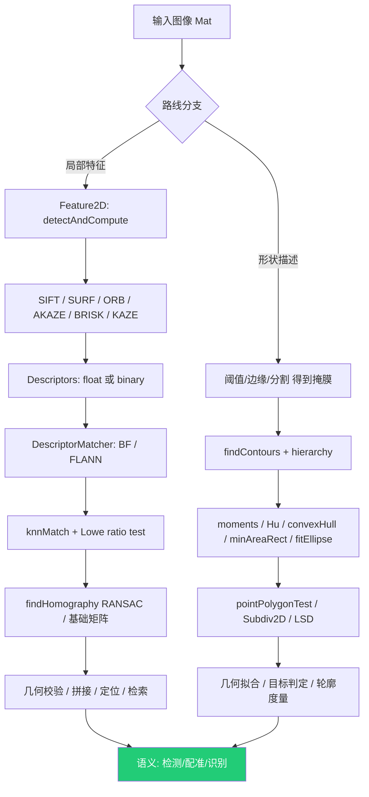

# 第 3 章 局部特征、形状描述与几何匹配：features2d / xfeatures2d / ShapeDescriptors 原理深解

> 本章基于 OpenCV C++ 官方示例源码（`samples/cpp` 根目录 14 个文件 + `tutorial_code/features2D/`、`tutorial_code/xfeatures2D/`、`tutorial_code/ShapeDescriptors/` 三个子目录的全部 `.cpp`）重写并大幅扩写。目标是把"能跑通的示例"还原为"可迁移的原理"——对每个条目给出数学表达、关键 API 参数表、算法关联对比、常见错误与落地场景。正文为简体中文，API 与代码标识符保留英文。
>
> 约定：文件路径以 `samples/cpp/...` 相对前缀给出；公式用 LaTeX 行内（`$...$`）或伪代码块；所有示例均"先读源码再扩写"，未改动任何源文件。篇幅约为常规教程的 1.5–2 倍，重点在于把"演示代码"升级为"算法原理 + 工程权衡"。

---

## 3.0 章节导言

计算机视觉要"理解图像"，最朴素的两类问题分别是：**"这两张图里是不是同一个东西？"** 与 **"这个区域是什么形状？"**。前者催生了**局部特征（local features）**路线，后者催生了**形状描述（shape descriptors）**路线。OpenCV 用三个模块承载它们：

1. **`features2d`（2D Features Framework）**：模块级统一接口 `Feature2D`（检测 + 描述）、`DescriptorMatcher`（匹配）。内置 `ORB`、`AKAZE`、`BRISK`、`SimpleBlobDetector`、`MSER`、`AgastFeatureDetector`、`FastFeatureDetector` 等，并提供 `BFMatcher`、`FlannBasedMatcher`。它定义了一条完整的"检测 → 描述 → 匹配 → 几何校验（单应/基础矩阵）"流水线。
2. **`xfeatures2d`（Extra 2D Features，contrib 模块）**：补充 `SURF`、`LATCH`、`DAISY`、`VGG`、`BoostDesc` 等额外特征。当前 OpenCV 中 `SIFT` 与 `KAZE` 已位于主仓库 `features2d`；本章涉及的旧教程源码仍可能以历史目录名组织，不能据目录名推断当前 API 归属。
3. **`ShapeDescriptors`（形状描述子）**：不再依赖"兴趣点 + 局部邻域"，而是面向**整条轮廓或整个区域**做几何描述——`findContours`/`drawContours` 拓扑、`moments`/`HuMoments` 矩不变量、`contourArea`/`arcLength`、`convexHull`、`minAreaRect`/`fitEllipse`/`minEnclosingCircle`/`minEnclosingTriangle`、`pointPolygonTest`、`Subdiv2D`（Delaunay/Voronoi）、`LineSegmentDetector`、`fillConvexPoly` 等。它服务于"已知/可得轮廓后，如何度量、拟合、判定、定位"的下游任务。

两条路线的本质分歧：

- **局部特征路线**：特征是 *图像内容驱动* 的——算法自动在"有区分度"的位置（角点、斑状、尺度空间极值）落点，输出 `(x, y, 尺度, 方向)` 的 `KeyPoint` 加一段高维 `descriptor`。优点是对**遮挡、姿态、尺度、光照**有一定不变性，可用于检索、拼接、SLAM、相机定位；缺点是对**无纹理/重复纹理**场景失效，且描述子与"人的语义形状"没有直接关系。
- **形状描述路线**：描述是 *轮廓驱动* 的——必须先有轮廓/掩膜（通常来自阈值、边缘、分割），再对轮廓做矩、凸包、最小外接、点到轮廓距离等。优点是对**清晰边界目标**非常精确、可解释、可微可优化；缺点是完全依赖"轮廓从哪来"的前置质量，对噪声、断裂、遮挡敏感。

二者在实践中互补：`features2d` 给出"可能匹配的点对"，`findHomography`/RANSAC 给出"把这些点对齐的全局变换"，而 `ShapeDescriptors` 在该变换后又可对检测到的目标轮廓做精确拟合（如 `fitEllipse`、`minAreaRect`）、做单应校验（`AKAZE_match.cpp` 里用已知 `H` 做 inlier 判定本质上就是形状/几何一致性约束）。

上下游依赖：两条路线都建立在前两章的 `cv::Mat`、滤波、阈值、形态学、边缘（`Canny`/`Sobel`）之上；`findContours` 几乎总是吃 `Canny` 或阈值图；`SIFT`/`SURF` 内部依赖 `GaussianBlur`、梯度、Hessian、积分图；`findHomography` 属于 `calib3d`；`Subdiv2D` 由 `imgproc` 提供但算法属于计算几何。读不懂本章，上层的 `calib3d`、`stitching`、`objdetect`、`videostab`、`dnn` 都会出现理解断层。

本章阅读建议：先读根目录 `asift`/`matchmethod_orb_akaze_brisk`/`flann_search_dataset`（建立"检测→描述→匹配"的全局观），再按 `detect_*`（Blob/MSER/Affine）→ `features2D` 教程（SURF/AKAZE/单应）→ `ShapeDescriptors`（轮廓/矩/凸包/最小外接）→ `delaunay2`/`intelligent_scissors`/`lsd_lines` 的顺序深入。每节按章程八段顺序展开。重点吃透 **SIFT 的 DoG 尺度空间与 128 维描述子、SURF 的 Hessian 积分图近似、ORB 的 rBRIEF、AKAZE/KAZE 的非线性扩散、Lowe 比值检验、RANSAC 单应 DLT 求解、MSER 极值区域、Suzuki-Abe 轮廓拓扑、Hu 矩、Graham/Sklansky 凸包、Delaunay/Subdiv2D、live-wire/Dijkstra** 这些可迁移内核。

**概念阅读顺序**（重点看核心原理与参数说明，不写编译运行）：

- 先懂检测→描述→匹配→单应（RANSAC）整条流水线，再对照 `SURF_FLANN_matching_homography_Demo.cpp`
- 先懂轮廓拓扑、层次结构与面积/周长等度量，再对照 `findContours_demo.cpp`
- 先懂局部特征与形状描述两条路线的适用边界，再回头对照本章其余特征/矩/凸包示例
- 阅读时盯原理与关键参数，不写编译运行步骤

---

## 3.1 根目录示例：局部特征与形状拟合的总览

### 3.1.1 asift.cpp

> **源文件**：`samples/cpp/asift.cpp`
> **所属模块**：features2d · 仿射不变特征匹配（Affine-SIFT 演示） ｜ **示例类型**：`完整流程`

#### 功能概述

演示 `AffineFeature` 包装器——用 `SIFT`/`ORB`/`BRISK` 做"后端"，由 `AffineFeature` 在其之上模拟**仿射形变**（tilt + 旋转）来把"视角变化很大"的两张图对齐。流程是：检测 + 描述 → `knnMatch` → Lowe 比值 0.75 初筛 → `findHomography(RANSAC)` 求单应 → 用 `perspectiveTransform` 把图 1 四角映射到图 2 验证 → 画线。

#### 核心原理

- **为什么需要仿射不变**：普通 SIFT 仅对**尺度 + 旋转**不变，对**视角倾斜（仿射）**只在小范围内不变。当相机绕光轴侧向倾斜、物体平面发生透视压缩时，同一平面的圆会变成椭圆、方形会变形，`SIFT` 的圆形/方形邻域采样不再匹配。
- **ASIFT 思想（Morel–Yu）**：在采样邻域前，**先把图像按一组"倾斜角 θ（tilt）"和"相对于tilt轴的旋转 φ"做仿射 warp**，再在每个 warp 图上跑标准检测器。这样相当于"把各种视角都预演一遍"，把所有视角下都能稳定的特征都召回，再统一映射回原坐标系。
- **OpenCV 的实现**：`AffineFeature::create(backend)` 内部维护 `maxTilt/minTilt/tiltStep/rotateStepBase/rotateStepRange` 等参数，自动生成仿射变换矩阵集合，对每个 warp 调用后端 `detectAndCompute`，再把检测到的 `KeyPoint` 坐标用对应仿射的逆变换拉回原图。keypoint 数量因此放大数倍，召回率显著上升，代价是耗时倍增。
- **几何校验**：初筛后用 RANSAC 拟合单应 $H$（见 1.5 / 2.5 节），把图 1 角点 `perspectiveTransform` 到图 2 仅用于"可视化验证匹配是否合理"，不参与求解。
算法步骤如下：
- 仿射 warp 用 `warpAffine`，单个仿射矩阵形如 $A = R_\phi\,T_\theta\,R_\phi^{-1}$，其中 $T_\theta=\mathrm{diag}(\theta,1)$（纵向压缩比 $\theta$），$\phi$ 为倾斜方向角。
- 单应求解（RANSAC/DLT）：对 $n\ge4$ 对对应点 $(p_i,p_i')$，每对给出两条线性方程，堆叠成 $A\mathbf{h}=0$（$\mathbf{h}$ 为 $H$ 的 9 维向量，约束 $\lVert h\rVert=1$），SVD 取最小奇异值右奇异向量得 $H$。RANSAC 反复抽样 4 点求 $H$，统计重投影误差 $\|p_i'-\hat p_i'\|_2<\tau$ 的内点，取内点最多的 $H$。
- 重投影误差：$e_i = \sqrt{(x_i'- \frac{h_{11}x_i+h_{12}y_i+h_{13}}{h_{31}x_i+h_{32}y_i+h_{33}})^2 + (y_i'- \frac{h_{21}x_i+h_{22}y_i+h_{23}}{h_{31}x_i+h_{32}y_i+h_{33}})^2}$。

#### 关键 API

`AffineFeature`、`Feature2D::detectAndCompute`、`DescriptorMatcher::knnMatch`、`findHomography`、`perspectiveTransform`、`FlannBasedMatcher`/`makePtr<FlannBasedMatcher>(makePtr<flann::LshIndexParams>(6,12,1))`、`BFMatcher`。

#### 处理流程

- **① 输入图像**
  - `imread` — imread(path, flags) — flags: IMREAD_COLOR(1)/GRAYSCALE(0)/UNCHANGED(-1)，读取为 BGR/灰度/含 alpha。
- **② 预处理（灰度化 / 滤波降噪 / 直方图均衡化等）**
  - `resize` — resize(src, dst, dsize[, fx,fy,interp]) — 按 dsize 或比例缩放；interp: INTER_LINEAR/CUBIC。
  - `cvtColor` — cvtColor(src, dst, code[, dcn]) — code 如 COLOR_BGR2GRAY/HSV；色彩空间转换。
- **③ 核心算法处理**
  - `detectAndCompute` — det.detectAndCompute(img, mask) -> (kps, desc) — 同时检测关键点与计算描述子。
  - `knnMatch` — matcher.knnMatch(d, k) -> 每个查询点前 k 个匹配 — 用于 Lowe 比率测试。
  - `findHomography` — findHomography(src, dst[, method, ransacReproj, mask]) — RANSAC 求单应矩阵。
  - `sortIdx`
  - `perspectiveTransform`
- **④ 结果输出与交互**
  - `imshow` — imshow(winname, mat) — 在指定窗口显示图像。
  - `waitKey` — waitKey(delay) — 等待按键 delay 毫秒；0 表示永久等待，用于驱动 GUI 循环。

#### 参数说明

| 符号/调用 | 参数 | 含义 | 本例取值 |
|---|---|---|---|
| `AffineFeature::create` | `backend` | 后端检测器（SIFT/ORB/BRISK） | `SIFT::create()` 等 |
| `knnMatch` | `k=2` | 取前 2 近邻做比值检验 | `2` |
| Lowe 比值 | `0.75` | `d0 < 0.75·d1` 保留 | `0.75`（示例） |
| `findHomography` | `RANSAC` | 鲁棒估计单应 | `RANSAC` |
| `LshIndexParams` | `(6,12,1)` | ORB/BRISK 的 FLANN-LSH 参数 | 用于二进制描述子 |

#### 关联与对比

- `AffineFeature` 是**装饰器模式**：不改变后端算法，只在它外围"加仿射采样"。后端选 SIFT 即经典 ASIFT；选 ORB/BRISK 即"仿射增强版 ORB/BRISK"，速度快但精度取决于后端。
- 与 2.5 的 `SURF_FLANN_matching_homography_Demo.cpp` 相比，本例多了"仿射仿真"这一层，专门用于**大视角变化**场景。
- 与 `flann_search_dataset.cpp`（1.4）相比，本例是"两图精确对齐"，后者是"图库检索"。

#### 注意事项

- `AffineFeature` 会使 keypoint 数量成倍增长，**显存/耗时**急剧上升，实时场景慎用。
- 二进制描述子（ORB/BRISK）必须配 `BruteForce-Hamming` 或 `LshIndexParams` FLANN；用 L2 距离会给出无意义匹配（参考 `matchmethod_orb_akaze_brisk.cpp` 1.5 节的断言）。
- `findHomography` 返回的 `H` 是 `CV_64F`；`perspectiveTransform` 的输入点须是 `Point2f` 或 `Mat(3,1)` 齐次坐标。
- `knnMatch` 返回 `vector<vector<DMatch>>`；需先判 `m.size()==2` 再做比值检验。

#### 应用场景

宽基线（wide-baseline）图像匹配、文物/建筑大视角配准、遥感影像匹配、工艺品检索、图像拼接中"单应初值不稳"的兜底。
学习要点：理解"仿射不变 = 在多个仿射 warp 上重复检测"，是把"旋转+尺度不变"升级为"视角不变"的关键一跃；同时体会 `Feature2D` 统一接口让"换后端"只需改一行 `create`。
### 3.1.2 detect_blob.cpp

> **源文件**：`samples/cpp/detect_blob.cpp`
> **所属模块**：features2d · 斑点（Blob）检测 ｜ **示例类型**：`完整流程`

#### 功能概述

用 `SimpleBlobDetector` 演示"斑点检测 + 多重几何过滤"。程序构造 6 组 `Params`，分别按 **面积 / 圆度 / 惯性比 / 凸度 / 颜色 / 全部** 过滤 `detect_blob.png` 中的亮斑，并随机着色绘制。

#### 核心原理

`SimpleBlobDetector` 检测的是"在多个阈值下都稳定存在、且形状满足约束的连通亮/暗区域"，本质是 **阈值扫描 + 连通域跟踪 + 跨阈值一致性 + 形状过滤**，与角点检测器（FAST/Harris）互补——它找的是"有面积的区域"而不是"点"。
算法步骤如下：
  1. **多阈值二值化**：从 `minThreshold` 到 `maxThreshold`，以 `thresholdStep` 步进，对每级阈值 $t$ 得到二值图 $B_t = (I > t)$（或按 `blobColor` 取 `<`）。
  2. **连通域标记**：在每张 $B_t$ 上找连通分量（4/8 邻接），得到"候选斑点"及其质心、面积。
  3. **跨阈值中心跟踪（grouping）**：同一物理斑点在相邻阈值下质心应相近；按 `minDistBetweenBlobs` 与 `minRepeatability`（在多少张阈值图上重复出现）合并为最终 blob，取其尺度 `size` 与中心 `pt`。
  4. **形状过滤**（开关控制）：
     - **圆度 Circularity**：$c = \frac{4\pi\cdot \mathrm{Area}}{\mathrm{Perimeter}^2}\in(0,1]$，圆为 1。
     - **惯性比 InertiaRatio**：对斑点的二阶矩（协方差）做特征值分解，得长短轴方向特征值 $\lambda_1\ge\lambda_2$；惯性比 $r=\frac{\lambda_2}{\lambda_1}\in[0,1]$，圆为 1、线为 0。
     - **凸度 Convexity**：斑点的凸包面积 / 斑点面积，越接近 1 越凸。
     - **颜色 Color**：斑点中心像素灰度是否等于 `blobColor`（0=暗，255=亮）。

#### 关键 API

`SimpleBlobDetector::Params`、`SimpleBlobDetector::create`、`Feature2D::detect`（返回 `vector<KeyPoint>`，`kp.size` 为半径）。

#### 处理流程

- **① 输入图像**
  - `imread` — imread(path, flags) — flags: IMREAD_COLOR(1)/GRAYSCALE(0)/UNCHANGED(-1)，读取为 BGR/灰度/含 alpha。
- **③ 核心算法处理**
  - `detect` — det.detect(img[, mask]) -> kps — 仅检测关键点。
- **④ 结果输出与交互**
  - `drawKeypoints` — drawKeypoints(img, kps, out[, color, flags]) — 绘制关键点。
  - `namedWindow` — namedWindow(name, flags) — flags: WINDOW_NORMAL/AUTOSIZE；创建显示窗口。
  - `imshow` — imshow(winname, mat) — 在指定窗口显示图像。
  - `waitKey` — waitKey(delay) — 等待按键 delay 毫秒；0 表示永久等待，用于驱动 GUI 循环。

#### 参数说明

| Params 字段 | 含义 | 默认/示例 |
|---|---|---|
| `thresholdStep` | 阈值步进 | `10` |
| `minThreshold`/`maxThreshold` | 阈值扫描范围 | `10`/`220` |
| `minRepeatability` | 跨阈值最小重复次数 | `2` |
| `minDistBetweenBlobs` | 合并斑点的最小中心距 | `10` |
| `filterByArea`/`minArea`/`maxArea` | 面积过滤 | `25`~`5000` |
| `filterByCircularity`/`minCircularity` | 圆度过滤 | `0.9` |
| `filterByInertia`/`minInertiaRatio` | 惯性比过滤 | `0.1` |
| `filterByConvexity`/`minConvexity` | 凸度过滤 | `0.95` |
| `filterByColor`/`blobColor` | 颜色过滤 | `0`（暗） |

#### 关联与对比

- 与 `MSER`（1.3）都找"区域"，但 Blob 是"阈值扫描 + 圆度/凸度约束"，MSER 是"极值区域树"，后者对阈值更不敏感、连通性更强。
- 与角点检测器（FAST/Harris/`GFTT`）互补：Blob 找"面"，角点找"点"。

#### 注意事项

- `filterBy*` 默认多为 `false`（示例里手动置 `true`）；全关时检测所有斑点，数目巨大。
- `KeyPoint.size` 表示关键点有意义邻域的**直径**。本例直接把它作为绘图半径只是可视化选择，不应据此反推 API 的尺度语义。
- 圆度/惯性比基于轮廓，若轮廓被 `CHAIN_APPROX`/阈值破碎会导致过滤异常。

#### 应用场景

工业视觉中"圆形标记/焊点/孔洞"检测、生物细胞计数、药片缺粒检测、标志物（ fiducial ）定位。
学习要点：Blob 检测 = "用连续阈值把区域稳定化 + 用形状矩过滤噪声"，是"从像素到语义区域"最简单可靠的一类方法，也是理解 MSER/Affine 区域生长的铺垫。
### 3.1.3 detect_mser.cpp

> **源文件**：`samples/cpp/detect_mser.cpp`
> **所属模块**：features2d · 最大稳定极值区域（MSER） ｜ **示例类型**：`完整流程`

#### 功能概述

用 `MSER` 检测"最大稳定极值区域"。可选 `detectRegions` 返回每区域像素 `vector<vector<Point>>` 与外接 `Rect`，并把所有区域像素染蓝；含一个合成嵌套矩形/圆图 `MakeSyntheticImage` 演示极值区域，以及可选的 OpenGL 3D 可视化。

#### 核心原理

MSER 在**阈值由低到高扫描**时，跟踪每个连通分量的面积变化。当一个分量在较大阈值区间内**面积几乎不变**（即"稳定"），它就是"极值区域"——典型如文字笔画、亮斑。稳定区域对**仿射、光照、模糊**有较强不变性。
算法步骤如下：
  1. 对灰度图 $I$，将阈值 $t$ 从 0 增到 255，记录每个连通分量 $C_t$ 的面积 $S(t)=|C_t|$。
  2. **极值判定**：分量在局部阈值处是"稳定"的，若其面积变化率小于 `maxVariation`：
     $$V = \frac{S(t+\Delta)-S(t-\Delta)}{S(t)} \le \text{maxVariation}$$
     其中 $\Delta=\text{delta}$。
  3. **多样性 diversity**：父子区域面积之比需大于 `minDiversity`，避免嵌套重复区域。
  4. 按 `minArea`/`maxArea` 限大小；`pass2Only` 只做 MSER+（正向或反向二阶极值）。
  5. OpenCV 内部用 **优先级队列 + 并查集** 构建分量树（component tree），从树中取稳定的极大/极小节点。

#### 关键 API

`MSER::create(delta, minArea, maxArea, maxVariation, minDiversity, maxEvolution, areaThreshold, minMargin, edgeBlurSize)`、`MSER::detectRegions(img, regions, boxes)`、`MSER::setPass2Only`。

#### 处理流程

- **① 输入图像**
  - `imread` — imread(path, flags) — flags: IMREAD_COLOR(1)/GRAYSCALE(0)/UNCHANGED(-1)，读取为 BGR/灰度/含 alpha。
- **② 预处理（灰度化 / 滤波降噪 / 直方图均衡化等）**
  - `cvtColor` — cvtColor(src, dst, code[, dcn]) — code 如 COLOR_BGR2GRAY/HSV；色彩空间转换。
  - `blur`
  - `merge` — merge(mv, dst) — 多通道合并为单 Mat。
- **③ 核心算法处理**
  - `calcHist` — calcHist(images, channels, mask, histSize, ranges[, hist]) — 计算直方图。
- **④ 结果输出与交互**
  - `namedWindow` — namedWindow(name, flags) — flags: WINDOW_NORMAL/AUTOSIZE；创建显示窗口。
  - `setMouseCallback` — setMouseCallback(win, cb, userdata) — 注册鼠标事件回调(画框/涂抹)。
  - `waitKey` — waitKey(delay) — 等待按键 delay 毫秒；0 表示永久等待，用于驱动 GUI 循环。
  - `imshow` — imshow(winname, mat) — 在指定窗口显示图像。

#### 参数说明

| 参数 | 含义 | 示例 |
|---|---|---|
| `delta` | 面积比较的阈值间隔 $\Delta$ | `5` / `10` / `100` |
| `minArea`/`maxArea` | 区域面积限 | `60`~`14400` |
| `maxVariation` | 最大面积变化率 | `0.25`（演示用到 `2`） |
| `minDiversity` | 父子面积最小多样性 | `0.2` |
| `maxEvolution` | 灰度投影演化步数（彩色 MSER） | `200` |
| `areaThreshold` | 面积阈值（彩色） | `1.01` |
| `minMargin` | 最小边缘裕度 | `0.003` |
| `edgeBlurSize` | 边缘模糊核 | `5` |
| `pass2Only` | 仅 MSER+ | `false/true` |

#### 关联与对比

- MSER vs Blob：`MSER` 基于"极值稳定"，不需手动设圆度/凸度，对阈值噪声更鲁棒；`SimpleBlobDetector` 更直观可控（1.2）。
- MSER 是**区域（region）**而非 **keypoint**，本例 `detectRegions` 返回像素集合，不像 ORB 返回带尺度的点；可把区域质心当 keypoint 用。

#### 注意事项

- 彩色 MSER（RGB 演化）参数更多，灰度图只需前 5 个参数。
- 返回 `regions` 是 `vector<vector<Point>>`，直接遍历像素上色即可，但大图像像素量巨大、绘图慢。
- `maxVariation` 太大（如演示的 `2`）会返回几乎全部区域，失去"稳定"意义——仅为演示参数影响。

#### 应用场景

文字检测（MSER 是经典场景文字/自然场景文本检测基线）、宽基线匹配、斑点/标志区域、医学图像兴趣区提取。
学习要点：MSER 把"阈值扫描"升维为"分量树上的稳定性度量"，是连接"Blob 检测"与"仿射区域不变性"的桥梁；其"极值区域"思想也影响了后面的连通域分析（2.13 `segment_objects`）。
### 3.1.4 flann_search_dataset.cpp

> **源文件**：`samples/cpp/flann_search_dataset.cpp`
> **所属模块**：features2d · FLANN 大规模描述子检索 ｜ **示例类型**：`完整流程`

#### 功能概述

把一整个**图像文件夹**当作数据集，对每张图提取 `SIFT` 或 `ORB` 描述子，拼成大矩阵后用 **FLANN 索引**（SIFT→`L2`+KD-tree；ORB→`Hamming`+LSH）建库；再用查询图的描述子 `knnSearch` 求近邻，Lowe 比值 0.7 过滤，按"每张图匹配数 / 该图关键点总数"的比例挑出最相似的图。

#### 核心原理

把"图像检索"转化为"高维向量近邻搜索"。关键点：
  1. **描述子库扁平化**：所有图的描述子沿行拼接成一个大 `Mat`，同时维护 `db_indice_2_image_lut`（描述子行号 → 原图编号）与每图索引区间 `db_images_indice_range`。
  2. **索引选择**：浮点描述子（SIFT）用 `L2<float>` + `KDTreeIndexParams(4)`（4 棵随机kd-tree 森林）；二进制描述子（ORB）用 `Hamming` + `LshIndexParams()`（局部敏感哈希）。
  3. **查询与比值检验**：`knnSearch(k=2)` 返回每个查询点的前 2 近邻，`d[0] < 0.7·d[1]` 视为好匹配。
  4. **图级决策**：统计每图命中数，按 `nbr_of_kpts / nbr_of_matches`（比例越小越相似）排序，并在 1.1× 比例内用"匹配数平方加权"选最佳。
算法步骤如下：
- SIFT 距离：$d = \sqrt{\sum_i (a_i-b_i)^2}$（`L2`）。
- ORB 距离：汉明距离 = $d_H(a,b)=\sum_i (a_i\oplus b_i)$（`Hamming`）。
- 比例判定：保留当 $\frac{d_0}{d_1} < 0.7$。
- 图相似度排序键：`inverse_proportion = nbr_of_kpts / nbr_of_matches`（越小越匹配）。

#### 关键 API

`flann::GenericIndex<cvflann::L2<float>>`、`flann::GenericIndex<cvflann::Hamming<unsigned char>>`、`cvflann::KDTreeIndexParams`、`cvflann::LshIndexParams`、`index->knnSearch`、`cvflann::SearchParams(32)`、`utils::fs::glob`、`DMatch`。

#### 处理流程

- **① 输入图像**
  - `imread` — imread(path, flags) — flags: IMREAD_COLOR(1)/GRAYSCALE(0)/UNCHANGED(-1)，读取为 BGR/灰度/含 alpha。
- **② 预处理（灰度化 / 滤波降噪 / 直方图均衡化等）**
  - `resize` — resize(src, dst, dsize[, fx,fy,interp]) — 按 dsize 或比例缩放；interp: INTER_LINEAR/CUBIC。
- **③ 核心算法处理**
  - `detectAndCompute` — det.detectAndCompute(img, mask) -> (kps, desc) — 同时检测关键点与计算描述子。
  - `KDTreeIndexParams`
  - `LshIndexParams`
  - `save`
  - `SearchParams`
- **④ 结果输出与交互**
  - `drawMatches` — drawMatches(img1, kps1, img2, kps2, matches, out) — 绘制匹配连线。
  - `imshow` — imshow(winname, mat) — 在指定窗口显示图像。
  - `waitKey` — waitKey(delay) — 等待按键 delay 毫秒；0 表示永久等待，用于驱动 GUI 循环。

#### 参数说明

| 项 | 参数 | 含义 | 取值 |
|---|---|---|---|
| SIFT 索引 | `KDTreeIndexParams(4)` | 4 棵 kd-tree | `4` |
| ORB 索引 | `LshIndexParams()` | LSH 哈希表 | 默认 |
| `knnSearch` | `knn=2` | 返回 2 近邻 | `2` |
| `SearchParams` | `32` | 树遍历检查数 | `32` |
| 比值 | `ratio_thresh` | Lowe 阈值 | `0.7` |
| 最少匹配 | `>=4` | 求单应所需 | `4` |

#### 关联与对比

- `BFMatcher` 是**暴力**全比对，保真但 $O(N)$；FLANN 是**近似**近邻，库大时远快于暴力（本例即其用武之地）。
- 与 1.1 `asift` 比：本例是"一对多检索"，`asift` 是"一对一精确对齐"。

#### 注意事项

- **描述子类型必须和距离匹配**：SIFT 浮点 → `L2`；ORB/BRISK/AKAZE 二进制 → `Hamming`。混用会编译或结果全错。
- `knnSearch` 不会自动初始化 `indices`/`dists` 的空 Mat，必须预先分配（示例已分配 `CV_32S`/`CV_32F`/`CV_32S` 对应 DIST_TYPE）。
- 描述子矩阵行数须与 `db_indice_2_image_lut` 长度一致，否则查表越界。

#### 应用场景

图像检索/以图搜图、视觉地点识别（VLAD/词袋也可在此之上构建）、重复图检测、版权/相似素材排查。
学习要点：理解"特征匹配"如何扩展到"大规模检索"——核心是**索引结构（kd-tree/LSH）**与**图级重排**；这一步正是 SIFT/词袋→图像检索 pipeline 的骨架。
### 3.1.5 matchmethod_orb_akaze_brisk.cpp

> **源文件**：`samples/cpp/matchmethod_orb_akaze_brisk.cpp`
> **所属模块**：features2d · 检测器/描述子与匹配器组合对比 ｜ **示例类型**：`完整流程`

#### 功能概述

系统地遍历 **描述子（AKAZE-Upright / AKAZE / ORB / BRISK）× 匹配器（BruteForce / BruteForce-L1 / BruteForce-Hamming / BruteForce-Hamming(2)）** 的组合，对 `basketball1/2.png` 做检测+描述+匹配，按距离排序取前 30 条 `drawMatches`，并打印"匹配点累积距离"用于横向对比。

#### 核心原理

核心是**“描述子类型 ↔ 距离度量”必须配对**。浮点描述子（本例显式创建的 `AKAZE::DESCRIPTOR_KAZE_UPRIGHT`、SIFT/SURF）用 L1/L2；二进制描述子（`AKAZE::create()` 默认的 MLDB、ORB、BRISK）用 Hamming。用错度量时，即使 API 接受输入，所得距离也没有正确的描述子语义（示例会打印告警，部分组合还会抛异常）。
算法步骤如下：
- 浮点 L2：$d=\sqrt{\sum (a_i-b_i)^2}$；L1：$d=\sum|a_i-b_i|$。
- 二进制 Hamming：$d_H=\mathrm{popcount}(a\oplus b)$。
- `NORM_HAMMING2` 按 2 bit 单元比较，主要用于 ORB `WTA_K=3/4`；本例默认 ORB 为 `WTA_K=2`，通常应选普通 Hamming。
- 取最优：`sortIdx` 对 `matches.distance` 升序，取前 30 个 `DMatch` 绘制。

#### 关键 API

`AKAZE::create(AKAZE::DESCRIPTOR_KAZE_UPRIGHT)`、`ORB::create()`、`BRISK::create()`、`DescriptorMatcher::create(string)`（`"BruteForce"`/`"BruteForce-L1"`/`"BruteForce-Hamming"`/`"BruteForce-Hamming(2)"`）、`sortIdx`、`drawMatches`。

#### 处理流程

- **① 输入图像**
  - `imread` — imread(path, flags) — flags: IMREAD_COLOR(1)/GRAYSCALE(0)/UNCHANGED(-1)，读取为 BGR/灰度/含 alpha。
- **③ 核心算法处理**
  - `detect` — det.detect(img[, mask]) -> kps — 仅检测关键点。
  - `compute`
  - `detectAndCompute` — det.detectAndCompute(img, mask) -> (kps, desc) — 同时检测关键点与计算描述子。
  - `match` — matcher.match(desc1, desc2) -> DMatch 列表 — 暴力匹配。
  - `sortIdx`
- **④ 结果输出与交互**
  - `drawMatches` — drawMatches(img1, kps1, img2, kps2, matches, out) — 绘制匹配连线。
  - `namedWindow` — namedWindow(name, flags) — flags: WINDOW_NORMAL/AUTOSIZE；创建显示窗口。
  - `imshow` — imshow(winname, mat) — 在指定窗口显示图像。
  - `waitKey` — waitKey(delay) — 等待按键 delay 毫秒；0 表示永久等待，用于驱动 GUI 循环。

#### 参数说明

| 描述子 | 类型 | 应配匹配器 | 不应配 |
|---|---|---|---|
| `AKAZE::DESCRIPTOR_KAZE_UPRIGHT` | float `CV_32F` | `BruteForce`/`BruteForce-L1` | Hamming |
| `AKAZE::create()` 默认 MLDB | binary | `BruteForce-Hamming` | L1/L2 |
| `ORB`（默认 `WTA_K=2`） | binary | `BruteForce-Hamming` | L1/L2、Hamming(2) |
| `BRISK` | binary | `BruteForce-Hamming` | L1/L2 |

#### 关联与对比

- `BruteForce` = `NORM_L2`（浮点）、`BruteForce-Hamming` = `NORM_HAMMING`（二进制）。运行时用 `b->defaultNorm()` 可程序化判断。
- `AKAZE-DESCRIPTOR_KAZE_UPRIGHT` 是**无旋转分量**的 KAZE 描述，速度更快、**不具备旋转不变性**（仅适用于已配准/旋转小的情形）。

#### 注意事项

- 用 Hamming 配浮点描述子，或 L1/L2 配二进制描述子，程序会告警且距离不可信。
- 输出 `matches[i].distance` 是 float；保存到 `FileStorage` 受已知 bug 影响（注释提到 4308），保存结果可能不准。
- 源码固定抽取前 30 个匹配，若 `matches.size() < 30` 会越界；用于其他图像时应取 `min(30, matches.size())`。
- 源码名为 `cumSumDist2` 的变量在循环内使用赋值而非累加，因此最终只保留最后一个匹配的位移平方，不能当作可靠的“累计距离”评价指标。

#### 应用场景

选型 benchmark——在部署前比较哪种 (检测器, 匹配器) 组合在你的数据上速度/精度更好；特征工程调研。
学习要点：**"描述子类型决定距离度量"**是特征匹配第一铁律；本例把 4×4 组合跑一遍，是理解 `defaultNorm()`/`descriptorType()` 的最佳教具。
### 3.1.6 lsd_lines.cpp

> **源文件**：`samples/cpp/lsd_lines.cpp`
> **所属模块**：ShapeDescriptors / imgproc · 直线段检测（LSD） ｜ **示例类型**：`完整流程`

#### 功能概述

用 `LineSegmentDetector` 在 `building.jpg` 上检测直线段，可选 `LSD_REFINE_STD`（标准细化）或 `LSD_REFINE_NONE`，可选先用 `Canny` 做边缘，可选叠加在原图。打印耗时。

#### 核心原理

LSD（Line Segment Detector, von Gioi et al.）是一种**无参数、基于梯度对齐（a contrario）**的直线检测方法。它不靠 Hough 投票，而是直接对梯度场做"对齐区域生长 + 矩形拟合 + NFA 显著性检验"。
算法步骤如下：
  1. **梯度场**：对每个像素计算梯度幅值 $g=\sqrt{g_x^2+g_y^2}$ 与方向 $\theta=\arctan(g_y/g_x)$，按 `gradientThreshold`（默认梯度幅值下限）抑制弱像素。
  2. **水平线角（level-line angle）**：$\alpha(p)=\theta(p)+\pi/2$，代表该像素"等灰度线"的方向。
  3. **区域生长**：从梯度最大的像素出发，吸收**方向一致**（与区域主方向夹角 < `angThres`，默认 $\sim$22.5°）的邻域像素，形成"对齐像素集"。
  4. **矩形近似**：把该像素集用最小二乘拟合成一个覆盖矩形的参数（中心、宽、高、方向），要求"矩形内像素方向都接近矩形方向"。
  5. **NFA 显著性检验（a contrario）**：用"在纯噪声图上出现如此对齐的概率"作为误检数 NFA（Number of False Alarms），NFA < `logNFA`（默认 0，即 $\le1$）才接受为直线。这是 LSD "无参数"且误检可控的关键。
  6. 输出 `vector<Vec4f>`，每行 `(x1,y1,x2,y2)`。

#### 关键 API

`createLineSegmentDetector(int refine=LSD_REFINE_STD, double scale=0.8, double sigma_scale=0.6, double quant=2.0, double ang_th=22.5, double log_eps=0.0, double density_th=0.7, int n_bins=1024)`、`LSD::detect`、`LSD::drawSegments`。

#### 处理流程

- **① 输入图像**
  - `imread` — imread(path, flags) — flags: IMREAD_COLOR(1)/GRAYSCALE(0)/UNCHANGED(-1)，读取为 BGR/灰度/含 alpha。
- **③ 核心算法处理**
  - `Canny` — Canny(src, edges, thr1, thr2[, aperture, L2grad]) — 双阈值滞后边缘检测。
  - `createLineSegmentDetector`
  - `detect` — det.detect(img[, mask]) -> kps — 仅检测关键点。
- **④ 结果输出与交互**
  - `imshow` — imshow(winname, mat) — 在指定窗口显示图像。
  - `waitKey` — waitKey(delay) — 等待按键 delay 毫秒；0 表示永久等待，用于驱动 GUI 循环。

#### 参数说明

| 参数 | 含义 | 默认 |
|---|---|---|
| `refine` | `LSD_REFINE_STD`/`LSD_REFINE_NONE`/`LSD_REFINE_ADV` | `STD` |
| `scale` | 图像下采样比（加速） | `0.8` |
| `sigma_scale` | 高斯平滑 $\sigma$ | `0.6` |
| `ang_th` | 方向对齐角阈值（度） | `22.5` |
| `log_eps` | NFA 对数阈值（越小越严） | `0.0` |
| `density_th` | 矩形密度阈值 | `0.7` |

#### 关联与对比

- 与 `HoughLinesP`（标准 Hough 概率直线）相比：LSD 无需调参、直接给**线段端点**（Hough 给参数或需 `HoughLinesP` 给端点），误检率由 NFA 控制；Hough 对非对齐噪声更鲁棒但需调 $\rho/\theta$ 与阈值。
- LSD 输出是"段"，天然适合后续消失点/矩形/立方体恢复（如 2.9 文档校正）。

#### 注意事项

- LSD 默认对输入做内部下采样；超大图注意 `scale` 影响精度/速度。
- `drawSegments` 直接在原图上画线并覆盖；要保留原图请先 `copyTo`。
- 与 `Canny` 联用时（示例中 `useCanny`），LSD 实际上吃边缘图，行为与传统梯度场略有不同。

#### 应用场景

建筑/文档/工业场景的直线提取、道路车道线初检、消失点估计、相机标定棋盘格之外的结构化场景理解、SLAM 线特征。
学习要点：LSD 把"直线检测"从"参数空间投票"转向"梯度对齐 + 统计显著性"，是**无参数几何检测**的范本，也是理解"a contrario 模型"的入口。
### 3.1.7 fitellipse.cpp

> **源文件**：`samples/cpp/fitellipse.cpp`
> **所属模块**：ShapeDescriptors · 椭圆拟合（三种代数最小二乘） ｜ **示例类型**：`完整流程`

#### 功能概述

对 `ellipses.jpg` 找轮廓（`findContours` + `RETR_LIST`），对每个轮廓子采样点，用 **三种方法** 拟合椭圆并对比：`fitEllipse`（Fitzgibbon 1995，OpenCV 默认）、`fitEllipseAMS`（Taubin 1991 均值平方）、`fitEllipseDirect`（直接最小二乘）。阈值滑条控制轮廓提取。

#### 核心原理

椭圆拟合是"用 5 参数 $(x_c,y_c,a,b,\theta)$"拟合一组 2D 点。直接把点代入一般二次曲线方程 $\mathbf{x}^T A \mathbf{x}+B^T\mathbf{x}+F=0$ 做最小二乘会退化（平凡解），必须加约束。三种方法差异在**约束形式**：
算法步骤如下：
- 一般二次曲线：$Ax^2 + Bxy + Cy^2 + Dx + Ey + F = 0$，椭圆要求判别式 $B^2-4AC<0$。
- **Fitzgibbon (fitEllipse)**：在约束 $B^2-4AC=-1$ 下最小化代数距离 $\sum_i f(x_i)^2$，用 SVD 解广义特征值问题，保证结果必为椭圆（数值最稳）。
- **Taubin AMS (fitEllipseAMS)**：约束 $\lVert\begin{bmatrix}A&C&D/2&E/2&F\end{bmatrix}\rVert$（适当加权）最小化，减小"代数距离 ≠ 几何距离"的偏差，对噪声更均衡。
- **Direct (fitEllipseDirect)**：直接约束 $\|D\|=1$ 最小化，更快但数值不如 Fitzgibbon 稳。
- 点须 $\ge 5$ 才能拟合；示例用 `isGoodBox` 过滤长宽比异常（宽 > 30×高视为退化）。

#### 关键 API

`fitEllipse(InputArray points) -> RotatedRect`、`fitEllipseAMS`、`fitEllipseDirect`、`RotatedRect::points`、`ellipse`、`findContours`。

#### 处理流程

- **① 输入图像**
  - `imread` — imread(path, flags) — flags: IMREAD_COLOR(1)/GRAYSCALE(0)/UNCHANGED(-1)，读取为 BGR/灰度/含 alpha。
- **③ 核心算法处理**
  - `findContours` — findContours(src, contours, hierarchy, mode, method[, offset]) — 提取轮廓；mode: RETR_*, method: CHAIN_APPROX_*。
  - `fitEllipse` — fitEllipse(cnt) — 对点集拟合旋转矩形(椭圆)。
  - `fitEllipseAMS`
  - `fitEllipseDirect`
- **④ 结果输出与交互**
  - `imshow` — imshow(winname, mat) — 在指定窗口显示图像。
  - `namedWindow` — namedWindow(name, flags) — flags: WINDOW_NORMAL/AUTOSIZE；创建显示窗口。
  - `createTrackbar` — createTrackbar(name, win, &val, max, cb) — 创建滑动条，值变化时回调 cb。
  - `waitKey` — waitKey(delay) — 等待按键 delay 毫秒；0 表示永久等待，用于驱动 GUI 循环。

#### 参数说明

| 函数 | 输入点数下限 | 返回 | 约束 |
|---|---|---|---|
| `fitEllipse` | 5 | `RotatedRect` | $B^2-4AC=-1$（保椭圆） |
| `fitEllipseAMS` | 5 | `RotatedRect` | Taubin 加权 |
| `fitEllipseDirect` | 5 | `RotatedRect` | $\|D\|=1$ |

#### 关联与对比

- 与 `minAreaRect`（1.8）对比：`minAreaRect` 是"最小外接旋转矩形"（纯几何、不拟合），`fitEllipse` 是"最佳拟合椭圆"（统计、服从点分布）。
- 若轮廓近似圆/椭圆，`fitEllipse` 给出更贴合中心的椭圆；若轮廓是方/多边形，`minAreaRect` 更合理。

#### 注意事项

- 点 < 5 会抛异常；共线点（`isGoodBox` 拒绝）会得到退化矩形。
- `RotatedRect` 的 `angle` 约定为 `[-90,0)` 或 `[0,90)`；`points()` 返回 4 角点顺序固定。
- 轮廓点很多时先 `j%20` 子采样，否则拟合慢且无必要。

#### 应用场景

瞳孔/细胞/果实/瓶盖等近圆目标的精确测量、工业圆形件质检、交通标志圆牌检测、医学影像 ROI 拟合。
学习要点：三种"代数最小二乘"椭圆拟合的本质差异都在**约束项**；`fitEllipse` 的 Fitzgibbon 约束是避免退化的标准做法，是"几何拟合"与"矩阵 SVD"结合的典型。
### 3.1.8 minarea.cpp

> **源文件**：`samples/cpp/minarea.cpp`
> **所属模块**：ShapeDescriptors · 最小外接几何（矩形/三角形/圆） ｜ **示例类型**：`完整流程`

#### 功能概述

随机生成点集，分别用 `minAreaRect`（最小面积旋转矩形）、`minEnclosingTriangle`（最小面积外接三角形）、`minEnclosingCircle`（最小外接圆）包络并绘制，按键刷新。

#### 核心原理

这是"给定点集，求最小体积包围体"的经典计算几何问题，常用于把任意形状的点云用一个"规范几何体"近似，便于后续定位/碰撞/度量。
算法步骤如下：
- **最小外接圆**：Welzl 随机增量算法，期望 $O(n)$。结果 `(center, radius)`。
- **最小面积外接矩形（旋转卡壳 Rotating Calipers）**：凸包上，矩形必有一条边与凸包某边共线；枚举凸包每条边为"矩形底边方向"，用旋转卡壳在 $O(h)$（h=凸包点数）内求最小面积矩形。返回 `RotatedRect(center, size, angle)`。
- **最小面积外接三角形**：基于凸包，枚举"一条边在凸包支撑线上、顶点在对侧"的候选，取最小面积；OpenCV 实现为 $O(n^2)$ 级。

#### 关键 API

`minAreaRect`、`minEnclosingTriangle`、`minEnclosingCircle`、`RotatedRect::points`、`convexHull`（矩形/三角内部隐含用到）。

#### 处理流程

- **③ 核心算法处理**
  - `minAreaRect`
  - `minEnclosingTriangle`
  - `minEnclosingCircle`
  - `theRNG`
- **④ 结果输出与交互**
  - `imshow` — imshow(winname, mat) — 在指定窗口显示图像。
  - `waitKey` — waitKey(delay) — 等待按键 delay 毫秒；0 表示永久等待，用于驱动 GUI 循环。

#### 参数说明

| 函数 | 输出 | 复杂度 |
|---|---|---|
| `minAreaRect(points)` | `RotatedRect` | 依赖凸包 + 卡壳 |
| `minEnclosingTriangle(points, triangle)` | `vector<Point2f>`(3) | $O(n^2)$ 近似 |
| `minEnclosingCircle(points, center, radius)` | `Point2f`, `float` | Welzl $O(n)$ |

#### 关联与对比

- 三者都是"外接"而非"拟合"：`minAreaRect`/`fitEllipse`（1.7）是"包络 vs 拟合"对照；外接体保证"全部点在内"，拟合体允许误差但更贴合。
- 性能：圆最快（随机增量），矩形需先凸包，三角形最慢。

#### 注意事项

- `minAreaRect` 输入为 `vector<Point>`（整数）或 `Point2f`；返回 `size` 中 `width/height` 已含旋转后包围盒尺寸。
- 点过少（<2/3）时圆/三角无定义或退化。
- `RotatedRect.angle` 范围约定需与 `fitEllipse` 区别记忆。

#### 应用场景

目标包围盒初始化（跟踪/检测）、碰撞检测粗筛、点云降维描述、OCR 文本行外接、工业件姿态估算。
学习要点：理解"凸包是许多几何包围算法的预处理"——`minAreaRect` 内部先求凸包再旋转卡壳，这为 1.9 的 `convexHull` 与 3.4 的 `hull_demo` 做了铺垫。
### 3.1.9 convexhull.cpp

> **源文件**：`samples/cpp/convexhull.cpp`
> **所属模块**：ShapeDescriptors · 凸包 ｜ **示例类型**：`完整流程`

#### 功能概述

随机点集，用 `convexHull` 求凸包并 `polylines` 绘制闭合凸多边形，按键刷新。

#### 核心原理

凸包是"包含点集的最小凸多边形"，所有点都在边界或内部。它是计算几何最基本结构，服务于包围盒、碰撞、形状检索、缺陷检测。
算法步骤如下：
- **输出形式**：`hull` 可以是点序列（`vector<Point>`），或"原轮廓点索引序列"（`vector<int>`，由 `hull` 参数 `returnPoints=false` 控制）。
- **算法**：OpenCV 默认 **Sklansky 1982** 单蒙版（one-pass）算法（变体的 Graham 扫描 / 单调链），复杂度 $O(n\log n)$（排序）+ $O(n)$，对凸包点按极角/扫描线构造上下链。
- 凸包判定：点 $p$ 在凸包内当且仅当对所有边 $(a,b)$ 满足**左转**（叉积 $\ge0$）。

#### 关键 API

`convexHull(InputArray points, OutputArray hull, bool clockwise=false, bool returnPoints=true)`。

#### 处理流程

- **③ 核心算法处理**
  - `convexHull` — convexHull(cnt, hull[, clockwise, returnPoints]) — 凸包点集。
  - `theRNG`
- **④ 结果输出与交互**
  - `imshow` — imshow(winname, mat) — 在指定窗口显示图像。
  - `waitKey` — waitKey(delay) — 等待按键 delay 毫秒；0 表示永久等待，用于驱动 GUI 循环。

#### 参数说明

| 参数 | 含义 | 默认 |
|---|---|---|
| `points` | 输入点集（通常为轮廓） | — |
| `hull` | 输出；`vector<Point>` 或 `vector<int>` | — |
| `clockwise` | 方向 | `false`（逆时针） |
| `returnPoints` | `true` 返回点，`false` 返回原索引 | `true` |

#### 关联与对比

- 与 `minAreaRect`（1.8）关系：矩形算法先求凸包；凸包比最小外接矩形"更贴合"原形状（矩形是凸包的保守包络）。
- 与 3.4 `hull_demo` 一致；区别在后者对**轮廓**求包并和轮廓一起画。

#### 注意事项

- `returnPoints=false` 时 `hull` 是索引，需用原轮廓点访问；画出前常 `Mat(contour)[hull]` 还原。
- 共线点处理：Sklansky 默认保留边界共线点，可用 `isContourConvex` 验证。

#### 应用场景

手势识别（凸缺陷 `convexityDefects`）、目标包围、缺损检测、碰撞检测、形状粗分类。
学习要点：凸包是"形状分析"的基石；掌握 `returnPoints` 两种输出，是理解"凸缺陷"（`convexityDefects`）和"凸度过滤"（1.2 Blob）的前提。
### 3.1.10 contours2.cpp

> **源文件**：`samples/cpp/contours2.cpp`
> **所属模块**：ShapeDescriptors · 轮廓发现与层级（Suzuki-Abe） ｜ **示例类型**：`完整流程`

#### 功能概述

绘制 6 张"人脸"，`findContours(RETR_TREE, CHAIN_APPROX_SIMPLE)` 提取全部轮廓并 `approxPolyDP` 多边形化，用滑条 `levels` 控制 `drawContours` 的 `maxLevel` 参数，演示**层级轮廓**（父子）的绘制。

#### 核心原理

`findContours` 不仅是"找边界"，还用 **Suzuki-Abe 算法**在二值图上同时构建**轮廓拓扑（hierarchy）**——谁嵌套在谁里面、是外轮廓还是洞（hole）。这是 OpenCV 轮廓系统的理论内核。
算法步骤如下：
- **Suzuki-Abe（1985）**：基于"边界跟随（border following）"+ "连通分量标号"，在扫描二值图时把每条轮廓标记为"外边界"或"孔边界"，并记录其 `next/prev/first_child/parent` 关系，输出 `vector<Vec4i> hierarchy`（每轮廓 4 个整数：同层下一个、上一个、首个子、父）。
- **检索模式**：
    - `RETR_EXTERNAL`：只取最外层轮廓（忽略洞）。
    - `RETR_LIST`：所有轮廓平铺，无层级（1.11 `squares` 用）。
    - `RETR_CCOMP`：两层（外+洞），用于连通域（2.13 `segment_objects`）。
    - `RETR_TREE`：完整嵌套树（本例）。
- **近似方法**：`CHAIN_APPROX_SIMPLE` 仅保留多边形拐点（压缩水平/垂直/对角段），`CHAIN_APPROX_NONE` 保留每点。
- **绘制**：`drawContours(img, contours, contourIdx, color, thickness, lineType, hierarchy, maxLevel)`；`maxLevel<=0` 只画 `contourIdx`；`>0` 递归画其下 `maxLevel` 层子轮廓（本例 `levels-3` 映射到 `-3..3` 演示）。

#### 关键 API

`findContours`、`approxPolyDP`、`drawContours`、`RETR_TREE`、`CHAIN_APPROX_SIMPLE`。

#### 处理流程

- **② 预处理（灰度化 / 滤波降噪 / 直方图均衡化等）**
  - `resize` — resize(src, dst, dsize[, fx,fy,interp]) — 按 dsize 或比例缩放；interp: INTER_LINEAR/CUBIC。
- **③ 核心算法处理**
  - `findContours` — findContours(src, contours, hierarchy, mode, method[, offset]) — 提取轮廓；mode: RETR_*, method: CHAIN_APPROX_*。
  - `approxPolyDP`
- **④ 结果输出与交互**
  - `drawContours` — drawContours(img, contours, idx, color[, thick, lineType, hierarchy, maxLevel]) — 绘制轮廓；idx=-1 全画。
  - `imshow` — imshow(winname, mat) — 在指定窗口显示图像。
  - `namedWindow` — namedWindow(name, flags) — flags: WINDOW_NORMAL/AUTOSIZE；创建显示窗口。
  - `createTrackbar` — createTrackbar(name, win, &val, max, cb) — 创建滑动条，值变化时回调 cb。
  - `waitKey` — waitKey(delay) — 等待按键 delay 毫秒；0 表示永久等待，用于驱动 GUI 循环。

#### 参数说明

| 项 | 取值 | 含义 |
|---|---|---|
| `mode` | `RETR_EXTERNAL/LIST/CCOMP/TREE` | 层级策略 |
| `method` | `CHAIN_APPROX_NONE/SIMPLE` | 点压缩 |
| `drawContours` `maxLevel` | `<=0` / `>0` | 仅本轮廓 / 递归子层 |
| `hierarchy` | `vector<Vec4i>` | `[next,prev,first_child,parent]` |

#### 关联与对比

- 与 3.1 `findContours_demo` 同为 `RETR_TREE` 教学，本例重在 `drawContours` 的 `maxLevel` + 层级可视化；`findContours_demo` 重在"基础用法"。
- `approxPolyDP` 把轮廓压成多边形，是 `squares.cpp`（1.11）、`generalContours_demo1`（3.3）共用的"轮廓 → 多边形"工具。

#### 注意事项

- OpenCV 3.2 起 `findContours` 不再修改输入图；仍建议传入独立二值图，因为后续通常还要保留原灰度图，且旧版本行为不同。
- `hierarchy` 索引与 `contours` 顺序一一对应；`contourIdx=-1` 画全部。
- 输入必须是**8-bit 单通道二值图**；非二值会报错或行为异常。

#### 应用场景

任何需要"区分前景/孔洞/嵌套结构"的场合——零件内部孔位检测、OCR 连通域、文档版式分析、医疗影像器官内外轮廓。
学习要点：掌握 `hierarchy` 的 4 元组与 4 种 `mode`，是 OpenCV 形状分析的"语法基础"；`RETR_TREE` + `maxLevel` 是处理嵌套结构的标准手段。
### 3.1.11 squares.cpp

> **源文件**：`samples/cpp/squares.cpp`
> **所属模块**：ShapeDescriptors · 基于轮廓的多边形/正方形检测 ｜ **示例类型**：`完整流程`

#### 功能概述

经典"Square Detector"。对 `pic1-6.png` 逐张：先 `pyrDown`+`pyrUp` 去噪，再对 **3 个颜色通道**各自在 **N=11 个阈值级**（含 Canny）上阈值化，找 `RETR_LIST` 轮廓，`approxPolyDP` 多边形化，筛选"4 顶点 + 面积>1000 + 凸 + 四角余弦<0.3（近直角）"的四边形，绘制。

#### 核心原理

把"找正方形"拆成"找四边形 + 验证直角 + 验证凸"。关键技巧是**多通道 × 多阈值扫描**，保证不同亮度/颜色的方块都能被阈值化捕获。
算法步骤如下：
  1. **金字塔去噪**：`pyrDown`（降采样 1/2）+ `pyrUp`（上采样回原尺寸）做一次轻度低通，抑制细碎纹理。
  2. **阈值扫描**：对 3 通道各做 $l=0..N-1$：
     - $l=0$：`Canny(0, thresh)` + `dilate` 补边缝；
     - $l>0$：二值 $I \ge (l+1)\cdot255/N$。
  3. **轮廓 + 多边形近似**：`findContours(RETR_LIST)`，每个轮廓 `approxPolyDP(contour, approx, 0.02·arcLength, true)`（精度=周长 2%）。
  4. **四边形判定**：`approx.size()==4 && |contourArea(approx)|>1000 && isContourConvex(approx)`。
  5. **直角判定**：对相邻两边夹角余弦 $\cos\theta=\frac{\mathbf{u}\cdot\mathbf{v}}{\|\mathbf{u}\|\|\mathbf{v}\|}$，取最大绝对余弦 `maxCosine`；若 `maxCosine < 0.3`（约 72°~108° 内，对应角近 90°）则接受。`angle()` 函数用点积算两向量夹角余弦。

#### 关键 API

`pyrDown`/`pyrUp`、`mixChannels`、`Canny`、`findContours`、`approxPolyDP`、`contourArea`、`isContourConvex`、`arcLength`、`polylines`。

#### 处理流程

- **① 输入图像**
  - `imread` — imread(path, flags) — flags: IMREAD_COLOR(1)/GRAYSCALE(0)/UNCHANGED(-1)，读取为 BGR/灰度/含 alpha。
- **② 预处理（灰度化 / 滤波降噪 / 直方图均衡化等）**
  - `pyrDown` — pyrDown(src, dst[, dsize, border]) — 高斯模糊+隔点下采样，构建图像金字塔。
  - `pyrUp` — pyrUp(src, dst[, dsize, border]) — 上采样+卷积，金字塔重建。
  - `mixChannels`
  - `dilate` — dilate(src, dst, kernel[, anchor, iter]) — 膨胀(扩大亮区)。
- **③ 核心算法处理**
  - `Canny` — Canny(src, edges, thr1, thr2[, aperture, L2grad]) — 双阈值滞后边缘检测。
  - `findContours` — findContours(src, contours, hierarchy, mode, method[, offset]) — 提取轮廓；mode: RETR_*, method: CHAIN_APPROX_*。
  - `approxPolyDP`
  - `arcLength`
  - `contourArea`
- **④ 结果输出与交互**
  - `imshow` — imshow(winname, mat) — 在指定窗口显示图像。
  - `waitKey` — waitKey(delay) — 等待按键 delay 毫秒；0 表示永久等待，用于驱动 GUI 循环。

#### 参数说明

| 调用 | 参数 | 作用 |
|---|---|---|
| `approxPolyDP` | `epsilon=0.02*arcLength` | 近似精度 |
| `contourArea` | 取绝对值 | 面积（带符号，随方向） |
| `isContourConvex` | — | 凸性判定 |
| `Canny` | `(0, thresh, 5)` | 第 0 级边缘 |
| 阈值级数 | `N=11` | 多阈值扫描次数 |

#### 关联与对比

- 与 1.10 `contours2`：`squares` 用 `RETR_LIST`（不需层级），且多了"几何约束筛选"。
- 与 `minAreaRect`（1.8）：若只需"外接矩形"不需要严格直角，`minAreaRect` 更快；`squares` 要求"严格的四边形且近直角"。

#### 注意事项

- `contourArea` 可能为负（依轮廓方向），务必 `fabs`。
- `approxPolyDP` 的 `epsilon` 太大漏角、太小留噪点；本例按周长比例自适应（推荐做法）。
- 多通道重复检测会产生同一方块多个近似，必要时做非极大抑制（NMS）。

#### 应用场景

棋盘格/二维码外框、文档纸张、招牌、工业方块件、相机标定前的棋盘格初定位（与 2.6+ 的 `findChessboardCorners` 互补）。
学习要点："多阈值扫描 + 多边形近似 + 几何约束"是**任意规则形状检测**的通用范式（可推广到三角形/五边形/圆角矩形）。
### 3.1.12 delaunay2.cpp

> **源文件**：`samples/cpp/delaunay2.cpp`
> **所属模块**：ShapeDescriptors / imgproc · Delaunay 三角剖分与 Voronoi 图（Subdiv2D） ｜ **示例类型**：`完整流程`

#### 功能概述

在 600×600 矩形内随机插点，用 `Subdiv2D` 增量构建 **Delaunay 三角剖分**，逐步显示三角形；结束后用 `getVoronoiFacetList` 填充 **Voronoi 图**。演示 `locate`、`getTriangleList`、`insert` 等。

#### 核心原理

给定平面点集，**Delaunay 三角剖分**使每个三角形的外接圆内不含其他点（空圆性质），最大化最小角、避免瘦长三角形。其**对偶**是 **Voronoi 图**（每个 cell 是"离某点最近的区域"）。OpenCV 用 `Subdiv2D`（基于 Guibas-Stolfi 四边形边/旋转树）支持增量插入与定位。
算法步骤如下：
  1. **初始化**：`Subdiv2D subdiv(rect)`，rect 为有效域。
  2. **插入**：`subdiv.insert(Point2f)`，内部维护四边形剖分结构（四边图 DCEL）。
  3. **定位**：`subdiv.locate(fp, edge, vertex)` 找到点所在边/顶点，用于"活动三角形"高亮；沿 `NEXT_AROUND_LEFT` 遍历边。
  4. **取结果**：`getTriangleList()` → `vector<Vec6f>`（每三角形 3 顶点 x,y）；`getVoronoiFacetList()` → `facets`（多边形）+ `centers`。
  5. **空圆性质**：对三角形 $\triangle ABC$，外接圆 $C_{ABC}$ 内无点集其他点（Delaunay 判据）。

#### 关键 API

`Subdiv2D`、`Subdiv2D::insert`、`Subdiv2D::locate`、`Subdiv2D::getTriangleList`、`Subdiv2D::getVoronoiFacetList`、`Subdiv2D::NEXT_AROUND_LEFT`、`fillConvexPoly`。

#### 处理流程

- **② 预处理（灰度化 / 滤波降噪 / 直方图均衡化等）**
  - `resize` — resize(src, dst, dsize[, fx,fy,interp]) — 按 dsize 或比例缩放；interp: INTER_LINEAR/CUBIC。
- **④ 结果输出与交互**
  - `imshow` — imshow(winname, mat) — 在指定窗口显示图像。
  - `waitKey` — waitKey(delay) — 等待按键 delay 毫秒；0 表示永久等待，用于驱动 GUI 循环。

#### 参数说明

| 方法 | 作用 |
|---|---|
| `Subdiv2D(Rect)` | 在矩形域内构建 |
| `insert(Point2f)` | 增量插点 |
| `getTriangleList` | 返回 `Vec6f` 三角形列表 |
| `getVoronoiFacetList` | 返回 Voronoi facet 多边形与中心 |
| `locate` | 查询点所在位置（边/顶点） |

#### 关联与对比

- Delaunay 与 Voronoi 互为**对偶**：三角形顶点 ↔ Voronoi cell；三角形边 ↔ Voronoi 边。
- 与 1.9 `convexHull`：凸包是点的"外边界"，Delaunay 是点集的"内部连接结构"。

#### 注意事项

- 插入点必须严格在构造 `Rect` 内，越界会异常。
- `getVoronoiFacetList` 的 facet 可能是凹多边形，绘制用 `fillConvexPoly` 仅对凸 facet 正确（示例点在矩形内通常凸，但理论上需谨慎）。
- `Subdiv2D` 坐标是浮点 `Point2f`。

#### 应用场景

图像扭曲/Mesh warp（如人脸识别的三角变形）、地形插值、最邻近查询（Voronoi）、点云表面重建、纹理映射、图像拼接的局部形变。
学习要点：`Subdiv2D` 把"计算几何经典结构"封装为易用类；理解 Delaunay/Voronoi 对偶，是做"基于特征点的图像形变/配准（mesh warp）"的基础。
### 3.1.13 intelligent_scissors.cpp

> **源文件**：`samples/cpp/intelligent_scissors.cpp`
> **所属模块**：ShapeDescriptors / 交互式分割 · live-wire（智能剪刀） ｜ **示例类型**：`完整流程`

#### 功能概述

实现 Mortensen–Barrett 的 "Intelligent Scissors"：用户点选种子点，算法用 **Dijkstra 最短路径** 在"代价图"上实时把种子连到鼠标当前点，沿边缘"吸附"。左键定种子、右键结束当前轮廓。

#### 核心原理

把"勾勒轮廓"变成**图上的代价最短路**。每个像素是节点，8-邻接边有权，权越小代表"越像边缘"。预计算**局部代价场**后，从种子出发跑 Dijkstra，鼠标移动时沿 `hit_map` 回溯即得"贴边路径"。
算法步骤如下：
  1. **预计算特征图**：`Canny` 得边缘；`Sobel` 得 $I_x,I_y$；`threshold(...,254,1,THRESH_BINARY_INV)` 得 Laplacian 零交叉 `zero_crossing`（边缘=1）；`magnitude` 得梯度幅值并归一化到 $[0,1]$。
  2. **局部代价**（边 $p\to q$）：
     $$c(p,q) = w_z\cdot Z(q) + w_d\cdot \frac{\arccos(d_p)+\arccos(d_q)}{\pi} + w_g\cdot G(q)$$
     其中 $Z$ 为零交叉（权重 0.43）、方向项（权重 0.43，用 $dp=I_y(q_x-p_x)-I_x(q_y-p_y)$ 的 acos 度量梯度方向与边的对齐）、幅值项（权重 0.14）。对角线距离除以 $\sqrt2$。代价越小越"贴边"。
  3. **Dijkstra**：优先队列 `L`（`std::greater`，小顶堆），`cost_map` 初始 `FLT_MAX`，从种子松弛邻居；维护 `hit_map_x/hit_map_y` 记录每个像素的"前驱"。终止后回溯 `hit_map` 即得路径（鼠标移动时实时画蓝线）。

#### 关键 API

`Canny`、`Sobel`、`magnitude`、`threshold`、`std::priority_queue<Pix,vector<Pix>,std::greater<Pix>>`（Dijkstra）、`find_min_path`、`drawContours`、`addWeighted`。

#### 处理流程

- **① 输入图像**
  - `imread` — imread(path, flags) — flags: IMREAD_COLOR(1)/GRAYSCALE(0)/UNCHANGED(-1)，读取为 BGR/灰度/含 alpha。
- **② 预处理（灰度化 / 滤波降噪 / 直方图均衡化等）**
  - `resize` — resize(src, dst, dsize[, fx,fy,interp]) — 按 dsize 或比例缩放；interp: INTER_LINEAR/CUBIC。
  - `cvtColor` — cvtColor(src, dst, code[, dcn]) — code 如 COLOR_BGR2GRAY/HSV；色彩空间转换。
  - `threshold` — threshold(src, dst, thresh, maxval, type) — type: THRESH_BINARY/OTSU 等。
- **③ 核心算法处理**
  - `addWeighted` — addWeighted(a, wa, b, wb, gamma, dst) — dst = wa*a+wb*b+gamma。
  - `Canny` — Canny(src, edges, thr1, thr2[, aperture, L2grad]) — 双阈值滞后边缘检测。
  - `Sobel` — Sobel(src, dst, ddepth, dx, dy[, ksize]) — x/y 方向一阶导数边缘。
  - `minMaxLoc` — minMaxLoc(src[, mask]) -> (minVal, maxVal, minLoc, maxLoc)。
- **④ 结果输出与交互**
  - `imshow` — imshow(winname, mat) — 在指定窗口显示图像。
  - `drawContours` — drawContours(img, contours, idx, color[, thick, lineType, hierarchy, maxLevel]) — 绘制轮廓；idx=-1 全画。
  - `namedWindow` — namedWindow(name, flags) — flags: WINDOW_NORMAL/AUTOSIZE；创建显示窗口。
  - `setMouseCallback` — setMouseCallback(win, cb, userdata) — 注册鼠标事件回调(画框/涂抹)。
  - `waitKey` — waitKey(delay) — 等待按键 delay 毫秒；0 表示永久等待，用于驱动 GUI 循环。

#### 参数说明

| 项 | 含义 | 取值 |
|---|---|---|
| `EDGE_THRESHOLD_LOW/HIGH` | Canny 双阈值 | `50`/`100` |
| `WEIGHT_LAP_ZERO_CROSS` | 零交叉权重 | `0.43` |
| `WEIGHT_GRADIENT_DIRECTION` | 方向权重 | `0.43` |
| `WEIGHT_GRADIENT_MAGNITUDE` | 幅值权重 | `0.14` |

#### 关联与对比

- 与 1.10/3.1 的 `findContours`：后者全自动（阈值后找闭合轮廓），`intelligent_scissors` 是**交互式**（人指定种子，算法算最优边）。
- 与 1.12 `Subdiv2D` 的图算法无关，但都属"计算几何/图搜索"族。

#### 注意事项

- 代价图需归一化，否则三项量纲不同导致权重失衡。
- 每次移动鼠标都回溯 `hit_map`，因此**种子一旦变更必须重跑 Dijkstra**（本例在左键时 `find_min_path`）。
- 大图 Dijkstra 的 `cost_map`/`hit_map` 为 `CV_32F`/`CV_32S`，内存随图尺寸线性增长。

#### 应用场景

图像编辑中的智能套索（Photoshop 磁性套索同源思想）、医学影像半自动勾画、交互式标注工具、对"边缘清晰但全自动分割不稳"的目标。
学习要点：**"图像 → 代价图 → 最短路"** 是把几何约束转成图搜索的范式；live-wire 是 GrabCut/智能标注的前身思想，也是理解"边缘代价场"设计的入口。
### 3.1.14 segment_objects.cpp

> **源文件**：`samples/cpp/segment_objects.cpp`
> **所属模块**：ShapeDescriptors / 视频 · 背景减除 + 连通域清理 ｜ **示例类型**：`完整流程`

#### 功能概述

用 `BackgroundSubtractorMOG2` 实时学习背景得到掩膜，再 `refineSegments`：形态学开闭（去噪/填洞）→ `findContours(RETR_CCOMP)` → 取**面积最大**的连通域用随机色填充绘制。支持空格键暂停/继续背景学习。

#### 核心原理

前景分割 = "背景建模（概率高斯混合）" + "形态学清理" + "连通域分析（取主目标）"。重点在用 `RETR_CCOMP` 的两层拓扑遍历所有顶层轮廓并选最大面积者。
算法步骤如下：
  1. **背景减除**：MOG2 为每个像素维护 K 个高斯分布，按"背景权重/方差"判定前景：`bgsubtractor->apply(frame, bgmask, update? -1 : 0)`；`setVarThreshold(10)` 控制前景灵敏度。
  2. **形态学清理**：`dilate → erode×2 → dilate`（`niters=3`），等价于开运算（去小白点）+ 闭运算（填小洞），把前景团块补全。
  3. **连通域**：`findContours(RETR_CCOMP)`，遍历 `hierarchy` 的 `next` 链（`idx=hierarchy[idx][0]`），用 `contourArea` 找 `maxArea` 对应的 `largestComp`。
  4. `drawContours(dst, contours, largestComp, color, FILLED, LINE_8, hierarchy)` 仅画最大连通域。

#### 关键 API

`createBackgroundSubtractorMOG2`、`BackgroundSubtractorMOG2::apply`、`findContours(RETR_CCOMP)`、`drawContours(...,hierarchy)`、`contourArea`、`dilate`/`erode`。

#### 处理流程

- **② 预处理（灰度化 / 滤波降噪 / 直方图均衡化等）**
  - `dilate` — dilate(src, dst, kernel[, anchor, iter]) — 膨胀(扩大亮区)。
  - `erode` — erode(src, dst, kernel[, anchor, iter]) — 腐蚀(缩小亮区)。
- **③ 核心算法处理**
  - `findContours` — findContours(src, contours, hierarchy, mode, method[, offset]) — 提取轮廓；mode: RETR_*, method: CHAIN_APPROX_*。
  - `contourArea`
  - `createBackgroundSubtractorMOG2` — createBackgroundSubtractorMOG2([hist, thr, detectShadows]) — 高斯混合背景模型。
- **④ 结果输出与交互**
  - `drawContours` — drawContours(img, contours, idx, color[, thick, lineType, hierarchy, maxLevel]) — 绘制轮廓；idx=-1 全画。
  - `namedWindow` — namedWindow(name, flags) — flags: WINDOW_NORMAL/AUTOSIZE；创建显示窗口。
  - `imshow` — imshow(winname, mat) — 在指定窗口显示图像。
  - `waitKey` — waitKey(delay) — 等待按键 delay 毫秒；0 表示永久等待，用于驱动 GUI 循环。

#### 参数说明

| 调用 | 参数 | 作用 |
|---|---|---|
| `createBackgroundSubtractorMOG2` | — | 高斯混合背景模型 |
| `setVarThreshold` | `10` | 前景判定阈值（越小越灵敏） |
| `apply` | `learningRate` | `-1` 自动 / `0` 不更新 |
| `findContours mode` | `RETR_CCOMP` | 两层（外+洞）拓扑 |

#### 关联与对比

- 与 1.10 `contours2`：本例用 `RETR_CCOMP` 而非 `RETR_TREE`，因为背景减除只需"外层前景块 + 其内洞"两层，遍历更高效。
- 与 `connected_components.cpp`（根目录，未纳入本章）互补：MOG2 负责"动"，连通域负责"选主体"。

#### 注意事项

- 首帧若含运动目标会被当背景；建议先空跑若干帧或允许空格重学。
- `RETR_CCOMP` 的 `hierarchy` 是 4 元组，遍历顶层用 `[0]`（next）；洞在 `[2]`（first_child）。
- `contourArea` 返回的洞面积为负，比较前取 `fabs`（示例已用 `fabs`）。

#### 应用场景

监控前景提取、运动目标分割、视频会议虚拟背景、交通车流统计、工业在线缺陷初筛。
学习要点：把"背景模型 + 形态学 + 两层连通域"串成实时分割流水线，是 `findContours` 在视频领域的标准用法，也示范了 `RETR_CCOMP` 的实战遍历。
## 3.2 tutorial_code/features2D：经典特征检测、描述、匹配与单应

本节的示例把第 1 节"总览"具体化为可复现的流水线，核心串起 **检测(detect) → 描述(compute) → 匹配(match) → 比值检验(Lowe) → 几何校验(findHomography/RANSAC)** 五步。下面先给出两条"黄金流水线"的 mermaid，再逐文件展开。

### 3.2.1 AKAZE_match.cpp

> **源文件**：`samples/cpp/tutorial_code/features2D/AKAZE_match.cpp`
> **所属模块**：features2D · AKAZE 检测 + 二进制匹配 + 已知单应校验 ｜ **示例类型**：`完整流程`

#### 功能概述

用 `AKAZE::create()` 对 `graf1.png`/`graf3.png` 检测描述，BF `NORM_HAMMING` `knnMatch`，比值 0.8 初筛，再用**已知真值单应** `H1to3p.xml` 做"几何 inlier 校验"（重投影距离 < `inlier_threshold=2.5`），统计 inlier 比例。

#### 核心原理

AKAZE（Accelerated KAZE）在**非线性扩散（PM 方程）**构建的尺度空间上提取特征，描述子可输出二进制（默认）或浮点 KAZE 描述。本例用"真值 H"代替 RANSAC 做**确定性几何校验**——这是评测匹配质量的干净做法（无需估计 H）。
算法步骤如下：
- 非线性扩散尺度空间：$∂L/∂t=\mathrm{div}(c(x,y,t)\nabla L)$，传导系数 $c$ 由图像梯度控制（见 2.4 KAZE 原理）。
- 匹配：$d_H=\mathrm{hamming}(desc_1,desc_2)$；保留 $\frac{d_0}{d_1}<0.8$。
- 单应校验：对匹配点 $p$，齐次化 $(x,y,1)^T$，计算 $\hat p'=H p$，除以第三分量得欧氏坐标，误差 $e=\|p'_{img2}-\hat p'\|_2$；`e<2.5` 为 inlier。

#### 关键 API

`AKAZE::create()`、`BFMatcher(NORM_HAMMING)`、`knnMatch`、`DMatch`、`perspectiveTransform`（手写 3×1 乘法）。

#### 处理流程

- **① 输入图像**
  - `imread` — imread(path, flags) — flags: IMREAD_COLOR(1)/GRAYSCALE(0)/UNCHANGED(-1)，读取为 BGR/灰度/含 alpha。
- **③ 核心算法处理**
  - `detectAndCompute` — det.detectAndCompute(img, mask) -> (kps, desc) — 同时检测关键点与计算描述子。
  - `knnMatch` — matcher.knnMatch(d, k) -> 每个查询点前 k 个匹配 — 用于 Lowe 比率测试。
- **④ 结果输出与交互**
  - `drawMatches` — drawMatches(img1, kps1, img2, kps2, matches, out) — 绘制匹配连线。
  - `imwrite` — imwrite(path, img[, params]) — 按扩展名编码保存；params 为编码器参数(如 JPEG 质量)。
  - `imshow` — imshow(winname, mat) — 在指定窗口显示图像。
  - `waitKey` — waitKey(delay) — 等待按键 delay 毫秒；0 表示永久等待，用于驱动 GUI 循环。

#### 参数说明

| 符号 | 含义 | 取值 |
|---|---|---|
| `inlier_threshold` | 重投影 inlier 距离 | `2.5`（像素） |
| `nn_match_ratio` | 比值检验阈值 | `0.8` |
| `NORM_HAMMING` | 二进制距离 | AKAZE 默认 |

#### 关联与对比

- 与 2.5 `SURF_FLANN_matching_homography_Demo`：都用"单应校验 inlier"，但 AKAZE 用真值 H（评测），SURF 用 RANSAC 估计 H（实用检测）。
- 与 1.5 `matchmethod_orb_akaze_brisk`：AKAZE 默认二进制，故配 `NORM_HAMMING`（那里专门强调了配对规则）。

#### 注意事项

- AKAZE 描述子可能是二进制或浮点，取决于创建参数；本例 `NORM_HAMMING` 说明用二进制。
- 真值 H 必须与图像对一致（`H1to3p.xml` 对应 graf1→graf3），否则 inlier 比例失真。
- 手写 `col = homography * col; col /= col.at<double>(2);` 注意 `col` 是 `CV_64F` 齐次坐标。

#### 应用场景

特征匹配质量评测基准、文档/平面目标定位（已知模板变换时）、教学"比值检验 + 几何校验"两步过滤。
学习要点：把"比值检验（外观相似）"与"几何校验（空间一致）"两阶段分离，是理解匹配鲁棒性的关键；真值 H 校验常用于论文实验。
### 3.2.2 feature_detection/SURF_detection_Demo.cpp

> **源文件**：`samples/cpp/tutorial_code/features2D/feature_detection/SURF_detection_Demo.cpp`
> **所属模块**：features2D/xfeatures2D · SURF 关键点检测 ｜ **示例类型**：`完整流程`

#### 功能概述

用 `SURF::create(minHessian=400)` 对 `box.png` 检测关键点并 `drawKeypoints` 绘制。需 `HAVE_OPENCV_XFEATURES2D` 编译宏（contrib）。

#### 核心原理

SURF（Speeded-Up Robust Features）用 **Hessian 矩阵行列式的近似** 做"斑点/角点"检测，并用 **积分图（integral image）** 加速盒式滤波，使检测对尺度近乎恒定时间。
算法步骤如下：
- Hessian 行列式（斑点响应）：
    $$\det(\mathcal{H})=\frac{\partial^2 I}{\partial x^2}\frac{\partial^2 I}{\partial y^2}-\left(\frac{\partial^2 I}{\partial x\partial y}\right)^2 \approx D_{xx}D_{yy}-(w D_{xy})^2$$
    其中 $D_{xx},D_{yy},D_{xy}$ 是不同尺寸的**盒式（box）滤波器**近似二阶导，$w\approx0.9$ 为因盒式近似引入的权重补偿。
- **积分图加速**：$D$ 在任何尺度、任何位置都用积分图在常数时间算出盒式响应，从而大幅快于 SIFT 的 DoG。
- **尺度空间**：盒式滤波器尺寸按尺度成倍放大（9,15,21,…），近似高斯金字塔。
- **非极大抑制 + 阈值**：`minHessian` 即 Hessian 响应阈值，过滤弱响应。

#### 关键 API

`cv::xfeatures2d::SURF::create(int hessianThreshold=100, int nOctaves=4, int nOctaveLayers=3, bool extended=false, bool upright=false)`、`detect`、`drawKeypoints`。

#### 处理流程

- **① 输入图像**
  - `imread` — imread(path, flags) — flags: IMREAD_COLOR(1)/GRAYSCALE(0)/UNCHANGED(-1)，读取为 BGR/灰度/含 alpha。
- **③ 核心算法处理**
  - `detect` — det.detect(img[, mask]) -> kps — 仅检测关键点。
- **④ 结果输出与交互**
  - `drawKeypoints` — drawKeypoints(img, kps, out[, color, flags]) — 绘制关键点。
  - `imshow` — imshow(winname, mat) — 在指定窗口显示图像。
  - `waitKey` — waitKey(delay) — 等待按键 delay 毫秒；0 表示永久等待，用于驱动 GUI 循环。

#### 参数说明

| 参数 | 含义 | 默认/示例 |
|---|---|---|
| `hessianThreshold` | Hessian 响应阈值 | `400`（示例）/`100` |
| `nOctaves` | 组数（尺度倍率） | `4` |
| `nOctaveLayers` | 每组层数 | `3` |
| `extended` | `true`→128 维，`false`→64 维 | `false` |
| `upright` | `true`→不计算方向（更快） | `false` |

#### 关联与对比

- SURF vs SIFT：SURF 用积分图盒式滤波近似，**快 3× 左右**；SIFT 用 DoG（见 2.3）。SURF 曾受专利保护（已过期但仍在 contrib）。
- 与 1.2 Blob：SURF 是"带尺度/方向的斑点"，Blob 是"纯区域过滤"。

#### 注意事项

- SURF 在 **contrib/xfeatures2d**，必须 `opencv_contrib` 编译且定义 `HAVE_OPENCV_XFEATURES2D`，否则 `main` 退化为打印提示。
- `minHessian` 越大点越少；过小会爆发大量弱响应。

#### 应用场景

需要比 SIFT 更快、对尺度/旋转/模糊鲁棒的特征——早期图像拼接、物体识别、视觉 SLAM 前处理（专利过期后使用更自由）。
学习要点：SURF 的精髓是"**用积分图把二阶导滤波降到 $O(1)$**"，理解盒式近似与 Hessian 行列式，就理解了"如何又快又稳地检斑点"。
### 3.2.3 feature_description/SURF_matching_Demo.cpp

> **源文件**：`samples/cpp/tutorial_code/features2D/feature_description/SURF_matching_Demo.cpp`
> **所属模块**：features2D/xfeatures2D · SURF 描述 + 暴力匹配 ｜ **示例类型**：`完整流程`

#### 功能概述

`SURF::create` 对 `box.png`/`box_in_scene.png` `detectAndCompute`，用 `DescriptorMatcher::create(BRUTEFORCE)`（即 `NORM_L2`，因 SURF 为浮点描述）`match`，`drawMatches` 显示。

#### 核心原理

SURF 描述子在关键点周围取 **4×4 子区域**，每区域统计 Haar 小波响应（dx、|dx|、dy、|dy|）的加权和，得 **64 维**（或 `extended=true` 时 128 维）浮点向量，并对方向归一化（旋转不变）。匹配用 L2 暴力比对。
算法步骤如下：
- 以关键点主方向为基准，取 20σ×20σ 邻域，分 4×4=16 子块，每块统计：
    $$v_{\text{sub}} = \left(\sum dx,\ \sum |dx|,\ \sum dy,\ \sum |dy|\right)$$
    拼接成 $16×4=64$ 维；`extended` 时每子块 8 维 → 128 维。
- 距离：`BRUTEFORCE` → `NORM_L2`：$d=\|d_1-d_2\|_2$。

#### 关键 API

`SURF::detectAndCompute`、`DescriptorMatcher::create(DescriptorMatcher::BRUTEFORCE)`、`matcher->match`、`drawMatches`。

#### 处理流程

- **① 输入图像**
  - `imread` — imread(path, flags) — flags: IMREAD_COLOR(1)/GRAYSCALE(0)/UNCHANGED(-1)，读取为 BGR/灰度/含 alpha。
- **③ 核心算法处理**
  - `detectAndCompute` — det.detectAndCompute(img, mask) -> (kps, desc) — 同时检测关键点与计算描述子。
  - `match` — matcher.match(desc1, desc2) -> DMatch 列表 — 暴力匹配。
- **④ 结果输出与交互**
  - `drawMatches` — drawMatches(img1, kps1, img2, kps2, matches, out) — 绘制匹配连线。
  - `imshow` — imshow(winname, mat) — 在指定窗口显示图像。
  - `waitKey` — waitKey(delay) — 等待按键 delay 毫秒；0 表示永久等待，用于驱动 GUI 循环。

#### 参数说明

| 项 | 取值 | 说明 |
|---|---|---|
| 描述子类型 | float `CV_32F` | 64 或 128 维 |
| `BRUTEFORCE` | `NORM_L2` | 浮点用 L2 |
| `match`（非 knn） | 1-NN | 返回每个查询点的唯一最近 |

#### 关联与对比

- 与 2.4 `SURF_FLANN_matching_Demo`：本例暴力匹配、不筛选；2.4 用 FLANN + 比值检验更实用。
- 与 1.5：SURF 浮点描述必须 L2，不能 Hamming。

#### 注意事项

- `match()`（单近邻）易含误匹配；生产务必用 `knnMatch` + 比值检验（2.4/2.5）。
- 描述子 `descriptors` 为 `CV_32F`；若误用 `NORM_HAMMING` 匹配器会断言/异常。

#### 应用场景

特征匹配入门演示、对精度要求高且非实时的检索/对齐基线。
学习要点：SURF 描述子 = "主方向对齐 + 4×4 Haar 小波直方图"，是"梯度直方图描述"思路在 SURF 上的实现，与 SIFT/ORB 一脉相承（见 2.3 对比小节与 1.1）。
### 3.2.4 feature_flann_matcher/SURF_FLANN_matching_Demo.cpp

> **源文件**：`samples/cpp/tutorial_code/features2D/feature_flann_matcher/SURF_FLANN_matching_Demo.cpp`
> **所属模块**：features2D/xfeatures2D · SURF + FLANN + Lowe 比值检验 ｜ **示例类型**：`完整流程`

#### 功能概述

同 2.3 检测描述，但用 **`FlannBasedMatcher`（L2/index）** `knnMatch(k=2)`，按 **Lowe 比值 0.7** 过滤，仅画 good matches。

#### 核心原理

FLANN（Fast Library for Approximate Nearest Neighbors）用 **kd-tree 森林** 对浮点描述子做近似最近邻，比暴力快很多；比值检验剔除"次近邻也太近"的歧义匹配（这类往往是重复纹理/误匹配）。
算法步骤如下：
- kd-tree：按维度轮流中值切分，构建平衡树；查询时回溯最近邻，复杂度约 $O(\log n)$。
- **Lowe 比值检验**：
    $$\text{keep}\ \ m\ \ \text{if}\ \ \frac{d_1^{(1)}}{d_1^{(2)}} < 0.7$$
    其中 $d^{(1)}$ 最近邻距离，$d^{(2)}$ 次近邻距离。阈值 0.7 是 SIFT 原论文经验值。

#### 关键 API

`DescriptorMatcher::create(DescriptorMatcher::FLANNBASED)`、`knnMatch`、`drawMatches(..., DrawMatchesFlags::NOT_DRAW_SINGLE_POINTS)`。

#### 处理流程

- **① 输入图像**
  - `imread` — imread(path, flags) — flags: IMREAD_COLOR(1)/GRAYSCALE(0)/UNCHANGED(-1)，读取为 BGR/灰度/含 alpha。
- **③ 核心算法处理**
  - `detectAndCompute` — det.detectAndCompute(img, mask) -> (kps, desc) — 同时检测关键点与计算描述子。
  - `knnMatch` — matcher.knnMatch(d, k) -> 每个查询点前 k 个匹配 — 用于 Lowe 比率测试。
- **④ 结果输出与交互**
  - `drawMatches` — drawMatches(img1, kps1, img2, kps2, matches, out) — 绘制匹配连线。
  - `imshow` — imshow(winname, mat) — 在指定窗口显示图像。
  - `waitKey` — waitKey(delay) — 等待按键 delay 毫秒；0 表示永久等待，用于驱动 GUI 循环。

#### 参数说明

| 项 | 取值 | 说明 |
|---|---|---|
| matcher | `FLANNBASED` | 浮点→kd-tree(L2) |
| `knnMatch` | `k=2` | 取前 2 近邻 |
| `ratio_thresh` | `0.7` | Lowe 阈值 |

#### 关联与对比

- `FlannBasedMatcher` vs `BFMatcher`：库大时 FLANN 远快；小库/高保真用 BF。
- 与 1.4 `flann_search_dataset`：那里用底层 `flann::GenericIndex`，这里用高层 `FlannBasedMatcher`（封装一致）。
- 比值阈值：SURF/SIFT 常用 0.7；二进制常见 0.8（2.1/2.6）。

#### 注意事项

- FLANN 对 SURF 默认走 L2 kd-tree；若描述子非浮点会失败。
- 某些 OpenCV 版本 FLANN 对 `CV_32F` 需要特定布局；矩阵须连续（`isContinuous`）。
- `knnMatch` 返回的 `knn_matches[i]` 长度可能 < 2（极少数），取 `[1]` 前需判长度。

#### 应用场景

中等规模图像对的快速鲁棒匹配、拼接/检索的前置、作为 RANSAC 单应（2.5）的输入。
学习要点：**FLANN + 比值检验** 是"浮点描述子匹配"的常用组合；阈值 0.7 不是金科玉律，调低更严格（精度通常升、召回降），调高更宽松。
### 3.2.5 feature_homography/SURF_FLANN_matching_homography_Demo.cpp

> **源文件**：`samples/cpp/tutorial_code/features2D/feature_homography/SURF_FLANN_matching_homography_Demo.cpp`
> **所属模块**：features2D/xfeatures2D · SURF + FLANN + 单应（对象检测完整范例） ｜ **示例类型**：`完整流程`

#### 功能概述

OpenCV 官方"feature matching + homography"经典范例。流程：SURF 检测描述 → FLANN 匹配 → 比值 0.75 → `findHomography(obj, scene, RANSAC)` 求单应 → `perspectiveTransform` 把物体四角映射到场景 → 画绿色包围四边形，实现"在场景图中定位物体"。

#### 核心原理

这是**平面对象检测**的最小闭环。RANSAC 在存在大量误匹配时仍能稳健估计单应 $H$（透射变换），再用 $H$ 把模板角点投到场景，得到目标外接四边形。
算法步骤如下：
  1. 匹配筛选：比值 `0.75`，得到 `good_matches`；提取对应点 `obj`/`scene`。
  2. **单应估计（RANSAC）**：$H$ 满足 $p_{scene}\sim H\,p_{obj}$（齐次，$\sim$ 表示差尺度）。
     $$x' = H\,x,\quad H=\begin{bmatrix}h_{11}&h_{12}&h_{13}\\h_{21}&h_{22}&h_{23}\\h_{31}&h_{32}&h_{33}\end{bmatrix}$$
     DLT 求初值 + RANSAC 剔除离群；`ransacReprojThreshold` 默认 3（像素）。
  3. **角点映射**：`obj_corners`（模板四角）→ `perspectiveTransform` → `scene_corners`（场景中四边形）。

#### 关键 API

`findHomography(InputArray srcPoints, InputArray dstPoints, int method=RANSAC, double ransacReprojThreshold=3, OutputArray mask=noArray(), ...)`、`perspectiveTransform`、`drawMatches`。

#### 处理流程

- **① 输入图像**
  - `imread` — imread(path, flags) — flags: IMREAD_COLOR(1)/GRAYSCALE(0)/UNCHANGED(-1)，读取为 BGR/灰度/含 alpha。
- **③ 核心算法处理**
  - `detectAndCompute` — det.detectAndCompute(img, mask) -> (kps, desc) — 同时检测关键点与计算描述子。
  - `knnMatch` — matcher.knnMatch(d, k) -> 每个查询点前 k 个匹配 — 用于 Lowe 比率测试。
  - `findHomography` — findHomography(src, dst[, method, ransacReproj, mask]) — RANSAC 求单应矩阵。
  - `perspectiveTransform`
- **④ 结果输出与交互**
  - `drawMatches` — drawMatches(img1, kps1, img2, kps2, matches, out) — 绘制匹配连线。
  - `imshow` — imshow(winname, mat) — 在指定窗口显示图像。
  - `waitKey` — waitKey(delay) — 等待按键 delay 毫秒；0 表示永久等待，用于驱动 GUI 循环。

#### 参数说明

| 参数 | 含义 | 建议 |
|---|---|---|
| `method` | `RANSAC`/`LMEDS`/`0`(最小二乘) | 有离群用 `RANSAC` |
| `ransacReprojThreshold` | 内点重投影阈值（px） | `2.5~3` |
| `mask` | 输出内点掩膜 | 可用于统计 inliers |
| `maxIters` | 最大迭代 | 默认 2000 |
| `confidence` | 置信度 | 默认 0.995 |

#### 关联与对比

- 与 2.1 `AKAZE_match`：都做"比值 + 几何校验"，本例用 **RANSAC 估计 H**（实用），2.1 用**真值 H**（评测）。
- 与 2.9 `panorama_stitching`：对象检测用 RANSAC 单应，拼接用已知旋转算出的单应。
- 与 1.1 `asift`：同样 `findHomography(RANSAC)`，但 `asift` 多了仿射仿真前端。

#### 注意事项

- 对应点 **必须 ≥ 4** 才能估计 $H$；少于 4 时 `findHomography` 返回空 `Mat`。
- `ransacReprojThreshold` 太小会剔掉真内点（运动模糊/透镜畸变大时）；太大则包容误匹配。
- `perspectiveTransform` 输出点需加 `img_object.cols` 偏移才能画在拼接图上（示例已处理）。
- 若场景有多份相同物体，`findHomography` 只给一个平面解（多单应需额外处理）。

#### 应用场景

平面目标检测（海报/logo/书皮/棋盘格）、AR 标记跟踪、图像拼接初值、文档区域定位、相机位姿估计的输入。
学习要点：**这是全章最关键的"黄金样例"**——把"检测→描述→匹配→比值→单应→定位"串成端到端闭环。掌握它，`stitching`、`planar_tracking`、`pose_from_homography` 都是其变体。
### 3.2.6 Homography/decompose_homography.cpp

> **源文件**：`samples/cpp/tutorial_code/features2D/Homography/decompose_homography.cpp`
> **所属模块**：features2D/calib3d · 单应矩阵分解（从 H 恢复位姿） ｜ **示例类型**：`完整流程`

#### 功能概述

用棋盘格两图，先 `solvePnP` 求两相机位姿，再 `computeHomography`（由相机位移 + 平面法向 + 距离）直接构造单应；同时 `findHomography` 从角点估计 H。两者都喂给 `decomposeHomographyMat` 分解出多组 $(R,t,\text{normal})$，与真值对比。

#### 核心原理

单应不仅是"图像→图像"映射，对**共面点**它还编码了"相机旋转 + 平移 + 平面法向 + 相机内参"。给定 $K$，可从 $H$ 分解出最多 4 组 $(R,t,n)$（尺度模糊 + 镜像歧义）。
算法步骤如下：
- 由相机位移构造（欧几里得单应）：
    $$H_{\infty} = R_{1\to2} + \frac{1}{d}\,t_{1\to2}\,n_1^T$$
    再投影到像素：$H = K\,H_{\infty}\,K^{-1}$，归一化 $H_{22}=1$。
- 相机位移：$R_{1\to2}=R_2 R_1^T$，$t_{1\to2}=R_2(-R_1^T t_1)+t_2$。
- **分解** `decomposeHomographyMat(H, K, Rs, ts, normals)`：返回最多 4 组解；每组的 $t$ 带尺度模糊 $d$（需乘 `1/d_inv` 还原）。
- 平面法向：$n_1=R_1(0,0,1)^T$（世界平面 $z=0$ 在相机 1 下的法向），距离 $d = 1/(n_1\cdot o_1)$，$o_1=R_1\cdot 0 + t_1$。

#### 关键 API

`findChessboardCorners`、`solvePnP`、`Rodrigues`、`computeHomography`（示例自定义）、`decomposeHomographyMat`、`findHomography`。

#### 处理流程

- **① 输入图像**
  - `imread` — imread(path, flags) — flags: IMREAD_COLOR(1)/GRAYSCALE(0)/UNCHANGED(-1)，读取为 BGR/灰度/含 alpha。
- **② 预处理（灰度化 / 滤波降噪 / 直方图均衡化等）**
  - `resize` — resize(src, dst, dsize[, fx,fy,interp]) — 按 dsize 或比例缩放；interp: INTER_LINEAR/CUBIC。
- **③ 核心算法处理**
  - `findChessboardCorners` — findChessboardCorners(img, patternSize, corners[, flags]) — 寻找棋盘格内角点。
  - `solvePnP` — solvePnP(objpts, imgpts, K, dist, rvec, tvec[, flags]) — 位姿估计(PnP)。
  - `Rodrigues` — Rodrigues(rvec, R) / Rodrigues(R, rvec) — 旋转向量<->矩阵互转。
  - `findHomography` — findHomography(src, dst[, method, ransacReproj, mask]) — RANSAC 求单应矩阵。

#### 参数说明

| 函数 | 输入 | 输出 |
|---|---|---|
| `decomposeHomographyMat` | `H`, `K` | `Rs, ts, normals`（≤4 组） |
| `findHomography` | 角点对应 | 估计 $H$ |
| `solvePnP` | 3D 物点+2D 像点 | `rvec,tvec` |

#### 关联与对比

- 与 2.5：2.5 用 $H$ 做"定位"；本节用 $H$ 反推"相机怎么动的"，是互逆视角。
- 与 2.7 `homography_from_camera_displacement`：本节是"分解估计的 H"，2.7 是"由位姿正算 H 再验证 warps 一致"。

#### 注意事项

- $H$ 分解的 $t$ 有**尺度歧义**，必须乘 $1/d$ 才与真实位移同尺度。
- 最多 4 组解含**镜像/前后面**歧义，需用额外约束（如法向朝向相机）选正解。
- 输入角点须精确（`findChessboardCorners` 成功），否则 $H$ 偏差大、分解发散。

#### 应用场景

平面目标的位姿估计（AR）、单目 SLAM 初始化（平面场景）、相机自标定、从单应恢复运动。
学习要点：单应是"平面场景 + 相机运动"的压缩表示；`decomposeHomographyMat` 把"图像变换"翻译回"三维运动"，是连接 2D 特征与 3D 几何的桥梁。
### 3.2.7 Homography/homography_from_camera_displacement.cpp

> **源文件**：`samples/cpp/tutorial_code/features2D/Homography/homography_from_camera_displacement.cpp`
> **所属模块**：features2D/calib3d · 由相机位移正算单应 ｜ **示例类型**：`完整流程`

#### 功能概述

与 2.6 互补——先 `solvePnP` 求两帧位姿，再**由相机位移 + 平面法向 + 距离正算** $H$（含两种等价公式：位移形式与绝对位姿形式），用 `findHomography` 估计的 $H$ 对照，并 `warpPerspective` 验证 warp 结果一致。

#### 核心原理

当已知相机内参与平面在世界中的位姿，单应可**直接正算**（无需图像匹配）。本例验证"正算 H"与"估计 H"给出的 warp 一致，巩固单应 = 相机位移 + 平面的几何意义。
算法步骤如下：
- 位移形式：$H_{\infty}=R_{1\to2}+\frac{1}{d}t_{1\to2}n_1^T$（同 2.6）。
- 绝对位姿形式（等价校验）：
    $$H_{\infty}=R_2 R_1^T + \frac{1}{d}(-R_2 R_1^T t_1 + t_2)n_1^T$$
- 像素单应：$H=K H_{\infty} K^{-1}$，并除以 $H_{22}$ 归一化。
- `warpPerspective(img1, img1_warp, H, size)` 验证。

#### 关键 API

`solvePnP`、`Rodrigues`、`computeHomography`（两种）、`findHomography`、`warpPerspective`、`drawFrameAxes`。

#### 处理流程

- **① 输入图像**
  - `imread` — imread(path, flags) — flags: IMREAD_COLOR(1)/GRAYSCALE(0)/UNCHANGED(-1)，读取为 BGR/灰度/含 alpha。
- **② 预处理（灰度化 / 滤波降噪 / 直方图均衡化等）**
  - `resize` — resize(src, dst, dsize[, fx,fy,interp]) — 按 dsize 或比例缩放；interp: INTER_LINEAR/CUBIC。
- **③ 核心算法处理**
  - `findChessboardCorners` — findChessboardCorners(img, patternSize, corners[, flags]) — 寻找棋盘格内角点。
  - `solvePnP` — solvePnP(objpts, imgpts, K, dist, rvec, tvec[, flags]) — 位姿估计(PnP)。
  - `drawFrameAxes`
  - `Rodrigues` — Rodrigues(rvec, R) / Rodrigues(R, rvec) — 旋转向量<->矩阵互转。
  - `findHomography` — findHomography(src, dst[, method, ransacReproj, mask]) — RANSAC 求单应矩阵。
  - `warpPerspective` — warpPerspective(src, dst, M, dsize[, flags, border]) — 透视变换(M 为 3x3)。
- **④ 结果输出与交互**
  - `imshow` — imshow(winname, mat) — 在指定窗口显示图像。
  - `waitKey` — waitKey(delay) — 等待按键 delay 毫秒；0 表示永久等待，用于驱动 GUI 循环。

#### 参数说明

| 调用 | 说明 |
|---|---|
| `computeHomography(R,t,d_inv,n)` | 位移形式 |
| `computeHomography(R1,t1,R2,t2,d_inv,n)` | 绝对位姿形式 |
| `warpPerspective` | 用 H 做透视 warp |

#### 关联与对比

- 与 2.6：一个"由 H 反推运动"，一个"由运动正算 H"，合起来完整刻画单应与相机几何的关系。
- 与 2.9 `panorama`：纯旋转相机时 $t=0$，单应退化为 $H=K R K^{-1}$（见 2.9）。

#### 注意事项

- 两种公式必须 $n_1,d$ 一致，否则对照失败。
- `warpPerspective` 的 `size` 决定输出画布；比较两 warp 需同尺寸。
- 平面法向必须相对"相机 1"帧（示例用 $R_1(0,0,1)^T$）。

#### 应用场景

已知相机运动的图像配准、合成训练数据（渲染→真实 warp）、平面 SLAM 初始化验证、AR 中由位姿直接 warp 模板。
学习要点：单应不是"黑盒变换"，而是可被相机参数显式表达——这一步把 feature matching 与 calib3d 打通。
### 3.2.8 Homography/panorama_stitching_rotating_camera.cpp

> **源文件**：`samples/cpp/tutorial_code/features2D/Homography/panorama_stitching_rotating_camera.cpp`
> **所属模块**：features2D/calib3d · 旋转相机全景拼接 ｜ **示例类型**：`完整流程`

#### 功能概述

给定 Blender 渲染的两张绕光轴旋转的图像及其相机位姿/内参，直接由**相对旋转** $R_{2\to1}=R_1 R_2^T$ 构造单应 $H=K R_{2\to1} K^{-1}$，`warpPerspective` 把图 2 warp 到图 1 坐标系并横向拼合。

#### 核心原理

**绕光心纯旋转**的相机，两视图间满足单应 $H=K R_{21} K^{-1}$（无平移项）。这正是全景拼接（rotating camera）的理论基础，比"特征匹配估计 H"更干净、无离群。
算法步骤如下：
- 提取旋转块：$R_1=c_1M_o[0:3,0:3], R_2=c_2M_o[0:3,0:3]$。
- 相对旋转：$R_{2\to1}=R_1 R_2^T$（注意方向：把图2 旋到图1）。
- 单应：$H=K R_{2\to1} K^{-1}$，归一化 $H_{22}=1$。
- 拼接：`warpPerspective(img2, stitch, H, Size(cols*2, rows))`，把 `img1` 拷到左半。

#### 关键 API

`warpPerspective`、`Mat(Range,Range)` 取旋转子块、`hconcat`。

#### 处理流程

- **① 输入图像**
  - `imread` — imread(path, flags) — flags: IMREAD_COLOR(1)/GRAYSCALE(0)/UNCHANGED(-1)，读取为 BGR/灰度/含 alpha。
- **③ 核心算法处理**
  - `warpPerspective` — warpPerspective(src, dst, M, dsize[, flags, border]) — 透视变换(M 为 3x3)。
- **④ 结果输出与交互**
  - `imshow` — imshow(winname, mat) — 在指定窗口显示图像。
  - `waitKey` — waitKey(delay) — 等待按键 delay 毫秒；0 表示永久等待，用于驱动 GUI 循环。

#### 参数说明

| 项 | 说明 |
|---|---|
| $R_{2\to1}=R_1 R_2^T$ | 图2→图1 旋转 |
| $H=K R_{2\to1} K^{-1}$ | 纯旋转单应 |
| `warpPerspective size` | `cols*2` 容纳拼接 |

#### 关联与对比

- 与 2.5：2.5 用 RANSAC 估计 H（有平移/离群）；本例用"已知旋转正算 H"（无平移），是拼接的两种路线。
- 与 2.7：纯旋转是 2.7 中 $t=0$ 的特例。

#### 注意事项

- 仅当**相机绕光心旋转（无平移）**时 $H=K R K^{-1}$ 才严格成立；手持平移拼接必须用特征估计 H（或 `stitching` 模块）。
- 旋转方向（$R_1 R_2^T$ vs $R_2 R_1^T$）写反会导致 warp 图像飞出画布。
- 输出尺寸需留足（`cols*2`），否则图 1 被裁。

#### 应用场景

全景拼接（全景云台/手机全景）、VR 环视、宽幅扫描重建、卫星/航拍旋转平台。
学习要点：**旋转相机单应 = $K R K^{-1}$** 是全景拼接的核心公式；理解它就知道为何"旋转平台"拼接不需要特征点。
### 3.2.9 Homography/perspective_correction.cpp

> **源文件**：`samples/cpp/tutorial_code/features2D/Homography/perspective_correction.cpp`
> **所属模块**：features2D/calib3d · 透视校正 ｜ **示例类型**：`完整流程`

#### 功能概述

用棋盘格两图 `findChessboardCorners` 得角点，`findHomography(corners1, corners2)` 估计单应，`warpPerspective` 把"倾斜拍摄的棋盘"校正到"正对视角"，并画线展示角点如何被 H 映射。

#### 核心原理

透视校正 = 用单应把"倾斜平面"映射回"正对平面"。本质是 2.5 单应的"反向应用"——已知对应点估 H，再 warp 整图。
算法步骤如下：
- 估计：$H=\text{findHomography}(corners1, corners2)$。
- 校正：`warpPerspective(img1, img1_warp, H, img1.size())`。
- 角点可视化：齐次点 $p\leftarrow (x,y,1)^T$，$p'=H p$，除以第三分量得映射坐标，连线展示。

#### 关键 API

`findHomography`、`warpPerspective`、`findChessboardCorners`。

#### 处理流程

- **① 输入图像**
  - `imread` — imread(path, flags) — flags: IMREAD_COLOR(1)/GRAYSCALE(0)/UNCHANGED(-1)，读取为 BGR/灰度/含 alpha。
- **③ 核心算法处理**
  - `findChessboardCorners` — findChessboardCorners(img, patternSize, corners[, flags]) — 寻找棋盘格内角点。
  - `findHomography` — findHomography(src, dst[, method, ransacReproj, mask]) — RANSAC 求单应矩阵。
  - `warpPerspective` — warpPerspective(src, dst, M, dsize[, flags, border]) — 透视变换(M 为 3x3)。
- **④ 结果输出与交互**
  - `imshow` — imshow(winname, mat) — 在指定窗口显示图像。
  - `waitKey` — waitKey(delay) — 等待按键 delay 毫秒；0 表示永久等待，用于驱动 GUI 循环。

#### 参数说明

| 调用 | 说明 |
|---|---|
| `findHomography(corners1, corners2)` | 估计校正单应 |
| `warpPerspective` | 应用单应做校正 |

#### 关联与对比

- 与 2.5：同用 `findHomography`；2.5 是"检测物体四边形"，本例是"校正整个平面视角"。
- 与 2.8：本例由对应点估 H（有透视），2.8 由旋转正算 H。

#### 注意事项

- `warpPerspective` 输出尺寸若小于 warp 后范围，边缘被裁；校正常需放大尺寸或先算目标画布。
- 角点必须稳定检测（棋盘格），否则 H 歪斜。

#### 应用场景

文档/发票扫描校正、路牌/海报正视化、艺术画透视拉直、OCR 前处理、AR 平面对齐。
学习要点：透视校正 = "单应 warp 整图"，是单应在文档/几何正视化中的直接落地，也是移动端扫描类 App 的核心算法之一。
### 3.2.10 Homography/pose_from_homography.cpp

> **源文件**：`samples/cpp/tutorial_code/features2D/Homography/pose_from_homography.cpp`
> **所属模块**：features2D/calib3d · 由共面点单应估计相机位姿 ｜ **示例类型**：`完整流程`

#### 功能概述

对单张棋盘格图，`findHomography(objectPointsPlanar, imagePoints)` 估计单应，再从 $H$ 恢复旋转矩阵 $R$（列正交化 + SVD 极分解）与平移 $t$，`drawFrameAxes` 显示相机相对棋盘的位姿。

#### 核心原理

共面 3D 点（z=0）与其像点间的单应 $H=K[R|t]$ 在 $z=0$ 平面的特例，可反解 $R,t$（尺度模糊）。关键是把 $H$ 的列向量正交化得到合法旋转（极分解取出旋转部分，消尺度与噪声）。
算法步骤如下：
  1. 归一化：$H\leftarrow H/\|H_{col0}\|$（使 $\|c_1\|=1$）。
  2. 取列：$c_1=H_{col0}, c_2=H_{col1}, c_3=c_1\times c_2$，$t=H_{col2}$。
  3. 组装 $R=[c_1\ c_2\ c_3]$（近似正交但含噪声/非单位）。
  4. **极分解（消尺度+保旋转）**：`SVDecomp(R=U W Vt)`，$R\leftarrow U V_t$；若 $\det(R)<0$ 修正 $V_t$ 第 3 行符号（保证右手系，$\det=+1$）。
  5. `Rodrigues(R)` → `rvec`，`drawFrameAxes`。

#### 关键 API

`findHomography`、`undistortPoints`、`SVDecomp`、`Rodrigues`、`drawFrameAxes`。

#### 处理流程

- **① 输入图像**
  - `imread` — imread(path, flags) — flags: IMREAD_COLOR(1)/GRAYSCALE(0)/UNCHANGED(-1)，读取为 BGR/灰度/含 alpha。
- **② 预处理（灰度化 / 滤波降噪 / 直方图均衡化等）**
  - `resize` — resize(src, dst, dsize[, fx,fy,interp]) — 按 dsize 或比例缩放；interp: INTER_LINEAR/CUBIC。
- **③ 核心算法处理**
  - `findChessboardCorners` — findChessboardCorners(img, patternSize, corners[, flags]) — 寻找棋盘格内角点。
  - `findHomography` — findHomography(src, dst[, method, ransacReproj, mask]) — RANSAC 求单应矩阵。
  - `determinant`
  - `Rodrigues` — Rodrigues(rvec, R) / Rodrigues(R, rvec) — 旋转向量<->矩阵互转。
  - `drawFrameAxes`
- **④ 结果输出与交互**
  - `drawChessboardCorners`
  - `imshow` — imshow(winname, mat) — 在指定窗口显示图像。
  - `waitKey` — waitKey(delay) — 等待按键 delay 毫秒；0 表示永久等待，用于驱动 GUI 循环。

#### 参数说明

| 调用 | 说明 |
|---|---|
| `findHomography(objPlanar, imgPts)` | 共面点单应 |
| `SVDecomp(R,W,U,Vt)` | 极分解取旋转 |
| `drawFrameAxes` | 画坐标轴显示位姿 |

#### 关联与对比

- 与 2.6 `decomposeHomographyMat`：本例是"手写从 H 取 R,t 并极分解"，2.6 是"库函数一次性分解出 ≤4 解"。
- 与 `solvePnP`：PnP 直接用 3D-2D 对应求位姿（更通用）；本例走"单应→位姿"的平面特例。

#### 注意事项

- 必须极分解修正，否则 $R$ 非正交导致坐标轴变形/镜像。
- $\det(R)<0$ 时若不修正，$V_t$ 第三行变号会得到"镜像旋转"。
- 平移 $t$ 带单应尺度模糊（比例由平面真实尺寸决定），需已知 `squareSize` 才能真尺度。

#### 应用场景

平面物体位姿估计（AR 标记）、机器人抓取平面工件、单目平面 SLAM、相机标定辅助。
学习要点：**SVD 极分解把"含噪/含尺度的 H 列"还原成合法旋转矩阵**，是"从单应到位姿"的数值关键，也是理解 `decomposeHomographyMat` 内部做法的铺垫。
### 3.2.11 AKAZE_tracking/planar_tracking.cpp

> **源文件**：`samples/cpp/tutorial_code/features2D/AKAZE_tracking/planar_tracking.cpp`
> **所属模块**：features2D · 实时平面目标跟踪（AKAZE vs ORB 对比） ｜ **示例类型**：`完整流程`

#### 功能概述

实时视频中，用户框选 ROI（`selectROI`）作为模板；用 `Tracker` 类对每帧 AKAZE 与 ORB 分别检测描述、`knnMatch`、比值 0.8、RANSAC `findHomography` 求单应，把模板 bbox `perspectiveTransform` 到当前帧画包围框；并统计 keypoints/matches/inliers/fps。

#### 核心原理

把 2.5 的"对象检测"做成了**逐帧在线跟踪器**。核心技巧：
- 模板帧用 `Mat mask` 只在第一帧 ROI 内检测（`detectAndCompute(first_frame, matMask, ...)`），减少背景干扰。
- 每帧 `knnMatch(first_desc, desc, 2)` + 比值 + RANSAC 单应，单应把"模板 bbox"映射到当前帧 bbox。
- `bb_min_inliers=100` 才画框（抑制误跟）。
算法步骤如下：
- 匹配筛选：同 2.1/2.5，比值 `0.8`。
- RANSAC：`findHomography(Points(matched1), Points(matched2), RANSAC, ransac_thresh=2.5, inlier_mask)`；`matched1.size()>=4` 才估计。
- 跟踪框：`perspectiveTransform(object_bb, new_bb, homography)`。

#### 关键 API

`Tracker` 类、`AKAZE::create()`、`ORB::create()`、`BFMatcher("BruteForce-Hamming")`、`selectROI`、`findHomography(RANSAC)`、`perspectiveTransform`、`drawMatches`、`TickMeter`。

#### 处理流程

- **③ 核心算法处理**
  - `detectAndCompute` — det.detectAndCompute(img, mask) -> (kps, desc) — 同时检测关键点与计算描述子。
  - `knnMatch` — matcher.knnMatch(d, k) -> 每个查询点前 k 个匹配 — 用于 Lowe 比率测试。
  - `findHomography` — findHomography(src, dst[, method, ransacReproj, mask]) — RANSAC 求单应矩阵。
  - `perspectiveTransform`
  - `resizeWindow`
- **④ 结果输出与交互**
  - `drawMatches` — drawMatches(img1, kps1, img2, kps2, matches, out) — 绘制匹配连线。
  - `namedWindow` — namedWindow(name, flags) — flags: WINDOW_NORMAL/AUTOSIZE；创建显示窗口。
  - `waitKey` — waitKey(delay) — 等待按键 delay 毫秒；0 表示永久等待，用于驱动 GUI 循环。
  - `imshow` — imshow(winname, mat) — 在指定窗口显示图像。

#### 参数说明

| 符号 | 含义 | 取值 |
|---|---|---|
| `akaze_thresh` | AKAZE 检测阈值 | `3e-4`（约 1000 点） |
| `ransac_thresh` | RANSAC 内点阈值 | `2.5` |
| `nn_match_ratio` | 比值 | `0.8` |
| `bb_min_inliers` | 画框最少内点 | `100` |

#### 关联与对比

- 与 2.5：同一 Pipeline 的**实时化**；2.5 是离线两图，本例是视频多帧。
- AKAZE vs ORB：AKAZE 基于非线性尺度空间（更稳、对尺度/模糊鲁棒但较慢），ORB 基于 FAST+金字塔（更快但大视角/尺度变化下弱）。本例用 `Stats` 直接对比二者 fps/inliers。

#### 注意事项

- RANSAC 失败（`homography.empty()`）时直接返回双图拼接，需判空（示例已判）。
- ORB 设 `setMaxFeatures(stats.keypoints)` 以匹配 AKAZE 点数做公平对比。
- `selectROI` 返回 `Rect`，需转 4 角 `Point2f` 供 `perspectiveTransform`。
- 实时场景 AKAZE 阈值别太低，否则点太多掉帧。

#### 应用场景

增强现实（AR）平面标记跟踪、产品包装实时识别、机器人抓取引导、监控中已知标牌跟踪。
学习要点：把"离线对象检测"升级为"在线跟踪器"，关键是 **ROI 掩膜 + 每帧 RANSAC 单应 + 内点数阈值**；AKAZE/ORB 的实时性/鲁棒性对比也在此直观体现。
## 3.3 tutorial_code/xfeatures2D：LATCH 学习式二进制描述子

### 3.3.1 xfeatures2D/LATCH_match.cpp

> **源文件**：`samples/cpp/tutorial_code/xfeatures2D/LATCH_match.cpp`
> **所属模块**：features2D/xfeatures2D · LATCH 描述子 + 二进制匹配 ｜ **示例类型**：`完整流程`

#### 功能概述

用 `ORB::create(10000)` 检测关键点，再用 `xfeatures2d::LATCH::create()` 计算 **512-bit 二进制描述子**，BF `NORM_HAMMING` `knnMatch`，比值 0.8 初筛，再用真值单应 `H1to3p.xml` 做 inlier 校验（阈值 2.5），统计 inlier 比例。

#### 核心原理

LATCH（Learned Arrangements of Three Patch Codes）是**数据驱动**的二进制描述子：它学习"三对不同patch位置的强度比较"来生成比特——对每对 patch，比较其中心强度大小置 0/1，512 位即 512 组三元比较。相比手工的 BRIEF/ORB，LATCH 的"比较位置"是**从数据中学习**出来的，判别力更强。
算法步骤如下：
- 单比特：对学习的 patch 三元组 $(P_a,P_b,P_c)$，比较 $I(P_a)$ 与 $I(P_b)$ 等（具体为三元编码，输出 2 或 3 值经二值化），共 512 位。
- 距离：`NORM_HAMMING`（512 位 → 可用 `NORM_HAMMING` 或 `NORM_HAMMING2`，OpenCV LATCH 默认 512-bit 走 Hamming）。
- 校验：同 2.1，用真值 $H$ 重投影，误差 `< 2.5` 为 inlier。

#### 关键 API

`cv::ORB::create(10000)`、`xfeatures2d::LATCH::create(int bytes=64, bool rotationInvariance=true, int half_ssd_size=5, ...)`、`BFMatcher(NORM_HAMMING)`、`knnMatch`。

#### 处理流程

- **① 输入图像**
  - `imread` — imread(path, flags) — flags: IMREAD_COLOR(1)/GRAYSCALE(0)/UNCHANGED(-1)，读取为 BGR/灰度/含 alpha。
- **③ 核心算法处理**
  - `detect` — det.detect(img[, mask]) -> kps — 仅检测关键点。
  - `compute`
  - `knnMatch` — matcher.knnMatch(d, k) -> 每个查询点前 k 个匹配 — 用于 Lowe 比率测试。
- **④ 结果输出与交互**
  - `drawMatches` — drawMatches(img1, kps1, img2, kps2, matches, out) — 绘制匹配连线。
  - `imwrite` — imwrite(path, img[, params]) — 按扩展名编码保存；params 为编码器参数(如 JPEG 质量)。
  - `imshow` — imshow(winname, mat) — 在指定窗口显示图像。
  - `waitKey` — waitKey(delay) — 等待按键 delay 毫秒；0 表示永久等待，用于驱动 GUI 循环。

#### 参数说明

| 参数 | 含义 | 默认 |
|---|---|---|
| `bytes` | 描述子字节数（512-bit=64B） | `64` |
| `rotationInvariance` | 是否旋转不变 | `true` |
| `half_ssd_size` | patch 半窗口 | `5` |
| 匹配 | `NORM_HAMMING` | 二进制 |

#### 关联与对比

- LATCH vs ORB/BRIEF：LATCH 的采样/比较模式是**学习**所得，对视角/光照更稳；BRIEF/rBRIEF 是固定模式（ORB 只加旋转 steering）。
- 与 2.1 AKAZE：都是"二进制 + 真值 H 校验"，差别在描述子来源（学习式 vs 非线性尺度空间）。
- 与 1.5：LATCH 是二进制，必须 Hamming（再次印证"类型配距离"铁律）。

#### 注意事项

- LATCH 在 **contrib/xfeatures2d**，需对应编译宏；无则 `main` 退化为提示。
- LATCH **只 compute 不 detect**（无尺度/方向），所以示例先用 ORB 出 keypoints 再喂 LATCH——这是"检测与描述解耦"的范例。
- `bytes` 决定描述子维度；64B=512bit，`NORM_HAMMING2` 更适合 2/3 值编码。

#### 应用场景

需要比 ORB 更稳的二进制描述、又想保持汉明距离的快速匹配——移动端/嵌入式上的鲁棒匹配、检索、轻量 SLAM。
学习要点：LATCH 代表"**描述子从手工 → 学习**"的过渡；理解"检测（ORB）与描述（LATCH）可解耦组合"，为深度学习描述子（SuperPoint/LoFTR）埋下伏笔。
## 3.4 tutorial_code/ShapeDescriptors：轮廓、矩、凸包与几何判定

本节文件全部围绕"**已有轮廓后如何度量/拟合/判定**"。统一前置是 `findContours`（见 1.10 的 Suzuki-Abe 原理），下面逐个展开其下游用法。

### 3.4.1 findContours_demo.cpp

> **源文件**：`samples/cpp/tutorial_code/ShapeDescriptors/findContours_demo.cpp`
> **所属模块**：ShapeDescriptors · 轮廓发现基础 ｜ **示例类型**：`完整流程`

#### 功能概述

`HappyFish.jpg` 灰度+模糊后，`Canny` 边缘，`findContours(RETR_TREE, CHAIN_APPROX_SIMPLE)` 找所有轮廓，`drawContours` 随机色绘制；滑条调 Canny 阈值实时更新。

#### 核心原理

这是 1.10 的"最简版"——强调"轮廓来自边缘图"以及 `RETR_TREE` + `drawContours` 的基础调用。阈值高低直接决定轮廓数量/完整性。
算法步骤如下：
- 流程：`cvtColor` → `blur(3×3)` → `Canny(th, 2th)` → `findContours` → `drawContours`。
- Suzuki-Abe 见 1.10（`hierarchy` 4 元组）。

#### 关键 API

`findContours`、`drawContours`、`Canny`、`blur`。

#### 处理流程

- **① 输入图像**
  - `imread` — imread(path, flags) — flags: IMREAD_COLOR(1)/GRAYSCALE(0)/UNCHANGED(-1)，读取为 BGR/灰度/含 alpha。
- **② 预处理（灰度化 / 滤波降噪 / 直方图均衡化等）**
  - `cvtColor` — cvtColor(src, dst, code[, dcn]) — code 如 COLOR_BGR2GRAY/HSV；色彩空间转换。
  - `blur`
- **③ 核心算法处理**
  - `Canny` — Canny(src, edges, thr1, thr2[, aperture, L2grad]) — 双阈值滞后边缘检测。
  - `findContours` — findContours(src, contours, hierarchy, mode, method[, offset]) — 提取轮廓；mode: RETR_*, method: CHAIN_APPROX_*。
- **④ 结果输出与交互**
  - `namedWindow` — namedWindow(name, flags) — flags: WINDOW_NORMAL/AUTOSIZE；创建显示窗口。
  - `imshow` — imshow(winname, mat) — 在指定窗口显示图像。
  - `createTrackbar` — createTrackbar(name, win, &val, max, cb) — 创建滑动条，值变化时回调 cb。
  - `waitKey` — waitKey(delay) — 等待按键 delay 毫秒；0 表示永久等待，用于驱动 GUI 循环。
  - `drawContours` — drawContours(img, contours, idx, color[, thick, lineType, hierarchy, maxLevel]) — 绘制轮廓；idx=-1 全画。

#### 参数说明

| 项 | 取值 |
|---|---|
| `mode` | `RETR_TREE` |
| `method` | `CHAIN_APPROX_SIMPLE` |
| `Canny` | `th`, `2*th` |

#### 关联与对比

- 与 1.10 `contours2`：本例只画、不玩层级滑条；是后者的"基础篇"。
- 与 4.2/4.3：本例只发现轮廓，下游才做拟合/矩。

#### 注意事项

- `blur` 不可省——直接对原灰度 `Canny` 噪声多、轮廓碎。
- `findContours` 改原图，输入应是 `Canny` 的二值副本。
- `Canny` 阈值太低→轮廓糊成一片；太高→断裂。

#### 应用场景

轮廓分析的通用入口、任何"先分割再分析"的预处理。
学习要点：所有 ShapeDescriptors 示例的"第一环"都是 `findContours`；掌握"边缘→轮廓→绘制"是把前面 `imgproc` 知识与形状分析衔接的关键。
### 3.4.2 generalContours_demo1.cpp

> **源文件**：`samples/cpp/tutorial_code/ShapeDescriptors/generalContours_demo1.cpp`
> **所属模块**：ShapeDescriptors · 轮廓多边形化 + 外接矩形 + 外接圆 ｜ **示例类型**：`完整流程`

#### 功能概述

`stuff.jpg` 经 Canny 找轮廓，对每个轮廓 `approxPolyDP` 多边形化，再 `boundingRect`（轴对齐外接矩形）与 `minEnclosingCircle`（最小外接圆），一并绘制。

#### 核心原理

把"像素级轮廓"转化为"规范几何图元"——多边形近似降噪/降维，矩形/圆提供目标的快速包围与尺寸度量。
算法步骤如下：
- `approxPolyDP(contour, approx, 3, true)`：Douglas-Peucker，递归保留到基线的垂直距离 > `epsilon=3` 的点（见 1.11）。
- `boundingRect`：轴对齐最小矩形 `Rect(x,y,w,h)`（不旋转，最便宜的包围）。
- `minEnclosingCircle`：见 1.8（Welzl）。

#### 关键 API

`approxPolyDP`、`boundingRect`、`minEnclosingCircle`。

#### 处理流程

- **① 输入图像**
  - `imread` — imread(path, flags) — flags: IMREAD_COLOR(1)/GRAYSCALE(0)/UNCHANGED(-1)，读取为 BGR/灰度/含 alpha。
- **② 预处理（灰度化 / 滤波降噪 / 直方图均衡化等）**
  - `cvtColor` — cvtColor(src, dst, code[, dcn]) — code 如 COLOR_BGR2GRAY/HSV；色彩空间转换。
  - `blur`
- **③ 核心算法处理**
  - `Canny` — Canny(src, edges, thr1, thr2[, aperture, L2grad]) — 双阈值滞后边缘检测。
  - `findContours` — findContours(src, contours, hierarchy, mode, method[, offset]) — 提取轮廓；mode: RETR_*, method: CHAIN_APPROX_*。
  - `approxPolyDP`
  - `boundingRect`
  - `minEnclosingCircle`
- **④ 结果输出与交互**
  - `namedWindow` — namedWindow(name, flags) — flags: WINDOW_NORMAL/AUTOSIZE；创建显示窗口。
  - `imshow` — imshow(winname, mat) — 在指定窗口显示图像。
  - `createTrackbar` — createTrackbar(name, win, &val, max, cb) — 创建滑动条，值变化时回调 cb。
  - `waitKey` — waitKey(delay) — 等待按键 delay 毫秒；0 表示永久等待，用于驱动 GUI 循环。
  - `drawContours` — drawContours(img, contours, idx, color[, thick, lineType, hierarchy, maxLevel]) — 绘制轮廓；idx=-1 全画。

#### 参数说明

| 调用 | 输出 | 说明 |
|---|---|---|
| `approxPolyDP` | `vector<Point>` | `epsilon=3`, 闭合 |
| `boundingRect` | `Rect` | 轴对齐 |
| `minEnclosingCircle` | `Point2f,float` | 最小圆 |

#### 关联与对比

- 与 1.8 `minarea`：`boundingRect`/`minEnclosingCircle` 是 `minAreaRect`/`minEnclosingCircle` 的子集（本例无旋转矩形）。
- 与 4.3：本例用"轴对齐矩形 + 圆"，4.3 用"旋转矩形 + 椭圆"。

#### 注意事项

- `approxPolyDP` 的 `epsilon` 是**绝对像素**，跨尺度图像需按 `arcLength` 比例设置（参考 1.11）。
- `boundingRect` 不旋转，细长目标会包很大空白；需要紧包用 `minAreaRect`（4.3/1.8）。

#### 应用场景

目标粗定位（bbox）、圆形件检测、轮廓降噪、物体尺寸测量（直径/长宽）。
学习要点：轮廓→图元的三种基本转换（多边形/轴对齐矩形/圆），是后续所有形状测量 API 的"积木"。
### 3.4.3 generalContours_demo2.cpp

> **源文件**：`samples/cpp/tutorial_code/ShapeDescriptors/generalContours_demo2.cpp`
> **所属模块**：ShapeDescriptors · 旋转矩形 + 椭圆拟合 ｜ **示例类型**：`完整流程`

#### 功能概述

`stuff.jpg` 找轮廓后，对每个轮廓 `minAreaRect`（最小面积旋转矩形）与（点数>5 时）`fitEllipse`（最小二乘椭圆），绘制轮廓 + 椭圆 + 旋转矩形四边。

#### 核心原理

当目标有朝向（非轴对齐）或近椭圆时，旋转矩形/椭圆比轴对齐矩形更贴合。椭圆拟合需 ≥5 点（见 1.7）。
算法步骤如下：
- `minAreaRect`：旋转卡壳（见 1.8），返回 `RotatedRect`。
- `fitEllipse`：Fitzgibbon 约束最小二乘（见 1.7），`contours[i].size()>5` 才调用。

#### 关键 API

`minAreaRect`、`fitEllipse`、`RotatedRect::points`。

#### 处理流程

- **① 输入图像**
  - `imread` — imread(path, flags) — flags: IMREAD_COLOR(1)/GRAYSCALE(0)/UNCHANGED(-1)，读取为 BGR/灰度/含 alpha。
- **② 预处理（灰度化 / 滤波降噪 / 直方图均衡化等）**
  - `cvtColor` — cvtColor(src, dst, code[, dcn]) — code 如 COLOR_BGR2GRAY/HSV；色彩空间转换。
  - `blur`
- **③ 核心算法处理**
  - `Canny` — Canny(src, edges, thr1, thr2[, aperture, L2grad]) — 双阈值滞后边缘检测。
  - `findContours` — findContours(src, contours, hierarchy, mode, method[, offset]) — 提取轮廓；mode: RETR_*, method: CHAIN_APPROX_*。
  - `minAreaRect`
  - `fitEllipse` — fitEllipse(cnt) — 对点集拟合旋转矩形(椭圆)。
- **④ 结果输出与交互**
  - `namedWindow` — namedWindow(name, flags) — flags: WINDOW_NORMAL/AUTOSIZE；创建显示窗口。
  - `imshow` — imshow(winname, mat) — 在指定窗口显示图像。
  - `createTrackbar` — createTrackbar(name, win, &val, max, cb) — 创建滑动条，值变化时回调 cb。
  - `waitKey` — waitKey(delay) — 等待按键 delay 毫秒；0 表示永久等待，用于驱动 GUI 循环。
  - `drawContours` — drawContours(img, contours, idx, color[, thick, lineType, hierarchy, maxLevel]) — 绘制轮廓；idx=-1 全画。

#### 参数说明

| 调用 | 前置条件 | 返回 |
|---|---|---|
| `minAreaRect` | — | `RotatedRect` |
| `fitEllipse` | 点 > 5 | `RotatedRect`（椭圆） |

#### 关联与对比

- 与 4.2：本例"旋转矩形 + 椭圆"对"有朝向/椭圆目标"更优；4.2"轴对齐矩形 + 圆"更快。
- 与 1.7 `fitellipse`：本例是 `findContours` 驱动的逐轮廓拟合，1.7 是三方法对比教学。

#### 注意事项

- 点数 ≤5 调 `fitEllipse` 会抛异常（本例已用 `size()>5` 守卫）。
- `RotatedRect.angle` 约定与前文一致，画四边用 `points()`。
- 共线/退化轮廓的 `minAreaRect` 会出现 `size.width=0`，需判。

#### 应用场景

工业件姿态估计、细胞/果实椭圆测量、文本行倾斜校正（旋转矩形）、交通标志拟合。
学习要点：`minAreaRect`/`fitEllipse` 是"轮廓→有朝向几何"的标准工具，和 1.7/1.8 的纯点集 API 形成"轮廓输入"与"点集输入"两种入口。
### 3.4.4 hull_demo.cpp

> **源文件**：`samples/cpp/tutorial_code/ShapeDescriptors/hull_demo.cpp`
> **所属模块**：ShapeDescriptors · 凸包（轮廓驱动） ｜ **示例类型**：`完整流程`

#### 功能概述

`stuff.jpg` 找轮廓后对每个轮廓 `convexHull`，把轮廓与凸包一起绘制。

#### 核心原理

与 1.9 算法一致，但本例输入是**真实轮廓**（而非随机点），演示"对分割出的目标做凸包"的实战用法。
算法步骤如下：Sklansky 算法（见 1.9）。注意本例 `hull` 为 `vector<vector<Point>>`（默认 `returnPoints=true`）。

#### 关键 API

`convexHull`、`drawContours`。

#### 处理流程

- **① 输入图像**
  - `imread` — imread(path, flags) — flags: IMREAD_COLOR(1)/GRAYSCALE(0)/UNCHANGED(-1)，读取为 BGR/灰度/含 alpha。
- **② 预处理（灰度化 / 滤波降噪 / 直方图均衡化等）**
  - `cvtColor` — cvtColor(src, dst, code[, dcn]) — code 如 COLOR_BGR2GRAY/HSV；色彩空间转换。
  - `blur`
- **③ 核心算法处理**
  - `Canny` — Canny(src, edges, thr1, thr2[, aperture, L2grad]) — 双阈值滞后边缘检测。
  - `findContours` — findContours(src, contours, hierarchy, mode, method[, offset]) — 提取轮廓；mode: RETR_*, method: CHAIN_APPROX_*。
  - `convexHull` — convexHull(cnt, hull[, clockwise, returnPoints]) — 凸包点集。
- **④ 结果输出与交互**
  - `namedWindow` — namedWindow(name, flags) — flags: WINDOW_NORMAL/AUTOSIZE；创建显示窗口。
  - `imshow` — imshow(winname, mat) — 在指定窗口显示图像。
  - `createTrackbar` — createTrackbar(name, win, &val, max, cb) — 创建滑动条，值变化时回调 cb。
  - `waitKey` — waitKey(delay) — 等待按键 delay 毫秒；0 表示永久等待，用于驱动 GUI 循环。
  - `drawContours` — drawContours(img, contours, idx, color[, thick, lineType, hierarchy, maxLevel]) — 绘制轮廓；idx=-1 全画。

#### 参数说明

| 调用 | 说明 |
|---|---|
| `convexHull(contour, hull)` | 默认返回点序列 |

#### 关联与对比

- 与 1.9 `convexhull`：同算法，本例是"轮廓 → 凸包"应用，1.9 是随机点演示。
- 凸缺陷 `convexityDefects`（未在本例但属同一族）可用于手指/凹形识别。

#### 注意事项

- 轮廓含噪声时凸包会"鼓起"吃掉凹陷；必要时先 `approxPolyDP` 平滑（4.2）。
- `returnPoints=false` 时 `hull` 是索引，绘制需还原（见 1.9）。

#### 应用场景

手势/手指计数、目标凸包近似、形状粗分类、缺陷检测前置。
学习要点：凸包是从"轮廓"提取"最紧凸包围"的标准 API，与矩/最小外接配合构成形状描述基础集。
### 3.4.5 moments_demo.cpp

> **源文件**：`samples/cpp/tutorial_code/ShapeDescriptors/moments_demo.cpp`
> **所属模块**：ShapeDescriptors · 矩、质心与 Hu 矩不变量 ｜ **示例类型**：`完整流程`

#### 功能概述

`stuff.jpg` 找轮廓后对每个轮廓算 `moments`，由 $m_{10}/m_{00}, m_{01}/m_{00}$ 得质心并画点；打印 `m00`（面积）与 `contourArea`/`arcLength` 对照。

#### 核心原理

图像矩是把"形状"压缩为一组标量统计，具备**平移/缩放/旋转不变**（经构造）的性质，是形状检索/分类的经典描述子。
算法步骤如下：
- 原始矩：$m_{pq}=\sum_x\sum_y x^p y^q\,I(x,y)$（对二值轮廓，$I\in\{0,1\}$，等价于对所有轮廓像素求和）。
- 质心：$(\bar x,\bar y)=(m_{10}/m_{00},\ m_{01}/m_{00})$（加 `1e-5` 防除零）。
- 中心矩：$\mu_{pq}=\sum_x\sum_y (x-\bar x)^p(y-\bar y)^q\,I(x,y)$，对平移不变。
- 归一化中心矩：$\eta_{pq}=\mu_{pq}/\mu_{00}^{(p+q)/2+1}$，对尺度不变。
- **Hu 矩（7 个）**：由 $\eta$ 组合出对**平移+尺度+旋转**不变的 7 个不变量 $I_1..I_7$（OpenCV `HuMoments(mu)` 直接给）；常用 $\log|I_i|$ 增强区分。
- 面积 $m_{00}$ 应等于 `contourArea`；周长 `arcLength(contour, closed=true)`。

#### 关键 API

`moments`、`HuMoments`、`contourArea`、`arcLength`。

#### 处理流程

- **① 输入图像**
  - `imread` — imread(path, flags) — flags: IMREAD_COLOR(1)/GRAYSCALE(0)/UNCHANGED(-1)，读取为 BGR/灰度/含 alpha。
- **② 预处理（灰度化 / 滤波降噪 / 直方图均衡化等）**
  - `cvtColor` — cvtColor(src, dst, code[, dcn]) — code 如 COLOR_BGR2GRAY/HSV；色彩空间转换。
  - `blur`
- **③ 核心算法处理**
  - `Canny` — Canny(src, edges, thr1, thr2[, aperture, L2grad]) — 双阈值滞后边缘检测。
  - `findContours` — findContours(src, contours, hierarchy, mode, method[, offset]) — 提取轮廓；mode: RETR_*, method: CHAIN_APPROX_*。
  - `contourArea`
  - `arcLength`
- **④ 结果输出与交互**
  - `namedWindow` — namedWindow(name, flags) — flags: WINDOW_NORMAL/AUTOSIZE；创建显示窗口。
  - `imshow` — imshow(winname, mat) — 在指定窗口显示图像。
  - `createTrackbar` — createTrackbar(name, win, &val, max, cb) — 创建滑动条，值变化时回调 cb。
  - `waitKey` — waitKey(delay) — 等待按键 delay 毫秒；0 表示永久等待，用于驱动 GUI 循环。
  - `drawContours` — drawContours(img, contours, idx, color[, thick, lineType, hierarchy, maxLevel]) — 绘制轮廓；idx=-1 全画。

#### 参数说明

| 调用 | 输出 | 说明 |
|---|---|---|
| `moments(contour)` | `Moments` | 含 m00,m10,m01.. |
| `HuMoments(Moments)` | `double[7]` | 7 个不变矩 |
| `contourArea` | `double` | 与 m00 对照 |
| `arcLength` | `double` | 周长 |

#### 关联与对比

- 矩描述 vs 局部特征：矩描述**整体轮廓**（全局、对整体形变不变），SIFT/ORB 描述**局部 patch**（对遮挡鲁棒）。二者正交、可融合。
- `m00` 与 `contourArea`：离散求和 vs 格林公式，数值应一致（示例打印对照验证）。

#### 注意事项

- 质心除零：轮廓可能为空或 `m00=0`，务必 `+1e-5`（示例已加）。
- Hu 矩第 3、5、7 个可能为负（含 $I_3,I_5$ 的差值项），比较用 $\log|I_i|$ 而非直接比 $I_i$。
- 矩对"断裂/噪声轮廓"敏感；先 `approxPolyDP`（4.2）更稳。

#### 应用场景

形状检索/分类（与模板 Hu 矩比对）、目标质心定位、印章/Logo 识别、工业件姿态无关的识别。
学习要点：**Hu 矩 = 把形状压成 7 个不变标量**，是"形状描述子"最经典的代表；它和局部特征形成"全局 vs 局部"互补，也是深度学习形状嵌入（如 Shape Context）的前身思想。
### 3.4.6 pointPolygonTest_demo.cpp

> **源文件**：`samples/cpp/tutorial_code/ShapeDescriptors/pointPolygonTest_demo.cpp`
> **所属模块**：ShapeDescriptors · 点到轮廓有符号距离 ｜ **示例类型**：`完整流程`

#### 功能概述

构造一个六边形轮廓，对图像每个像素调用 `pointPolygonTest(contour, pt, true)` 得**有符号距离场**（内部正、外部负、边界 0），按距离着色成热力图，并用 `minMaxLoc` 找最大距离点（内切圆心）画内切圆。

#### 核心原理

`pointPolygonTest` 计算点到轮廓的最近距离，并带符号表示"内/外"。由此可生成**距离场**，用于"点到形状的归属/距离"判定、内切圆、骨架等。
算法步骤如下：
- 有符号距离：$d(p)=\begin{cases}+\min_q\|p-q\|& p\text{ 在轮廓内}\\ -\min_q\|p-q\|& p\text{ 在轮廓外}\\ 0& p\text{ 在边界}\end{cases}$（`measureDist=true` 返距离；`false` 只返 ±1/0）。
- 内切圆：距离场内的最大值点即"最大内切圆心"，半径 `maxVal`（`minMaxLoc`）。

#### 关键 API

`pointPolygonTest`、`minMaxLoc`、`circle`。

#### 处理流程

- **③ 核心算法处理**
  - `findContours` — findContours(src, contours, hierarchy, mode, method[, offset]) — 提取轮廓；mode: RETR_*, method: CHAIN_APPROX_*。
  - `pointPolygonTest`
  - `minMaxLoc` — minMaxLoc(src[, mask]) -> (minVal, maxVal, minLoc, maxLoc)。
- **④ 结果输出与交互**
  - `imshow` — imshow(winname, mat) — 在指定窗口显示图像。
  - `waitKey` — waitKey(delay) — 等待按键 delay 毫秒；0 表示永久等待，用于驱动 GUI 循环。

#### 参数说明

| 参数 | 含义 | 取值 |
|---|---|---|
| `contour` | 输入轮廓 | — |
| `pt` | 查询点 | `Point2f` |
| `measureDist` | `true` 返距离，`false` 返 ±1/0 | `true` |

#### 关联与对比

- 与 `minEnclosingCircle`（1.8/4.2）：内切圆（最大距离场） vs 外接圆（最小包围）；一个是"塞进形状内最大圆"，一个是"包住形状最小圆"。
- 与 1.13 `intelligent_scissors` 的代价场：都是"逐像素场"，但 pointPolygonTest 用几何距离、live-wire 用边缘代价。

#### 注意事项

- `measureDist=false` 时返回 `-1/0/1`，不能着色距离；需距离必须 `true`。
- 距离场计算是 $O(像素×轮廓点)$，大轮廓 + 大图很慢（本例仅 400×400 六边形）。
- 轮廓必须闭合（`RETR_TREE` 得到的轮廓通常闭合）。

#### 应用场景

点在多边形内判定（UI 命中测试）、最大内切圆/最小外接、形状距离度量、骨架/中轴变换初值、碰撞间隙测量。
学习要点：`pointPolygonTest` 把"形状"变成"连续距离场"，是许多几何度量（内切/间隙/归属）的计算基础；理解有符号距离对"内外区分"至关重要。
## 3.5 算法谱系横向对比（速查）

### 3.5.1 局部特征检测器/描述子对比

| 算法 | 模块 | 检测原理 | 描述子 | 距离 | 不变性 | 专利/许可 | 速度 |
|---|---|---|---|---|---|---|---|
| **SIFT** | features2d | DoG 尺度空间极值 | 128 维浮点（梯度方向直方图） | L2 | 尺度+旋转+部分仿射 | 专利已过期、主仓库可用 | 中 |
| **SURF** | xfeatures2d | Hessian 行列式（盒式+积分图） | 64/128 维浮点 | L2 | 尺度+旋转 | 已过期（contrib） | 快于 SIFT |
| **ORB** | features2d | FAST 角点 + 金字塔 | rBRIEF 二进制 256-bit | Hamming | 尺度+旋转（steered BRIEF） | 免费 | 很快 |
| **AKAZE/KAZE** | features2d | 非线性扩散尺度空间 | 二进制 MLDB / 浮点 KAZE | Hamming/L2 | 尺度+旋转，对边界保留较好 | 免费 | 中 |
| **BRISK** | features2d | AGAST + 尺度空间 | 二进制（采样环） | Hamming | 尺度+旋转 | 免费 | 快 |
| **LATCH** | xfeatures2d | 外部提供（如 ORB） | 512-bit 学习式二进制 | Hamming | 取决于检测+学习 | 免费（contrib） | 中 |
| **SimpleBlob** | features2d | 阈值扫描+连通域 | （无描述，返回区域） | — | 阈值稳定 | 免费 | 快 |
| **MSER** | features2d | 极值区域树稳定 | （无描述，返回区域） | — | 仿射+光照 | 免费 | 中 |

心智模型与失败边界：

- **Harris / Shi-Tomasi / FAST** 都在找“两个方向都不能轻易滑动”的位置。Harris 与 Shi-Tomasi显式分析结构张量特征值；FAST 则用中心像素周围 16 点圆环做亮/暗连续段测试，先以 1、9、5、13 号点快速拒绝，再检查是否有连续 `N` 点都比中心亮或暗超过阈值。`threshold` 调大时误检少但弱角点消失；关闭 `nonmaxSuppression` 会在同一角附近成簇输出。FAST 没有尺度与方向，ORB 才通过金字塔、Harris 排序和灰度质心方向把它补成可匹配特征。
- **SIFT** 的心智模型是“在不同模糊尺度里找稳定斑点，再把邻域梯度转到主方向坐标系”。DoG 的 26 邻域极值经低对比度与边缘响应剔除，4×4 单元、每单元 8 个方向组成 128 维描述子。`contrastThreshold` 调大点更少更稳；`edgeThreshold` 调大反而保留更多边缘型候选；`nOctaveLayers` 增大尺度采样更密但更慢。低纹理、重复纹理、强非刚性形变是主要失败模式。
- **SURF** 与 SIFT 同属尺度空间浮点描述子，但用积分图上的盒式二阶导近似 Hessian；`hessianThreshold` 越大点越少。`upright=true` 跳过方向估计，只适合旋转很小的场景；`extended=true` 从 64 维增至 128 维，以内存和匹配时间换判别力。
- **ORB** 是“FAST 找点 + 灰度质心定方向 + 旋转 BRIEF 比较”。`nfeatures` 是最终点数上限，`scaleFactor` 越接近 1 尺度采样越密但层数成本更高，`WTA_K=3/4` 时描述子元素编码多路比较，必须配 `NORM_HAMMING2`。大尺度差、大视角与运动模糊会让 FAST/rBRIEF 不稳定。
- **AKAZE** 在非线性扩散尺度空间中保边平滑，默认 MLDB 二进制描述子配 Hamming；KAZE 浮点描述子配 L2。`threshold` 降低会召回更多弱点并显著增时，`nOctaves` 增加可覆盖更大尺度，`diffusivity` 改变跨边缘扩散方式。纹理极少时仍无点，快速运动模糊会破坏局部比较。
- **BRISK** 用 AGAST 尺度空间检测，在同心圆采样模式上以长距离点对估方向、短距离点对生成比特。`thresh` 越高点越少，`octaves` 越多尺度范围越大，`patternScale` 增大采样半径、抗噪更强但细节定位更差。它通常快于浮点描述子，但在透视和重复纹理下仍需几何校验。

### 3.5.2 关键公式速查

- **Harris 角点响应**：$R=\det(M)-k\,\mathrm{tr}(M)^2$，$M=\sum w(\nabla I)(\nabla I)^T$，$k\approx0.04\sim0.06$。
- **Shi-Tomasi**：$R=\min(\lambda_1,\lambda_2)$（最小特征值大于阈值即角点）。
- **SIFT DoG**：$\mathrm{DoG}=G(x,y,\sigma_{k+1})-G(x,y,\sigma_k)$；描述子：16×16 邻域 → 4×4 子块 → 每块 8 方向直方图 = **128 维**，方向按主梯度对齐。
- **SURF Hessian**：$D_{xx}D_{yy}-(0.9 D_{xy})^2$，盒式滤波 + 积分图加速。
- **ORB rBRIEF**：在关键点邻域按**学习得到的旋转 steered** 点对做强度比较，256-bit；方向由灰度质心（IC）法求得。
- **AKAZE/KAZE**：非线性扩散 $\partial L/\partial t=\mathrm{div}(c\nabla L)$，在尺度空间取极值 + M-SURF 描述。
- **BRISK**：同心采样环 + 短/长距离点对强度比较，含旋转校准。
- **描述子距离**：SIFT/SURF/KAZE 浮点向量用 $L_2$（或明确选择 $L_1$）；ORB/AKAZE-MLDB/BRISK 用按位异或后的 popcount，即 Hamming。距离小只表示局部外观接近，不代表几何正确。
- **Lowe 比值**：$d_1/d_2<\tau$。$\tau$ 越小越严格、精度升而召回降；0.7/0.8 只是本章源码中的经验取值，不是浮点/二进制的固定规则。重复纹理会使前两近邻都近而被拒绝；数据库只有一个候选时无法做比值，读取 `[1]` 前必须检查长度。
- **RANSAC 单应**：$x'\sim Hx$，每次最少抽 4 对非共线点，用 DLT 求候选 $H$，按重投影误差阈值统计内点，再用内点重估。阈值调大可容纳定位噪声但也接纳误配；迭代上限和 `confidence` 控制漏掉正确模型的概率。非平面物体、明显视差、共线点、重复图案与内点不足会使单应退化或返回空矩阵。
- **Hu 矩**：由归一化中心矩构造 7 个 $I_i$，对平移/尺度/旋转不变。

### 3.5.3 匹配器选择

| 描述子类型 | 推荐匹配器 | 距离 | 大规模检索 |
|---|---|---|---|
| 浮点 (SIFT/SURF/KAZE-float) | `BFMatcher` / `FlannBasedMatcher` | `NORM_L2` | FLANN kd-tree |
| 二进制 (ORB/BRISK/AKAZE/LATCH) | `BFMatcher-Hamming` / `FlannBasedMatcher` | `NORM_HAMMING` | FLANN LSH |

---

## 3.6 本章小结（跨文件归纳与进阶方向）

### 3.6.1 本章脉络归纳

本章沿"**局部特征路线**"与"**形状描述路线**"两轴展开：

- **局部特征路线**（features2d / xfeatures2d）：以 `asift`（仿射仿真）、`detect_blob`、`detect_mser`（区域检测）、`matchmethod_orb_akaze_brisk`（检测器/匹配器组合）、`flann_search_dataset`（大规模检索）建立全局观；再以 `features2D` 教程把 **SIFT/SURF/AKAZE/ORB/LATCH** 串成"检测→描述→匹配（BF/FLANN）→ Lowe 比值→ RANSAC 单应→定位/拼接/位姿"的黄金流水线（2.1–2.11）。核心不变式是：**描述子类型决定距离度量**（浮点→L2，二进制→Hamming），**比值检验剔除歧义**，**RANSAC 单应给出空间一致解**。
- **形状描述路线**（ShapeDescriptors）：以 `findContours`（Suzuki-Abe 拓扑，1.10/4.1）为入口，下游用 `moments`/`HuMoments`（全局矩不变量，4.5）、`convexHull`（凸包，1.9/4.4）、`minAreaRect`/`fitEllipse`/`minEnclosingCircle`/`Triangle`（几何拟合，1.7/1.8/4.2/4.3）、`pointPolygonTest`（有符号距离场，4.6）做度量与判定；并延伸到计算几何（`Subdiv2D` Delaunay/Voronoi，1.12）与交互式分割（`intelligent_scissors` live-wire/Dijkstra，1.13）、结构化直线（`LSD`，1.6）。
- **两条路线的交汇点**：`findHomography`（2.5/2.6/2.7/2.9/2.10/2.11）与 `perspectiveTransform` 把"局部特征点对"升级为"全局几何变换"，而 ShapeDescriptors 的拟合 API 又可在单应变换后做精确轮廓测量——二者在"平面对象检测/跟踪/拼接/校正"中天然协作。

### 3.6.2 工程要点回顾（易错速记）

1. **描述子类型↔距离度量**必须配对（ORB/BRISK/AKAZE/LATCH→Hamming；SIFT/SURF/KAZE-float→L2）。
2. **`knnMatch` 取 k=2 + Lowe 比值**是剔除误匹配的标配；阈值浮点 0.7、二进制 0.8 可调。
3. **`findHomography` 需 ≥4 对点**，RANSAC 的 `ransacReprojThreshold` 一般 2.5~3；返回空 `Mat` 必须判空。
4. **`findContours` 改原图**，输入须 8-bit 单通道二值图；`hierarchy` 4 元组与 4 种 `mode` 是拓扑语法基础。
5. **`fitEllipse` 需 ≥5 点**，`minAreaRect`/`convexHull` 内部依赖凸包；`RotatedRect.angle` 约定需牢记。
6. **`pointPolygonTest(measureDist=true)`** 才返回距离；大图距离场计算昂贵。
7. **contrib 模块（SIFT/SURF/KAZE/LATCH）**需 `opencv_contrib` + 编译宏，否则相关 `main` 退化为提示。

### 3.6.3 进阶方向

- **深度学习特征**：传统手工特征（SIFT/ORB/AKAZE）正被学习型特征取代——**SuperPoint**（自监督角点+描述）、**LoFTR**（无检测器的 Transformer 粗到细匹配）、**D2-Net / DISK / LightGlue** 等。它们在弱纹理、大视角、重复纹理下显著优于手工特征，但依赖 `dnn` 模块与 GPU。
- **特征匹配大模型**：`LightGlue`、`SuperGlue` 用图神经网络做"可学习匹配"，替代 Lowe 比值 + RANSAC 的启发式，内点率更高。
- **端到端几何**：`PoseCNN`、NeRF、SLAM（ORB-SLAM3）把"特征→几何"进一步端到端化；但理解本章的 DoG/Hessian/Hu 矩/RANSAC 单应，仍是读懂这些系统的"底层语言"。
- **性能工程**：移动/嵌入式上优先 ORB/AKAZE + FLANN-LSH；需要更高精度再上 SuperPoint+LightGlue。
- **形状分析进阶**：`Shape Context`、`Fourier 描述子`、骨架/中轴变换、`convexityDefects` 手势、Active Shape Model，都是本章矩/凸包/距离的延伸。

> 本章所有内容均基于 `samples/cpp` 下所列源码"先读后写"扩写而成，未修改任何源文件。建议配合第 1 章 `cv::Mat`、第 2 章滤波/边缘/形态学/几何变换一起研读，并在本地用对应示例图片（如 `graf1.png`、`box.png`、`stuff.jpg`、`HappyFish.jpg`、棋盘格图）实际运行各 demo 以加深理解。
