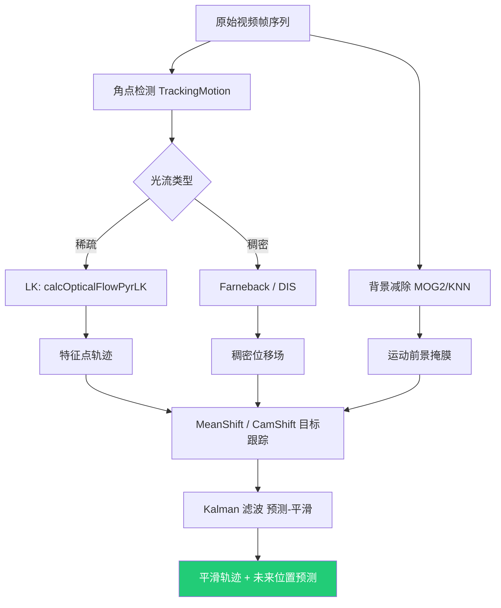

# 第 4 章 视频分析与运动建模型：Video / TrackingMotion 原理深解

> 本章基于 OpenCV C++ 官方示例源码（`samples/cpp` 根目录 8 个文件 + `tutorial_code/video/`、`tutorial_code/TrackingMotion/` 两个子目录的全部 `.cpp`）重写并大幅扩写。目标是把"能跑通的示例"还原为"可迁移的原理"——对每个条目给出数学表达、关键 API 参数表、算法关联对比、常见错误与落地场景。正文为简体中文，API 与代码标识符保留英文。
>
> 约定：文件路径以 `samples/cpp/...` 相对前缀给出；公式用 LaTeX 行内（`$...$`）或伪代码块；所有示例均"先读源码再扩写"，未改动任何源文件。

---

## 4.0 章节导言

前几章处理的是*单张图像*（空间域）：滤波、边缘、特征、点。真实世界是**时序帧序列**——视频是一组按时间采样、彼此高度相关的帧。把单帧算法直接套到每一帧上，往往会丢失帧与帧之间的运动信息；也无法利用"上一帧知道什么"来约束"这一帧应该是什么"。

OpenCV 把这类能力放在 `opencv2/video.hpp`（运动估计、背景建模、卡尔曼滤波）和 `opencv2/video/tracking.hpp`（LK 光流、MeanShift/CamShift）中。本章覆盖的两个子目录在时序视觉中的定位如下：

- **`tutorial_code/video/`**——把"运动"当成**信号/场**来估计与分离：
  - `bg_sub.cpp`、根目录 `bgfg_segm.cpp`：背景减除，从帧序列中剥离前景背景、得到运动前景掩膜；
  - `optical_flow/optical_flow.cpp`、`optical_flow_dense.cpp`、根目录 `lkdemo.cpp`、`fback.cpp`、`dis_opticalflow.cpp`：光流，估计每个像素（稠密）或每个特征点（稀疏）在两帧间的位移；
  - `meanshift/meanshift.cpp`、`meanshift/camshift.cpp`、根目录 `camshiftdemo.cpp`：基于直方图反向投影的密度模式搜索与目标跟踪。
- **`tutorial_code/TrackingMotion/`**——为运动跟踪服务的*特征点预处理*与*定位精化*：`cornerHarris_Demo.cpp`、`cornerDetector_Demo.cpp`、`goodFeaturesToTrack_Demo.cpp` 产出可跟踪的角点（光流的"种子点"）；`cornerSubPix_Demo.cpp` 把角点定位到亚像素精度（LK 光流的精度基石）。

可以把整条链路浓缩成一句话：*用角点检测找到"该跟踪什么点"（TrackingMotion）→ 用 LK/Farneback/DIS 光流估计"这些点/像素去了哪里"（video/optical_flow）→ 用 MeanShift/CamShift 在颜色直方图空间中收敛到"目标当前在哪"（video/meanshift）→ 用背景减除区分"哪些是运动物体/哪些是背景"（video/bg_sub）→ 用卡尔曼滤波对轨迹做时序平滑与预测（kalman）*。

**上下文依赖**：`video` 模块建立在 [ch01 cv::Mat](./ch01_core.md)、[ch02 imgproc](./ch02_imgproc.md)（Canny/阈值/形态学/直方图反向投影）之上；TrackingMotion 中的角点检测与 [ch03 Harris](./ch03_features.md) 是同一数学对象；光流是 [principles §13 运动分析与机器学习](./principles.md#13-运动分析与机器学习) 的代表；视频 I/O 由 [ch08 highgui/videoio](./ch08_gui_gapi_gpu.md) 的 `VideoCapture`/`VideoWriter` 提供。读不懂本章，上层的视频稳定（`videostab`）、动作识别、SLAM、跟踪都会有理解断层。

**本章阅读建议**：按"角点 → 光流 → MeanShift/CamShift → 背景减除 → Kalman"顺序读，每节按 功能 → 原理 → 数学 → API 参数 → 对比 → 易错点 → 场景 → 要点"展开。重点吃透 **LK 光流的亮度恒常假设与金字塔 Lucas-Kanade 方程、Farneback 多项式展开光流、MeanShift 的密度梯度上升、背景减除的在线高斯混合与前景掩码后处理、Kalman 的预测-更新循环与状态空间模型** 五处原理。

**概念阅读顺序**（重点看核心原理与参数说明，不写编译运行）：

- 先懂稀疏/稠密光流与金字塔 LK 假设，再对照 `optical_flow.cpp` / `lkdemo.cpp`
- 先懂背景模型在线更新与前景掩码语义，再对照 `bg_sub.cpp`
- 先懂角点作为光流种子点的意义，再对照 `TrackingMotion` 下的角点示例
- 再按需看 MeanShift/CamShift、Kalman，仍以原理与参数表为主

---

## 4.1 背景减除（Background Subtraction）

背景减除从帧序列中"学"一个背景模型，新帧与之相减得到运动前景掩膜。它是固定相机场景下运动检测的标准入口。

### 4.1.1 `bgfg_segm.cpp` —— MOG/KNN 背景减除

> **源文件**：`samples/cpp/bgfg_segm.cpp` ｜ **所属模块**：`video` ｜ **示例类型**：完整流程

#### 功能概述

演示 `BackgroundSubtractorMOG2`（基于高斯混合）与 `BackgroundSubtractorKNN`（基于 K 近邻）两类背景减除器，滑条调 `varThreshold`/`detectShadows`，输出前景掩膜。

#### 核心原理

**30 秒心智模型**：每个像素的时序值视为一个随机过程——"背景"是缓慢变化或周期性变化的部分（如树叶晃动、水波），"前景"是与背景分布显著不同的瞬时变化。MOG2 对每个像素维护 $K$ 个高斯分布（典型 $K=3$–$5$），按权重 $\omega_k$ 与方差 $\sigma_k^2$ 排序，权重高且方差小的分布被认为是背景。新像素值若落入背景分布的 $\pm 2.5\sigma$ 范围则判背景，否则判前景并更新分布。

像素 $p_t$ 在分布 $k$ 下的更新（中值更新）：

$$\omega_k\leftarrow(1-\alpha)\omega_k+\alpha\cdot\mathbb{1}[\text{matched}],\quad
\mu_k\leftarrow(1-\rho)\mu_k+\rho\, p_t,\quad
\sigma_k^2\leftarrow(1-\rho)\sigma_k^2+\rho(p_t-\mu_k)^2$$

其中 $\alpha$ 为学习率（背景更新速度），$\rho=\alpha/\omega_k$。KNN 不假设分布形状，用最近邻距离判前景，对非高斯背景（如显示器闪烁）更鲁棒。

`detectShadows=true` 时输出 3 值图：0=背景、255=前景、127=阴影（用色调差异判定）。

#### 关键 API

- `createBackgroundSubtractorMOG2(history, varThreshold, detectShadows)`；
- `createBackgroundSubtractorKNN(history, dist2Threshold, detectShadows)`；
- `subtractor->apply(frame, fgmask)`：在线更新并产生前景掩膜；
- `subtractor->getBackgroundImage(bg)`：取当前背景估计。

#### 处理流程

`VideoCapture` 打开 → 循环 `>>frame` → `apply` 得 `fgmask` → 阈值化/形态学开去噪 → `imshow`。

#### 参数说明

| 参数 | 含义 | 典型范围/默认 | 调大/调小会怎样 |
| --- | --- | --- | --- |
| `history` | 学习历史帧数 | 500 | 越大背景更新越慢、对渐变背景越稳，但启动慢 |
| `varThreshold` | 马氏距离阈值 | 16–40 | 越大越严格（前景少但漏检多），越小越宽松 |
| `detectShadows` | 是否检测阴影 | true | true 输出 3 值图，false 仅二值 |
| `learningRate`（apply 第三参） | 手动学习率 | 0（自动） | -1=按 history 自动；正值覆盖 |

#### 关联与对比

背景减除是 [principles §13 运动分析](./principles.md#13-运动分析与机器学习) 的代表。与 [ch02 帧差分](./ch02_imgproc.md)（`absdiff` 两帧相减）相比：MOG2/KNN 主动建模背景分布，对周期性背景变化（树叶、波纹）鲁棒；帧差分简单但对背景晃动极敏感。前景掩膜下游可接 [ch02 连通域](./ch02_imgproc.md) + `segment_objects.cpp`。

#### 注意事项

- 启动阶段背景未收敛，前几百帧前景会"满屏"，应等 `history` 帧后再用；
- 相机抖动会让固定背景失效，应先做视频稳定或换 `videostab`；
- 阴影会被误判为前景，需开 `detectShadows` 并后续过滤 127 值。

#### 应用场景

固定相机监控、运动目标计数、入侵检测、停车场空位检测。

### 4.1.2 `bg_sub.cpp` —— 教程版背景减除

> **源文件**：`tutorial_code/video/bg_sub.cpp` ｜ **所属模块**：`video` ｜ **示例类型**：完整流程

#### 功能概述

与 [4.1.1](#411-bgfg_segmcpp--mogknn-背景减除) 同主题，更简洁地演示 `createBackgroundSubtractorMOG2` 的最小用法。

#### 核心原理

同 4.1.1，重点演示最小 API 调用与前景掩膜可视化。

#### 关键 API

同 4.1.1。

#### 处理流程

`VideoCapture` → `MOG2->apply` → `imshow`。

#### 参数说明

同 4.1.1。

#### 关联与对比

作为 [4.1.1](#411-bgfg_segmcpp--mogknn-背景减除) 的精简版，适合快速上手。

#### 注意事项

同 4.1.1。

#### 应用场景

同 4.1.1。

### 4.1.3 `segment_objects.cpp` —— 前景目标分割

> **源文件**：`samples/cpp/segment_objects.cpp` ｜ **所属模块**：`video`+`imgproc` ｜ **示例类型**：完整流程

#### 功能概述

组合背景减除 + 形态学开闭 + 连通域标记，从视频中分割并标记独立运动目标。

#### 核心原理

`MOG2->apply` 得前景掩膜 → `morphologyEx(MORPH_OPEN)` 去孤立点 → `morphologyEx(MORPH_CLOSE)` 填孔 → `findContours`/`connectedComponentsWithStats` 提取目标 → 按面积过滤 → `rectangle` 画框。这是固定相机监控的标准流水线。

#### 关键 API

- `BackgroundSubtractorMOG2`；
- `morphologyEx`、`findContours`/`connectedComponentsWithStats`；
- `boundingRect`、`rectangle`。

#### 处理流程

`VideoCapture` → `apply` → 形态学开闭 → `findContours` → 面积阈值 → 画框 → `imshow`。

#### 参数说明

| 参数 | 含义 | 典型范围/默认 | 调大/调小会怎样 |
| --- | --- | --- | --- |
| 形态学核尺寸 | 平滑前景 | 3–5 | 大核会丢小目标 |
| 面积阈值 | 目标过滤 | 视场景 | 大阈值过滤小噪声，小阈值召回小目标 |

#### 关联与对比

是 [4.1.1](#411-bgfg_segmcpp--mogknn-背景减除) + [ch02 连通域](./ch02_imgproc.md) 的综合应用。与 [ch03 检测器](./ch03_features.md) 相比：背景减除不限目标类别，但需固定相机；检测器支持移动相机但限定类别。

#### 注意事项

- 形态学核尺寸需按目标大小调；
- 静止目标会被学进背景而消失，需配合跟踪维持 ID。

#### 应用场景

监控目标计数、入侵检测、停车场、交通流量统计。

---

## 4.2 光流（Optical Flow）

光流估计每个像素或特征点在两帧间的位移，是时序运动的核心信号。

### 4.2.1 `lkdemo.cpp` —— 稀疏 LK 光流（根目录）

> **源文件**：`samples/cpp/lkdemo.cpp` ｜ **所属模块**：`video` ｜ **示例类型**：完整流程

#### 功能概述

从摄像头/视频读帧，用 `goodFeaturesToTrack` 自动取角点或鼠标点击加点，调 `calcOpticalFlowPyrLK` 跟踪点到下一帧，演示稀疏 LK 金字塔光流的完整交互。

#### 核心原理

**30 秒心智模型**：LK 光流假设(1) **亮度恒常**——同一物点在两帧中灰度不变；(2) **空间一致**——邻域内所有像素位移相同；(3) **位移小**——相邻帧间位移有限。在此假设下，位移 $(d_x,d_y)$ 满足线性方程：

$$I_x d_x + I_y d_y + I_t = 0,\quad \nabla I=\begin{bmatrix}I_x\\I_t\end{bmatrix},\quad A^\top A\,\mathbf{d}=-A^\top I_t$$

其中 $A$ 是邻域内像素的梯度堆叠。方程只在 $A^\top A$ 可逆（即邻域有二维纹理，非边缘/平坦）时有唯一解——这正是 LK 必须在*角点*上跑的原因（角点 $A^\top A$ 的两特征值都大）。位移大时线性化失效，金字塔从粗到细逐层求解：在粗层估计大位移，逐层精化。

`TermCriteria(COUNT|EPS, 20, 0.03)` 控制迭代停止：20 次迭代或位移变化小于 0.03 像素。

#### 关键 API

- `goodFeaturesToTrack(gray, points, MAX_COUNT, qualityLevel, minDistance)`：自动取角点；
- `calcOpticalFlowPyrLK(prevGray, gray, prevPoints, nextPoints, status, err, winSize, maxLevel, criteria)`：金字塔 LK 跟踪；
- `cornerSubPix`：亚像素精化（与 [4.5.4](#454-cornersubpix_democpp) 配合）。

#### 处理流程

`VideoCapture` → 第一帧 `goodFeaturesToTrack` 取点 → 后续帧 `calcOpticalFlowPyrLK` 跟踪 → `circle` 画轨迹 → 失效点重新初始化 → `imshow`。

#### 参数说明

| 参数 | 含义 | 典型范围/默认 | 调大/调小会怎样 |
| --- | --- | --- | --- |
| `winSize` | LK 邻域窗口 | (31,31) | 大窗口抗噪但跟踪运动细节差 |
| `maxLevel` | 金字塔层数 | 3 | 越大能跟踪越大的位移但越慢 |
| `qualityLevel` | 角点质量阈值 | 0.01 | 越大角点越少但越强 |
| `minDistance` | 角点最小间距 | 10 | 防止角点聚簇 |
| `criteria` | 迭代停止 | COUNT\|EPS,20,0.03 | COUNT 大则更精但慢 |

#### 关联与对比

LK 是 [principles §13 运动分析](./principles.md#13-运动分析与机器学习) 的代表。与 [4.2.3 Farneback](#423-optical_flow_densecpp--稠密-farneback-光流) 稠密光流相比：LK 稀疏快、只跟踪特征点；Farneback 稠密慢但给全场位移。种子点来自 [4.5 TrackingMotion](#45-角点检测与特征点trackingmotion-子目录)。

#### 注意事项

- 大位移场景 `winSize` 与 `maxLevel` 需调大；
- 亮度突变/遮挡会让 LK 失效，需用 `status` 标志过滤失效点；
- 长时间跟踪点会漂移，需周期性重新初始化。

#### 应用场景

稀疏点跟踪、动作识别（轨迹特征）、SLAM 视觉里程计、视频稳定。

### 4.2.2 `optical_flow.cpp` —— 稀疏 LK 光流（教程版）

> **源文件**：`tutorial_code/video/optical_flow/optical_flow.cpp` ｜ **所属模块**：`video` ｜ **示例类型**：完整流程

#### 功能概述

与 [4.2.1](#421-lkdemocpp--稀疏-lk-光流根目录) 同主题，强调教程化的最小可运行示例。

#### 核心原理

同 4.2.1。

#### 关键 API

同 4.2.1。

#### 处理流程

同 4.2.1。

#### 参数说明

同 4.2.1。

#### 关联与对比

作为 [4.2.1](#421-lkdemocpp--稀疏-lk-光流根目录) 的教程精简版。

#### 注意事项

同 4.2.1。

#### 应用场景

同 4.2.1。

### 4.2.3 `optical_flow_dense.cpp` —— 稠密 Farneback 光流

> **源文件**：`tutorial_code/video/optical_flow/optical_flow_dense.cpp` ｜ **所属模块**：`video` ｜ **示例类型**：完整流程

#### 功能概述

用 `calcOpticalFlowFarneback` 估计每个像素的位移，得到稠密位移场，可视化（HSV 编码方向 + 幅值）。

#### 核心原理

**30 秒心智模型**：Farneback 把每帧邻域用二次多项式近似 $I(\mathbf{x})\approx \mathbf{x}^\top A\mathbf{x}+\mathbf{b}^\top\mathbf{x}+c$，两帧间的多项式系数关系给出像素位移的解析解。对每个像素在邻域上做加权最小二乘，得到稠密位移场。计算量大但给全场运动，适合运动分割、视频稳定、动作识别。

$$I_2(\mathbf{x}+\mathbf{d})\approx I_1(\mathbf{x})\ \Rightarrow\ \mathbf{d}\ \text{由多项式系数关系解析求得}$$

#### 关键 API

- `calcOpticalFlowFarneback(prev, next, flow, pyr_scale, levels, winsize, iterations, poly_n, poly_sigma, flags)`。

#### 处理流程

`VideoCapture` → 两帧灰度 → `calcOpticalFlowFarneback` → `cartToPolar` 得极坐标 → HSV 编码方向（H）与幅值（V） → `cvtColor(HSV2BGR)` → `imshow`。

#### 参数说明

| 参数 | 含义 | 典型范围/默认 | 调大/调小会怎样 |
| --- | --- | --- | --- |
| `pyr_scale` | 金字塔缩放比 | 0.5 | 0.5 经典，越小层数越密 |
| `levels` | 金字塔层数 | 3–5 | 越大跟踪大位移越稳但慢 |
| `winsize` | 平均窗口 | 15 | 越大越平滑但丢细节 |
| `iterations` | 每层迭代数 | 3 | 越大越精但慢 |
| `poly_n` | 多项式邻域 | 5/7 | 7 比 5 平滑 |
| `poly_sigma` | 多项式高斯 sigma | 1.1/1.5 | 与 poly_n 配合 |

#### 关联与对比

与 [4.2.1 LK](#421-lkdemocpp--稀疏-lk-光流根目录) 互补：Farneback 稠密慢但给全场；LK 稀疏快但只跟踪点。与 [4.2.5 DIS](#425-dis_opticalflowcpp--dis-光流) 相比：Farneback 精度高但慢（每秒几帧），DIS 快（实时）但精度略低。

#### 注意事项

- 输出 `flow` 为 `CV_32FC2`，每像素 (dx,dy) 浮点；
- 大位移场景 `levels` 需调大；
- 内存占用大，1080P 实时性差，常降采样到 480P。

#### 应用场景

运动分割、视频稳定、动作识别（光流特征）、视频压缩运动估计。

### 4.2.4 `fback.cpp` —— 稠密 Farneback 光流（根目录）

> **源文件**：`samples/cpp/fback.cpp` ｜ **所属模块**：`video` ｜ **示例类型**：完整流程

#### 功能概述

与 [4.2.3](#423-optical_flow_densecpp--稠密-farneback-光流) 同主题，演示 `calcOpticalFlowFarneback` 的标准用法与可视化。

#### 核心原理

同 4.2.3。

#### 关键 API

同 4.2.3。

#### 处理流程

同 4.2.3。

#### 参数说明

同 4.2.3。

#### 关联与对比

作为 [4.2.3](#423-optical_flow_densecpp--稠密-farneback-光流) 的根目录对照版。

#### 注意事项

同 4.2.3。

#### 应用场景

同 4.2.3。

### 4.2.5 `dis_opticalflow.cpp` —— DIS 光流

> **源文件**：`samples/cpp/dis_opticalflow.cpp` ｜ **所属模块**：`video` ｜ **示例类型**：完整流程

#### 功能概述

演示 `DISOpticalFlow`（Dense Inverse Search）——比 Farneback 快 10 倍以上的稠密光流，适合实时。

#### 核心原理

DIS 不做多项式展开，而是用**逆搜索**策略：在位移空间用反向相关匹配，结合金字塔层级，达到实时性能。精度略低于 Farneback 但远超，是手机端/嵌入式实时稠密光流的首选。

#### 关键 API

- `DISOpticalFlow::create(preset)`：`DISOpticalFlow_PRESET_FAST/ULTRA_FAST/MEDIUM`；
- `->calc(prev, next, flow)`。

#### 处理流程

`VideoCapture` → 两帧灰度 → `DIS->calc` → 可视化 → `imshow`。

#### 参数说明

| 参数 | 含义 | 典型范围/默认 | 调大/调小会怎样 |
| --- | --- | --- | --- |
| `preset` | 速度/精度档 | ULTRA_FAST/MEDIUM | MEDIUM 精度高，ULTRA_FAST 最快 |

#### 关联与对比

DIS 是 [4.2.3 Farneback](#423-optical_flow_densecpp--稠密-farneback-光流) 的实时替代——精度略换速度大幅提升。与 [4.2.1 LK](#421-lkdemocpp--稀疏-lk-光流根目录) 相比：DIS 稠密，LK 稀疏但更精确。

#### 注意事项

- 输入需为 8 位单通道；
- 严重遮挡/光照突变会让光流发散，需时序平滑。

#### 应用场景

手机实时 AR、视频稳定（`videostab`）、运动分割、实时动作识别。

---

## 4.3 MeanShift / CamShift 目标跟踪

基于直方图反向投影的密度模式搜索，适合颜色显著目标的跟踪。

### 4.3.1 `camshiftdemo.cpp` —— CamShift 跟踪（根目录）

> **源文件**：`samples/cpp/camshiftdemo.cpp` ｜ **所属模块**：`video`+`imgproc` ｜ **示例类型**：完整流程

#### 功能概述

用户框选 ROI 建立 HSV 色相直方图，后续帧用 `CamShift` 在反向投影图上搜索并自适应调整目标框尺寸/方向。

#### 核心原理

**30 秒心智模型**：MeanShift 是在反向投影图（每像素值为"属于目标颜色"的概率）上做的**密度梯度上升**——从初始框中心出发，按邻域加权质心移动到更高密度处，收敛到密度峰值。MeanShift 框尺寸固定；CamShift 在 MeanShift 收敛后重新估计框的尺寸与方向（基于二阶矩），适合尺寸变化的目标。

MeanShift 迭代：

$$\mathbf{c}_{t+1}=\frac{\sum_{\mathbf{x}\in W} K(\mathbf{x}-\mathbf{c}_t)\,p(\mathbf{x})\,\mathbf{x}}{\sum_{\mathbf{x}\in W} K(\mathbf{x}-\mathbf{c}_t)\,p(\mathbf{x})}$$

其中 $W$ 为窗口、$p$ 为反投概率、$K$ 为核函数。CamShift 在收敛后用反投图二阶矩更新框：

$$\text{size}\propto \frac{M_{00}}{\text{scale}},\quad \text{angle}=\frac{1}{2}\arctan\frac{2M_{11}/M_{00} - \bar{x}\bar{y}}{M_{20}/M_{00}-\bar{x}^2 - (M_{02}/M_{00}-\bar{y}^2)}$$

#### 关键 API

- `calcHist`（HSV H 通道）→ `normalize`；
- `calcBackProject`；
- `CamShift(probImage, window, criteria)`：返回带旋转的 `RotatedRect`；
- `MeanShift(probImage, window, criteria)`：仅平移。

#### 处理流程

`VideoCapture` → 鼠标框选 ROI → `cvtColor(BGR2HSV)` → `calcHist` H 通道 → 后续帧 `calcBackProject` → `CamShift` → `ellipse` 画框 → `imshow`。

#### 参数说明

| 参数 | 含义 | 典型范围/默认 | 调大/调小会怎样 |
| --- | --- | --- | --- |
| `hsize` | H 直方图 bin | 16 | 越大越精细但需更多样本 |
| `criteria` | 迭代停止 | 10 次/1 像素 | 大迭代更稳但慢 |
| `hscale`（V/S 过滤） | 颜色容差 | 经验 | 过宽召回噪声多 |

#### 关联与对比

CamShift 是 [ch02 直方图反向投影](./ch02_imgproc.md) 的视频应用——把单帧定位扩展为时序跟踪。与 [4.2 LK 光流](#421-lkdemocpp--稀疏-lk-光流根目录) 相比：CamShift 颜色驱动、对形变/旋转鲁棒；LK 纹理驱动、对弱纹理场景强。

#### 注意事项

- HSV 中 H 通道范围 `[0,180)`；
- 颜色相近背景（如肤色跟踪遇手）会让 CamShift 漂移，需限定搜索窗；
- 遮挡时 CamShift 会丢失，应配合 Kalman 预测。

#### 应用场景

颜色目标跟踪（球、人脸）、手势跟踪、瞳孔跟踪、AR 标记跟踪。

### 4.3.2 `camshift.cpp` —— 教程版 CamShift

> **源文件**：`tutorial_code/video/meanshift/camshift.cpp` ｜ **所属模块**：`video` ｜ **示例类型**：完整流程

#### 功能概述

与 [4.3.1](#431-camshiftdemocpp--camshift-跟踪根目录) 同主题的教程版最小示例。

#### 核心原理

同 4.3.1。

#### 关键 API

同 4.3.1。

#### 处理流程

同 4.3.1。

#### 参数说明

同 4.3.1。

#### 关联与对比

作为 [4.3.1](#431-camshiftdemocpp--camshift-跟踪根目录) 的教程精简版。

#### 注意事项

同 4.3.1。

#### 应用场景

同 4.3.1。

### 4.3.3 `meanshift.cpp` —— MeanShift 跟踪

> **源文件**：`tutorial_code/video/meanshift/meanshift.cpp` ｜ **所属模块**：`video` ｜ **示例类型**：完整流程

#### 功能概述

演示 `MeanShift`——框尺寸固定的反向投影密度搜索，与 [4.3.2 CamShift](#432-camshiftcpp--教程版-camshift) 对比，展示"固定框 vs 自适应框"的差异。

#### 核心原理

同 [4.3.1](#431-camshiftdemocpp--camshift-跟踪根目录)，但不更新框尺寸/方向。

#### 关键 API

- `MeanShift(probImage, window, criteria)`。

#### 处理流程

同 4.3.2 但调 `MeanShift` 而非 `CamShift`。

#### 参数说明

同 4.3.2。

#### 关联与对比

与 [4.3.1 CamShift](#431-camshiftdemocpp--camshift-跟踪根目录) 相比：MeanShift 框固定，适合尺寸稳定目标；CamShift 自适应，适合尺寸/方向变化目标。

#### 注意事项

- 目标尺寸变化时 MeanShift 会偏，应改用 CamShift；
- MeanShift 收敛快于 CamShift，适合计算受限场景。

#### 应用场景

固定尺寸目标跟踪、低算力场景、颜色显著物体定位。

---

## 4.4 Kalman 滤波

Kalman 滤波用线性状态空间模型对带噪观测做时序平滑与预测。

### 4.4.1 `kalman.cpp` —— Kalman 滤波演示

> **源文件**：`samples/cpp/kalman.cpp` ｜ **所属模块**：`video` ｜ **示例类型**：完整流程

#### 功能概述

模拟一个二维匀速运动目标，加噪声观测，用 `KalmanFilter` 平滑轨迹并预测未来位置。

#### 核心原理

**30 秒心智模型**：状态 $\mathbf{x}_t$（位置+速度）按线性动力学 $\mathbf{x}_t=F\mathbf{x}_{t-1}+\mathbf{w}_t$ 演化，观测 $\mathbf{z}_t=H\mathbf{x}_t+\mathbf{v}_t$ 带噪声。Kalman 用两步循环：

- **预测**：$\hat{\mathbf{x}}_t^-=F\hat{\mathbf{x}}_{t-1}^+$，$P_t^-=FP_{t-1}^+F^\top+Q$；
- **更新**：$K_t=P_t^-H^\top(HP_t^-H^\top+R)^{-1}$，$\hat{\mathbf{x}}_t^+=\hat{\mathbf{x}}_t^-+K_t(\mathbf{z}_t-H\hat{\mathbf{x}}_t^-)$，$P_t^+=(I-K_tH)P_t^-$。

$F$ 为状态转移（匀速模型 $F=\begin{bmatrix}1&0&dt&0\\0&1&0&dt\\0&0&1&0\\0&0&0&1\end{bmatrix}$），$H$ 为观测（只观测位置），$Q/R$ 为过程/观测噪声协方差。$K$ 为卡尔曼增益——当观测噪声小（$R$ 小）时信任观测、当模型不确定（$Q$ 大）时信任预测。

#### 关键 API

- `KalmanFilter(dynamParams, measureParams, controlParams, type)`；
- `kf.predict(control)`、`kf.correct(measurement)`；
- `kf.transitionMatrix`、`kf.measurementMatrix`、`kf.processNoiseCov`、`kf.measurementNoiseCov`、`kf.errorCovPost`。

#### 处理流程

构造 `KalmanFilter(4,2,0)` → 设置 $F/H/Q/R$ → 循环：`predict` → 加噪观测 → `correct` → 画真值/观测/估计/预测四条轨迹 → `imshow`。

#### 参数说明

| 参数 | 含义 | 典型范围/默认 | 调大/调小会怎样 |
| --- | --- | --- | --- |
| `processNoiseCov` $Q$ | 模型不确定性 | 1e-4 | 大则更信观测，平滑弱；小则更信模型，平滑强 |
| `measurementNoiseCov` $R$ | 观测噪声 | 1e-1 | 大则更信模型，估计滞后；小则更信观测，估计抖 |
| `dt` | 离散步长 | 1 | 影响 $F$ 中速度积分系数 |

#### 关联与对比

Kalman 是 [principles §13 运动分析](./principles.md#13-运动分析与机器学习) 的时序平滑代表。与 [4.2 光流](#421-lkdemocpp--稀疏-lk-光流根目录)/[4.3 CamShift](#431-camshiftdemocpp--camshift-跟踪根目录) 配合：光流/CamShift 给观测，Kalman 平滑+预测。扩展 Kalman（EKF）与无迹 Kalman（UKF）用于非线性，OpenCV 不直接提供。

#### 注意事项

- 状态空间维度需与 $F$ 严格一致；
- $Q/R$ 调参是 Kalman 工程难点，常按经验先验设；
- 高度非线性运动（急转）需 EKF/UKF 或粒子滤波。

#### 应用场景

目标轨迹平滑、遮挡期预测、雷达/视频融合、GPS/IMU 融合、自动驾驶轨迹预测。

---

## 4.5 角点检测与特征点（TrackingMotion 子目录）

TrackingMotion 提供光流的"种子点"——可跟踪的角点，以及亚像素精化。

### 4.5.1 `cornerHarris_Demo.cpp` —— Harris 角点

> **源文件**：`tutorial_code/TrackingMotion/cornerHarris_Demo.cpp` ｜ **所属模块**：`imgproc` ｜ **示例类型**：完整流程

#### 功能概述

滑条调 `blockSize`/`ksize`/`k`，用 `cornerHarris` 检测角点并归一化可视化。

#### 核心原理

**30 秒心智模型**：角点是"在所有方向上灰度都变化显著"的点。Harris 用结构张量（二阶矩矩阵）$M=\sum w\begin{bmatrix}I_x^2&I_xI_y\\I_xI_y&I_y^2\end{bmatrix}$ 的特征值 $\lambda_1,\lambda_2$ 判定：两个都大=角点、一大一小=边、都小=平坦。响应函数：

$$R=\det(M)-k\,(\text{tr}\,M)^2=\lambda_1\lambda_2-k(\lambda_1+\lambda_2)^2$$

$k$ 经验值 0.04–0.06。`cornerHarris` 输出浮点响应图，阈值化得角点。

#### 关键 API

- `cornerHarris(src, dst, blockSize, ksize, k, borderType)`；
- `normalize`、`threshold`。

#### 处理流程

`imread` 灰度 → `cornerHarris` → `normalize` → 阈值化 → `imshow`。

#### 参数说明

| 参数 | 含义 | 典型范围/默认 | 调大/调小会怎样 |
| --- | --- | --- | --- |
| `blockSize` | 邻域尺寸 | 2–7 | 越大响应越平滑但定位差 |
| `ksize` | Sobel 核 | 3 | 大核更抗噪但定位下降 |
| `k` | Harris 参数 | 0.04–0.06 | 大则对边响应更敏感 |

#### 关联与对比

Harris 是 [principles §8 特征检测](./principles.md#8-特征检测与描述从角点到描述子) 的代表。结构张量与 [ch02 各向异性分割](./ch02_imgproc.md) 同源。Harris 对旋转不变但对尺度敏感——尺度不变版本见 [ch03 SIFT](./ch03_features.md)。Harris 角点是 [4.2 LK 光流](#421-lkdemocpp--稀疏-lk-光流根目录) 的种子点候选。

#### 注意事项

- 响应图浮点，需 `normalize` 后可视；
- `k` 超出 [0,0.25] 数学性质会退化；
- 单点响应会扩散，需非极大值抑制。

#### 应用场景

光流种子点、相机标定棋盘角点、SLAM 特征、运动检测。

### 4.5.2 `cornerDetector_Demo.cpp` —— 通用角点检测器

> **源文件**：`tutorial_code/TrackingMotion/cornerDetector_Demo.cpp` ｜ **所属模块**：`imgproc` ｜ **示例类型**：完整流程

#### 功能概述

演示 `cornerEigenValsAndVecs`/`cornerMinEigenVal` 等底层角点度量，对比 Harris、最小特征值、FAST 等策略。

#### 核心原理

`cornerMinEigenVal` 直接用 $\min(\lambda_1,\lambda_2)$ 作响应（Shi-Tomasi），避免 Harris 的 $k$ 调参，物理意义更直接：两方向都强才算角点。

#### 关键 API

- `cornerEigenValsAndVecs`、`cornerMinEigenVal`；
- `preCornerDetect`。

#### 处理流程

`imread` 灰度 → 各度量计算 → 阈值化 → 对比可视。

#### 参数说明

同 4.5.1。

#### 关联与对比

Shi-Tomasi 是 [4.5.1 Harris](#451-cornerharris_democpp--harris-角点) 的变体——[4.5.3 goodFeaturesToTrack](#453-goodfeaturestotrack_democpp) 默认用 Shi-Tomasi。

#### 注意事项

- 输出深度需为 `CV_32F`；
- 不同度量响应值范围不同，归一化后对比。

#### 应用场景

角点策略选型、棋盘/标定板角点提取、教学演示。

### 4.5.3 `goodFeaturesToTrack_Demo.cpp` —— Shi-Tomasi 角点

> **源文件**：`tutorial_code/TrackingMotion/goodFeaturesToTrack_Demo.cpp` ｜ **所属模块**：`imgproc` ｜ **示例类型**：完整流程

#### 功能概述

用 `goodFeaturesToTrack` 一次性输出最强 $N$ 个角点，含非极大值抑制与最小间距约束，是 LK 光流的"标准种子点生成器"。

#### 核心原理

`goodFeaturesToTrack` 流程：(1) 计算结构张量特征值；(2) 用 Shi-Tomasi 响应 $\min(\lambda_1,\lambda_2)$（或 Harris）；(3) 阈值化；(4) 非极大值抑制（局部极大保留）；(5) 按响应排序取前 $N$；(6) 最小间距 greedy 选择避免聚簇。

#### 关键 API

- `goodFeaturesToTrack(image, corners, maxCorners, qualityLevel, minDistance, mask, blockSize, useHarrisDetector, k)`。

#### 处理流程

`imread` 灰度 → `goodFeaturesToTrack` → `circle` 画点 → `imshow`。

#### 参数说明

| 参数 | 含义 | 典型范围/默认 | 调大/调小会怎样 |
| --- | --- | --- | --- |
| `maxCorners` | 最大角点数 | 500–1000 | 越大召回多但计算量上升 |
| `qualityLevel` | 质量阈值 | 0.01–0.1 | 越大角点越少但越强 |
| `minDistance` | 最小间距 | 5–10 | 防聚簇，大值分布更均匀 |
| `useHarrisDetector` | Harris vs Shi-Tomasi | false | true 用 Harris |

#### 关联与对比

是 [4.5.1 Harris](#451-cornerharris_democpp--harris-角点) 的"工程化版本"——加了 NMS 与最小间距，直接给 LK 光流用（见 [4.2.1 lkdemo](#421-lkdemocpp--稀疏-lk-光流根目录)）。

#### 注意事项

- `qualityLevel` 是相对最大响应的比例，需按图调；
- 多通道图需先转灰度；
- 对尺度敏感，多尺度场景需金字塔。

#### 应用场景

LK 光流种子点、相机标定、SLAM、稀疏跟踪。

### 4.5.4 `cornerSubPix_Demo.cpp` —— 亚像素角点精化

> **源文件**：`tutorial_code/TrackingMotion/cornerSubPix_Demo.cpp` ｜ **所属模块**：`imgproc` ｜ **示例类型**：完整流程

#### 功能概述

在 `goodFeaturesToTrack` 输出的整数像素角点上做 `cornerSubPix` 精化到亚像素精度，是 LK 光流精度与标定精度的基石。

#### 核心原理

亚像素精化在角点邻域内拟合一个二次曲面，取其极值点为精化位置。迭代公式基于质心偏移：

$$\mathbf{q}_{t+1}=\mathbf{q}_t+\frac{\sum_{\mathbf{x}\in W}(\mathbf{x}-\mathbf{q}_t)\,g(\mathbf{x})}{\sum_{\mathbf{x}\in W} g(\mathbf{x})}$$

其中 $g(\mathbf{x})$ 是梯度幅值，迭代收敛到亚像素精度。

#### 关键 API

- `goodFeaturesToTrack` 取粗点；
- `cornerSubPix(gray, corners, win, zeroZone, criteria)`：亚像素迭代精化。

#### 处理流程

`imread` 灰度 → `goodFeaturesToTrack` → `cornerSubPix` → 画点（放大可视亚像素偏移）→ `imshow`。

#### 参数说明

| 参数 | 含义 | 典型范围/默认 | 调大/调小会怎样 |
| --- | --- | --- | --- |
| `win` | 精化邻域 | (5,5) | 越大越稳但可能跨邻角 |
| `zeroZone` | 零区 | (-1,-1) | 不用 |
| `criteria` | 迭代停止 | 40 次/0.001 | 越严格越精但慢 |

#### 关联与对比

亚像素精化是 [4.5.3 goodFeaturesToTrack](#453-goodfeaturestotrack_democpp) 的后处理。是 [ch07 相机标定](./ch07_calib3d_stitching.md) `cornerSubPix` 棋盘角点精化的同 API——标定精度直接依赖角点亚像素精度。

#### 注意事项

- `win` 太大会混入邻角，应按角点密度调；
- 精化结果需存为 `Point2f`，整数化会丢失精度。

#### 应用场景

相机标定棋盘角点、LK 光流种子点、亚像素目标定位、精密测量。

---

## 4.6 人脸检测与跟踪

### 4.6.1 `smiledetect.cpp` —— 人脸+微笑检测

> **源文件**：`samples/cpp/smiledetect.cpp` ｜ **所属模块**：`objdetect`+`video` ｜ **示例类型**：完整流程

#### 功能概述

用 Haar 级联检测人脸 + 微笑，结合视频流演示"检测器 + 时序"组合，是 [ch06 目标检测](./ch06_objdetect_photo.md) 在视频上的应用。

#### 核心原理

Haar 级联在每帧做滑动窗口检测（见 [ch06 facedetect](./ch06_objdetect_photo.md)），输出人脸框。视频场景下检测器在每帧独立运行，无时序关联——本例演示了"检测即跟踪"的简化版：每帧检测人脸，在人脸 ROI 内再检测微笑。无 Kalman/光流平滑，是教学用最小流程。

#### 关键 API

- `CascadeClassifier::detectMultiScale`；
- `VideoCapture`。

#### 处理流程

`VideoCapture` → 加载 face/smile 级联 → 每帧 `detectMultiScale(face)` → 人脸 ROI 内 `detectMultiScale(smile)` → 画框 → `imshow`。

#### 参数说明

| 参数 | 含义 | 典型范围/默认 | 调大/调小会怎样 |
| --- | --- | --- | --- |
| `scaleFactor` | 金字塔缩放 | 1.1 | 小则更精但慢 |
| `minNeighbors` | 检测邻域数 | 3–5 | 大则更严但漏检多 |
| `minSize` | 最小窗口 | (30,30) | 按场景 |

#### 关联与对比

是 [ch06 facedetect](./ch06_objdetect_photo.md) 的视频版。检测器与时序结合的标准做法见 SORT/DeepSORT（[4.7.3](#473-进阶方向)）。

#### 注意事项

- Haar 检测每帧耗时，实时性受分辨率影响；
- 旋转/侧脸检测率低，可改用 DNN 检测器（[ch06 dbt_face_detection](./ch06_objdetect_photo.md)）。

#### 应用场景

微笑相机、互动营销、表情识别前置、人脸 ROI 提取。

---

## 4.7 本章小结与进阶

### 4.7.1 本章脉络回顾

本章从"时序帧序列"出发，覆盖了运动估计与跟踪的四条主线：

1. **背景减除**（4.1）：MOG2/KNN 在线学习背景分布，分离运动前景；
2. **光流**（4.2）：LK 稀疏、Farneback/DIS 稠密，估计像素/特征点位移；
3. **MeanShift/CamShift**（4.3）：反向投影 + 密度梯度上升，颜色目标跟踪；
4. **Kalman 滤波**（4.4）：线性状态空间模型的时序平滑与预测。

角点检测（4.5）为光流提供种子点，是上述链路的预处理。人脸检测跟踪（4.6）展示了检测器与时序的结合。

### 4.7.2 工程实践建议

- **运动检测标准链**：背景减除 → 形态学开闭 → 连通域 → Kalman 平滑 → 多目标跟踪；
- **颜色目标跟踪**：HSV 直方图 → 反向投影 → CamShift → Kalman 预测遮挡期；
- **稀疏点跟踪**：`goodFeaturesToTrack` → `cornerSubPix` → `calcOpticalFlowPyrLK` → 轨迹聚类；
- **实时稠密光流**：手机/嵌入式用 DIS，离线精度优先用 Farneback；
- **背景减除**：固定相机用 MOG2/KNN，移动相机需先稳定或换深度学习。

### 4.7.3 进阶方向

传统方法的局限：

- 背景减除对动态背景（水波、树叶）仍会误检；
- LK/Farneback 对大位移、遮挡、光照突变敏感；
- CamShift 对颜色相近背景易漂移；
- Kalman 仅适用线性高斯。

学习-based 进阶：

- **DeepSORT**：检测器 + 外观特征 + Kalman 数据关联，多目标跟踪主流；
- **RAFT / FlowFormer**：深度学习光流，精度远超 Farneback；
- **SORT**：检测器 + Kalman 的简化多目标跟踪；
- **TransTrack / Tracktor**：Transformer 端到端跟踪；
- **BackgroundMatting**：深度学习背景分离，支持移动相机。

读完本章，应能从"视频帧序列"出发，构造出"可检测、可跟踪、可平滑预测"的工程流水线，并理解传统方法的边界与深度学习的改进方向。

---

## 4.A 附录：关键 API 速查

| 类别 | API | 用途 |
| --- | --- | --- |
| 背景减除 | `createBackgroundSubtractorMOG2/KNN` | 在线背景建模 |
| 光流（稀疏） | `calcOpticalFlowPyrLK` | 金字塔 LK 点跟踪 |
| 光流（稠密） | `calcOpticalFlowFarneback` | Farneback 全场光流 |
| 光流（DIS） | `DISOpticalFlow::create` | 实时稠密光流 |
| 跟踪 | `MeanShift`/`CamShift` | 反向投影密度搜索 |
| Kalman | `KalmanFilter` | 线性时序滤波 |
| 角点 | `cornerHarris`、`goodFeaturesToTrack`、`cornerSubPix` | 角点检测与精化 |
| 视频I/O | `VideoCapture`/`VideoWriter` | 见 [ch08](./ch08_gui_gapi_gpu.md) |
