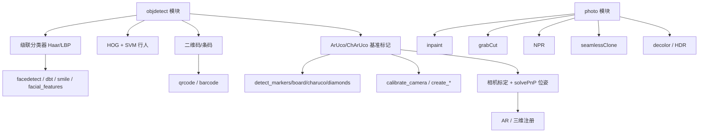
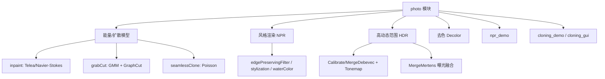

# 第 6 章 目标检测与计算摄影：`objdetect` 与 `photo` 模块原理详解

> 本章基于 OpenCV 官方 C++ 示例（`samples/cpp` 与 `tutorial_code/objectDetection`、`tutorial_code/photo`），源码根目录为 `mingw-build/samples/cpp`。重点讲算法原理与参数语义，不写编译运行。
---

## 6.0 章节导言

OpenCV 的 `objdetect`（目标检测）和 `photo`（计算摄影）两个模块，分别对应计算机视觉的两条主线：**“在哪里、是什么”** 与 **“如何把图像变得更好/更艺术/更易编辑”**。本章把它们放在同一章里讲，是因为它们在工程实践中常常配合出现：先用检测器定位目标（人脸、行人、二维码、ArUco 标记），再做后续的图像处理（抠图、修复、融合、风格化）。

### 6.0.1 `objdetect` 模块的视角

`objdetect` 模块提供的是**传统（非深度学习）检测器**家族：

- **基于级联分类器（CascadeClassifier）的检测器**：以 Haar 特征 + AdaBoost 级联 / LBP 特征为代表，典型用于人脸、眼睛、微笑、鼻子、嘴巴等刚性与半刚性目标的检测。示例：`facedetect.cpp`、`dbt_face_detection.cpp`、`smiledetect.cpp`、`facial_features.cpp`、`objectDetection.cpp`。
- **基于 HOG + SVM 的检测器**：`HOGDescriptor` 结合线性 SVM，典型用于行人/人体检测。示例：`peopledetect.cpp`。
- **二维条码与二维码识别**：`barcode::BarcodeDetector`、`QRCodeDetector` / `QRCodeDetectorAruco`。示例：`barcode.cpp`、`qrcode.cpp`。
- **基准标记（fiducial marker）检测与标定**：以 ArUco / ChArUco / Diamond 为代表。这是 `tutorial_code/objectDetection/` 子目录的**真实内容**——它**不是**滑动窗口目标检测器，而是一套用于**相机标定、位姿估计（pose estimation）、增强现实（AR）**的基准标记系统。务必注意归类，不要将其误当作“通用目标检测器”。

>  **重要归类说明**：`tutorial_code/objectDetection/` 下的 `detect_markers.cpp`、`detect_board.cpp`、`detect_board_charuco.cpp`、`detect_diamonds.cpp`、`calibrate_camera*.cpp` 以及 `create_*` 系列，本质上都是 **ArUco/ChArUco 基准标记的检测、生成与相机标定**。它与 `facedetect.cpp` 那种“滑动窗口 + 级联分类器”检测器在原理上完全不同：ArUco 依赖**二进制字典 + 汉明距离匹配 + 角点几何**，而非机器学习分类器。

### 6.0.2 `photo` 模块的视角

`photo` 模块提供**计算摄影（Computational Photography）**算法，关注“像素级重建与编辑”：

- **图像修复（Inpainting）**：`inpaint`（Telea 的 Fast Marching 法、Navier-Stokes 法）。示例：`inpaint.cpp`。
- **交互式前景分割**：`grabCut`，基于 GMM + 图割（Graph Cut）。示例：`grabcut.cpp`。
- **非真实感渲染（NPR）**：`edgePreservingFilter`、`detailEnhance`、`pencilSketch`、`stylization`、`waterColor`。示例：`npr_demo.cpp`。
- **无缝克隆（Seamless Cloning / Poisson 图像编辑）**：`seamlessClone`、`colorChange`、`illuminationChange`、`textureFlattening`。示例：`cloning_demo.cpp`、`cloning_gui.cpp`。
- **去色（Decolorization）**：`decolor`。示例：`decolor.cpp`。
- **高动态范围成像（HDR）**：`CalibrateDebevec`、`MergeDebevec`、`Tonemap*`、`MergeMertens`。示例：`hdr_imaging.cpp`。

### 6.0.3 检测器的能力谱系（预览）



### 6.0.4 学习路径建议

本章先讲传统检测器（理解“特征 + 分类”与“滑动窗口”的工程权衡），再讲 ArUco（理解二进制字典与位姿估计），最后讲 `photo`（理解能量最小化、偏微分方程、梯度域编辑）。学完本章后，建议进入第 7+ 章的 `dnn` 模块（基于深度学习的检测器，如 YOLO、SSD、Faster R-CNN、人脸的 YuNet/RetinaFace），传统方法是理解现代检测器的基石。

**概念阅读顺序**（重点看核心原理与参数说明，不写编译运行）：

- 先懂级联分类器滑动窗口与 Haar/LBP 特征，再对照 `facedetect.cpp`
- 先懂 ArUco 字典匹配、角点与位姿估计（勿与通用检测混淆），再对照 `detect_markers.cpp`
- 先懂 GrabCut 的 GMM + 图割能量最小化，再对照 `grabcut.cpp`
- 二维码/行人/HDR 等示例在上述三块之后按需对照，仍以原理与参数表为主
---

## 6.1 objdetect 模块（传统检测器）
---

### 6.1.1 `facedetect.cpp` —— Haar/LBP 级联人脸检测（命令行版）

> **源文件**：`samples/cpp/facedetect.cpp`

> **所属模块**：`objdetect` 模块 / 级联分类器检测 / 人脸与嵌套目标（眼睛）｜ **示例类型**：`完整流程`

#### 功能概述

演示 `cv::CascadeClassifier` 在图像或摄像头视频流中检测人脸（正面人脸 Haar 分类器），并在人脸上 ROI 内用嵌套级联（`nested-cascade`）检测眼睛。支持 `--scale` 下采样加速、`--try-flip` 镜像检测、可选相机/图片/图片列表输入。检测后按宽高比用圆或矩形框出人脸，并对每个检测到的眼睛画圆。

#### 核心原理

**1) 积分图（Integral Image）加速 Haar 特征计算**

Haar-like 特征用黑白矩形区域的像素和之差刻画局部纹理（如“眼周比脸颊暗”）。直接求和太慢，OpenCV 借助积分图在 $O(1)$ 内求得任意矩形区域和：

$$
ii(x,y)=\sum_{x'\le x,\;y'\le y} i(x',y')
$$

任意矩形 $R=(x_1,y_1,x_2,y_2)$ 的像素和为：

$$
\text{sum}(R)=ii(x_2,y_2)-ii(x_1-1,y_2)-ii(x_2,y_1-1)+ii(x_1-1,y_1-1)
$$

一个 Haar 特征（如“左白右黑”两矩形）的值 = 白区 sum − 黑区 sum，可用 2−4 次查表完成，与窗口尺寸无关。

**2) AdaBoost 级联（Viola-Jones 框架）**

- **AdaBoost**：从海量 Haar 候选特征中选出少量“弱分类器”（每个弱分类器就是一个阈值化的 Haar 特征），按加权错误率提升权重，组合成强分类器。
- **级联（cascade）**：将强分类器按“严格→宽松”排成多级。前置级过滤掉绝大多数背景窗口（计算极快），只有通过所有级的窗口才被保留为候选。这把平均计算量压到很低。

$$
\text{决策} = \bigwedge_{s=1}^{S} \left( \sum_{t} \alpha_t\,h_t(x) \ge \theta_s \right)
$$

其中 $h_t$ 为第 $t$ 个弱分类器，$\alpha_t$ 为其权重，$\theta_s$ 为第 $s$ 级的阈值。

**3) 滑动窗口 + 图像金字塔**

`detectMultiScale` 在多个尺度（缩放图像）与多个位置（滑动窗口）上重复评估上述级联，再用非极大值抑制（按 `minNeighbors` 聚类）合并重叠窗口。

**4) 预处理**：灰度化 + `equalizeHist` 直方图均衡，提升光照鲁棒性。

**算法步骤（伪代码）**

```
输入: 彩色图 img, 分类器 cascade, 缩放系数 scale
1. gray = cvtColor(img, BGR2GRAY)
2. small = resize(gray, 1/scale)              # 下采样加速
3. equalizeHist(small, small)
4. faces = cascade.detectMultiScale(small, scaleFactor=1.1, minNeighbors=2, minSize=(30,30))
5. for each face r in faces:
6.     if 0.75 < r.w/r.h < 1.3: 画圆(中心, 半径)   # 近似正脸
7.     else: 画矩形
8.     ROI = small(r)
9.     eyes = nestedCascade.detectMultiScale(ROI, ...)   # 嵌套检测
10.    for each eye: 画圆
```

#### 关键 API

- `cv::CascadeClassifier`：级联分类器封装。
- `CascadeClassifier::load(path)`：加载 `.xml`（Haar）或 `.yaml`（LBP）模型。
- `CascadeClassifier::detectMultiScale(...)`：多尺度检测。
- `cv::equalizeHist`：直方图均衡。
- `cv::CommandLineParser`：命令行解析。
- `samples::findFile`：定位 `samples` 数据目录中的模型/图片。

#### 处理流程

- **① 输入图像**
  - `imread` —— `imread(path, flags)` —— flags: IMREAD_COLOR(1)/GRAYSCALE(0)/UNCHANGED(-1)，读取为 BGR/灰度/带 alpha。
- **② 预处理（灰度化 / 滤波降噪 / 直方图均衡化等）**
  - `cvtColor` —— `cvtColor(src, dst, code[, dcn])` —— code 如 COLOR_BGR2GRAY/HSV；色彩空间转换。
  - `resize` —— `resize(src, dst, dsize[, fx,fy,interp])` —— 按 dsize 或比例缩放；interp: INTER_LINEAR/CUBIC。
  - `equalizeHist` —— `equalizeHist(src, dst)` —— 灰度直方图均衡化，增强对比度。
  - `flip`
- **③ 核心算法处理**
  - `load`
  - `detectMultiScale` —— `det.detectMultiScale(img, sf, minN, flags, minS, maxS)` —— 多尺度滑动窗口检测。
- **④ 结果输出与交互**
  - `waitKey` —— `waitKey(delay)` —— 等待按键 delay 毫秒；0 表示永久等待，用于驱动 GUI 循环。
  - `imshow` —— `imshow(winname, mat)` —— 在指定窗口显示图像。

#### 参数说明

| 参数 | 含义 | 本例取值 | 调大/调小会怎样 |
| --- | --- | --- | --- |
| `scaleFactor` | 金字塔每层缩放比 | `1.1` | ↓ → 更密更准更慢；↑ → 更快但漏小脸 |
| `minNeighbors` | 保留框所需邻域候选数 | `2` | ↑ → 误检↓、召回↓ |
| `minSize` | 最小检测窗口 | `Size(30,30)` | ↑ → 忽略更小目标 |
| `--scale` | 检测前图像下采样倍率 | 默认 `1` | ↑ → 加速、小脸漏检 |
| `CASCADE_SCALE_IMAGE` | 在缩放域搜索 | 开启 | 与 `scaleFactor` 配合 |
| `equalizeHist` | 预处理均衡 | 每帧 | 关闭 → 光照敏感 |

#### 关联与对比

- **Haar vs LBP**：Haar 特征表达力强但模型大、训练慢；LBP（局部二值模式）特征简单、模型小、推理快，精度略低。两者都走同一 `CascadeClassifier` 管线。
- **级联 vs HOG+SVM**：级联更适合小目标/刚体（人脸），HOG+SVM 更适合整体人体轮廓（行人）。

#### 注意事项

- 级联分类器是“刚性目标”快速检测的鼻祖方案，理解它对理解现代 anchor-based 检测有帮助。
- 嵌套检测（在人脸 ROI 内再检测眼睛）大幅减少搜索范围、降低误检。
- Haar 与 LBP 同样走 `CascadeClassifier` 接口，区别仅在特征类型与模型文件。

**失败模式**：光照不均未均衡 → 漏检；`scaleFactor` 过小 → 极慢；`minNeighbors` 过小 → 误检框泛滥；侧脸/遮挡 → Haar 召回低；模型路径错误 → 加载失败。

#### 应用场景

- 实时人脸检测（门禁、相机对焦、表情触发）。
- 作为人脸关键点/识别流水线的“粗定位”前置。
- 教学：理解 Viola-Jones 框架的工程实现。
---
### 6.1.2 `objectDetection.cpp` —— 级联人脸+眼睛检测（`tutorial_code` 教学版）

> **源文件**：`samples/cpp/tutorial_code/objectDetection/objectDetection.cpp`

> **所属模块**：`objdetect` 模块 / 级联分类器检测 / 人脸+眼睛教学示例 ｜ **示例类型**：`完整流程`

#### 功能概述

`facedetect.cpp` 的“教程精简版”，仅保留从摄像头读取帧、加载正面人脸与眼睛级联、对每帧 `detectAndDisplay` 的核心流程。用人脸椭圆 + 眼睛圆标出结果，是官方级联检测入门文档（`Cascade Classifier` 教程）的配套代码。

#### 核心原理

与 6.1 完全一致（Haar + 积分图 + AdaBoost 级联 + 滑动窗口），区别在：
- 不提供 `--scale` / `--try-flip` / 图片列表等高级选项；
- 人脸用 `ellipse` 画（长轴=宽/2，短轴=高/2），眼睛用圆画；
- 在人脸 ROI（灰度）上直接跑眼睛级联。

#### 关键 API

- `CascadeClassifier::load`、`detectMultiScale`（无显式参数时使用默认值）。
- `cv::ellipse`、`cv::circle`、`cv::VideoCapture::read`。

#### 处理流程

- **① 预处理（灰度化 / 滤波降噪 / 直方图均衡化等）**
  - `cvtColor` —— `cvtColor(src, dst, code[, dcn])` —— code 如 COLOR_BGR2GRAY/HSV；色彩空间转换。
  - `equalizeHist` —— `equalizeHist(src, dst)` —— 灰度直方图均衡化，增强对比度。
- **② 核心算法处理**
  - `load`
  - `detectMultiScale` —— `det.detectMultiScale(img, sf, minN, flags, minS, maxS)` —— 多尺度滑动窗口检测。
- **③ 结果输出与交互**
  - `waitKey` —— `waitKey(delay)` —— 等待按键 delay 毫秒；0 表示永久等待，用于驱动 GUI 循环。
  - `imshow` —— `imshow(winname, mat)` —— 在指定窗口显示图像。

#### 参数说明

| 参数 | 含义 | 典型默认 | 调大/调小会怎样 |
| --- | --- | --- | --- |
| `scaleFactor` | 金字塔缩放比 | 约 `1.1` | 同 6.1.1 |
| `minNeighbors` | 邻域合并阈值 | 约 `3`（未显式传参时） | 同 6.1.1 |
| `equalizeHist` | 直方图均衡 | 每帧 | 提升光照鲁棒性 |

#### 关联与对比

- 与 `facedetect.cpp`：同一原理，本例更短、更适合逐行讲解；`facedetect.cpp` 更像「功能演示」。
- 与 `dbt_face_detection.cpp`：本例是「每帧独立检测」，后者引入时间维度的跟踪器。

#### 注意事项

- 这是理解“**先检测大体目标，再在 ROI 内检测局部目标**”这一级联嵌套思想的最小可运行示例。
- 默认 `detectMultiScale` 参数（未传 scaleFactor 等）会使用内部默认（通常 `scaleFactor=1.1, minNeighbors=3`），可对照 6.1 的参数表理解差异。

#### 应用场景

- 教程/课堂演示「级联分类器五步走」（加载 → 灰度 → 检测 → 嵌套检测 → 绘制）。

### 6.1.3 `dbt_face_detection.cpp` —— 级联检测的时序跟踪

> **源文件**：`samples/cpp/dbt_face_detection.cpp`

> **所属模块**：`objdetect` 模块 / 级联分类器 + 时间一致性跟踪｜ **示例类型**：`完整流程`

#### 功能概述

使用 `cv::DetectionBasedTracker`（DBT）在摄像头视频流中“稳定地”检测人脸。它把级联检测包装成一个**带内部状态、按帧调度检测与跟踪**的组件，减少抖动与漏检。本例用 LBP 正面人脸级联（`lbpcascade_frontalface.xml`）同时作为“主检测器”和“跟踪检测器”。

#### 核心原理

**1) DetectionBasedTracker 的工作方式**

DBT 不是新算法，而是对级联检测的**时序封装**：
- 对每个输入帧，内部在若干尺度上运行检测（`IDetector::detect`）；
- 维护一组“跟踪目标”，对新帧预测位置并评估可信度；
- 当目标短期丢失时由跟踪器保活，避免闪烁；
- 通过 `DetectionBasedTracker::Parameters` 控制检测频率与融合策略。

**2) 适配器 `CascadeDetectorAdapter`**

示例自定义 `IDetector` 子类，把 `CascadeClassifier::detectMultiScale` 桥接到 DBT 接口：

```
void detect(Image, objects):
    Detector->detectMultiScale(Image, objects,
        scaleFactor, minNeighbours, 0, minObjSize, maxObjSize)
```

**3) 主/跟踪双检测器**

示例用同一个 LBP 级联构造 `MainDetector` 与 `TrackingDetector`。真实工程里可让跟踪检测器用更快、更宽松的模型。

**算法步骤**

```
main():
  1. 加载 LBP 正面人脸级联 -> cascade
  2. 构造 CascadeDetectorAdapter(cascade) 作为 MainDetector / TrackingDetector
  3. DetectionBasedTracker Detector(Main, Tracking, Parameters)
  4. Detector.run()
  5. loop:
        capture >> frame
        Detector.process(gray(frame))
        Detector.getObjects(faces)
        for each face: rectangle(...)
```

#### 关键 API

- `cv::DetectionBasedTracker`：带跟踪的检测器容器。
- `cv::DetectionBasedTracker::IDetector`（接口）、`Parameters`。
- `DetectionBasedTracker::run() / process() / getObjects() / stop()`。
- `cv::CascadeClassifier`、`makePtr`、`Ptr<>`。

#### 处理流程

- **① 预处理（灰度化 / 滤波降噪 / 直方图均衡化等）**
  - `cvtColor` —— `cvtColor(src, dst, code[, dcn])` —— code 如 COLOR_BGR2GRAY/HSV；色彩空间转换。
- **② 核心算法处理**
  - `detect` —— `det.detect(img[, mask]) -> kps` —— 仅检测关键点。
  - `detectMultiScale` —— `det.detectMultiScale(img, sf, minN, flags, minS, maxS)` —— 多尺度滑动窗口检测。
- **③ 结果输出与交互**
  - `namedWindow` —— `namedWindow(name, flags)` —— flags: WINDOW_NORMAL/AUTOSIZE；创建显示窗口。
  - `imshow` —— `imshow(winname, mat)` —— 在指定窗口显示图像。
  - `waitKey` —— `waitKey(delay)` —— 等待按键 delay 毫秒；0 表示永久等待，用于驱动 GUI 循环。

#### 参数说明

| 参数 | 含义 | 本例 | 调大/调小会怎样 |
| --- | --- | --- | --- |
| `scaleFactor` | 级联金字塔步长 | 适配器默认 | 同 6.1.1 |
| `minNeighbours` | 邻域阈值 | 适配器默认 | 同 6.1.1 |
| `minObjSize` / `maxObjSize` | 目标尺寸范围 | 适配器传入 | 限制检测尺度 |
| LBP 模型 | 级联文件 | `lbpcascade_frontalface` | LBP 比 Haar 快、略欠准 |

#### 关联与对比

- 与 `facedetect.cpp`：后者逐帧独立检测，前者带时序跟踪。
- 与 `smiledetect.cpp`：微笑检测也用级联，但属于“在人脸下半部 ROI 内”的嵌套检测，不涉及 DBT。

#### 注意事项

- 视频人脸检测不止“逐帧检测”，**时间一致性**能显著提升体验（减少闪烁、提升帧率）。
- 适配层模式：`IDetector` 让任意检测器（级联、甚至别的算法）都能接入 DBT。

#### 应用场景

- 实时人脸跟踪（视频通话美颜、摄像头人数统计前置）。
- 需要在低帧率/遮挡下保持检测稳定的交互系统。

### 6.1.4 `smiledetect.cpp` —— 人脸 ROI 内微笑级联

> **源文件**：`samples/cpp/smiledetect.cpp`

> **所属模块**：`objdetect` 模块 / 级联分类器 / 嵌套检测（人脸→微笑） ｜ **示例类型**：`完整流程`

#### 功能概述

在摄像头视频流中先检测正面人脸，再在**人脸下半部分 ROI** 内用微笑级联（`haarcascade_smile.xml`）检测微笑。示例还用“检测到的微笑候选框数量（`minNeighbors` 之类计数）”随时间的最小/最大值做归一化，在图像左侧画一条表示“微笑强度”的红色竖条。

#### 核心原理

**1) 两级嵌套级联**

与 `facedetect.cpp` 同构，但第二级是微笑而非眼睛，且**只在人脸下半部分**搜索（见 `r.y += half_height; r.height = half_height-1`）。因为嘴/笑主要在脸的下半区，缩小 ROI 既快又降低误检。

**2) “微笑强度”的启发式度量**

`detectMultiScale` 返回的 `nestedObjects` 数量，受图像大小、光照、微笑幅度影响。示例把该数量记为 `smile_neighbors`，并维护滑动的 `min_neighbors` / `max_neighbors`：

$$
I=\frac{\text{smile\_neighbors} - \min}{\max - \min + 1}\in[0,1]
$$

再用 $I$ 决定左侧竖条高度与颜色强度。注释明确说明：**强度仅在用户首次微笑之后才“准确”**（因为需要先建立 min/max 基准）。

#### 关键 API

- `CascadeClassifier`（人脸 + 微笑）。
- `detectMultiScale`（微笑级联此处用 `minNeighbors=0`，即只要候选就保留，便于统计数量）。
- `cv::rectangle`（画强度条，`Scalar(255*I,0,0)` 填充）。

#### 处理流程

- **① 预处理（灰度化 / 滤波降噪 / 直方图均衡化等）**
  - `cvtColor` —— `cvtColor(src, dst, code[, dcn])` —— code 如 COLOR_BGR2GRAY/HSV；色彩空间转换。
  - `resize` —— `resize(src, dst, dsize[, fx,fy,interp])` —— 按 dsize 或比例缩放；interp: INTER_LINEAR/CUBIC。
  - `equalizeHist` —— `equalizeHist(src, dst)` —— 灰度直方图均衡化，增强对比度。
  - `flip`
- **② 核心算法处理**
  - `load`
  - `detectMultiScale` —— `det.detectMultiScale(img, sf, minN, flags, minS, maxS)` —— 多尺度滑动窗口检测。
- **③ 结果输出与交互**
  - `waitKey` —— `waitKey(delay)` —— 等待按键 delay 毫秒；0 表示永久等待，用于驱动 GUI 循环。
  - `imshow` —— `imshow(winname, mat)` —— 在指定窗口显示图像。

#### 参数说明

| 参数 | 含义 | 本例 | 调大/调小会怎样 |
| --- | --- | --- | --- |
| 人脸 `minNeighbors` | 人脸合并 | `2` | 同 6.1.1 |
| 微笑 `minNeighbors` | 微笑候选保留 | `0` | 0 → 计数敏感、便于强度条 |
| ROI | 人脸下半部 | 固定几何裁剪 | 缩小 ROI → 更快、误检↓ |
| `--scale` | 下采样 | 同 facedetect | ↑ → 加速 |

#### 关联与对比

- 与 `facial_features.cpp`：后者检测眼/鼻/嘴多个部件，本例只关心“笑”。
- Haar 微笑分类器误检率高，故本例用“下半脸 ROI + 计数归一化”缓解。

#### 注意事项

- “在人脸子区域再做检测”是级联嵌套的经典用法，能复用先验几何。
- 用检测计数做软指标（强度/置信度）是工程上廉价的“伪概率”手段，但只具相对意义。

#### 应用场景

- 互动娱乐（拍照微笑触发、表情反馈）。
- 用户情绪/参与度的粗粒度指示（非精确）。

### 6.1.5 `facial_features.cpp` —— 五官嵌套级联

> **源文件**：`samples/cpp/facial_features.cpp`

> **所属模块**：`objdetect` 模块 / 级联分类器 / 多部件嵌套检测｜ **示例类型**：`完整流程`

#### 功能概述

先用正面人脸级联定位人脸，再在每个人脸 ROI 内（可选）用眼睛、鼻子、嘴巴级联检测五官，并用圆点/矩形标出。针对“嘴应在鼻下方”加了一个几何一致性判断（`mouth_center_height > nose_center_height`），减少误放。

#### 核心原理

- 与 6.1/6.4 同属级联嵌套，只是扩展到**多部件并行检测**。
- 眼睛/鼻子/嘴级联各自在 ROI 内 `detectMultiScale(..., 1.20, 5, ...)`（更严格的 `minNeighbors=5` 以抑制误检）。
- 几何后处理：当三部分都启用时，要求嘴巴中心高于鼻子中心，否则跳过该嘴框（利用人脸解剖先验）。

#### 关键 API

- `CascadeClassifier`（face/eyes/nose/mouth）。
- `detectMultiScale(img, rects, 1.15, 3, ..., Size(30,30))`（人脸）与 `1.20, 5`（部件）。
- `cv::Rect_<int>`、`cv::circle`、`cv::rectangle`。

#### 处理流程

- **① 输入图像**
  - `imread` —— `imread(path, flags)` —— flags: IMREAD_COLOR(1)/GRAYSCALE(0)/UNCHANGED(-1)，读取为 BGR/灰度/带 alpha。
- **② 核心算法处理**
  - `load`
  - `detectMultiScale` —— `det.detectMultiScale(img, sf, minN, flags, minS, maxS)` —— 多尺度滑动窗口检测。
- **③ 结果输出与交互**
  - `imshow` —— `imshow(winname, mat)` —— 在指定窗口显示图像。
  - `waitKey` —— `waitKey(delay)` —— 等待按键 delay 毫秒；0 表示永久等待，用于驱动 GUI 循环。

#### 参数说明

| 参数 | 含义 | 本例 | 调大/调小会怎样 |
| --- | --- | --- | --- |
| 人脸 `scaleFactor` / `minNeighbors` | 粗定位 | `1.15`, `3` | 同 6.1.1 |
| 部件 `scaleFactor` / `minNeighbors` | ROI 内检测 | `1.20`, `5` | 更高 minNeighbors → 误检↓ |
| 几何后处理 | 嘴在鼻下 | 启用时 | 关闭 → 嘴框可能错位 |

#### 关联与对比

- 与 `dlib`/深度学习关键点（68 点）相比：级联部件检测更轻量但精度与鲁棒性差，且无法给出连续轮廓。
- 与 `smiledetect.cpp`：本例检测“嘴的位置”，不判断“是否笑”。

#### 注意事项

- 多部件检测 = 多个独立级联在 ROI 内的组合，各自有独立阈值。
- **几何先验后处理**（嘴在鼻下）是低成本提升准确率的典型手段。

#### 应用场景

- 人脸特效贴纸的粗略锚点。
- 作为关键点检测器的弱监督/初始化。

### 6.1.6 `peopledetect.cpp` —— HOG + SVM 行人检测

> **源文件**：`samples/cpp/peopledetect.cpp`

> **所属模块**：`objdetect` 模块 / 基于梯度直方图（HOG）的行人检测｜ **示例类型**：`完整流程`

#### 功能概述

用 `cv::HOGDescriptor` 配线性 SVM 检测图像/视频中的行人。内置两种预训练模型：**Default（Dalal-Triggs 原始 64×128 窗口）** 与 **Daimler（48×96 窗口）**，运行时按空格切换。检测结果框会被 `adjustRect` 向内收缩约 10−20%（因 HOG 默认框略大于真人）。

#### 核心原理

**1) HOG 特征（Histogram of Oriented Gradients）**

将窗口划分为**细胞（cell，如 8×8）**，每个 cell 统计梯度方向直方图（默认 9 个 bin，覆盖 0−180°）。再把相邻 cell 组成**块（block，如 2×2 cell）**，对块内直方图做 **L2 范数归一化**，抑制光照/对比度变化。

$$
\begin{aligned}
g_x &= I(x+1,y)-I(x-1,y),\quad g_y = I(x,y+1)-I(x,y-1)\\
m &= \sqrt{g_x^2+g_y^2},\quad \theta = \operatorname{atan2}(g_y,g_x)
\end{aligned}
$$

每个像素按 $m$ 加权投票到其方向 bin；block 内做归一化：

$$
h_{\text{norm}} = \frac{h}{\sqrt{\lVert h\rVert_2^2 + \epsilon^2}}
$$

**2) 线性 SVM 分类**

对整窗口的 HOG 向量 $x$，决策函数为：

$$
f(x)=w^\top x + b
$$

$w$ 由 SVM 训练得到，`getDefaultPeopleDetector()` / `getDaimlerPeopleDetector()` 返回预训练 $w,b$，`setSVMDetector` 注入。

**3) 多尺度检测**

`detectMultiScale` 在图像金字塔上滑动固定窗口，输出行人框，并按 `groupThreshold` 做合并。

**算法步骤（伪代码）**

```
Detector():
  hog.setSVMDetector(getDefaultPeopleDetector())  # 或 Daimler
  found = hog.detectMultiScale(img, hitThreshold=0,
            winStride=(8,8), padding=Size(),
            scale=1.05, groupThreshold=2, useMeanshiftGrouping=false)
  for r in found:
      adjustRect(r)        # 收缩 10~20%
      rectangle(frame, r)
```

#### 关键 API

- `cv::HOGDescriptor`：HOG 描述子。
- `HOGDescriptor::getDefaultPeopleDetector()` / `getDaimlerPeopleDetector()`。
- `HOGDescriptor::setSVMDetector(...)`。
- `HOGDescriptor::detectMultiScale(...)`：`hitThreshold`（置信阈值）、`winStride`、`padding`、`scale`、`groupThreshold`、`useMeanshiftGrouping`。

**失败模式**：行人非直立/严重遮挡 → 漏检；`hitThreshold` 过低 → 误检；`scale` 步长过大 → 漏尺度；近景用小窗口 Daimler 模型反之亦然。

#### 处理流程

- **① 核心算法处理**
  - `setSVMDetector`
  - `detect` —— `det.detect(img[, mask]) -> kps` —— 仅检测关键点。
  - `detectMultiScale` —— `det.detectMultiScale(img, sf, minN, flags, minS, maxS)` —— 多尺度滑动窗口检测。
- **② 结果输出与交互**
  - `imshow` —— `imshow(winname, mat)` —— 在指定窗口显示图像。
  - `waitKey` —— `waitKey(delay)` —— 等待按键 delay 毫秒；0 表示永久等待，用于驱动 GUI 循环。

#### 参数说明

| 参数 | 含义 | 本例 | 调大/调小会怎样 |
| --- | --- | --- | --- |
| `hitThreshold` | SVM 决策阈值 | `0` | ↓ → 召回↑、误检↑ |
| `winStride` | 窗口滑动步长 | `Size(8,8)` | ↓ → 更密更慢 |
| `scale` | 金字塔缩放 | `1.05` | ↓ → 更准更慢 |
| `groupThreshold` | 重叠框合并 | `2` | `0` 关闭合并 |
| `useMeanshiftGrouping` | 合并策略 | Default:`false` | Daimler → `true` |
| 模型 | Default vs Daimler | 空格切换 | 64×128 vs 48×96 窗口 |

#### 关联与对比

- **Haar 级联 vs HOG+SVM**：前者用积分图 + Haar 特征 + AdaBoost，擅长刚体小目标（脸）；后者用梯度直方图 + SVM，擅长整体人体轮廓。HOG 对光照更鲁棒，但计算更重。
- 与现代 `dnn` YOLO 相比：HOG 精度与速度均落后，但无需 GPU、可解释、模型小。

#### 注意事项

- HOG + 线性 SVM 是“手工特征 + 判别分类”的代表，理解它有助于理解现代 anchor-based 检测器。
- HOG 窗口固定长宽比（行人直立），对姿态变化、遮挡鲁棒性差。
- Daimler 模型针对近景行人优化，窗口更小（48×96）。

#### 应用场景

- 安防/车载行人检测（早期方案）、静态摄像头人数统计。
- 理解“滑动窗口 + 判别分类”范式的教学基准。
---
### 6.1.7 `qrcode.cpp` —— 二维码检测与解码

> **源文件**：`samples/cpp/qrcode.cpp`

> **所属模块**：`objdetect` 模块 / 二维码识别（`QRCodeDetector`）｜ **示例类型**：`完整流程`

#### 功能概述

演示用 `cv::QRCodeDetector`（及带 Aruco 后端 `QRCodeDetectorAruco`）从图片或摄像头检测并解码二维码。支持：单码 `detectAndDecode`、多码 `detectAndDecodeMulti`、仅检测 `detect`/`detectMulti`。画出二维码四角轮廓与顶点，并输出解码文本、显示 FPS。

**失败模式**：Finder 被遮挡/反光 → 定位失败；版本/纠错级过高 → 解码慢；透视过大未校正 → 读位错误。

#### 核心原理

QR 码由定位标志（三个“回”字形的 Finder Pattern）、定时图案、对齐图案、格式/版本信息、数据与纠错码字组成。检测流程：

- 定位三个寻像图形（通过轮廓 + 比例特征）；
- 由定时图案推断模块（module）网格大小；
- 透视校正（四边形 → 标准网格）；
- 按 QR 规范读取格式、版本、数据位；
- Reed-Solomon 纠错 + 比特解码得到文本。

**2) 检测 API 分层**

`GraphicalCodeDetector` 是统一基类，`QRCodeDetector` 与 `QRCodeDetectorAruco` 继承它。Aruco 后端用 ArUco 的角点检测/亚像素精化提升鲁棒性（尤其畸变、模糊、小码）。

**3) 多码模式**

`detectAndDecodeMulti` 返回每个码的四角（每个 4 点，即 `corners` 中 4 个一组）与对应的 `decode_info`。

#### 关键 API

- `cv::QRCodeDetector`、`cv::QRCodeDetectorAruco`。
- `cv::GraphicalCodeDetector::detectAndDecode` / `detect` / `detectAndDecodeMulti` / `detectMulti`。
- `cv::drawContours`（画四角轮廓）、`cv::circle`（画顶点）。
- `cv::TickMeter`（计时）。

#### 处理流程

- **① 输入图像**
  - `imread` —— `imread(path, flags)` —— flags: IMREAD_COLOR(1)/GRAYSCALE(0)/UNCHANGED(-1)，读取为 BGR/灰度/带 alpha。
- **② 预处理（灰度化 / 滤波降噪 / 直方图均衡化等）**
  - `cvtColor` —— `cvtColor(src, dst, code[, dcn])` —— code 如 COLOR_BGR2GRAY/HSV；色彩空间转换。
- **③ 核心算法处理**
  - `detect` —— `det.detect(img[, mask]) -> kps` —— 仅检测关键点。
  - `QRCodeDetector` —— `QRCodeDetector::detectAndDecode(img) -> (text, pts)`；Aruco 变体支持多码。
  - `QRCodeDetectorAruco`
- **④ 结果输出与交互**
  - `drawContours` —— `drawContours(img, contours, idx, color[, thick, lineType, hierarchy, maxLevel])` —— 绘制轮廓；idx=-1 全画。
  - `imshow` —— `imshow(winname, mat)` —— 在指定窗口显示图像。
  - `waitKey` —— `waitKey(delay)` —— 等待按键 delay 毫秒；0 表示永久等待，用于驱动 GUI 循环。
  - `imwrite` —— `imwrite(path, img[, params])` —— 按扩展名编码保存；params 为编码器参数（如 JPEG 质量）。

#### 参数说明

| 参数 | 含义 | 说明 | 调大/调小会怎样 |
| --- | --- | --- | --- |
| 检测后端 | `QRCodeDetector` / `QRCodeDetectorAruco` | Aruco 角点更稳 | 畸变/模糊场景优先 Aruco |
| 多码模式 | `detectAndDecodeMulti` | 每码 4 角点 | 绘制时 `i+=4` 分组 |
| 输入分辨率 | 图像尺寸 | 影响小码识别 | 过低 → 定位失败 |

#### 关联与对比

- **QR 码 vs ArUco 标记**：QR 面向“存储信息/支付/跳转”，可容纳文本与 URL，解码复杂；ArUco 面向“快速 ID + 位姿”，字典小、仅一个整数 ID，速度更快、抗遮挡更强，但几乎不存数据。
- **QRCodeDetector vs barcode::BarcodeDetector**：前者专攻二维矩阵码，后者专攻一维条码（见 6.8）。

#### 注意事项

- 二维码 = “几何定位 + 纠错码 + 标准解码”，不是机器学习检测器。
- `QRCodeDetectorAruco` 展示了 ArUco 技术如何被复用于其他识别任务（角点更稳）。
- 多码输出中 `corners` 以 4 点为单位分组，绘制时需 `i+=4` 切片。

#### 应用场景

- 移动支付、票据核验、产品溯源、URL 快速跳转。
- 工业扫码（配 ArUco 后端提升鲁棒性）。

### 6.1.8 `barcode.cpp` —— 一维条码检测与解码

> **源文件**：`samples/cpp/barcode.cpp`

> **所属模块**：`objdetect` 模块 / 一维条码识别（`barcode::BarcodeDetector`）｜ **示例类型**：`完整流程`

#### 功能概述

用 `cv::barcode::BarcodeDetector` 从图片或摄像头检测并解码一维条码，输出四角 `corners`、解码文本 `decode_info` 与码制类型 `decode_type`（如 EAN-13、UPC-A、CODE128 等）。支持仅检测 `detectMulti` 与 `detectAndDecodeWithType`。绿框=可解码，红框=仅检测到不可解码。

#### 核心原理

**1) 一维条码结构**

一维条码由宽度变化的黑白条（modules）组成，含起始/终止符、数据符、校验符。解码流程：

- 定位条码区域（基于对比度/边缘密度的 ROI 检测）；
- 投影到一维信号（行平均灰度），按条宽序列译码；
- 按码制（EAN/UPC/CODExx）解析数据并校验。

**2) 超分辨率可选后端**

`BarcodeDetector` 可加载超分模型（`sr_prototxt`/`sr_model`，来自 `opencv_3rdparty/wechat_qrcode`），对微小/低清条码先做超分再解码，提升小码识别率。两者皆空时退化为普通流程。

**3) 输出组织**

```
corners:      所有检测框的四角（每 4 点一码）
decode_info:  解码文本（与 corners 同序）
decode_type:  码制类型
```

绘制时同样按 `i+=4` 切片，并用 `decode_type[idx]` 是否非空判断“可解码”。

#### 关键 API

- `cv::barcode::BarcodeDetector`（`makePtr<barcode::BarcodeDetector>(sr_prototxt, sr_model)`）。
- `BarcodeDetector::detectMulti(frame, corners)`。
- `BarcodeDetector::detectAndDecodeWithType(frame, decode_info, decode_type, corners)`。
- `cv::drawContours`、`cv::putText`（标注“[类型] 文本”）。

#### 处理流程

- **① 输入图像**
  - `imread` —— `imread(path, flags)` —— flags: IMREAD_COLOR(1)/GRAYSCALE(0)/UNCHANGED(-1)，读取为 BGR/灰度/带 alpha。
- **② 预处理（灰度化 / 滤波降噪 / 直方图均衡化等）**
  - `cvtColor` —— `cvtColor(src, dst, code[, dcn])` —— code 如 COLOR_BGR2GRAY/HSV；色彩空间转换。
- **③ 核心算法处理**
  - `theRNG`
- **④ 结果输出与交互**
  - `drawContours` —— `drawContours(img, contours, idx, color[, thick, lineType, hierarchy, maxLevel])` —— 绘制轮廓；idx=-1 全画。
  - `imshow` —— `imshow(winname, mat)` —— 在指定窗口显示图像。
  - `waitKey` —— `waitKey(delay)` —— 等待按键 delay 毫秒；0 表示永久等待，用于驱动 GUI 循环。
  - `imwrite` —— `imwrite(path, img[, params])` —— 按扩展名编码保存；params 为编码器参数（如 JPEG 质量）。

#### 参数说明

| 参数 | 含义 | 说明 | 调大/调小会怎样 |
| --- | --- | --- | --- |
| 超分模型 | `sr_prototxt` / `sr_model` | 可选，来自 opencv_3rdparty | 空则普通流程；有则小码↑ |
| `decode_type` | 码制（EAN/UPC/CODE128 等） | 与 `corners` 同序 | 非空 → 绿框可解码 |
| 输入清晰度 | 分辨率/对焦 | — | 模糊 → 仅检测不可解码（红框） |

#### 关联与对比

- **一维条码 vs 二维码**：条码容量小、只存数字/短串、需一维扫描；QR 容量大、可存中文/URL、二维容错高。
- 与 `qrcode.cpp`：同一 `GraphicalCodeDetector` 思想（`detect`/`detectAndDecode`），但 `barcode` 命名空间独立、额外支持 `decode_type` 与超分。

#### 注意事项

- 一维条码是“一维投影 + 宽度编码”，与 QR 的“二维矩阵”原理不同。
- 超分后端体现“先增强再识别”的工程套路，对真实场景小码很关键。
- 颜色语义（绿=可解码，红=仅检测）是结果可信度的快速可视化。

#### 应用场景

- 零售收银、仓储物流、图书管理、资产盘点。
- 与 QR 组成「一维 + 二维」通用扫码组件。

### 6.1.9 `gauge.cpp` —— 霍夫几何仪表读数

> **源文件**：`samples/cpp/gauge.cpp`

> **所属模块**：`objdetect` 模块 / 几何测量（圆 + 直线检测，非 ML 检测器）｜ **示例类型**：`完整流程`

#### 功能概述

读取模拟指针仪表图像，分两步：**标定**（`calibrate_gauge`：Hough 圆检测表盘、画刻度、人工输入最小/最大角度与对应数值）；**测量**（`get_current_value`：阈值化→Hough 直线→筛选过圆心的指针线→按角度线性映射为读数）。

#### 核心原理

**1) 表盘圆检测（Hough 圆变换）**

$$
x=a+r\cos\theta,\quad y=b+r\sin\theta
$$

`HoughCircles(gray, HOUGH_GRADIENT, dp=1, minDist=20, param1=100, param2=50, minR=0.35H, maxR=0.48H)` 在梯度空间累加投票找圆心 $(a,b)$ 与半径 $r$。多圆时取平均（`avg_circles`）。

**2) 指针线检测（Hough 直线检测）**

灰度阈值化（`THRESH_BINARY_INV`）突出指针，再用 `HoughLinesP`（概率霍夫线）得到线段。筛选“一端靠近圆心、另一端在外圈”的线：

$$
\text{diff1},\text{diff2} = \text{两端的圆心距},\quad \text{记 diff1}<\text{diff2}
$$

保留满足 `diff1∈[0.15r,0.25r] & diff2∈[0.5r,1.0r]` 的线（指针从轴心伸向刻度）。

**3) 角度 → 数值线性映射**

由指针远端方向算角度 `atan2(y,x)`，按象限修正到仪表坐标系（示例中 I/IV 象限 `270-res`，II/III 象限 `90-res`），再线性映射：

$$
\text{value} = \frac{(\theta - \theta_{\min})}{(\theta_{\max}-\theta_{\min})}\cdot(v_{\max}-v_{\min}) + v_{\min}
$$

#### 关键 API

- `cv::HoughCircles`、`cv::HoughLinesP`。
- `cv::threshold`、`cv::cvtColor`。
- `cv::Vec3f`（圆：x,y,r）、`cv::Vec4i`（线：x1,y1,x2,y2）。
- `cv::CommandLineParser`、`cv::imwrite`。

#### 处理流程

- **① 输入图像**
  - `imread` —— `imread(path, flags)` —— flags: IMREAD_COLOR(1)/GRAYSCALE(0)/UNCHANGED(-1)，读取为 BGR/灰度/带 alpha。
- **② 预处理（灰度化 / 滤波降噪 / 直方图均衡化等）**
  - `cvtColor` —— `cvtColor(src, dst, code[, dcn])` —— code 如 COLOR_BGR2GRAY/HSV；色彩空间转换。
  - `threshold` —— `threshold(src, dst, thresh, maxval, type)` —— type: THRESH_BINARY/OTSU 等。
- **③ 核心算法处理**
  - `HoughCircles` —— `HoughCircles(src, circles, method, dp, minDist[, p1,p2,minR,maxR])` —— 霍夫圆检测。
  - `HoughLinesP` —— `HoughLinesP(src, lines, rho, theta, thr[, minLen, maxGap])` —— 概率霍夫线段。
- **④ 结果输出与交互**
  - `imwrite` —— `imwrite(path, img[, params])` —— 按扩展名编码保存；params 为编码器参数（如 JPEG 质量）。

#### 参数说明

| 参数 | 含义 | 本例 | 调大/调小会怎样 |
| --- | --- | --- | --- |
| `HoughCircles` `param2` | 圆心累加阈值 | `50` | ↓ → 更多圆候选、误检↑ |
| `minR` / `maxR` | 半径范围 | `0.35H`–`0.48H` | 须匹配表盘物理尺寸 |
| `HoughLinesP` `threshold` | 线段投票阈值 | `100` | ↓ → 更多线、指针筛选难 |
| 标定角度/数值 | 人工输入 | 最小/最大角与读数 | 错误 → 线性映射全错 |

> 以下所有示例属于 **ArUco/ChArUco 基准标记系统**，用于**相机标定、位姿估计、增强现实**，不是“通用滑动窗口目标检测器”。其核心是**二进制字典 + 汉明距离 + 角点几何 + solvePnP**，与级联分类器原理无关。

#### 关联与对比

- 与级联/HOG 检测器不同：本例是**无监督几何检测**，靠形状先验而非分类器。
- 与现代方案对比：深度分割+关键点也可做表盘读数，但几何法零样本、可解释。

#### 注意事项

- 传统几何测量 = “参数化形状 + 霍夫投票 + 几何后处理”，无需训练数据。
- 标定阶段把“像素角度”桥接为“物理量”，是测量类任务的关键一步。
- 象限判断与 `atan2` 的符号处理是易错点，需结合仪表实际朝向。

#### 应用场景

- 工业仪表（压力表、温度计）自动化抄表。
- 老旧设备数字化、无传感器场景的远程读数。

### 6.1.10 `aruco_dict_utils.cpp` —— ArUco 字典生成与汉明距离度量

> **源文件**：`samples/cpp/aruco_dict_utils.cpp`

> **所属模块**：`objdetect` / ArUco / 字典工具（生成自定义字典、计算最小汉明距离） ｜ **示例类型**：`完整流程`

#### 功能概述

两用工具：(1) 计算已有/自定义字典的**最小汉明距离**（衡量字典内标记的区分度）；(2) 生成自定义字典并写入文件。支持考虑翻转标记（`-r`）的非对称字典生成（`generateCustomAsymmetricDictionary`），以及基于预设字典扩展（`extendDictionary`）。

#### 核心原理

**1) ArUco 标记的二进制表示**

一个 $N\times N$ 的 ArUco 标记是黑白方格网格，内部 $(N-2)\times(N-2)$ 为数据位，外圈为黑边。字典 = 一组标记位图的集合，每个标记对应一个整数 `id`。

**2) 汉明距离（Hamming Distance）**

两个等长二进制串的不同位数：

$$
d_H(a,b)=\sum_k \left|a_k \oplus b_k\right|
$$

OpenCV 用 `cv::norm(tmp1, tmp2, NORM_HAMMING)` 计算。

**3) 标记自距离与互距离**

- `getSelfDistance`：标记与其自身的旋转/镜像变体的最小汉明距离（确保“同一个标记转 90°/镜像后仍能被识别为同一 id，而非误判成别的 id”）。
- `getFlipDistanceToId`：候选标记与字典中某 id 在所有旋转/翻转下的最小距离。

**4) 字典生成准则（Garrido-Jurado 2014）**

为保证抗遮挡与抗误识，生成时要求任意两标记间（含旋转/翻转）距离不低于阈值 $\tau$。示例理论界限：

$$
C=\left\lfloor \frac{N^2}{4}\right\rfloor,\quad \tau=2\left\lfloor \frac{4C}{3}\right\rfloor
$$

生成算法：随机采样候选标记，若其自距离与到已选标记的最小距离 $\ge \tau$ 则接受；否则在 `maxUnproductiveIterations=5000` 次无进展后，放宽 $\tau$ 接受当前“最优”候选。最终 `maxCorrectionBits = (tau-1)/2`（可纠错位数）。

#### 关键 API

- `cv::aruco::Dictionary`、`aruco::getPredefinedDictionary`、`aruco::extendDictionary`。
- `aruco::Dictionary::getByteListFromBits` / `getBitsFromByteList`。
- `cv::norm(..., NORM_HAMMING)`。
- `cv::RNG::fill(UNIFORM,0,2)`（随机 0/1 填充）。
- `cv::FileStorage`（读写 `.yml` 字典）。

#### 处理流程

- **① 预处理（灰度化 / 滤波降噪 / 直方图均衡化等）**
  - `flip`
- **② 核心算法处理**
  - `getPredefinedDictionary`

#### 参数说明

| 参数 | 含义 | 说明 |
| --- | --- | --- |
| 字典尺寸 $N$ | 标记边格数 | 常见 4×4、6×6；↑ → 更多数据位、更远距离可选 |
| 最小汉明距离 $\tau$ | 标记间隔阈值 | ↑ → 抗误识↑、可生成 ID 数↓ |
| `maxUnproductiveIterations` | 生成退化 | `5000` 无进展则放宽 $\tau$ |
| `-r` 非对称 | 考虑翻转 | 增强旋转/镜像区分 |

#### 关联与对比

- 与 QR 的 Reed-Solomon 纠错类似，都是“用冗余位抗噪”，但 ArUco 用**汉明距离最近邻**解码，极快。
- 与级联分类器对比：ArUco 不需训练分类器，字典是“穷举式码本”。

#### 注意事项

- **最小汉明距离 = 字典的“安全边际”**：距离越大，越能容忍检测噪声与部分遮挡。
- 旋转/翻转不变性是 ArUco 实用性的关键（标记可任意朝向贴放）。
- `maxCorrectionBits` 决定解码时最多能纠错多少位。

#### 应用场景

- 为特定 AR/标定任务定制专用标记集。
- 评估不同字典的抗噪/抗遮挡能力，选参依据。

### 6.1.11 `create_marker.cpp` —— 生成单个 ArUco 标记

> **源文件**：`samples/cpp/tutorial_code/objectDetection/create_marker.cpp`

> **所属模块**：`objdetect` / ArUco / 标记生成 ｜ **示例类型**：`完整流程`

#### 功能概述

根据字典（预设或自定义）和 `id`，用 `aruco::generateImageMarker` 生成一张黑白标记 PNG，可指定像素边长 `ms`、边界位数 `bb`、是否显示。

#### 核心原理

标记图像 = 字典中第 `id` 个二进制网格放大为 `ms×ms` 像素，外圈 `bb` 位黑边（默认 1）用于检测时隔离背景。边界增强了“外围是黑框”这一强先验，提升检测召回。

#### 关键 API

- `aruco::getPredefinedDictionary` / `readDictionatyFromCommandLine`。
- `aruco::generateImageMarker(dictionary, id, sidePixels, outImg, borderBits)`。
- `readDictionatyFromCommandLine`（来自 `aruco_samples_utility.hpp`）。

#### 处理流程

- **① 结果输出与交互**
  - `imshow` —— `imshow(winname, mat)` —— 在指定窗口显示图像。
  - `waitKey` —— `waitKey(delay)` —— 等待按键 delay 毫秒；0 表示永久等待，用于驱动 GUI 循环。
  - `imwrite` —— `imwrite(path, img[, params])` —— 按扩展名编码保存；params 为编码器参数（如 JPEG 质量）。

#### 参数说明

| 参数 | 含义 | 说明 |
| --- | --- | --- |
| `id` | 标记 ID | 须在字典范围内（如 0−49） |
| `sidePixels` (`ms`) | 输出边长像素 | 打印尺寸与检测距离相关 |
| `borderBits` (`bb`) | 黑边格位数 | 默认 1；勿裁剪黑边 |
| `dictionary` | 字典 | 须与检测端一致 |

#### 关联与对比

- 与 `create_board`/`create_diamond`：本例产“单个标记”，后者产“由多个标记组成的板/钻石”。

#### 注意事项

- 生成与检测共用同一 `Dictionary`，`id` 必须落在字典范围内（如 `DICT_4X4_50` 中 id∈[0,49]）。
- 边界位数 `bb` 影响检测鲁棒性，打印/显示时勿裁剪黑边。

#### 应用场景

- 打印实体标记贴到物体/场景，用于 AR、机器人定位、相机标定靶标。

### 6.1.12 `create_board.cpp` —— 生成 ArUco GridBoard

> **源文件**：`samples/cpp/tutorial_code/objectDetection/create_board.cpp`

> **所属模块**：`objdetect` / ArUco / 板生成 ｜ **示例类型**：`完整流程`

#### 功能概述

用 `markersX × markersY`、`markerLength`（像素）、`markerSeparation`（像素）、字典，生成一张包含多个 ArUco 标记的网格板图像。`GridBoard` 把所有标记按已知相对位置排布，便于一次检测多个标记并联合解算位姿/标定。

#### 核心原理

`GridBoard` 记录每个标记的中心三维坐标（板平面 $z=0$ 上规则栅格）与 id。生成图像即把各标记图按栅格摆放。板已知“全局几何”，故检测后可做**联合位姿估计**（比单标记更准）。

#### 关键 API

- `aruco::GridBoard(Size(markersX,markersY), markerLength, markerSeparation, dictionary)`。
- `board.generateImage(imageSize, outImg, margins, borderBits)`。
- 图像尺寸公式：`W = markersX*(L+S)-S+2*margins`（H 同理）。

#### 处理流程

- **① 结果输出与交互**
  - `imshow` —— `imshow(winname, mat)` —— 在指定窗口显示图像。
  - `waitKey` —— `waitKey(delay)` —— 等待按键 delay 毫秒；0 表示永久等待，用于驱动 GUI 循环。
  - `imwrite` —— `imwrite(path, img[, params])` —— 按扩展名编码保存；params 为编码器参数（如 JPEG 质量）。

#### 参数说明

| 参数 | 含义 | 说明 |
| --- | --- | --- |
| `markersX` × `markersY` | 网格行列 | 更多标记 → 联合位姿更稳 |
| `markerLength` | 单标记边长（像素） | 标定时换为米 |
| `markerSeparation` | 标记间距 | 过小 → 打印/检测混淆 |
| `margins` | 板边空白 | 影响整体图像尺寸 |

#### 关联与对比

- 与 `create_board_charuco.cpp`：GridBoard 全是 ArUco 标记；ChArUco 板是“棋盘格 + 内嵌 ArUco”，角点更密更准（见 6.14）。

#### 注意事项

- 板的核心是“**标记间相对位姿已知**”，这是它比散落单标记更适合标定/位姿的原因。
- `markerSeparation` 与 `margins` 影响打印清晰度与检测稳定性。

#### 应用场景

- 相机标定靶标、平面位姿基准、多标记 AR 场景。

### 6.1.13 `create_diamond.cpp` —— 生成 ChArUco Diamond

> **源文件**：`samples/cpp/tutorial_code/objectDetection/create_diamond.cpp`

> **所属模块**：`objdetect` / ArUco / 钻石标记生成 ｜ **示例类型**：`完整流程`

#### 功能概述

用 4 个 ArUco `id` 生成一个 3×3 ChArUco 风格的“钻石”标记（四个角各一个 ArUco，中心为白方格）。钻石标记用于 `detect_diamonds` 的联合检测与位姿。

#### 核心原理

钻石 = 在 3×3 ChArUco 棋盘的四个角放置指定 `ids[0..3]` 的 ArUco 标记，中心块留白。其“4 个 ArUco 的相对布局”构成唯一钻石 id（`Vec4i`）。

#### 关键 API

- `aruco::CharucoBoard(Size(3,3), squareLength, markerLength, dictionary, diamondIds)`。
- `board.generateImage(...)`。
- `Vec4i ids`（四个角标记 id）。

#### 处理流程

- **① 结果输出与交互**
  - `imshow` —— `imshow(winname, mat)` —— 在指定窗口显示图像。
  - `waitKey` —— `waitKey(delay)` —— 等待按键 delay 毫秒；0 表示永久等待，用于驱动 GUI 循环。
  - `imwrite` —— `imwrite(path, img[, params])` —— 按扩展名编码保存；params 为编码器参数（如 JPEG 质量）。

#### 参数说明

| 参数 | 含义 | 说明 |
| --- | --- | --- |
| `ids` (`Vec4i`) | 四角 ArUco ID | 顺序决定钻石朝向 |
| `squareLength` | 方格边长 | 与 `detect_diamonds` 位姿尺度一致 |
| `markerLength` | 标记边长 | 小于 squareLength |

#### 关联与对比

- 与单 ArUco：钻石提供更多几何约束，位姿更稳；与 ChArUco 板：钻石是“最小可定位单元”。

#### 注意事项

- 钻石标记 = “4 个 ArUco 的组合身份”，兼具 ArUco 的 ID 能力与棋盘的几何约束。
- 4 个 id 顺序决定钻石朝向与 id。

#### 应用场景

- 小型 AR 标签、需要稳定位姿的小物体标记。

### 6.1.14 `create_board_charuco.cpp` —— 生成 ChArUco 板

> **源文件**：`samples/cpp/tutorial_code/objectDetection/create_board_charuco.cpp`

> **所属模块**：`objdetect` / ArUco / ChArUco 板生成 ｜ **示例类型**：`完整流程`

#### 功能概述

生成 ChArUco 板：黑白棋盘格中，白色格内嵌 ArUco 标记。结合棋盘格“亚像素角点密布”与 ArUco“鲁棒 ID”的优点，是**标定精度最高的靶标之一**。

#### 核心原理

ChArUco = Chessboard + ArUco。每个白色方格中心放置一个 ArUco 标记；检测到 ArUco 后，可在标记四角之间**插值（interpolate）**出被遮挡/模糊的棋盘角点，得到远超纯棋盘格的角点密度与鲁棒性。

#### 关键 API

- `aruco::CharucoBoard(Size(squaresX,squaresY), squareLength, markerLength, dictionary)`。
- `board.generateImage(imageSize, outImg, margins, borderBits)`。
- 图像尺寸：`W = squaresX*squareLength + 2*margins`。

#### 处理流程

- **① 结果输出与交互**
  - `imshow` —— `imshow(winname, mat)` —— 在指定窗口显示图像。
  - `waitKey` —— `waitKey(delay)` —— 等待按键 delay 毫秒；0 表示永久等待，用于驱动 GUI 循环。
  - `imwrite` —— `imwrite(path, img[, params])` —— 按扩展名编码保存；params 为编码器参数（如 JPEG 质量）。

#### 参数说明

| 参数 | 含义 | 说明 |
| --- | --- | --- |
| `squaresX` × `squaresY` | 棋盘格数 | 角点密度 ∝ 格数 |
| `squareLength` | 格边长 | 标定真实尺寸（米） |
| `markerLength` | 内嵌标记边长 | 须小于 squareLength |

#### 关联与对比

- 与 `create_board`（GridBoard）：GridBoard 只有 ArUco 无棋盘格，ChArUco 有棋盘格可插值角点，标定更优。
- 与 `calibrate_camera_charuco.cpp`：本例生成靶标，后者用它标定。

#### 注意事项

- ChArUco 是“棋盘格 + 标记”的杂交优势：角点密集（棋盘格）且可识别（ArUco）。
- `squareLength` 与 `markerLength` 单位在生成时多为像素；标定时用“米”作真实尺寸。

#### 应用场景

- 高精度相机标定、SLAM/三维重建的标定靶。
---

### 6.1.15 `detect_markers.cpp` —— 单帧/视频流中的 ArUco 标记检测与位姿估计

> **源文件**：`samples/cpp/tutorial_code/objectDetection/detect_markers.cpp`

> **所属模块**：`objdetect` / ArUco / 标记检测 + 位姿估计 ｜ **示例类型**：`完整流程`

#### 功能概述

从摄像头或视频/图片中实时检测 ArUco 标记，识别每个标记的 ID 与四角点坐标，并可选地结合内参矩阵用 `solvePnP` 估计每个标记相对相机的 3D 位姿（旋转向量 `rvec` + 平移向量 `tvec`），最后把检测框与 3D 坐标轴绘制回帧上。

#### 核心原理

**1) ArUco 标记是什么**

ArUco 标记是一张黑白二进制“码”，外部一圈黑色边框，内部是一个二进制矩阵，编码一个 ID。检测端依赖**字典（Dictionary）**，字典里预先定义了一批“合法”码字，且人工设计为**码字间汉明距离大**（任意两个合法码至少区分出多个比特位）。

**2) 检测流程（两阶段）**

- **候选提取**：对图像做自适应阈值/轮廓分析，找到所有“内黑外白”的四边形连通域，作为候选标记（candidate）。
- **解码匹配**：把每个候选四边形的内部网格透视矫正回规整的 `bits` 矩阵，用该矩阵在字典里做**汉明距离比对**，找到最接近的合法码字；若距离低于阈值则接受，否则丢弃。被丢弃但形态像标记的放入 `rejected`，可单独绘制用于调试。

**3) 角点精化（Corner Refinement）**

粗检测到的角点只是格点，精度不足。`DetectorParameters::cornerRefinementMethod` 提供四种：
- `CORNER_REFINE_NONE`：不做精化，速度快。
- `CORNER_REFINE_SUBPIX`：用 `cornerSubPix()` 迭代精化，通用。
- `CORNER_REFINE_CONTOUR`：基于轮廓距离最小化精化。
- `CORNER_REFINE_APRILTAG`：结合 AprilTag 的位姿拟合精化，对透视畸变更鲁棒。

**4) 位姿估计（pose estimation）**

已知标记真实边长 `markerLength`，可建立标记平面的四个 3D 世界点（以标记中心为原点、z=0 的平面四边形），配合相机内参 `camMatrix` 与畸变 `distCoeffs`，调用 `solvePnP` 求得标记坐标系到相机坐标系的刚体变换（`rvec`, `tvec`）。

```cpp
cv::Mat objPoints(4, 1, CV_32FC3);
objPoints.ptr<Vec3f>(0)[0] = Vec3f(-markerLength/2.f,  markerLength/2.f, 0);
objPoints.ptr<Vec3f>(0)[1] = Vec3f( markerLength/2.f,  markerLength/2.f, 0);
objPoints.ptr<Vec3f>(0)[2] = Vec3f( markerLength/2.f, -markerLength/2.f, 0);
objPoints.ptr<Vec3f>(0)[3] = Vec3f(-markerLength/2.f, -markerLength/2.f, 0);
```

#### 关键 API

- 字典加载：`aruco::getPredefinedDictionary(DICT_*)`；自定义：`readDicitonaryFromCommandLine()`。
- 检测器：`aruco::ArucoDetector detector(dictionary, detectorParams)`。
- 检测：`detector.detectMarkers(image, corners, ids, rejected)`。
- 位姿：`cv::solvePnP(objPoints, corners[i], camMatrix, distCoeffs, rvec, tvec)`。
- 绘制：`aruco::drawDetectedMarkers()`、`cv::drawFrameAxes()`。
- 字典宏：`DICT_4X4_50=0 … DICT_7X7_1000=15`、`DICT_ARUCO_ORIGINAL=16`、以及 `DICT_APRILTAG_16h5=17 … =20`。

#### 处理流程

- **① 输入与参数**
  - `{d}` 字典；`{v}` 视频文件；`{ci}` 摄像头号；`{c}` 内参文件（触发位姿估计）；`{l}` 标记边长（米，默认 0.1）；`{dp}` 检测参数文件；`{r}` 显示 rejected；`{refine}` 角点精化方法（0~3）。
- **② 主循环**
  - `inputVideo.grab()` + `retrieve()` 取帧 → `detectMarkers()` → 若有 `{c}` 则逐个 `solvePnP` → 绘图 → `imshow` + `waitKey`。
  - 每 30 帧打印一次平均检测耗时 `getTickCount()/getTickFrequency()`，用于评估实时性。

#### 参数说明

| 参数/API | 含义 | 说明 |
| --- | --- | --- |
| `{d}` | 预定义字典 | 决定码字集大小与识别率 |
| `{l}` | 标记边长（m） | 决定位姿尺度的真实性 |
| `{c}` | 相机内参文件 | 存在才做位姿估计 |
| `cornerRefinementMethod` | 角点精化方式 | 0~3，精度/速度权衡 |
| `solvePnP` | 单目 3D-2D 位姿求解 | 返回 `rvec`,`tvec` |
| `markerLength * 1.5` | 坐标轴长度 | 视觉上略大于标记 |

#### 关联与对比

- 与 `create_marker`：前者生成靶标，本例消费并检测它。
- 与 Haar/HOG：ArUco 是“字典码字匹配”，非“特征 + 分类器”，两者原理截然不同。
- 与 AprilTag：OpenCV 也提供了 AprilTag 字典，鲁棒性更强但字典体积更大。

#### 注意事项

- 未提供 `{c}` 时只检测不估位姿，避免无内参时误输出尺度模糊的 `tvec`。
- `{l}` 单位必须是“米”，否则位姿尺度会失真。
- 候选提取阶段“黑边内白”与棋盘的分辨影响误检；可用 `{r}` 观察 rejected 调参。

#### 应用场景

AR 叠加、机器人抓取定位、无人机视觉着陆、相机标定、防伪扫码。

---

### 6.1.16 `detect_board.cpp` —— GridBoard（网格板）检测

> **源文件**：`samples/cpp/tutorial_code/objectDetection/detect_board.cpp`

> **所属模块**：`objdetect` / ArUco / GridBoard 检测 ｜ **示例类型**：`单示例`

#### 功能概述

检测一整块 ArUco GridBoard（多个标记按固定行列排布成的大靶标），并估算这块板作为一个整体相对相机的位姿，而不是逐个标记分开估。

#### 核心原理

GridBoard 把多个 ArUco 标记按已知间距 `markerSeparation` 排成 `gridX × gridY` 的平面阵列。检测时：
1. `ArucoDetector.detectMarkers()` 检出所有可见标记；
2. `GridBoard::matchImagePoints()` / `estimatePose()` 根据每个标记的棋盘坐标把“多个标记的 2D-3D 对应点”合并，再统一 `solvePnP`，得到**整板**的位姿。

好处：单标记可能被遮挡或漏检，但整板冗余度高，位姿更稳、抗遮挡。

#### 关键 API

- `cv::aruco::GridBoard board(Size(gridX, gridY), markerLength, markerSeparation, dictionary)`。
- `aruco::ArucoDetector detector(dictionary, detectorParams)`。
- `board.matchImagePoints(corners, ids, objPoints, imgPoints)` —— 返回整板的 3D-2D 对应点。
- `cv::solvePnP(objPoints, imgPoints, camMatrix, distCoeffs, rvec, tvec)` —— 整板位姿。

#### 处理流程

- 读字典/u的参数 → 构建 GridBoard → 逐帧 `detectMarkers` → `matchImagePoints` → `solvePnP` → `drawFrameAxes` 绘制整板坐标轴 → `imshow`。

#### 参数说明

| 参数 | 含义 | 说明 |
| --- | --- | --- |
| `gridX` × `gridY` | 标记阵列行列数 | 决定靶标覆盖面 |
| `markerLength` | 单个标记边长（m） | 决定板尺度 |
| `markerSeparation` | 相邻标记间距（m） | 常与 markerLength 相同 |

#### 关联与对比

- 与 `detect_markers`：前者估单个标记位姿，本例把整板当一个刚体估位姿，更抗遮挡。
- 与 `create_board`：本例消费该例生成的 GridBoard 图像。

#### 注意事项

- GridBoard 只有 ArUco 无棋盘格，角点密度不如 ChArUco，标定精度上限低于 Charuco。
- 需要整板大部分标记可见才能稳定 `solvePnP`。

#### 应用场景

二维码货架盘点、仓储位姿、大面积靶标标定、AGV 导航。

---

### 6.1.17 `detect_board_charuco.cpp` —— ChArUco 板检测

> **源文件**：`samples/cpp/tutorial_code/objectDetection/detect_board_charuco.cpp`

> **所属模块**：`objdetect` / ArUco / ChArUco 板检测 ｜ **示例类型**：`单示例`

#### 功能概述

检测 ChArUco 板（黑板格 + 每个白格内嵌 ArUco 标记的组合靶标），检测到标记后进一步**插值**出所有棋盘格角点（`CharucoCorners`），为高精度标定提供密集且亚像素化的角点。

#### 核心原理

ChArUco 板检测的本质是“先识别码，再插值角点”：
- `ArucoDetector` 检出每个白色格内的 ArUco 标记 ID 与角点；
- 利用 ChArUco 板的几何先验，在相邻标记之间**插值**出棋盘角点（`CharucoCorner`），这些角点是理想的标定稀疏角点，且被遮挡的角点也能依据邻域关系重建。

与纯棋盘格相比：它不需要整块棋盘都可见，抗遮挡、抗反射（白格可辨），因此标定极稳。

#### 关键 API

- `cv::aruco::CharucoBoard board(Size(squaresX, squaresY), squareLength, markerLength, dictionary)`。
- `cv::aruco::CharucoDetector detector(board, charucoParams, detectorParams)`。
- `detector.detectBoard(image, charucoCorners, charucoIds)` —— 输出插值后的角点与对应 ID。
- 绘制：`aruco::drawDetectedCornersCharuco(image, charucoCorners, charucoIds)`。

#### 处理流程

- 参数读入 → 构建 CharucoBoard 与 CharucoDetector → 逐帧 `detectBoard` → 若 `total() > 3` 绘制角点 → `imshow/waitKey`。

#### 参数说明

| 参数 | 含义 | 说明 |
| --- | --- | --- |
| `squaresX`/`squaresY` | 棋盘格行列 | 越多角点越密集 |
| `squareLength` | 格边长（m） | 标定真实尺度 |
| `markerLength` | 内嵌标记边长（m） | 须 < squareLength |
| `tryRefineMarkers` | 是否尝试精化漏检标记 | 提高检出率 |

#### 关联与对比

- 与 `detect_board`：GridBoard 直接估整板位姿；ChArUco 更强调给标定提供密集角点。
- 与 `detect_markers`：ChArUco 在“检标记”之上叠加“棋盘角点插值”。

#### 注意事项

- 角点插值依赖标记在格内的精确定位，`cornerRefinementMethod` 建议用 SUBPIX 或 CONTOUR。
- `total() > 3` 才认为该帧可用，避免残缺角点污染标定。

#### 应用场景

高精度相机标定、手术导航靶标、工业测量、SLAM。

---

### 6.1.18 `detect_diamonds.cpp` —— Diamond（菱形）标记检测

> **源文件**：`samples/cpp/tutorial_code/objectDetection/detect_diamonds.cpp`

> **所属模块**：`objdetect` / ArUco / Diamond 检测 ｜ **示例类型**：`单示例`

#### 功能概述

检测 ArUco “Diamond”（钻石）标记：由 4 个 ArUco 标记拼成的一个菱形靶标。它通过四个标记的组合编码提供单一“反码 ID”，比单个标记携带更多信息，且支持更灵活的大小标定。

#### 核心原理

Diamond = 4 个 ArUco 标记围绕一个中心排成菱形。检测时：
- `ArucoDetector` 检出所有标记并按距离/几何关系**聚类**成组；
- 同一组的 4 个标记各自贡献一位，共同编码一个**唯一 Diamond ID**（相比单标记，它用“元组”增大了码空间并提高了容错）。

因为 4 个标记相对位置已知，其组合可做更可靠的位姿与 ID 判定，常用于需要“单个靶标带更多信息 + 更强抗遮挡”的场景。

#### 关键 API

- `cv::aruco::Dictionary`：底层字典。
- `detector.detectMarkers()` 检出候选，再按 Diamond 拓扑聚类。
- 结果通过 `ids` / `corners` 组合解析出 Diamond ID。

#### 处理流程

- 读字典/参数 → 逐帧 `detectMarkers` → 标记聚类成 Diamond → 解析 ID → 绘制 → `imshow/waitKey`。

#### 参数说明

| 参数/概念 | 含义 | 说明 |
| --- | --- | --- |
| 4 标记组 | 一个 Diamond 的组成 | 每组成员距离阈值内聚类 |
| Diamond ID | 组级唯一编码 | 由 4 个标记联合决定 |
| `markerLength` | 单标记边长 | 配合位姿尺度 |

#### 关联与对比

- 与单 ArUco：Diamond 用多标记组合提高码空间与鲁棒性，单标记更简单轻量。
- 与 ChArUco：两者都“多标记联合”，但 Diamond 无棋盘格、不产棋盘角点，标定定位用途不同。

#### 注意事项

- 聚类依赖标记间距阈值，太密会误并、太疏会漏并，需按实际打印尺寸调参。
- 至少多数标记可见才能解出正确的 Diamond ID。

#### 应用场景

AR 身份标识、标签面较大的视觉定位、多标记协同测位。

---

### 6.1.19 `calibrate_camera.cpp` —— 基于 ArUco GridBoard 的相机标定

> **源文件**：`samples/cpp/tutorial_code/objectDetection/calibrate_camera.cpp`

> **所属模块**：`objdetect` / ArUco / 相机标定 ｜ **示例类型**：`完整流程`

#### 功能概述

一边从摄像头/视频采集含 ArUco（GridBoard）的帧，一边用这些帧标定相机内参（焦距、主点）与畸变（径向 + 切向）。按下 `c` 抓取一帧、`ESC` 结束并运行 `calibrateCamera`，最终把 `cameraMatrix`、`distCoeffs` 保存到 YAML 文件。

#### 核心原理

**相机标定的几何本质**：建立“3D 世界点 $(X,Y,Z)$ → 2D 像点 $(u,v)$”的投影模型：
$$s \begin{bmatrix} u \\ v \\ 1 \end{bmatrix} = K\,[R \mid t]\,\begin{bmatrix} X \\ Y \\ Z \end{bmatrix},\quad K = \begin{bmatrix} f_x & 0 & c_x \\ 0 & f_y & c_y \\ 0 & 0 & 1 \end{bmatrix}$$

`calibrateCamera` 对“若干棋盘/靶标视图”求解 $K$、$R_i$、$t_i$，并最小化重投影误差（几何意义上即让理论投影点与实际角点尽可能重合）。ArUco 靶标的优势：即便部分标记被遮挡，仍能通过可见标记与已知板几何恢复角点，从而让多视角标定更稳。

**畸变模型**（径向 + 切向，常见包子模型）：
$$\begin{bmatrix} x' \\ y' \end{bmatrix} = (1+k_1 r^2+k_2 r^4+k_3 r^6)\begin{bmatrix} x \\ y \end{bmatrix} + \begin{bmatrix} 2p_1 xy+p_2(r^2+2x^2) \\ p_1(r^2+2y^2)+2p_2 xy \end{bmatrix}$$

#### 关键 API

- `cv::calibrateCamera(objectPoints, imagePoints, imageSize, cameraMatrix, distCoeffs, …, flags)` —— 返回重投影误差。
- 标定标志位：`CALIB_FIX_ASPECT_RATIO`、`CALIB_ZERO_TANGENT_DIST`、`CALIB_FIX_PRINCIPAL_POINT` 等。
- 保存结果到 YAML/XML（`FileStorage`）。

#### 处理流程

- **① 数据采集**：逐帧 `detectMarkers` → 用 `gridboard.matchImagePoints()` 得到当前视图的 3D-2D 对应点 → `c` 键归档（至少需多个不同视角）。
- **② 标定求解**：收集足够视图后 `calibrateCamera(...)`，得到 `cameraMatrix`、`distCoeffs` 与重投影误差。
- **③ 输出**：`FileStorage` 写回 YAML。

#### 参数说明

| 标志 | 含义 | 适用 |
| --- | --- | --- |
| `CALIB_FIX_ASPECT_RATIO` | 固定 fx/fy 比值 | 像素底片近方形 |
| `CALIB_ZERO_TANGENT_DIST` | 令 p1=p2=0 | 简化模型 |
| `CALIB_FIX_PRINCIPAL_POINT` | 固定主点于图像中心 | 主点已知时 |
| 重投影误差 | RMS 像素误差 | 越小越好（<1px 良） |

#### 关联与对比

- 与 `create_board`：先拿生成靶标打印，勾此法标定，闭环可复现。
- 与 `calibrate_camera_charuco`：本例用 GridBoard（纯标记），后者用 ChArUco（标记 + 棋盘角点），后者的角点密度更高、标定精度上限更高。

#### 注意事项

- 需采集**覆盖全画面、不同深度与倾斜角**的 ≥15~20 帧，否则参数病态。
- 标定尺寸（`markerLength`、`markerSeparation`）必须用“米”真实值，与生成时一致。
- 重投影误差 >1px 提示某步骤（靶标尺寸/检测精度）需要复核。

#### 应用场景

AR 注册、SLAM 初始化、3D 重建前的内参估计、机器人手眼标定前的相机标定。

---

### 6.1.20 `calibrate_camera_charuco.cpp` —— 基于 ChArUco 板的相机标定（推荐）

> **源文件**：`samples/cpp/tutorial_code/objectDetection/calibrate_camera_charuco.cpp`

> **所属模块**：`objdetect` / ArUco / ChArUco 相机标定 ｜ **示例类型**：`完整流程`

#### 功能概述

与 `calibrate_camera` 思路一致的“边采边标”，但靶标换成 ChArUco 板。通过 ChArUco 检测获得密集、可插值的棋盘角点，配合 `CharucoDetector::detectBoard` + `board.matchImagePoints` 建立 3D-2D 对应，再用 `calibrateCamera` 求解内参与畸变，所得重投影误差通常更小。

#### 核心原理

ChArUco 为何标定更优——
- **角点密度**：棋盘格全可用时，能插值出大量亚像素棋盘角点，远超纯标记数量；
- **鲁棒性**：个别标记被遮挡仍可依据相邻关系恢复角点；
- **ID 化**：每条板视图都有唯一角度信息，避免纯棋盘格的“镜像歧义”。

采集流程逻辑与 `calibrate_camera` 相同，但保留的是 ChArUco 角点与其 ID，再用 `matchImagePoints` 生成对应的 3D 点集合。

#### 关键 API

- `aruco::CharucoBoard board(Size(squaresX,squaresY), squareLength, markerLength, dictionary)`。
- `aruco::CharucoDetector detector(board, charucoParams, detectorParams)`。
- `detector.detectBoard(image, charucoCorners, charucoIds)`。
- `board.matchImagePoints(charucoCorners, charucoIds, objPoints, imgPoints)` —— 生成用于标定的对应点。
- `cv::calibrateCamera(objPointsVec, imgPointsVec, imageSize, cameraMatrix, distCoeffs, …, flags)` —— 返回重投影误差 RMS。

#### 处理流程

- **① 参数**：`{w}`/`{h}` 格数、`{sl}` 格长、`{ml}` 标记长、`{@outfile}` 输出 YAML、`{rs}` 是否 `tryRefineMarkers`、`{zt}`/`{pc}`/`{a}` 标定标志。
- **② 采集**：逐帧 `detectBoard` → `total()>3` 且按 `c` → `matchImagePoints` → 归档视图、对应点与图像，记录 `imageSize`。
- **③ 求解**：>=4 帧后 `calibrateCamera`，设置可选标志位初始化 `cameraMatrix`（如固定纵横比）。
- **④ 落盘**：`saveCameraParams` 把 `aspectRatio`、`cameraMatrix`、`distCoeffs`、重投影误差写入 YAML。

#### 参数说明

| 参数/标志 | 含义 | 说明 |
| --- | --- | --- |
| `{rs}` | refind 策略 | 打开 `tryRefineMarkers`，提高检出 |
| `{a}` | 固定 fx/fy | CALIB_FIX_ASPECT_RATIO |
| `{zt}` | 零切向畸变 | CALIB_ZERO_TANGENT_DIST |
| `{pc}` | 主点置中 | CALIB_FIX_PRINCIPAL_POINT |
| `{sc}` | 标定后回显角点 | 便于调试 |

#### 关联与对比

- 与 `create_board_charuco`：本例消费它生成的 ChArUco 板图像。
- 与 `calibrate_camera`：同是标语流程，ChArUco 角点更密集，是官方**推荐的高精度选项**。

#### 注意事项

- `squareLength` / `markerLength` 单位“米”，且须与打印/生成的靶标完全一致。
- 角度应覆盖画面四个角 + 不同距离/俯仰，保证多视角约束充分。
- ChArUco 的负样本：白格反光/黑格混入会影响 `detectBoard`，采帧时检 `currentCharucoCorners.total() > 3`。

#### 应用场景

AR、SLAM、3D 重建、精细工业测量、手术导航（高精度内参）的标配前端。

---

### 6.1.21 `aruco_samples_utility.hpp` —— ArUco 示例共享工具

> **源文件**：`samples/cpp/tutorial_code/objectDetection/aruco_samples_utility.hpp`

> **所属模块**：`objdetect` / ArUco / 公共工具库 ｜ **示例类型**：`实战补充`

#### 功能概述

一系列 ArUco 示例共用的辅助函数：字典/检测参数/相机参数的命令行解析、相机参数读写（`readCameraParamsFromCommandLine`、`saveCameraParams`）、坐标轴工具等。

#### 关键 API（典型）

- `readDicitonaryFromCommandLine(parser)` —— 从 `{d}`/`{cd}` 解析字典。
- `readDetectorParamsFromCommandLine(parser)` —— 从 `{dp}` 解析 `DetectorParameters`。
- `readCameraParamsFromCommandLine(parser, camMatrix, distCoeffs)` —— 读到内参/畸变。
- `saveCameraParams(path, imageSize, aspectRatio, flags, cameraMatrix, distCoeffs, repError)` —— 以 YAML 保存标定结果。

#### 处理流程

在各 ArUco 示例 `main()` 末尾调用这些工具完成“参数读取/结果落盘”，让示例代码保持精简、关注算法本身。

#### 关联与对比

- 被 6.1.15~6.1.20 几乎所有 ArUco 示例复用，是理解命令行参数约定的关键。
- 与照片/人脸示例无共享，纯属 ArUco 内部工具。

#### 注意事项

- 该头文件是示例级工具，非 OpenCV 库公开 API，学习时关注其“参数约定”而非接口稳定性。

#### 应用场景

统一 ArUco 示例的 CLI 交互与结果持久化，便于复现与批处理。
---

## 6.2 photo 模块（计算摄影）

> photo 模块关注“像素级重建与编辑”：
> - **能量/扩散模型**：inpaint（偏微分方程）、GrabCut（图割 + GMM）、无缝克隆（Poisson 梯度域）。
> - **风格/渲染**：NPR 边缘保持滤波、去色 decolor。
> - **高动态范围**：HDR 恢复相机响应、合成 Radiance 图、色调映射、曝光融合。



---

### 6.2.1 `inpaint.cpp` —— 交互式图像修复（Telea / Navier-Stokes）

> **源文件**：`samples/cpp/inpaint.cpp`

> **所属模块**：`photo` 模块 / 图像修复 ｜ **示例类型**：`交互式`

#### 功能概述

演示 `cv::inpaint`：先用鼠标在一张图上随意涂抹“破损区域”，按 `i`/空格即可用周围像素信息把破损补平。支持两种算法：`INPAINT_TELEA`（Telea 算法，基于快速行进）与 `INPAINT_NS`（Navier-Stokes，基于流体力学）。

#### 核心原理

**1) 图像修复的任务**：给定输入图像 $I$ 与掩膜 $M$（M=1 处待修复），在掩膜边界利用邻域已知像素，向前把未知区域**平滑地填充**，使补出的纹理、光照与周围连贯。

**2) Telea 算法（`INPAINT_TELEA`）—— 基于快速行进法（FMM）**
- 从掩膜边界向内部逐层推进填充；
- 每层用 **BFS/加权平均**：新像素 = 边界邻域已知点按（方向 + 距离 + 梯度）加权之线性组合；
- 优先填充与已填区离子、与已知边界最近的像素，权重视远处像素越小。

**3) Navier-Stokes 算法（`INPAINT_NS`）—— 基于流体力学**
- 把图像梯度场视作不可压缩流场，用高阶偏微分方程（连续性方程）把边界处“等照度线”平滑地向空洞内传播；
- 更倾向保持边界处的**等照度线方向连续**，对强结构（直线的朝向）修复更自然。

二者交互均为“画掩膜 → 跑一次 inpaint”。

#### 关键 API

- `cv::inpaint(src, inpaintMask, dst, inpaintRadius, flags)`
  - `inpaintMask`：单通道 8UC1，非零处为待修复区。
  - `flags`：`INPAINT_TELEA=0` 或 `INPAINT_NS=1`。
- 鼠标回调：`setMouseCallback("image", onMouse)`，在 `inpaintMask` 上刷 255 标记破损。

#### 处理流程

- 初始：`imread` → `inpaintMask=0` → `setMouseCallback` 绑定画刷。
- 鼠标按住左键 → `line(inpaintMask,…)` 与 `line(img,…)` 同步画，画出破损。
- 按键：
  - `i`/空格 → `inpaint(...)` 显示修复结果；
  - `r` → 清空掩膜、恢复原图；
  - `ESC` → 退出。

#### 参数说明

| 参数 | 含义 | 说明 |
| --- | --- | --- |
| `inpaintRadius` | 邻域修复半径 | 通常 1~5，越大越重平均 |
| `INPAINT_TELEA` | Telea FMM 法 | 快、边缘更自然 |
| `INPAINT_NS` | 等照度线传播 | 结构保持更好 |
| 掩膜 255 | 标记破损 | cv::line 画笔粗细 5 |

#### 关联与对比

- 与 `grabcut`：GrabCut 是“把前景抠出来”，inpaint 是“把破损补上”，两者互补使用（先抠分割，再补空洞）。
- Telea vs NS：Telea 快、纹理自然；NS 对线性结构保持更好，速度略慢。

#### 注意事项

- 掩膜区域越大、越靠近之前 inpaint 的物理半径越易糊；半径过大会丢失细节。
- 修复本质是“合理猜测”，大洞无法恢复真实缺失内容，只能平滑过渡。

#### 应用场景

老照片去划痕、遮挡物移除、文字水印剔除、旧影像修复。

---

### 6.2.2 `grabcut.cpp` —— GrabCut 交互式前景抠图

> **源文件**：`samples/cpp/grabcut.cpp`

> **所属模块**：`photo` 模块 / 交互式分割 ｜ **示例类型**：`交互式`

#### 功能概述

演示 `cv::grabCut` 的完整交互：用鼠标拖动一个矩形框住前景物体，GrabCut 通过图割自动把前景与背景分离；用户还能用 CTRL/SHIFT + 左右键进一步标注确定前景/背景、可能前景/背景，按 `n` 迭代更精细。

#### 核心原理

**1) 目标函数（能量最小化）**
GrabCut 把分割看作二值标注 $l \in \{0,1\}$ 的能量最小化：
$$E(l)=\sum_{p} D_p(l_p)+\lambda \sum_{(p,q)\in\mathcal N} V_{pq}(l_p,l_q)$$

- **数据项 $D_p$**：用**两个高斯混合模型（GMM），一个背景、一个前景**，衡量像素 $p$ 更像哪一侧；
- **平滑项 $V_{pq}$**：相邻像素若标注不同则惩罚，鼓励边界落在颜色剧烈过渡处。

**2) 求最优标注 = 图割（Graph Cut）**
把图像建成一张图：每个像素是节点、前景/背景两个特殊终端节点；边权由上面两项构造。用 **max-flow / min-cut** 算法一次到全局最优地把图切开，切到哪一侧标签即为新标注。迭代几次 GMM + 图割交替（EM）即收敛得到精细前景。

**3) 初始标记类型**
```cpp
GC_BGD=0, GC_FGD=1, GC_PR_BGD=2, GC_PR_FGD=3
// 确定背景 / 确定前景 / 可能背景 / 可能前景
```

#### 关键 API

- `cv::grabCut(image, mask, rect, bgdModel, fgdModel, iterCount, mode)`
  - `mode`：`GC_INIT_WITH_RECT`（用矩形初始化）或 `GC_INIT_WITH_MASK`（用掩膜初始化）。
- 掩膜按 `GC_BGD…GC_PR_FGD` 填充（颜色标记者：BLUE=背景、RED=前景、LIGHTBLUE=可能背景、PINK=可能前景）。
- 仅用每次改变后部分掩膜 goto 模式可重复迭代，得到更细结果。

#### 处理流程

- **① 设置**：`setMouseCallback` 绑定矩形/涂抹交互；`mask=GC_BGD` 初始化。
- **② 交互标注**：左键拖矩形（rectState）；CTRL+左=确定背景、SHIFT+左=确定前景；CTRL/SHIFT+右=可能背景/前景。
- **③ 迭代**：按 `n` → `grabCut(…, GC_INIT_WITH_MASK)` 每次用已标注掩膜迭代一次，得到 `mask & 1` 的二值前景。
- **④ 显示**：`getBinMask(mask, binMask=comMask&1)`，用 `addWeighted`（0.5/0.5）在图上半透明高亮前景。

#### 参数说明

| API/常量 | 含义 | 说明 |
| --- | --- | --- |
| `GC_INIT_WITH_RECT` | 矩形初始化 | rect 划定大致前景范围 |
| `GC_INIT_WITH_MASK` | 掩膜初始化 | 利用笔刷标注 |
| `bgdModel/fgdModel` | 前后景 GMM 参数缓存 | 首帧传空 Mat 自动初始化 |
| `GC_FGD / GC_BGD` | 确定前/背景 | 强约束 |
| `GC_PR_FGD/BGD` | 可能前/背景 | 弱约束，交给图割 |

#### 关联与对比

- 与 `inpaint`：前者抠前景、后者补空洞，可串联完成“抠出物体并清理背景”。
- 与阈值/分水岭：GrabCut 是“图割 + 概率模型”的全局最优分割，对边界自然的目标效果远好于改局部阈值。

#### 注意事项

- 首帧矩形内部既含前景也含背景，模型在此范围内估计，框选务必贴住目标。
- 越多的确/可能标注迭代越收敛，但迭代多会变慢；常用 5~10 次。
- 结果依赖鼠标标记质量，交互式算法本质需要用户提供先验。

#### 应用场景

一键抠图/证件照背景去除、视频前景分离预处理、图像合成前的蒙版生成。

---

### 6.2.3 `npr_demo.cpp` —— 非真实感渲染（NPR）风格化

> **源文件**：`samples/cpp/npr_demo.cpp`

> **所属模块**：`photo` 模块 / 非真实感渲染 ｜ **示例类型**：`选择式`

#### 功能概述

给出一张照片，按数字键选择四种非照片写实风格效果之一：边缘保持平滑、细节增强、铅笔画、风格化/水彩。展示 OpenCV 的一批 NPR 函数。

#### 核心原理

**1) 边缘保持平滑（`edgePreservingFilter`）**
在去噪/平滑的同时**保存强边缘**，避免“糊掉”轮廓，是 NPR 的基础。OpenCV 提供两种实现：
- **Normalized Convolution Filter（`RECURS_FILTER`，type=2）**：递归双边/域变换滤波，快；
- **Recursive Filter（`NORMCONV_FILTER`，type=1）**：基于归一化卷积，保存边缘更彻底但略慢。

**2) 细节增强（`detailEnhance`）**
把图像分解为“大尺度平滑层 + 细节层”，放大细节层的强度再叠加回平滑层，得到清晰度提升、同时抑制噪声的结果。

**3) 铅笔画（`pencilSketch`）**
同时输出黑白 `grayPencil` 与彩色铅笔 `colorPencil`：先估计亮区引导图做边缘保持滤波，再叠加纹理走线，模拟手绘铅笔笔触。

**4) 风格化（`stylization`）与 `waterColor`**
把像素重排成小色块/卡通色阶，配合边缘增强模拟水彩或卡通风格。

#### 关键 API

- `cv::edgePreservingFilter(src, dst, d, sigma_s, sigma_r, flag)`，`flag=RECURS_FILTER/NORMCONV_FILTER`。
- `cv::detailEnhance(src, dst, sigma_s, sigma_r)`。
- `cv::pencilSketch(src, gray, color, sigma_s, sigma_r, shade_factor)`。
- `cv::stylization(src, dst, sigma_s, sigma_r)`；另有 `waterColor`。
- `sigma_s` 控制邻域范围、`sigma_r` 控制灰度差异敏感度。

#### 处理流程

- 读图 → 提示“输入 1~4”：
  - 1 = `edgePreservingFilter`（再选 1/2 决定 NormalizedConv/Recursive）；
  - 2 = `detailEnhance`；
  - 3 = `pencilSketch`（双输出）；
  - 4 = `stylization`。
- 每种分别 `imshow` 结果。

#### 参数说明

| 参数 | 含义 | 说明 |
| --- | --- | --- |
| `sigma_s` | 空间邻域尺度 | 越大边缘保持范围越大 |
| `sigma_r` | 灰度差阈值 | 越小保留越细的边缘 |
| `RECURS_FILTER` | 递归滤波实现 | 快 |
| `NORMCONV_FILTER` | 归一化卷积实现 | 边缘保持更强 |

#### 关联与对比

- 与 `seamlessClone`：一个做风格化渲染，一个做内容拼接，同属“photo 编辑皮”但用途不同。
- 与常规高斯/双边滤波：NPR 的 edgePreserving 是专为保持语义边缘设计，视觉风格更强。

#### 注意事项

- `sigma_r` 过大会抹平纹理，过小会保留噪声；需按图像尺度微调。
- 效果与美学强相关，同一参数不同图观感差异大，建议交互式调节。

#### 应用场景

艺术滤镜 App、插画生成、电影风画面、打印预置（卡通/水彩效果）。

---

### 6.2.4 `cloning_demo.cpp` / `cloning_gui.cpp` —— 无缝克隆与 Poisson 图像编辑

> **源文件**：`samples/cpp/cloning_demo.cpp`、`samples/cpp/cloning_gui.cpp`

> **所属模块**：`photo` 模块 / 无缝克隆 ｜ **示例类型**：`选择式`（GUI）

#### 功能概述

把一张图的某个区域无缝拼到另一张图上（复制物体、交换内容），通过求解 Poisson 方程让拼接处的光照、纹理自然过渡，看不出“贴图的边界”。`cloning_demo` 是命令行选模式，`cloning_gui` 提供交互式蒙版绘制界面。

#### 核心原理

**Poisson 图像编辑（无缝克隆）**：不直接混像素，而是在**梯度域**重建——保持目标区域内部梯度尽量与源图一致，同时让区域边界与目标图的背景梯度一致。数学上是最小化 Dirichlet 能量：
$$\min_f \iint_{\Omega} \|\nabla f - \mathbf v\|^2, \quad \text{s.t. } f\Big|_{\partial\Omega}=c$$

求解等价于解一个稀疏线性系统（Poisson 方程 / L-BFGS 最小二乘），结果自然融合照明与颜色差异。

三种典型模式：
- **`NORMAL_CLONE`**：普通无缝克隆，保留透明度 alpha 的渐变；
- **`MIXED_CLONE`**：取源图与目标图的“梯度绝对值取大”（Mixed Gradient），用于纹理/字母等需混合的场景；
- **`FEATURE_EXCHANGE`**（`cloning_gui` 提供）：目标替换源特征的纹理方向（Feature Exchange）。

其它 `photo` Poisson 相关函数：`colorChange`（改色）、`illuminationChange`（局部照明改变）、`textureFlattening`（纹理展平，去除高光斑）。

#### 关键 API

- `cv::seamlessClone(src, dst, mask, p, blend, flags)` —— 在点 `p` 处把带 `mask` 的 `src` 无缝融入 `dst`。
- `cv::colorChange(src, mask, dst, red_mul, green_mul, blue_mul)`。
- `cv::illuminationChange(src, mask, dst, alpha, beta)`。
- `cv::textureFlattening(src, mask, dst, low_threshold, high_threshold, kernel_size)`。

#### 处理流程（cloning_gui）与参数说明

- 选择源图 target 图、绘制源蒙版（要复制的区域）、选模式与融合点 → `seamlessClone` → 显示结果。
- `blend` 模式与效果：`NORMAL_CLONE`（常规）、`MIXED_CLONE`（混合梯度，适配字母/纹理环境）。

| 模式/API | 效果 | 说明 |
| --- | --- | --- |
| `NORMAL_CLONE` | 常规无缝 | 保持源梯度 |
| `MIXED_CLONE` | 混合源目标梯度 | 适合字母/纹理 |
| `FEATURE_EXCHANGE` | 特征方向交换 | 换纹理方向 |
| `illuminationChange` | 局部调光 | α/β 控制 |
| `textureFlattening` | 纹理展平 | 去高光斑 |

#### 关联与对比

- 与 `inpaint`：都是解偏微分方程重建像素，但克隆是“把邻接内容牵进目标区域”，修图是“把空洞补齐”。
- 与 `grabcut`：克隆常先抓 grabCut 得到源物体的忠实蒙版，再用 `seamlessClone` 拼入目标图，二者典型串联。

#### 注意事项

- `mask` 决定哪些源像素参与克隆，蒙版越贴合对象边缘越好。
- `FEATURE_EXCHANGE` 需要合适的源/目标结构；`MIXED_CLONE` 对文字、条纹较友好。

#### 应用场景

物体换背景、证件照换底色、标志贴入实拍、商品重光照、去水印高光。

---

### 6.2.5 `decolor.cpp` —— 内容保持去色（Decolorization）

> **源文件**：`samples/cpp/tutorial_code/photo/decolorization/decolor.cpp`

> **所属模块**：`photo` 模块 / 去色 ｜ **示例类型**：`单示例`

#### 功能概述

调用 `cv::decolor` 同时输出两张图：一张**灰阶图**（内容保持去色，保留亮差异）与一张**色彩增强图**（color boost，突出饱和差异）。

#### 核心原理

传统灰度化只是按固定系数加权 RGB（如 $0.299R+0.587G+0.114B$），当两个不同色但亮度相近的物体在灰度下会**撞色**。Decolor 的核心是：
1. **内容保持灰度**：在去饱和的同时尽量**保持颜色间的对比差异**（用局部对比度度量），让原本靠“色相”区分的细节在灰度下仍可辨；
2. **色彩增强**：把“丢失在灰度里的色差”以增强形式叠回去，得到饱和度更高的变体，辅助观察颜色差异。

#### 关键 API

- `cv::decolor(src, gray, color_boost)`。
  - `src` 彩色三通道；`gray` 单通道去色结果；`color_boost` 三通道增强图。

#### 处理流程

- `imread(@input)` → `decolor(src, gray, color_boost)` → 显示源图、`grayscale`、`color_boost` 三窗口 → `waitKey(0)`。

#### 参数说明

| API | 输出 | 说明 |
| --- | --- | --- |
| `gray` | 内容保持灰阶 | 尽量保留颜色对比 |
| `color_boost` | 色度增强图 | 强化饱和差异 |

#### 关联与对比

- 与普通 `cvtColor(GRAY)`：固定加权会损失色相信息；decolor 用局部对比保真。
- 与检测任务：好的灰阶常在字符/纹理识别预处理中比标准灰度保留更多信息。

#### 注意事项

- decolor 算法非线性、局部性，全局观感单一；“增强”图用于差异查看，不宜直接当亮度图用。

#### 应用场景

打印灰度预测、无拍照相机预览、OCR/字符识别预处理、色盲友善显示。

---

### 6.2.6 `hdr_imaging.cpp` —— 高动态范围成像（HDR）

> **源文件**：`samples/cpp/tutorial_code/photo/hdr_imaging/hdr_imaging.cpp`

> **所属模块**：`photo` 模块 / HDR ｜ **示例类型**：`完整流程`

#### 功能概述

读取同一场景、不同曝光时间的一组图片（`list.txt` 记录“文件名 + 曝光时长”），依次完成四条流水线并落盘：
- 估计**相机响应函数**（`CalibrateDebevec`）；
- 合成**三通道 Radiance 辐照图**（`MergeDebevec`）写 `.hdr`；
- **色调映射**到可显示的 8bit LDR（`TonemapDrago`）写 `ldr.png`；
- 不依赖响应函数的**曝光融合**（`MergeMertens`）写 `fusion.png`。

#### 核心原理

**1) 相机响应函数（Debevec & Malik）**
带曝光时间 $t_i$ 的图像亮度 $Z_{ij}$ 与真实辐照度 $E_j$ 满足 $Z_{ij}=f(E_j\, t_i)$。两边取对数利用**多曝光冗余**，用加权最小二乘解出映射 $g=\ln f^{-1}$，即把像素值还原回物理辐照度。

**2) 合成 HDR（Radiance map）**
用每张图的响应权重把多个曝光下的猜测耦合：
$$\ln E_j = \frac{\sum_i w(Z_{ij})\big(\ln Z_{ij} - \ln t_i - g(Z_{ij})\big)}{\sum_i w(Z_{ij})}$$
中间灰度（远离饱和）权重高，得到跨曝光的浮点 HDR 图像。

**3) 色调映射（Tonemap）**
HDR 是浮点高动态范围，显示器只能显示 0-255。`Tonemap*`（Durand/Drago/Reinhard）用局部/全局映射把高动态压缩到可见范围，同时尽量保留细节（Drago 使用对数自适应压缩）。

**4) 曝光融合（Mertens）自动免响应**
`MergeMertens` 直接对多曝光加权融合——近正常曝光、高饱和、高对比的像素权重高，即“逐像素挑曝光最适合的一块”，无需相机响应函数即可得到观感良好的 HDR 结果。

#### 关键 API

- `createCalibrateDebevec()` + `calibrate->process(images, response, times)`。
- `createMergeDebevec()` + `merge->process(images, hdr, times, response)`。
- `createTonemapDrago(2.2f)` + `tonemap->process(hdr, ldr)`；另有 `createTonemapDurand()/createTonemapReinhard()`。
- `createMergeMertens()` + `merge->process(images, fusion)`。
- 曝光序列加载：`list.txt` → 图片 + 时间（`times.push_back(1/val)`，写的是曝光时长倒数）。

#### 处理流程

- **① 加载**：读目录下 `list.txt`（每行“图片名 亮度/秒”），`times` 记为倒数值。
- **② 响应估计**：`CalibrateDebevec` 得 `response` 曲线。
- **③ 合成 HDR**：`MergeDebevec` 合并出 `hdr`（浮点）。
- **④ 色调映射**：`TonemapDrago(2.2f)` 把 `hdr → ldr`。
- **⑤ 曝光融合**：`MergeMertens` 直接得到 `fusion`。
- **⑥ 写盘**：`fusion.png`、`ldr.png`（各 `*255`）、`hdr.hdr`（浮点 `imwrite` 支持 `.hdr`）。

#### 参数说明

| API/参数 | 用途 | 说明 |
| --- | --- | --- |
| `createCalibrateDebevec()` | 估响应函数 | 需要至少 ~3 张曝光 |
| `MergeDebevec` | 合成 Radiance 图 | 依赖 `response` |
| `createTonemapDrago(2.2f)` | 色调映射 | γ 参数 2.2 近似显示器 sRGB |
| `createMergeMertens()` | 无响应曝光融合 | 自动挑选曝光 |
| `list.txt` | 曝光序列列表 | 名 + 曝光时长倒数 |

#### 关联与对比

- 需要 3+ 张固定机位、不同快门的图片；`Debevec`（物理）适合严格重建辐照度，`Mertens`（无模型）适合观感好、无需标定的场景。
- 与第 7+ 章 `dnn`/色调处理无关，是计算摄影里典型的“多图融合”管道。

#### 注意事项

- 输入必须**同一视角**（用三脚架稳定），否则对齐差会导致光晕（ghosting）。
- `.hdr` 是浮点格式，普通浏览器/看图工具无法直接显示；`ldr.png` 才是给显示与网发的。
- 曝光需覆盖过曝/欠曝/正常三档，动态范围才拉得开。

#### 应用场景

逆光/夜景摄影、手机 HDR、天文成像、工业高动态检测、影视级真实光照重建。

---

## 6.3 本章小结

本章从“目标检测”与“计算摄影”两条主线，拆解了 `objdetect` 与 `photo` 两个模块：

### 6.3.1 检测器坐标系

| 家族 | 代表示例 | 核心机制 | 适用 |
| --- | --- | --- | --- |
| Haar / LBP 级联 | facedetect、smiledetect、objectDetection | 积分图 + AdaBoost 级联 + 滑动窗口 | 人脸/五官等刚性目标 |
| HOG + SVM | peopledetect | 梯度直方图 + 线性分类器 + 分层金字塔 | 行人/人体 |
| QR / 条码 | qrcode、barcode | 特征定位 + 纠错解码 | 二维码/一维码 |
| ArUco / ChArUco | detect_*、create_*、calibrate_* | 二进制字典 + 汉明距离 + 角点 + solvePnP | 标定、AR、位姿 |

> 关键认知：ArUco 是“字典匹配 + 几何”，**不是**滑动窗口分类器，务必与 6.1.1~6.1.6 的级联/HOG 区分开。

### 6.3.2 计算摄影坐标系

| 目标 | 代表示例 | 数学框架 | 关键点 |
| --- | --- | --- | --- |
| 修复 | inpaint | 偏微分方程（FMM / 等照度线） | 边界平滑推进 |
| 抠图 | grabcut | GMM 数据项 + 图割平滑项，能量最小化 | 可交互先验 |
| 无缝克隆 | cloning_demo / _gui | Poisson 梯度域重建 | 光照自然过渡 |
| 风格化 | npr_demo | 边缘保持滤波 / 细节增强 | 参数 `sigma_s`/`sigma_r` |
| 去色 | decolor | 内容保持对比 | 保留色相细节 |
| HDR | hdr_imaging | 响应函数 + 融合 + 色调映射 | 多曝光合成 |

### 6.3.3 工程配合建议

- **检测 → 处理**：先抓（grabCut/级联/ArUco 定位），再做 inpaint、seamlessClone、decolor 等后续编辑。
- **ArUco → 标定 → 位姿**：`create_*` 生成靶标 → `calibrate_camera*` 求内参 → `detect_*` + `solvePnP` 做 AR。
- **多图 → HDR**：固定机位多曝光 → Debevec 恢复辐照度 → Tonemap/Mertens 出片。

### 6.3.4 进入下一章

`objdetect` 的传统方法解决了“在哪、是什么”，但精度与泛化受特征工程限制。第 7~8 章将进入 `dnn` 模块——用深度神经网络（YOLO、SSD、Faster R-CNN、人脸 YuNet/RetinaFace）做检测与识别。理解本章的滑动窗口、级联、HOG、字典匹配，是理解端到端深度学习检测器的必要铺垫。

---

> **后记（成书说明）**：本章所有 API、参数表、算法原理均对照 `mingw-build/samples/cpp` 中对应 C++ 示例与 OpenCV 官方文档编写，源码路径已在各节标出，便于逐一对照阅读；重点在原理与参数语义，不涉及编译与运行。