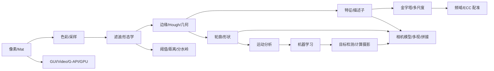

# OpenCV 图像处理基础原理篇

> 本文是 `docs` 系列中的*理论总纲*（学习主入口），与《示例处理流程》[samples_flow.md](./samples_flow.md)、分章正文配套。
> 先在此理解"为什么这么做"与**关键参数如何改变结果**，再在流程篇/分章对照源码。"那段代码在算什么"。
> 全文围绕 `mingw-build/samples/cpp` 真实示例展开，*不以编译运行为入口*。

## 目录

1. [图像的像素结构与 Mat](#1-图像的像素结构与-mat)
2. [色彩空间：RGB / HSV / 灰度](#2-色彩空间rgb--hsv--灰度)
3. [图像采样与量化](#3-图像采样与量化)
4. [直方图与模板匹配](#4-直方图与模板匹配)
5. [卷积与滤波：邻域运算的基石](#5-卷积与滤波邻域运算的基石)
6. [形态学操作：腐蚀、膨胀与开闭运算](#6-形态学操作腐蚀膨胀与开闭运算)
7. [边缘、Hough 与几何变换](#7-边缘hough-与几何变换)
8. [特征检测与描述：从角点到描述子](#8-特征检测与描述从角点到描述子)
9. [图像金字塔与多尺度分析](#9-图像金字塔与多尺度分析)
10. [频域变换与 ECC 配准](#10-频域变换与-ecc-配准)
11. [轮廓与形状分析](#11-轮廓与形状分析)
12. [分割：阈值、距离变换与分水岭](#12-分割阈值距离变换与分水岭)
13. [运动分析与机器学习](#13-运动分析与机器学习)
14. [目标检测与计算摄影](#14-目标检测与计算摄影)
15. [相机模型、多视几何与拼接](#15-相机模型多视几何与拼接)
16. [HighGUI、Video I/O、G-API 与 GPU](#16-highguivideo-iog-api-与-gpu)
17. [一张图串起完整知识链路](#17-一张图串起完整知识链路)

***

## 1. 图像的像素结构与 Mat

### 30 秒心智模型

数字图像是*二维离散函数* $I(x, y)$：每个坐标存一个或多个数值。OpenCV 用 `cv::Mat` 统一管理这块内存——*多个 Mat 头可共享同一块像素数据*（浅拷贝、ROI），改 ROI 会污染原图；真正独立副本需 `clone()`。

### 关键概念

| 字段            | 含义                          |
| -------------- | ---------------------------- |
| `rows`, `cols` | 高、宽（像素数）                |
| `channels()`   | 通道数（灰度=1，彩色=3）          |
| `depth()`      | 单像素数据类型（如 `CV_8U`）      |
| `type()`       | 如 `CV_8UC3` = 8 位无符号 3 通道 |
| `data`         | 像素首地址                     |
| `step`         | 一行实际字节数（含对齐填充）       |

- **灰度图**：单通道 `[0, 255]`，0=黑，255=白。
- **彩色图（OpenCV 默认 BGR）**：三通道 `(B, G, R)`；读图顺序是 **BGR** 而非 RGB。
- **连续存储**：`mat.isContinuous()` 为真时可当一维数组遍历；否则必须按 `step` 跳行。

### ROI 与引用计数

```cpp
Mat roi = img(Rect(x, y, w, h));   // 浅拷贝：共享 data
Mat copy = roi.clone();            // 深拷贝：独立内存
img.copyTo(dst, mask);             // 带掩膜复制
```

**ROI 语义**：`roi` 只是原图上的"窗口视图"，不分配新像素缓冲。并行写同一 `data` 需自行同步。

### 像素访问

```cpp
Vec3b px = img.at<Vec3b>(y, x);   // 先 y 后 x
for (int y = 0; y < img.rows; y++) {
    Vec3b* row = img.ptr<Vec3b>(y);
    for (int x = 0; x < img.cols; x++) { /* row[x] */ }
}
```

### 关键参数 / 陷阱

| 操作               | 调大/误用效果 | 典型失败                |
| ----------------- | ---------- | --------------------- |
| ROI 不写 `clone()` | —          | 改 ROI 后原图"莫名"变化 |
| 非连续 Mat 当 1D 扫 | —          | 跨界越界、结果错误       |
| `at<>(y,x)` 写反   | —          | 行列颠倒、结果错误       |

### 分章 / 示例 / 练习

| 资源    | 链接                                                                                                        |
| ------ | ---------------------------------------------------------------------------------------------------------- |
| 分章    | [ch01_core.md §2 Mat](./ch01_core.md)                                                                       |
| 官方示例 | [`cout_mat.cpp`](./samples_flow.md#cout_matcpp)、[`how_to_scan_images.cpp`](./README.md#附录-b-示例清单demo_map) |
| learn  | `L1_core/01_mat_create_type.cpp`、`02_pixel_scan.cpp`、`08_create_mask.cpp`                                |

***

## 2. 色彩空间：RGB / HSV / 灰度

### 30 秒心智模型

色彩空间是*同一颜色的不同坐标系*。显示用 BGR/RGB；按颜色分割用 HSV（亮度与色彩相解耦）；几何/边缘/特征几乎都在**灰度**上算。

### 关键公式

```
Gray = 0.299·R + 0.587·G + 0.114·B     // 亮度权重
HSV: H∈[0,179], S∈[0,255], V∈[0,255]   // OpenCV 8 位下 H 折半
```

### 算法步骤（颜色分割）

1. `cvtColor(bgr, hsv, COLOR_BGR2HSV)`
2. `inRange(hsv, lower, upper, mask)` 得到二值掩膜
3. 掩膜参与 `bitwise_and` / 轮廓 / 跟踪

### 关键参数

| 参数 | 含义 | 范围 | 调大/调小 |
| --- | --- | --- | --- |
| `lowerb/upperb` | HSV 上下界 | H∈[0,179] | H 容差大→颜色泛化、误检多；小→漏检 |
| `code` | 转换方向 | `COLOR_BGR2HSV` 等 | 错用 RGB↔BGR 致通道颠倒 |

### 典型失败模式

- H 在红端绕回（0 与 179 相邻），需分两段 `inRange` 后 `bitwise_or`。
- 强光/阴影下 V 变化剧烈，单 HSV 不够稳健→改用 YCrCb 或自适应阈值。

### 分章 / 示例 / 练习

| 资源 | 链接 |
| --- | --- |
| 分章 | [ch01_core.md §3 颜色](./ch01_core.md)、[ch02_imgproc.md 颜色映射](./ch02_imgproc.md) |
| learn | `L2_imgproc/09_inrange_hsv.cpp`、`03_linear_transform_colormap.cpp` |

***

## 3. 图像采样与量化

### 30 秒心智模型

采样=空间离散化（像素数），量化=幅值离散化（每通道位数）。二者共同决定信息量与体积。下采样丢高频，过采样不补细节；量化过粗出现假轮廓。

### 关键公式

$$
\text{数据量} = H \cdot W \cdot C \cdot \lceil \text{depth}/8 \rceil \quad;\quad
f_{\max} = \frac{1}{2\Delta}
$$

奈奎斯特：采样间隔 $\Delta$ 须小于最短细节周期之半，否则混叠。

### 算法步骤（JPEG 编解码）

1. `cvtColor` → YCrCb（Y 优先高位深）
2. DCT 分块、量化（`quality` 越低量化步长越大）
3. 熵编码；解码逆过程

### 关键参数

| 参数 | 含义 | 调大/调小 |
| --- | --- | --- |
| 像素位数 `depth` | `CV_8U`/`CV_16U`/`CV_32F` | 大→精度高、内存翻倍；小→量化假轮廓 |
| `quality`（JPEG） | 压缩质量 | 大→文件大、伪影少；小→块效应 |
| 下采样因子 | `pyrDown` 次数 | 多→高频永久丢失 |

### 典型失败模式

- 8 位存 HDR 场景→高光剪影；应 `CV_32F`/`CV_16U`。
- 重采样插值选错（缩放用 `INTER_NEAREST`）→锯齿。

### 分章 / 示例 / 练习

| 资源 | 链接 |
| --- | --- |
| 分章 | [ch01_core.md 编解码](./ch01_core.md) |
| 官方 | `imgcodecs_jpeg.cpp`、`animations.cpp` |
| learn | `L1_core/10_jpeg_codec.cpp` |

***

## 4. 直方图与模板匹配

### 30 秒心智模型

直方图统计像素值分布，是图像的全局"指纹"；模板匹配是把模板在图上滑动算相似度。前者用于检索/分割阈值选择，后者用于定位已知外观的目标。

### 关键公式

$$
H(k) = \sum_{x,y} \mathbb{1}[I(x,y)=k] \quad;\quad
R(x,y) = \text{metric}(T,\,I_{(x,y)})
$$

归一化相关 `TM_CCOEFF_NORMED` 输出 `[-1,1]`，越接近 1 越相似。

### 算法步骤

1. `calcHist` 计算直方图；`normalize` 归一化
2. 模板匹配 `matchTemplate`，`minMaxLoc` 找极值
3. 直方图反投影 `calcBackProject` 用于颜色概率图

### 关键参数

| 参数 | 含义 | 调大/调小 |
| --- | --- | --- |
| `histSize` | bin 数 | 大→分辨率高、稀疏；小→平滑、丢细节 |
| `method` | 匹配度量 | `SQDIFF` 越小越好；`CCOEFF_NORMED` 越大越好 |
| `bins` 维度 | 1D/2D/3D | 3D 颜色直方图维度多→稀疏、慢 |

### 典型失败模式

- 模板旋转/缩放→`matchTemplate` 失效，需改多尺度或特征匹配。
- 直方图无空间信息→不同图可能同分布。

### 分章 / 示例 / 练习

| 资源 | 链接 |
| --- | --- |
| 分章 | [ch02_imgproc.md 直方图](./ch02_imgproc.md) |
| 官方 | `demhist.cpp`、`calcHist_Demo.cpp`、`MatchTemplate_Demo.cpp` |
| learn | `L2_imgproc/26_calc_hist.cpp`、`28_compare_hist.cpp`、`30_match_template.cpp` |

***

## 5. 卷积与滤波：邻域运算的基石

### 30 秒心智模型

滤波=用核 $K$ 在图上滑动做加权和。线性滤波（均值、高斯）去高频、平滑；非线性滤波（中值）去脉冲噪声保边缘。核越大越模糊、越抗噪但越慢且边界效应越重。

### 关键公式

$$
G(x,y) = \sum_{i,j} K(i,j)\,I(x+i, y+j) \quad;\quad
G_\sigma(x) = \frac{1}{\sqrt{2\pi}\sigma}e^{-x^2/2\sigma^2}
$$

### 算法步骤

1. 选核（`getGaussianKernel`、`getStructuringElement`）
2. `filter2D`（自定义核）/ `GaussianBlur` / `medianBlur` / `bilateralFilter`
3. 处理边界 `borderType`（`BORDER_REFLECT_101` 最常用）

### 常见滤波器

| 滤波器 | 性质 | 用途 |
| --- | --- | --- |
| 均值 `blur` | 线性 | 简单降噪、严重模糊 |
| 高斯 `GaussianBlur` | 线性、低通 | 通用降噪、降采样前预处理 |
| 中值 `medianBlur` | 非线性 | 椒盐噪声、保边 |
| 双边 `bilateralFilter` | 非线性、保边 | 降噪同时保边 |
| `boxFilter` 归一化 | 线性 | 求局部均值 |

### 关键参数

| 参数 | 含义 | 调大/调小 |
| --- | --- | --- |
| `ksize` | 核尺寸（奇数） | 大→更模糊、更慢、边界效应大 |
| `sigma` | 高斯标准差 | 大→越平滑、丢细节；0 则由 ksize 推 |
| `borderType` | 边界处理 | `CONSTANT` 黑边；`REFLECT` 镜像 |

### 典型失败模式

- 中值滤波 `ksize` 过大→图像油画化、慢。
- 高斯降噪后阈值化→边缘漂移，影响后续 Canny/轮廓。

### 分章 / 示例 / 练习

| 资源 | 链接 |
| --- | --- |
| 分章 | [ch02_imgproc.md 滤波](./ch02_imgproc.md) |
| 官方 | `Smoothing.cpp`、`filter2D_demo.cpp`、`motion_deblur_filter.cpp` |
| learn | `L2_imgproc/01_smoothing.cpp`、`02_filter2d.cpp` |

***

## 6. 形态学操作：腐蚀、膨胀与开闭运算

### 30 秒心智模型

形态学用结构元 $B$ 对二值/灰度图做*局部极值*：腐蚀=局部最小、收缩；膨胀=局部最大、扩张。开=先蚀后胀（去小点）；闭=先胀后蚀（填小洞）。

### 关键公式

$$
I \ominus B = \min_{b\in B} I(x+b) \quad;\quad
I \oplus B = \max_{b\in B} I(x+b)
$$

开 $I \circ B = (I \ominus B) \oplus B$；闭 $I \bullet B = (I \oplus B) \ominus B$。

### 算法步骤

1. `getStructuringElement(shape, ksize)` 构造结构元
2. `erode` / `dilate` / `morphologyEx`（`MORPH_OPEN`/`CLOSE`/`GRADIENT`/`TOPHAT`/`BLACKHAT`）

### 关键参数

| 参数 | 含义 | 调大/调小 |
| --- | --- | --- |
| `ksize` | 结构元尺寸 | 大→作用范围大、更激进、更慢 |
| `shape` | `MORPH_RECT`/`ELLIPSE`/`CROSS` | 矩形作用均匀；椭圆保圆形；十字保线 |
| `iterations` | 重复次数 | 多≈大核但有方向累积 |
| `borderValue` | 边界填充 | 腐蚀常用极大值，否则边界被蚀 |

### 典型失败模式

- 结构元过大→小目标被完全抹掉。
- 形态梯度提取边缘对噪声敏感→先高斯。

### 分章 / 示例 / 练习

| 资源 | 链接 |
| --- | --- |
| 分章 | [ch02_imgproc.md 形态学](./ch02_imgproc.md) |
| 官方 | `Morphology_1.cpp`、`Morphology_2.cpp`、`Morphology_3.cpp`、`HitMiss.cpp` |
| learn | `L2_imgproc/04_erode_dilate.cpp`、`05_morphology_ex.cpp`、`07_morph_lines.cpp` |

***

## 7. 边缘、Hough 与几何变换

### 7.1 边缘检测：Sobel / Scharr / Laplacian / Canny

#### 30 秒心智模型

边缘=亮度突变。一阶梯度（Sobel/Scharr）给方向与强度；二阶（Laplacian）过零点；Canny 把"降噪→梯度→非极大抑制→双阈值滞后"合成一体，是最稳的通用边缘。

#### 关键公式

$$
G_x = \begin{bmatrix}-1&0&1\\-2&0&2\\-1&0&1\end{bmatrix} * I \quad;\quad
|\nabla|=\sqrt{G_x^2+G_y^2},\;\theta=\arctan(G_y/G_x)
$$

#### Canny 四步

1. 高斯降噪
2. Sobel 求梯度幅值与方向
3. 非极大抑制（沿梯度方向取局部最大）
4. 双阈值滞后：高于高阈值=强边，介于两者=连强边，低于低=弃

#### 关键参数（边缘）

| 参数 | 含义 | 调大/调小 |
| --- | --- | --- |
| `threshold1/threshold2` | Canny 低/高阈值 | 高阈值大→边缘少但噪声少；小→多但碎 |
| `apertureSize` | Sobel 核 3/5/7 | 大→抗噪但定位差 |
| `L2gradient` | 是否用 L2 | 真→更准；假→快 |

#### 典型失败模式

- 阈值固定→跨图不稳，可先用 `threshold` + OTSU 自动估。
- 噪声图直接 Canny→雪花边，先高斯。

### 7.2 Hough 变换

#### 30 秒心智模型

把边缘点变换到参数空间累加：直线的 $(\rho,\theta)$、圆的 $(a,b,r)$。累加器局部峰值=检测到的图形。对断裂、噪声鲁棒，但慢且需调参。

#### 关键公式

$$
\rho = x\cos\theta + y\sin\theta \quad(\theta\in[0,\pi))
$$

#### 算法步骤

1. 先 Canny 得边缘图
2. `HoughLines`（标准）/ `HoughLinesP`（概率，给端点段）
3. `HoughCircles` 给圆心半径

#### 关键参数

| 参数 | 含义 | 调大/调小 |
| --- | --- | --- |
| `threshold` | 累加器阈值 | 大→线少但稳；小→碎线多 |
| `minLineLength` | 线段最短长度 | 大→短噪线被滤；过短线丢失 |
| `maxLineGap` | 同线最大断口 | 大→断线连成一条；小→断线保留 |
| `dp` | 累加器分辨率 | 大→快粗；小→慢精 |
| `minDist` | 圆心最小间距 | 小→圆密集误叠 |

#### 典型失败模式

- 圆检测对半径范围敏感，范围过宽→误检爆增。
- 直线检测无 `minLineLength`→噪声短段塞满。

### 7.3 几何变换

#### 30 秒心智模型

仿射=平移+旋转+缩放+剪切（平行线仍平行，6 自由度，3 点定）；透视=一般投影（平行线可交，8 自由度，4 点定）。变换由矩阵描述，插值决定重采样质量。

#### 关键公式

$$
\begin{bmatrix}x'\\y'\end{bmatrix} =
\begin{bmatrix}a_{11}&a_{12}\\a_{21}&a_{22}\end{bmatrix}\begin{bmatrix}x\\y\end{bmatrix}+\begin{bmatrix}t_x\\t_y\end{bmatrix}\quad(\text{仿射});
\quad
\begin{bmatrix}x'\\y'\\w'\end{bmatrix}=H\begin{bmatrix}x\\y\\1\end{bmatrix}
$$

#### 算法步骤

1. `getAffineTransform`（3 点对）/ `getPerspectiveTransform`（4 点对）/ `findHomography`（多点+RANSAC）
2. `warpAffine` / `warpPerspective` 应用变换
3. `RANSAC`/`LMEDS`/`RHO` 处理外点

#### 关键参数

| 参数 | 含义 | 调大/调小 |
| --- | --- | --- |
| `method` | 估计方法 | `RANSAC` 抗外点；`LMEDS` 需>50% 内点 |
| `reprojThreshold` | RANSAC 内点判据 | 大→内点多但精度低；小→少而严 |
| `flags` | 反向/填充 | `WARP_INVERSE_MAP` 反向映射 |
| `dsize` | 输出尺寸 | 大→视野大但留黑边 |

#### 典型失败模式

- 4 点共面→透视退化；3 点共线→仿射退化。
- 内点不足时 `findHomography` 报空，应退化到仿射。

### 分章 / 示例 / 练习（汇总）

| 资源 | 链接 |
| --- | --- |
| 分章 | [ch02_imgproc.md 边缘/Hough/几何](./ch02_imgproc.md)、[ch03_features.md 单应](./ch03_features.md) |
| 官方 | `edge.cpp`、`CannyDetector_Demo.cpp`、`HoughLines_Demo.cpp`、`HoughCircle_Demo.cpp`、`warpPerspective_demo.cpp`、`Geometric_Transforms_Demo.cpp` |
| learn | `L2_imgproc/10_sobel.cpp`、`13_canny.cpp`、`14_hough_lines.cpp`、`16_hough_circles.cpp`、`17_warp_affine.cpp`、`18_warp_perspective.cpp` |

***

## 8. 特征检测与描述：从角点到描述子

### 30 秒心智模型

角点是两方向梯度都强的位置（"角落"），易于定位。但单角点无尺度/旋转不变性→需尺度不变检测器（SIFT/SURF/ORB/AKAZE）+ 描述子，再经匹配+RANSAC 给出几何关系。

### 8.1 角点：Harris / Shi-Tomasi / FAST

#### 关键公式

$$
M = \sum_{x,y} w(x,y)\begin{bmatrix}I_x^2&I_xI_y\\I_xI_y&I_y^2\end{bmatrix}\quad;\quad
R=\det(M)-k\cdot\text{tr}(M)^2
$$

#### 算法步骤（Harris / Shi-Tomasi）

1. 求 $I_x, I_y$ 与其外积，高斯加权求和得 $M$
2. Harris: $R=\det-k\,\text{tr}^2$；Shi-Tomasi: $\min(\lambda_1,\lambda_2)$
3. 非极大抑制 + 阈值得角点

#### 关键参数

| 参数 | 含义 | 调大/调小 |
| --- | --- | --- |
| `blockSize` | 局部窗口 | 大→角点平滑、定位差；小→噪声敏感 |
| `k` | Harris 经验系数 | 典型 0.04；大→角点少 |
| `qualityLevel` | 相对最大响应阈值 | 大→点少而稳；小→多但碎 |
| `maxCorners` | 角点数上限 | 不足则返回所有 |

#### 典型失败模式

- 角点对尺度敏感：放大后角点变边缘，需配合金字塔或 SIFT。

### 8.2 尺度不变：SIFT / SURF / ORB / AKAZE

SIFT 用 DoG（差分高斯）尺度空间极值；SURF 用 Hessian + 积分图加速；ORB 用 FAST 关键点 + BRIEF 描述（二进制）；AKAZE 用非线性尺度空间。SIFT/SURF 描述子为浮点（128 维），ORB/AKAZE 可为二进制（更省内存、汉明距离匹配）。

### 8.3 匹配 + Lowe + RANSAC 单应

#### 算法步骤

1. `BFMatcher` / `FlannBasedMatcher` 做 KNN 匹配
2. Lowe 比率检验（`ratio<0.7`）滤歧义点
3. `findHomography(..., RANSAC)` 估计 $H$ 并标 inlier
4. `perspectiveTransform` 把模板角点投到目标图，画框

#### 关键参数

| 参数 | 含义 | 调大/调小 |
| --- | --- | --- |
| `ratio` | Lowe 比率 | 大→匹配多但错；小→少而稳 |
| `reprojThreshold` | RANSAC 内点阈值 | 大→内点多、$H$ 松；小→严 |
| `minMatchCount` | 最少确认匹配数 | 不足则拒识 |

#### 典型失败模式

- 重复纹理/弱纹理→描述子无法区分，比率失效。
- 视角变化大→单应不成立，需多视图几何。

### 8.4 区域特征：MSER / Blob

MSER 在不同阈值下求最大稳定极值区域，适合文字/斑点；`SimpleBlobDetector` 按面积/圆度/凸度/惯性比筛连通域。

### 分章 / 示例 / 练习

| 资源 | 链接 |
| --- | --- |
| 分章 | [ch03_features.md](./ch03_features.md) |
| 官方 | `SURF_detection_Demo.cpp`、`SURF_FLNN_matching_homography_Demo.cpp`、`AKAZE_match.cpp`、`detect_mser.cpp`、`detect_blob.cpp` |
| learn | `L3_features_video/01_corner_harris.cpp`、`05_orb_detect_match.cpp`、`09_homography.cpp` |

***

## 9. 图像金字塔与多尺度分析

### 30 秒心智模型

金字塔=同一图的多尺度序列：逐层 `pyrDown`（高斯平滑后 2 倍降采样）得到上层，`pyrUp` 升采样。用于跨尺度搜索、合成融合、拉普拉斯金字塔（细节合成）。

### 关键公式

$$
G_{l+1} = \text{down}(G_l * G_\sigma)\quad;\quad L_l = G_l - \text{up}(G_{l+1})
$$

### 算法步骤

1. `pyrDown` / `pyrUp`（默认 5×5 高斯）
2. 拉普拉斯金字塔：$L_l=G_l-\text{up}(G_{l+1})$，用于多尺度融合/混合
3. 重建：逐层 `pyrUp` + 加回 $L_l$

### 关键参数

| 参数 | 含义 | 调大/调小 |
| --- | --- | --- |
| 金字塔层数 | 级数 | 多→跨尺度广但顶层太小、信息丢失 |
| 高斯核 `sigma` | 降采样前平滑 | 大→抗混叠但模糊；小→混叠 |
| 边界 | 处理方式 | `REFLECT_101` 减少边缘伪影 |

### 典型失败模式

- 不平滑直接降采样→锯齿、混叠（违反奈奎斯特）。
- 金字塔顶层过小→统计不稳。

### 分章 / 示例 / 练习

| 资源 | 链接 |
| --- | --- |
| 分章 | [ch02_imgproc.md 金字塔](./ch02_imgproc.md) |
| 官方 | `Pyramids.cpp`、`motion_deblur_filter.cpp` |
| learn | `L2_imgproc/31_pyramids.cpp` |

***

## 10. 频域变换与 ECC 配准

### 10.1 离散傅里叶变换 DFT

#### 30 秒心智模型

DFT 把空间图转到频率图：低频=整体光照/缓变，高频=边缘/噪声。用频域可做：去周期噪声（陷波）、运动模糊反卷积、大尺度相位相关配准。

#### 关键公式

$$
F(u,v) = \sum_{x,y} I(x,y)e^{-2\pi i(ux/H+vy/W)}
$$

幅度谱中心化后中心=低频，向外=高频。

#### 算法步骤

1. 扩到最优尺寸 `getOptimalDFTSize` + `copyMakeBorder`
2. `dft`（实输入可省通道）；`magnitude` + `log` 可视化
3. 频域滤波（乘以 $H(u,v)$）后 `idft` 还原

#### 关键参数

| 参数 | 含义 | 调大/调小 |
| --- | --- | --- |
| `flags` | `DFT_COMPLEX_OUTPUT`/`DFT_REAL_OUTPUT` | 输入实数可省一半计算 |
| 最优尺寸 | 2 的幂或高复合数 | 非 2 幂 DFT 慢数倍 |
| 滤波器截止 `D0` | 低通半径 | 大→越保细节；小→越模糊 |

#### 典型失败模式

- 未中心化直接滤波→对称位置伪影。
- 未补零→循环卷积造成边界错位。

### 10.2 ECC 密集配准（`findTransformECC`）

#### 30 秒心智模型

ECC（Enhanced Correlation Coefficient）最大化两图归一化互相关，迭代估计仿射/透视/平移参数。比特征配准更适合弱纹理/同源图（医学、遥感、多曝光栈）。

#### 关键公式

$$
\epsilon = 1 - \frac{\sum (I_w - \bar I_w)(J - \bar J)}{\sqrt{\sum(I_w-\bar I_w)^2 \sum(J-\bar J)^2}}
$$

#### 算法步骤

1. 选运动模型 `MOTION_TRANSLATION`/`AFFINE`/`HOMOGRAPHY`/`EUCLIDEAN`
2. 初始化单位变换 `warpMatrix`
3. `findTransformECC` 迭代；`warpPerspective` 应用

#### 关键参数

| 参数 | 含义 | 调大/调小 |
| --- | --- | --- |
| `criteria` | 迭代/收敛 | 迭代多→慢但精；eps 小→更严 |
| `motionType` | 模型自由度 | 自由度越高越需初值与计算 |
| `gaussFiltSize` | 预平滑核 | 大→抗噪但细节丢 |

#### 典型失败模式

- 模型自由度过高而初值差→陷入局部极值。
- 大位移不收敛→先粗匹配（相位相关）给初值。

### 分章 / 示例 / 练习

| 资源 | 链接 |
| --- | --- |
| 分章 | [ch01_core.md DFT](./ch01_core.md)、[ch02_imgproc.md 去噪/去模糊](./ch02_imgproc.md) |
| 官方 | `dft.cpp`、`discrete_fourier_transform.cpp`、`periodic_noise_removing_filter.cpp`、`motion_deblur_filter.cpp`、`phase_corr.cpp` |
| learn | `L1_core/07_dft_spectrum.cpp`、`09_ecc_align.cpp`、`L2_imgproc/32_phase_correlate.cpp` |

***

## 11. 轮廓与形状分析

### 30 秒心智模型

轮廓是二值图上的边界点序列。`findContours` 提取后可算面积、周长、矩、凸包、最小外接矩形/圆/三角、拟合椭圆，做形状识别与测量。轮廓对二值化质量极度依赖。

### 算法步骤

1. 阈值/Canny 得二值图
2. `findContours`（`RETR_EXTERNAL`/`RETR_LIST`/`RETR_CCOMP`/`RETR_TREE` + `CHAIN_APPROX_*`）
3. `contourArea` / `arcLength` / `moments` / `HuMoments` / `convexHull` / `fitEllipse` / `minAreaRect` / `minEnclosingCircle` / `pointPolygonTest`

### 关键参数

| 参数 | 含义 | 调大/调小 |
| --- | --- | --- |
| `mode` | 拓扑层级 | `TREE` 完整嵌套；`EXTERNAL` 仅最外 |
| `method` | 点逼近 | `NONE` 全点；`SIMPLE` 合并共线段 |
| `epsilon` | `approxPolyDP` 阈值 | 大→边形数少、近似粗 |
| `minArea` | 过滤阈值 | 小→保留噪声轮廓 |

### 典型失败模式

- 椒盐噪声形成大量小轮廓→先形态学开运算或面积过滤。
- `findContours` 会改输入图（旧版），应传副本。

### 分章 / 示例 / 练习

| 资源 | 链接 |
| --- | --- |
| 分章 | [ch03_features.md 轮廓形状](./ch03_features.md) |
| 官方 | `findContours_demo.cpp`、`generalContours_demo1.cpp`、`moments_demo.cpp`、`hull_demo.cpp`、`fitellipse.cpp`、`minarea.cpp`、`squares.cpp` |
| learn | `L3_features_video/10_find_contours.cpp`、`13_moments_hu.cpp`、`15_general_contours.cpp` |

***

## 12. 分割：阈值、距离变换与分水岭

### 12.1 阈值分割

#### 30 秒心智模型

阈值=按灰度一刀切前景/背景。固定阈值不稳；自适应/OTSU 按局部或全局直方图自动选；`inRange` 推广到多通道色彩分割。

#### 关键公式

$$
\text{dst}(x,y)=\begin{cases}\max & I(x,y)>T\\0&\text{otherwise}\end{cases}
$$

OTSU 最大化类间方差 $\sigma_B^2(T)$。

#### 关键参数

| 参数 | 含义 | 调大/调小 |
| --- | --- | --- |
| `thresh` | 阈值 | 大→前景少；小→前景多带噪声 |
| `type` | `THRESH_BINARY`/`INV`/`TRUNC`/`TOZERO`/`OTSU` | `OTSU` 自动 |
| `maxValue` | 命中后填充值 | 仅影响显示与下游 |

#### 典型失败模式

- 光照不均→单阈值失效，改自适应 `adaptiveThreshold` 或同态滤波。

### 12.2 距离变换

`distanceTransform` 给每个前景点到最近背景点的距离。用于分水岭的种子（局部极大）与骨架化。

| 参数 | 含义 | 调大/调小 |
| --- | --- | --- |
| `distanceType` | `DIST_L1`/`L2`/`C` | `L2` 较准但慢 |
| `maskSize` | 距离核 | 大→更准 |

### 12.3 分水岭

#### 30 秒心智模型

把灰度图当地形，从极小值注水；不同集水盆相遇处筑坝=分割线。直接用会过分割，需"标记"指定种子。

#### 算法步骤

1. 阈值+形态学清理得前景，距离变换取局部极大作种子
2. `watershed` 用 marker 图（前景/背景/未知）分割
3. 后处理连通域过滤

#### 典型失败模式

- 标记不够→过分割，碎块成千。
- 弱边界处溢流合并→需增强边缘或加大结构元。

### 分章 / 示例 / 练习

| 资源 | 链接 |
| --- | --- |
| 分章 | [ch02_imgproc.md 阈值/距离/分水岭](./ch02_imgproc.md) |
| 官方 | `Threshold.cpp`、`Threshold_inRange.cpp`、`distrans.cpp`、`watershed.cpp`、`imageSegmentation.cpp`、`connected_components.cpp` |
| learn | `L2_imgproc/08_threshold.cpp`、`22_distance_transform.cpp`、`23_connected_components.cpp`、`25_watershed.cpp` |

***

## 13. 运动分析与机器学习

### 13.1 背景减除：MOG2 / KNN

#### 30 秒心智模型

背景建模=对每个像素学一个时间分布，新帧偏离分布=前景。MOG2 用高斯混合（适应渐变背景）；KNN 用最近邻直方图（无需高斯假设、对抖动鲁棒）。

#### 算法步骤

1. `createBackgroundSubtractorMOG2`/`KNN` 初始化
2. `apply(frame, learningRate)` 在线学习
3. `getForegroundMask`；形态学开运算去噪 + 找轮廓

#### 关键参数

| 参数 | 含义 | 调大/调小 |
| --- | --- | --- |
| `varThreshold` | 马氏/距离判据 | 大→前景少、稳；小→多带噪 |
| `history` | 学习历史长度 | 大→适应慢、稳；小→快但抖 |
| `learningRate` | `-1` 自适应/`0..1` | 大→快学；小→慢学 |

#### 典型失败模式

- 风吹树叶、水波→动态背景需更高 `varThreshold` 或 `detectShadows` 关。
- 阴影被当前景→开阴影检测。

### 13.2 光流：LK / Farneback / DIS

#### 30 秒心智模型

光流=相邻帧间的逐像素位移向量场。LK（稀疏）跟踪关键点；Farneback（密集）每像素都给；DIS 又快又准的密集近似。

#### 关键公式

亮度恒常假设 $I(x,y,t)=I(x+dx,y+dy,t+dt)$，泰勒展开→ $\nabla I \cdot \mathbf{v} + I_t = 0$，LK 在窗口内最小化。

#### 核心原理对比

| 方法 | 类型 | 速度 | 精度 | 适用 |
| --- | --- | --- | --- | --- |
| LK `calcOpticalFlowPyrLK` | 稀疏点 | 快 | 中 | 跟踪关键点 |
| Farneback `calcOpticalFlowFarneback` | 密集 | 慢 | 高 | 全场运动 |
| DIS `DISOpticalFlow` | 密集 | 快 | 中高 | 实时 |

#### 关键参数

| 参数 | 含义 | 调大/调小 |
| --- | --- | --- |
| `winSize` | LK 局部窗 | 大→稳但定位差；小→精但抖 |
| `maxLevel` | 金字塔层数 | 大→大位移；小→小位移 |
| `winsize`(FB) | 多项式展开窗 | 大→平滑、慢 |
| `preset`（DIS） | `ULTRA`/`FAST`/`MEDIUM` | 越快精度越低 |

#### 典型失败模式

- 大位移+无金字塔→LK 跟丢；开 `maxLevel`。
- 亮度突变违反恒常假设→全场错。

### 13.3 MeanShift / CamShift / Kalman

#### MeanShift / CamShift

MeanShift 在概率图上向密度极大移动窗口；CamShift 自适应窗口大小与方向，用于跟踪彩色目标。

| 参数 | 含义 | 调大/调小 |
| --- | --- | --- |
| `criteria` | 迭代终止 | 多→精但慢 |
| `srange` | HSV 颜色范围 | 大→颜色泛化 |

#### Kalman 滤波

线性高斯状态空间递推：预测 $\hat x=Fx$，更新用卡尔曼增益 $K$ 加权测量。OpenCV `KalmanFilter` 常用于点/框跟踪平滑。

### 13.4 传统机器学习

#### 30 秒心智模型

OpenCV `ml` 模块封装经典统计学习：无监督 `KMeans`/`EM`，监督 `SVM`/`LogisticRegression`/`RTrees`/`Boost`/`ANN_MLP`/`SVMSGD`，降维 `PCA`。统一基类 `StatModel`：`train`/`predict`。

#### k-means

$$
J=\sum_k\sum_{x\in C_k}\|x-\mu_k\|^2
$$

`KMEANS_PP_CENTERS` 初始化稳；`attempts` 多次取最优；`compactness` 评估。

#### EM（高斯混合）

软分配合概率，给每点每类隶属度，比 k-means 软。`EM::train` 估计均值/协方差/权重。

#### SVM

最大化间隔 $2/\|w\|$，软间隔用 $C$ 权衡违反。核 `LINEAR`/`RBF`/`POLY`/`SIGMOID`/`CHI2`。`C` 大→过拟合；`gamma` 大→复杂边界过拟合。

#### PCA

主成分降维：协方差特征分解，取前 $k$ 大特征向量投影。`PCA` 可在人脸识别/可视化前降维。

#### 决策树 / 随机森林 / Boosting

`DTrees` 二叉树；`RTrees` 多树投票抗过拟合；`Boost` 加性提升弱学习器。

| 模型 | 关键参数 | 调大/调小 |
| --- | --- | --- |
| SVM | `C`, `gamma` | 大→过拟合 |
| k-means | `K`, `attempts` | K 大→簇细；attempts 多→稳 |
| RTrees | `maxDepth`, `activeVarCount` | 深→过拟合 |
| ANN_MLP | 层结构、`alpha` | 大→正则强 |

### 分章 / 示例 / 练习

| 资源 | 链接 |
| --- | --- |
| 分章 | [ch04_video.md](./ch04_video.md)、[ch05_ml.md](./ch05_ml.md) |
| 官方 | `bgfg_segm.cpp`、`lkdemo.cpp`、`fback.cpp`、`dis_opticalflow.cpp`、`kalman.cpp`、`camshiftdemo.cpp`、`kmeans.cpp`、`em.cpp`、`introduction_to_svm.cpp`、`pca.cpp`、`digits_svm.cpp` |
| learn | `L3_features_video/16_bg_subtract_mog2.cpp`、`17_lk_optical_flow.cpp`、`18_farneback_dense.cpp`、`20_camshift.cpp`、`22_kalman.cpp`、`L5_ml_gapi/01_kmeans.cpp`、`02_svm_intro.cpp`、`04_pca.cpp`、`06_ann_mlp.cpp` |

***

## 14. 目标检测与计算摄影

### 14.1 Haar / LBP 级联

#### 30 秒心智模型

级联=多级弱分类器串联，前级粗筛背景快速丢弃，后级精化。Haar 特征=黑白矩形对差值（积分图加速）；LBP=局部二值模式纹理。`CascadeClassifier` 加载 XML，`detectMultiScale` 出框。

#### 算法步骤

1. `CascadeClassifier::load(cascadeFile)`
2. `detectMultiScale(gray, objects, scaleFactor, minNeighbors, minSize)`
3. 多尺度滑动窗口；可选 `LBP` 替代 Haar

#### 关键参数

| 参数 | 含义 | 调大/调小 |
| --- | --- | --- |
| `scaleFactor` | 尺度步进 | 大→快漏检；小→慢精 |
| `minNeighbors` | 同目标合并阈值 | 大→框少、稳；小→多、误检 |
| `minSize/maxSize` | 尺寸上下限 | 过大→漏小目标 |

#### 典型失败模式

- 侧脸/遮挡→漏检；深度学习更稳。
- 头文件路径错→空检测无报错。

### 14.2 HOG + SVM 行人检测

#### 30 秒心智模型

HOG=梯度方向直方图，每 cell 累 $b$ 个方向 bin，块内归一化抗光照。预训练 `HOGDescriptor::getDefaultPeopleDetector` + SVM 线性核滑窗检测。

#### 关键参数

| 参数 | 含义 | 调大/调小 |
| --- | --- | --- |
| `winStride` | 滑窗步长 | 大→快漏检；小→慢精 |
| `padding` | 边界填充 | 大→部分检出框 |
| `hitThreshold` | SVM 距离偏置 | 大→少而严；小→多 |
| `scale0` | 金字塔比 | 大→快漏小目标 |

### 14.3 ArUco / ChArUco

ArUco=方形 fiducial 标记，每标记 ID 唯一，`aruco` 模块检测位姿。ChArUco=ArUco 嵌于棋盘，结合角点提升标定精度。

### 14.4 计算摄影

#### Inpaint（`inpaint`）

按掩膜区域用周围像素传播修复：`INPAINT_TELEA`/`NS`。小破损效果好，大区域幻觉。

#### GrabCut

交互式前景分割：用矩形/掩膜初始化 GMM，迭代图割优化。`model` 区分前景/背景 GMM。

#### HDR

多曝光栈 → `MergeDebayer`/`MergeMertens`/`MergeRobertson` 合并 → `CalibrateRobertson` 估计响应 → `tonemap` 映回显示域。

| 参数 | 含义 | 调大/调小 |
| --- | --- | --- |
| `iterCount`（GrabCut） | 迭代次数 | 多→收敛但慢 |
| `gamma`（Tonemap） | 亮度映射 | 大→亮部压缩 |
| `inpaintRadius` | 修复半径 | 大→更模糊 |

### 分章 / 示例 / 练习

| 资源 | 链接 |
| --- | --- |
| 分章 | [ch06_objdetect_photo.md](./ch06_objdetect_photo.md) |
| 官方 | `facedetect.cpp`、`peopledetect.cpp`、`train_HOG.cpp`、`detect_markers.cpp`、`aruco_dict_utils.cpp`、`inpaint.cpp`、`grabcut.cpp`、`hdr_imaging.cpp`、`cloning_demo.cpp`、`npr_demo.cpp` |
| learn | `L4_detect_calib/01_cascade_face.cpp`、`02_hog_pedestrian.cpp`、`05_aruco_detect.cpp`、`06_inpaint.cpp`、`07_grabcut.cpp`、`11_hdr.cpp` |

***

## 15. 相机模型、多视几何与拼接

### 15.1 针孔模型与棋盘

#### 30 秒心智模型

针孔模型：世界点 $\mathbf X_w$ 经外参 $(R,t)$ 到相机系，再经内参 $K$ 投影到像素。标定=从已知棋盘角点反求 $K$ 与畸变系数。张正友法用单视图多角点解基础矩阵后线性求 $K$，非线性优化重投影误差。

#### 关键公式

$$
Z_c\begin{bmatrix}u\\v\\1\end{bmatrix} = K[R\,|\,t]\begin{bmatrix}X_w\\Y_w\\Z_w\\1\end{bmatrix},\quad
K=\begin{bmatrix}f_x&0&c_x\\0&f_y&c_y\\0&0&1\end{bmatrix}
$$

#### 张正友标定步骤

1. `findChessboardCorners` → `cornerSubPix` 亚像素
2. 多视图收集角点 3D-2D 对
3. `calibrateCamera` 求 $K$、畸变、外参
4. `undistort` / `getOptimalNewCameraMatrix` 校正

#### 关键参数

| 参数 | 含义 | 调大/调小 |
| --- | --- | --- |
| 棋盘 `Size(w,h)` | 内角点数（行列减 1） | 错→`findChessboard` 失败 |
| `flags` | 畸变模型开关 | `CALIB_FIX_K3` 等控制自由度 |
| 图片数 | 标定帧数 | 多→稳；少→过拟合 |

### 15.2 对极几何：f / E

#### 关键公式

像素系基础矩阵 $x'^\top F x=0$；归一化系本质矩阵 $E=K_2^\top F K_1$；$E=[t]_\times R$，由 8 点法解，SVD 分解出 4 组 $(R,t)$，三角化验证选正确解。

### 15.3 双目立体与视差

#### 30 秒心智模型

双目校正后左右图行对齐，`StereoMatcher`（BM/SGBM）按块匹配得视差 $d$，深度 $Z=fB/d$。`stereoRectify` 给左右校正映射。

#### 算法步骤

1. 双目标定 → `stereoRectify` → `initUndistortRectifyMap`
2. `StereoSGBM` 计算视差，`filterSpeckles`/`WLS` 后处理
3. `reprojectImageTo3D` 得 3D 点云

#### 关键参数

| 参数 | 含义 | 调大/调小 |
| --- | --- | --- |
| `numDisparities` | 视差搜索范围（16 倍数） | 大→远距覆盖但慢 |
| `blockSize` | 匹配块 | 大→稳但细节糊 |
| `uniquenessRatio` | 唯一性比 | 大→少而严 |
| `disp12MaxDiff` | 左右一致性 | 大→容差大 |

### 15.4 PnP 位姿估计

已知 3D 点与对应 2D 像素，求 $(R,t)$。`solvePnPRansac` 抗外点；`SOLVEPNP_IPPE` 适合平面目标。常配合 ArUco/3D 模型做位姿。

### 15.5 图像拼接

#### 30 秒心智模型

`Stitcher` 流水线：特征→匹配→单应估计→投影到统一平面→曝光补偿→多频段融合→接缝裁剪。`stitching_detailed.cpp` 暴露每步可配置项。

#### 关键参数

| 参数 | 含义 | 调大/调小 |
| --- | --- | --- |
| `features` | SIFT/ORB/... | 浮点稳；二进制快 |
| `confidence` | 匹配确认阈值 | 大→严、可能不拼 |
| `warper` | 投影面 | `CYLINDRICAL`/`PLANE`/`PANORAMA` |
| `blend` | 融合方法 | `MULTI_BAND` 平滑；`FEATHER` 简单 |

### 分章 / 示例 / 练习

| 资源 | 链接 |
| --- | --- |
| 分章 | [ch07_calib3d_stitching.md](./ch07_calib3d_stitching.md) |
| 官方 | `calibration.cpp`、`camera_calibration.cpp`、`stereo_calib.cpp`、`stereo_match.cpp`、`epipolar_lines.cpp`、`essential_mat_reconstr.cpp`、`stitching.cpp`、`stitching_detailed.cpp`、`select3dobj.cpp` |
| learn | `L4_detect_calib/12_camera_calib.cpp`、`13_epipolar.cpp`、`14_stereo_match.cpp`、`15_stitching.cpp`、`19_essential_mat.cpp`、`20_pnp_pose.cpp` |

***

## 16. HighGUI、Video I/O、G-API 与 GPU

### 30 秒心智模型

`highgui` 提供窗口、滑块、鼠标交互回调；`videoio` 抽象多种视频源/写；`gapi` 把图像处理编成图，一次定义多次后端；`gpu`（CUDA）模块把热路径上 GPU。

### 关键参数（VideoCapture）

| 参数 | 含义 | 调大/调小 |
| --- | --- | --- |
| `CAP_PROP_FPS` | 帧率 | 设高→等帧丢弃；低→慢 |
| `CAP_PROP_FRAME_WIDTH/HEIGHT` | 分辨率 | 设备可能不支持 |
| `CAP_PROP_BUFFERSIZE` | 缓冲帧 | 大→延迟大；小→丢帧 |
| API 偏好 | `CAP_DSHOW`/`MSMF`/`V4L2`/`FFMPEG` | 不同后端特性/性能不同 |

### 典型失败模式

- 摄像头不支持某 `FPS`/分辨率→静默回退，需查询实际值。
- `VideoCapture` 不释放→下次打开失败。

### 分章 / 示例 / 练习

| 资源 | 链接 |
| --- | --- |
| 分章 | [ch08_gui_gapi_gpu.md](./ch08_gui_gapi_gpu.md) |
| 官方 | `AddingImagesTrackbar.cpp`、`videocapture_basic.cpp`、`videocapture_camera.cpp`、`videowriter_basic.cpp`、`gpu-basics-similarity.cpp`、`security_barrier_camera.cpp` |
| learn | `L0_intro/02_named_window_trackbar.cpp`、`05_videocapture_camera.cpp`、`08_videowriter.cpp`、`L5_ml_gapi/11_gapi_blur_canny.cpp`、`15_gapi_pipeline.cpp` |

***

## 17. 一张图串起完整知识链路



### 原理 → 最小练习速查

| 原理节 | 黄金示例 | 最小练习 |
| --- | --- | --- |
| §1 Mat | `cout_mat.cpp` | `L1_core/01_mat_create_type.cpp` |
| §5 滤波 | `Smoothing.cpp` | `L2_imgproc/01_smoothing.cpp` |
| §7 边缘 | `CannyDetector_Demo.cpp` | `L2_imgproc/13_canny.cpp` |
| §8 特征 | `SURF_FLNN_matching_homography_Demo.cpp` | `L3_features_video/09_homography.cpp` |
| §13 光流 | `lkdemo.cpp` | `L3_features_video/17_lk_optical_flow.cpp` |
| §13 ML | `introduction_to_svm.cpp` | `L5_ml_gapi/02_svm_intro.cpp` |
| §14 检测 | `facedetect.cpp` | `L4_detect_calib/01_cascade_face.cpp` |
| §15 标定 | `calibration.cpp` | `L4_detect_calib/12_camera_calib.cpp` |
| §16 视频 | `videocapture_basic.cpp` | `L0_intro/05_videocapture_camera.cpp` |

> 完整 233 文件清单见 [README 附录 B](./README.md#附录-b-示例清单demo_map)；根目录录屏流程切片见 [samples_flow.md](./samples_flow.md)。
